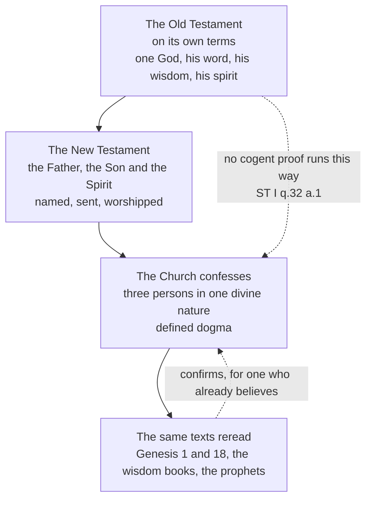

# The Triune God · Lesson 2.1: The one God of Israel, and the Church's backward reading

> ⏱ ~15 min · Module 2: The Trinity revealed · Builds on: [1.4 Immutability, eternity, immensity](01-04-immutability-eternity-immensity.md) · Unlocks: [2.2 The Father and the Son in the New Testament](02-02-the-father-and-the-son-in-the-new-testament.md)

## Why this matters

Sooner or later a parish handout reaches you with the heading "The Trinity in the Old Testament" and three bullets under it: God says *let us make man*; Abraham sees three men and answers one Lord; the seraphim cry holy three times. The handout means well. Aquinas thought this kind of help does damage, and said so in the coldest sentence in his treatment of the Trinity. This lesson is about a distinction the handout misses: a reading can be ancient, true, and sung in the liturgy, and still not be an argument. Module 2 exists to say what each text establishes, so the rule has to be fixed before the texts are opened.

## The idea

The rule this course keeps, stated once and used everywhere after:

> **The Trinity is known from the New Testament and confessed by the Church. The Old Testament is read in that light — not mined for proofs.**

Reading runs backward. The Church did not assemble the doctrine from clues in Genesis and then check it against the Gospels. She met the Father, the Son and the Spirit in the events the New Testament reports, confessed what she had met, and only then turned back to Israel's scriptures and recognized the same God speaking. The recognition is real. It is simply not the road anyone travelled to get there, and pretending otherwise inverts the order of knowledge.

This is not scepticism about the Old Testament. It is a claim about direction, and it leaves the [backward reading rule](../reference.md#the-backward-reading-rule) with real work to do — deciding which arguments may be made, and to whom.

## Source

Two verses in the Douay-Rheims (Challoner), with Challoner's own note on the second.

> **Deuteronomy 6:4** — Hear, O Israel, the Lord our God is one Lord.
>
> **Genesis 1:26** — And he said: Let us make man to our image and likeness: and let him have dominion over the fishes of the sea, and the fowls of the air, and the beasts, and the whole earth, and every creeping creature that moveth upon the earth.
>
> **Challoner's note on Genesis 1:26** — God speaketh here in the plural number, to insinuate the plurality of persons in the Deity.

Read the Shema for what it denies. "The Lord" stands for the name given at the burning bush, which this translation prints as I AM WHO AM (Exodus 3:14). The verse says that this God is one and that he is Israel's only; it does not say he is solitary, because the question had not been asked. Nothing in it yields what the Church confesses, and nothing in it excludes it.

Now Genesis 1:26. A first-person plural sits inside a chapter of singulars — the next verse has "And God created man to his own image." Exegetes read the plural as deliberation, as majesty, or as address to a heavenly court; that argument belongs to [`old-testament`](../../old-testament/syllabus.md), and this course does not settle it. What this course notices is Challoner's verb. Not *proves*, not *teaches*: **insinuate**. And a note printed under a verse by a bishop is an annotation, not an act of the Magisterium — no rung on the ladder at all ([`fundamental-theology` 4.4](../../fundamental-theology/lessons/04-04-the-ladder-of-doctrinal-authority.md)). The tradition's own vocabulary is already marking the weight of the claim. Most handouts are less careful than the Bible they are quoting from.

## The argument

1. **The Trinity is a [mystery strictly so called](../reference.md#mystery-strictly-so-called).** [1.2](01-02-the-one-true-god-and-what-reason-can-reach.md) established this with ST I q.32 a.1: creatures lead us to God as effects to their cause, and creative power is common to the whole Trinity, so natural reason reaches what belongs to the unity of the essence and not what belongs to the distinction of the persons. *In words:* the world can show you that God is; it cannot show you that God is three.

2. **Aquinas gives reason two different jobs, and only one of them is proving.** In the same article's reply to the second objection he distinguishes reason that furnishes sufficient proof of a principle from reason that confirms an already-established principle by showing how its consequences fit. Of the Trinity he says that reasons of the second kind confirm it once it is assumed to be true, and that we must not think the three persons adequately proved by them. *In words:* an argument can be genuinely worth making to someone who already believes and worth nothing at all to someone who does not. That is [proof and confirmation](../reference.md#proof-and-confirmation), and the two must never be swapped.

3. **Swapping them has a cost outside logic.** Aquinas names it in the body of the article:

   > when anyone in the endeavor to prove the faith brings forward reasons which are not cogent, he falls under the ridicule of the unbelievers: since they suppose that we stand upon such reasons, and that we believe on such grounds.

   *In words:* the unbeliever concludes not that your argument is weak but that your faith is. A bad proof of a true doctrine is worse than no proof, because it misrepresents why the doctrine is held. Aquinas's own rule follows: to those who accept the authority, argue from authority; to everyone else, it is enough to show that what faith teaches is not impossible.

4. **So the direction of reading is fixed by the order of knowing.** The New Testament and the Church's confession supply the principle; the Old Testament passages are read afterwards, in the order of confirmation. What the Church claims is that the God who spoke to Israel is the God she confesses — which is a claim about God, not a claim that Israel's text taught the doctrine.

5. **What that still permits is a great deal.** The fuller sense of a passage and the typological reading of persons and events are real, and the Church uses both constantly; how far they may go is owned by [`old-testament`](../../old-testament/syllabus.md), and the Fathers' rules for reading are in [`patristics` 3.5](../../patristics/lessons/03-05-allegory-and-history-alexandria-and-antioch.md). What the rule forbids is one move only: presenting a [sensus plenior](../reference.md#sensus-plenior) or a typological reading as evidence for a reader who does not yet grant the light in which it is read.

## The direction of reading

The solid arrows are the order of knowing. The lower dashed arrow is the handout's mistake.

## Worked examples

**Example 1 (clean): the word, the wisdom and the spirit of God.**

Israel's scriptures are full of God's extended agency spoken of as if it were a character. The spirit of God moves over the waters in the second verse of Genesis. God's word goes out and accomplishes what he sends it for. The wisdom books stage Wisdom as a woman who was there when the world was founded and who now stands in the street and calls. Run the rule.

*What the texts establish on their own:* that Hebrew poetry personifies what belongs to God — his word, his wisdom, his arm, his name, his glory. Personification is a figure, and a figure is not a distinct subsistent. Read in its own sense, none of this gives a second or third person in God; it gives one God vividly at work. The exegesis is [`old-testament`](../../old-testament/syllabus.md)'s.

*What the Church adds, reading backward:* the New Testament reaches for exactly this vocabulary and uses it of someone. John's prologue opens with the Word, and Hebrews with the Son as the brightness of God's glory ([2.2](02-02-the-father-and-the-son-in-the-new-testament.md)). That is not a coincidence, and noticing it is not a proof. The Old Testament supplied the language in which the New Testament could say something new; the something new is where the doctrine comes from. This is the clean case because the result is exact: the older texts contribute vocabulary, not premises.

**Example 2 (hard): the three at Mambre.**

Genesis 18 is the tradition's favourite, and the Hospitality of Abraham became the standard Eastern icon of the Trinity — Rublev's being the famous one. Augustine reads the scene carefully in *De Trinitate* Book II. He notices that the narrative opens by saying the Lord appeared, then reports three men; that Abraham speaks to them now in the plural and now in the singular; and he blocks the tidy solution that one of the three was the Lord and the other two his angels, since the two angels who reach Lot are also addressed as one. Then his conclusion:

> since three men appeared, and no one of them is said to be greater than the rest either in form, or age, or power, why should we not here understand, as visibly intimated by the visible creature, the equality of the Trinity, and one and the same substance in three persons?

Now watch where it strains. The sentence is a question, not a demonstration. Its verb is **intimated** — Challoner's *insinuate* again, four hundred years earlier. What is seen is a *visible creature*, not the divine substance; an appearance is something new in the creature and nothing new in God, which is why an immutable God can "appear" at all ([1.4](01-04-immutability-eternity-immensity.md)). And a few paragraphs earlier in the same book Augustine says flatly that it does not appear plainly whether some person of the Trinity or God the Trinity appeared to Abraham. He is arguing with other Christians about the best reading of a text they all already believe is about their God. Offer the same argument to someone who does not grant that, and premise 3 comes due.

## Watch out

- **You might think the plural of Genesis 1:26 is three speakers conferring.** Read that way it lands in **[tritheism](../reference.md#tritheism)**: agents who consult one another are distinct minds with distinct wills, and the divine intellect and will are one and common to the three (Module 4). The verse's plural, whatever it means, cannot mean a committee.
- **You might think Genesis 18 shows God appearing in three forms.** That is **[modalism](../reference.md#modalism)** — one God in three guises, which is precisely what the Church denies. What Augustine claims the three intimate is the *equality of three who are really distinct*, and the three men are creatures, not three appearances of one person.
- **Never say "the Church teaches that the three at Mambre are the three persons."** Step 1 of the procedure in [`fundamental-theology` 4.4](../../fundamental-theology/lessons/04-04-the-ladder-of-doctrinal-authority.md) is *find the act*, and there is no act. Age and liturgical use are not acts. Overstating a level is an exegetical error here, graded strictly.
- **The opposite error is easier to miss.** Refusing the Old Testament any share in the mystery, as though the God of Israel were a different and lesser subject, is the direction Marcion went. The rule is about what *argues*, not about whose God it is. The Church confesses that the one Lord of the Shema is the Trinity; she simply did not learn it there.

## One-liner

> The Church reads the Trinity out of the New Testament and back into the Old; run the traffic the other way and Aquinas promises you will be laughed at, and says the laughter will be aimed at the faith rather than the argument.

## Problems

**P1 (🟢) *(Exegetical.)*** Genesis 18:1-4, Douay-Rheims (Challoner):

> And the Lord appeared to him in the vale of Mambre as he was sitting at the door of his tent, in the very heat of the day. And when he had lifted up his eyes, there appeared to him three men standing near him: and as soon as he saw them he ran to meet them from the door of his tent, and adored down to the ground. And he said: Lord, if I have found favour in thy sight, pass not away from thy servant: But I will fetch a little water, and wash ye your feet, and rest ye under the tree.

(a) Track the shifts between singular and plural across these four verses, naming the words that carry each shift, and say what the passage establishes on its own about how many visitors there are and who is said to appear. (b) Augustine's reading takes the three as visibly intimating the equality of the persons. Using ST I q.32 a.1, name which of the two jobs reason can do this reading is performing, and say to whom it may therefore be offered. Two sentences per part.

**P2 (🟡) *(Exegetical.)*** An invented adult-formation handout:

> "The Trinity is no late invention. Turn to Genesis 18: the Lord appears to Abraham, and what Abraham sees is three men — yet he answers them as one Lord. There it is, on the first page of the Bible: three in one. God simply shows himself to us in three forms whenever he draws near, and always has. Anyone who says the doctrine was invented at Nicaea has not read Genesis."

(a) Name what the handout gets wrong about what the passage establishes, and the level error it commits. (b) Name the heresy the fourth sentence's phrasing lands in, and say what corrects it. (c) Say what true thing the handout is reaching for. 150 words or fewer in total.

**P3 (🔴, optional) *(Exegetical.)*** Assign a level to each claim and **name the act that fixes it**, one sentence each: (i) there are three persons in one divine nature; (ii) the three men at Mambre are the three divine persons; (iii) the plural of Genesis 1:26 is a plural of deliberation addressed to a heavenly court. Then, in one further sentence, name the step of the procedure in [`fundamental-theology` 4.4](../../fundamental-theology/lessons/04-04-the-ladder-of-doctrinal-authority.md) that decides (ii) and (iii).

Solutions

**P1** *(Exegetical (a) · Exegetical (b))*

**Must hit, strict (a):** four shifts, in order. Singular in v.1 — "the Lord appeared", the narrator's frame. Plural in v.2 — "three men", "them", "he ran to meet them". Singular again in v.3 — Abraham's address, carrying three singular forms: "Lord", "thy sight", "thy servant". Plural again in v.4 — "wash ye your feet", "rest ye". What the text establishes on its own: that three men appeared, and that the narrative frames the whole episode as an appearance of the Lord. It does not say the three are three divine persons, does not identify any one of them, and does not distinguish the narrator's singular (a frame) from Abraham's singular (an address). Credit for naming that distinction.

**Must hit, strict (b):** the second job — confirming a principle already established by showing how its consequences fit (q.32 a.1, reply to objection 2), not furnishing sufficient proof. So it may be offered to someone who already receives the authority; to anyone else it may be shown only that what faith teaches is not impossible, and offering it as proof is exactly what draws the ridicule Aquinas describes.

**Wrong turns:** taking the singular of v.3 to prove that one of the three is the Lord and the others angels — the text does not say so, and Augustine blocks the inference with the two angels Lot addresses as one. Treating "adored down to the ground" as settling the visitors' identity: Augustine raises that very question about Lot's prostration and declines to settle it. Answering (b) with "it is an argument from authority" — true of scripture generally, but not the distinction the article draws.

**Model answer:** (a) The narrator is singular in v.1 ("the Lord appeared"), the scene turns plural in v.2 ("three men... them"), Abraham's speech in v.3 is singular throughout ("Lord... thy sight... thy servant"), and v.4 returns to the plural imperatives ("wash ye", "rest ye"). On its own the passage establishes three visitors and an appearance of the Lord, and leaves entirely open who the three are or which of them, if any, is the Lord. (b) It is doing the second job: confirming a doctrine already held by showing how well the scene fits it, not proving it. It may therefore be offered to a reader who already holds the faith; to an unbeliever the most that may be claimed is that the doctrine is not impossible.

---

**P2** *(Exegetical.)*

**Must hit, strict (a):** the handout treats the passage as evidence for readers who do not already hold the doctrine, which inverts the direction of reading; and the passage on its own establishes three visitors and an appearance of the Lord, not three divine persons. The level error: presenting a patristic and liturgical reading as the Church's teaching. No magisterial act proposes that the three at Mambre are the three persons, and the Fathers were not unanimous — Augustine himself calls it an intimation and elsewhere says it is not plain which person appeared.

**Must hit, strict (b):** "shows himself in three forms" is **modalism** — one God in three appearances or modes, not three really distinct persons. What corrects it is the confession of three persons in one divine nature, and, within the passage itself, that Augustine's reading is about the *equality* of three, not about three guises of one.

**Must hit, strict (c):** that the God of Israel is the God the Church confesses, and that the doctrine is not an invention of the fourth century — the Church really does recognize the Trinity in these texts, and there really is continuity from Israel's scriptures to Nicaea. The reaching is right; the claim that the recognition functions as proof is what fails.

**Wrong turns:** calling the error tritheism — "three forms" is the modalist direction, not the tritheist one. Saying the handout is wrong to read Genesis 18 Trinitarianly at all: the reading is legitimate as confirmation and is in the liturgy and the icons. Answering (a) only about Genesis 18's exegesis and skipping the level error, which is half the question.

**Model answer:** The handout offers Genesis 18 as evidence to someone who does not yet hold the doctrine, which is the inverted direction; on its own the text gives three visitors and an appearance of the Lord, nothing about three divine persons. It then promotes a patristic and liturgical reading to the Church's teaching, though no act proposes it and Augustine calls it an intimation. "Shows himself in three forms" is modalism, corrected by the confession of three really distinct persons in one nature — and by Augustine's actual claim, which is about their equality. What it reaches for is true: the God of Israel is the Trinity, and the doctrine was not manufactured at Nicaea. That continuity is a recognition, not a proof.

---

**P3** *(Exegetical.)*

**Must hit, strict (i):** divinely revealed and proposed as such (rung 1). The act: the faith of Nicaea and Constantinople as received by the ecumenical councils and restated by later ones such as Lateran IV's *Firmiter* — and, independently, the ordinary and universal magisterium, which reaches rung 1 without any single defining act.

**Must hit, strict (ii):** no rung at all. No act of the Magisterium proposes it. It is a patristic and liturgical reading, offered by Augustine as an intimation and not held unanimously by the Fathers; on the theologians' scale it is a freely held opinion, which is where liturgical use and antiquity leave it.

**Must hit, strict (iii):** no rung, and not a doctrinal claim in the first place — an exegetical question owned by [`old-testament`](../../old-testament/syllabus.md). Holding it is fully compatible with the dogma, precisely because the dogma is not read off the verse.

**Must hit, strict (the step):** step 1, *find the act*: if no one with teaching authority proposed it, you are off the magisterial ladder entirely and the question becomes how strong the theological or exegetical case is. Credit for also naming step 4, default down, which forbids promoting a reading because it is ancient or liturgically used.

**Wrong turns:** answering (i) with "defined at Nicaea, 325" and stopping — Nicaea fixes the Son's consubstantiality, and the full confession is carried by 381 and by the constant teaching; rung 1 does not require one defining act. Calling (ii) theologically certain because the Fathers used it: frequency of use is not an act, and they were not agreed. Treating (iii) as dangerous to the faith, or as something the Church has settled.

**Model answer:** (i) Rung 1, divinely revealed and proposed as such: fixed by the conciliar faith of Nicaea and Constantinople, restated at Lateran IV, and in any case taught by the ordinary and universal magisterium. (ii) No rung: no magisterial act proposes it; it is a patristic and liturgical reading that Augustine offers as an intimation and that the Fathers did not hold uniformly. (iii) No rung, and not a doctrinal claim at all but an exegetical one belonging to `old-testament`; holding it leaves the dogma untouched. The deciding step is step 1, find the act — with no act there is no magisterial level, only the strength of the theological or exegetical case, and step 4's default-down rule blocks promoting an old and well-used reading into a taught one.

## Flashback

**From Lesson [1.4](01-04-immutability-eternity-immensity.md) (Immutability, eternity, immensity):** *(Exegetical.)* Lateran IV's *Firmiter* and *Dei Filius* chapter 1 both confess one God *aeternus* and *incommutabilis* — eternal and unchangeable. A popular book on prayer glosses the first word:

> "God is eternal: there was never a time when he was not, and there never will be. He keeps watch with us through the night, and each hour of it passes for him as it passes for us."

(a) Which account of eternity is that, and is the account itself condemned? (b) Which words of the passage do run against something the two councils confess, and what account of *aeternus* does the passage miss? **Two sentences per part.**

Solution

**Must hit, strict (a):** **everlastingness** — perpetuity, endless duration lived one moment at a time. It is **not condemned**: whether God's eternity is timeless or everlasting is disputed among theologians, no conciliar act runs the inference from *aeternus* to "simultaneously whole", and the timeless reading is the Latin tradition's common teaching (rung 4, theologically certain) rather than a definition.

**Must hit, strict (b):** **"each hour of it passes for him as it passes for us"** — a God for whom hours pass acquires and loses states, and that denies *incommutabilis*, which two ecumenical councils confess in solemn professions of faith (rung 1). The account missed is Boethius's, which Aquinas takes at ST I q.10 a.1 as the definition to be defended: eternity as "the simultaneously-whole and perfect possession of interminable life" — no beginning, no end, no succession, and a life had entire rather than a stretch of empty duration.

**Wrong turns:** calling the everlasting reading a heresy, which promotes a school's analysis to a council's level; dismissing the Boethian account as "just Boethius's theory", which demotes a settled common teaching — the two errors face opposite ways and are graded alike; letting (a) settle (b), since a dispute about the analysis leaves the defined attribute untouched and it is the defined one the second sentence trips over; objecting to "keeps watch with us", which says nothing about succession in God.

**Model answer:** (a) It is everlastingness — duration without beginning or end, lived moment by moment — and it is not condemned, since the councils define that God is *aeternus* without defining what the word comes to. (b) "Each hour of it passes for him as it passes for us" is the phrase that bites: hours that pass for God mean states acquired and lost, which denies the *incommutabilis* confessed at Lateran IV and Vatican I. What the passage misses is the Boethian account taken up at ST I q.10 a.1 — the simultaneously-whole and perfect possession of interminable life, a whole life had at once rather than spent piecemeal.

## Connections

- **Backward:** [1.2](01-02-the-one-true-god-and-what-reason-can-reach.md) established the Trinity as a mystery strictly so called, which is the premise the whole rule rests on. [1.4](01-04-immutability-eternity-immensity.md) supplies what "the Lord appeared" can and cannot mean: the newness is in the creature, never in God, which is why a theophany is not a change in him.
- **Forward:** [2.2](02-02-the-father-and-the-son-in-the-new-testament.md) and [2.3](02-03-the-holy-spirit-in-the-new-testament.md) read the New Testament under this rule, asking of each text what it settles on its own. [2.4](02-04-from-confession-to-creed.md) shows the Church reasoning this way before she had the vocabulary. The same distinction between proof and confirmation returns as the governing caution over Augustine's psychological analogy in [4.2](04-02-augustine-the-image-in-the-mind.md), and over the traces of the Trinity in creation in [6.2](06-02-the-trinity-in-the-economy-liturgy-and-prayer.md).
- **Sideways:** the senses of scripture, the fuller sense and how far typology may go belong to [`old-testament`](../../old-testament/syllabus.md); the Fathers' own rules of reading are in [`patristics` 3.5](../../patristics/lessons/03-05-allegory-and-history-alexandria-and-antioch.md). The ladder and its procedure are [`fundamental-theology` 4.4](../../fundamental-theology/lessons/04-04-the-ladder-of-doctrinal-authority.md). What may actually be offered to someone outside the faith — Aquinas's "not impossible" — is the working brief of [`apologetics-foundations`](../../apologetics-foundations/syllabus.md). Scope rules for this course are in the [syllabus](../syllabus.md).
