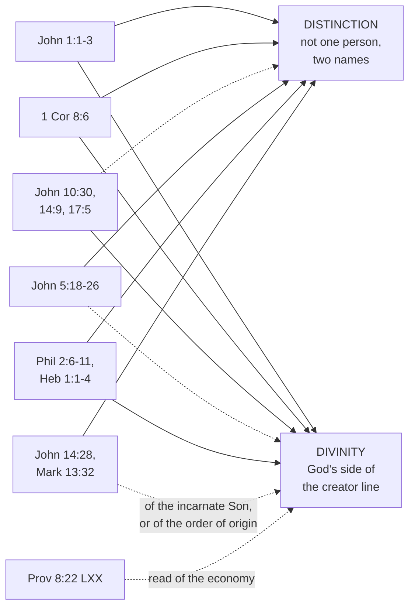

# The Triune God · Lesson 2.2: The Father and the Son in the New Testament

> ⏱ ~15 min · Module 2: The Trinity revealed · Builds on: [2.1](02-01-the-one-god-of-israel.md), [`patristics` 2.5](../../patristics/lessons/02-05-clement-of-alexandria-and-origen.md) · Unlocks: [2.3](02-03-the-holy-spirit-in-the-new-testament.md), [2.4](02-04-from-confession-to-creed.md), [3.1](03-01-nicaea.md)

## Why this matters

Arius and Athanasius had the same canon. The fourth century was not a quarrel about which books were scripture but about how much weight a sentence can be made to carry: both quoted John, both quoted Proverbs, and each could produce a verse that embarrassed the other. So the skill here is not collecting proof texts. It is saying, for each passage, three things: what it establishes about the *distinction* of Father and Son, what it establishes about the Son's *divinity*, and what it leaves open. The third column is where honesty lives, and it keeps the confession from being mistaken for a sum of verses.

## The idea

Two claims have to be carried, and they pull in opposite directions.

**Distinction.** Father and Son are not one person under two names. Somebody prays, somebody is prayed to.

**Divinity.** The Son stands on God's side of the line separating God from everything made.

Press the first alone and you land in [subordinationism](../reference.md#subordinationism): two distinct figures, one of them less. Press the second alone and you land in [modalism](../reference.md#modalism): one God wearing two names. The New Testament supplies both abundantly — but usually in different sentences, and the sentence supplying one often looks, alone, like evidence against the other.

Hence the rule this course keeps: **[what a text settles on its own](../reference.md#what-a-text-settles-on-its-own) is a different question from what the Church confesses on the whole.** No verse defines the faith. The Church, reading the whole testimony, confesses the Son consubstantial with the Father, and it is Nicaea's act that fixes that at the top of the ladder in [`fundamental-theology` 4.4](../../fundamental-theology/lessons/04-04-the-ladder-of-doctrinal-authority.md) — not any verse's self-evidence. Claiming for your reading of a verse the authority of the council's definition is the overstatement error, graded strictly here.

Aquinas's warning applies to exegesis too: arguments that do not actually work expose the faith to ridicule ([1.2](01-02-the-one-true-god-and-what-reason-can-reach.md)). How early a "high Christology" can be dated is [`new-testament`](../../new-testament/syllabus.md)'s question; what follows is dogmatic reading, not a reconstruction of origins.

## Source

Israel's confession, and Paul in a letter about idol-meat (Douay-Rheims):

> Hear, O Israel, the Lord our God is one Lord. (Deuteronomy 6:4)

> ... we know that an idol is nothing in the world, and that there is no God but one. For although there be that are called gods, either in heaven or on earth (for there be gods many, and lords many). Yet to us there is but one God, the Father, of whom are all things, and we unto him; and one Lord Jesus Christ, by whom are all things, and we by him. (1 Corinthians 8:4-6)

This is the sharpest single datum in the New Testament, and it is sharp because of what Paul does *not* do. He does not add a second God beside the one; he has just denied there is any other. He takes the Shema's own two words — *God* and *Lord*, which stand together in the Douay's "the Lord our God is one Lord" and in the Septuagint's *Theos* and *Kyrios* — and distributes them, one to the Father, one to Jesus, keeping "one" in front of each. Then he gives each the formula of creation: all things *of* the Father, all things *by* the Lord Jesus Christ.

Call it the [split Shema](../reference.md#the-split-shema): distinction (two, named separately) and divinity (Jesus inside Israel's confession, not beside it) in one breath. What it leaves open is everything else — how the two are one God, whether the word "God" may be said of Jesus, and the Spirit entirely.

## The argument

### The ledger, text by text

**1. The Johannine prologue (John 1:1-3).**

> In the beginning was the Word, and the Word was with God, and the Word was God. The same was in the beginning with God. All things were made by him: and without him was made nothing that was made.

Three clauses, three jobs. "Was in the beginning" puts the Word before anything made. "With God" requires two — you are not *with* yourself. "Was God" puts him on God's side. Verse 3 seals it: what made everything that was made is not among the things made. *In words:* the one place where distinction and divinity are asserted in consecutive clauses with nothing left to infer. It leaves open how the Word relates to the man Jesus — verse 14's business, and past that [`christology`](../../christology/syllabus.md)'s.

**2. The Johannine unity texts.** "I and the Father are one" (John 10:30), and the response — stones, "because that thou, being a man, maketh thyself God" (10:33). "He that seeth me seeth the Father also" (14:9). And John 17:5, asking for "the glory which I had, before the world was, with thee": glory held before creation, and held *with* another.

Augustine's gloss on 10:30 is this lesson compressed (*Tractates on the Gospel of John* 36):

> In these two words, in that He said one, He delivers you from Arius; in that He said are, He delivers you from Sabellius.

*In words:* "one" blocks the reading that makes the Son a lesser thing; the plural verb blocks the reading that makes the two one person.

**3. John 5, which cuts both ways.** His opponents wanted him dead because he "said God was his Father, making himself equal to God" (5:18) — a charge the narrative does not deny. But the same chapter has "the Son cannot do any thing of himself, but what he seeth the Father doing" (5:19) and "as the Father hath life in himself, so he hath given the Son also to have life in himself" (5:26). *Cannot*, and *hath given*: the strongest unity-of-operation passage in the Gospels and a standing subordinationist quarry at once. On its own it establishes that the Son has everything the Father has and has it *from* him — the raw material of eternal generation ([`patristics` 2.5](../../patristics/lessons/02-05-clement-of-alexandria-and-origen.md)) and of the processions in [4.3](04-03-the-two-processions.md) — and no single verse tells you how to read it.

**4. Philippians 2:6-11.** "Who being in the form of God, thought it not robbery to be equal with God" — then emptied himself, took the form of a servant, was obedient to death, and was given "a name which is above all names", at which every knee bows. The structure is the argument: something is *given up*, so it was held first; and the closing acclamation gives Jesus the homage Isaiah 45 reserves for the Lord alone.

**5. Hebrews 1:1-4, and the Wisdom background.** The Son is the one "by whom also he made the world", "the brightness of his glory, and the figure of his substance". Set that beside Wisdom 7:26, where Wisdom is "the brightness of eternal light, and the unspotted mirror of God's majesty". The vocabulary is borrowed wholesale — which is why Hebrews is both powerful and the hinge into the hard texts. Reading the Son as God's Wisdom is scriptural and ancient, and it inherits whatever the Wisdom literature says of Wisdom, Proverbs 8 included.

## The ledger as a picture

Solid arrows: the text carries that claim alone. Dashed: only with help from the rest.

## Worked examples

**Example 1 — the clean case: [John 14:28](../reference.md#the-father-is-greater-than-i).** "If you loved me, you would indeed be glad, because I go to the Father: for the Father is greater than I."

State the subordinationist reading at full strength first, because it is not silly. The comparison is made by the Son, about himself, unprompted. "Greater" compares *within* an order: you do not ordinarily say a creature is greater than God, you say something else entirely. And it sits in a farewell discourse about *going to* the Father. Read alone, the verse looks like the Son's own testimony to his rank — exactly how the fourth century used it.

The Church's reading denies one premise: that "greater" must name a difference of *nature*. Two grounds are available, and genuinely different.

- **Of the incarnate Son.** He who speaks is the Son made man, and in the assumed human nature the Father is greater. This is the standard Latin reading; [3.4](03-04-the-latin-rules-of-speech.md) reads the Athanasian Creed's version of it.
- **Of the order of origin.** Even as God, the Son is *from* the Father. Greek theology is content to call the Father greater as *source*, because what the source gives is the whole undivided nature — greater in nothing except in being the one from whom. That is not a concession to subordinationism; it is the monarchy of the Father, stated in its own terms in [3.2](03-02-one-ousia-three-hypostaseis.md) and [5.2](05-02-the-greek-doctrine-and-the-addition.md).

Neither reading claims the verse *by itself* teaches equality. It doesn't. It is compatible with equality, and that is all a single verse was ever going to give you.

**Example 2 — where it strains: [the created Wisdom of Proverbs 8](../reference.md#the-created-wisdom-of-proverbs-8), and Mark 13:32.**

Proverbs 8:22 in the Douay, following the Vulgate's *possedit*, reads: "The Lord possessed me in the beginning of his ways." Harmless. But the Greek fathers argued from the Septuagint: *Κύριος ἔκτισέ με ἀρχὴν ὁδῶν αὐτοῦ* — in this lesson's translation, "The Lord **created** me a beginning of his ways." *Ektisen* is the ordinary verb for making a creature.

So the Arian argument was not a misquotation. Given the Wisdom Christology Hebrews itself licenses, their Bible said in plain words that Wisdom was created. Hence Athanasius opens the second of his *Orations against the Arians* by naming this verse as the passage they misuse, and spends the book on it ([`patristics` 3.1](../../patristics/lessons/03-01-athanasius.md)).

Three replies, in ascending order of importance. The Hebrew verb behind it is disputed — acquire, possess, beget, create — so the Septuagint fixes a reading the original may not carry, and the verse's literal sense is [`old-testament`](../../old-testament/syllabus.md) 4.5's question, not ours. Where the Fathers do read it of the Son, they refer the "creating" to the economy, the Word's taking of a created beginning for God's works. And the decisive point is method: **the fourth century did not settle the doctrine by settling Proverbs 8; it settled Proverbs 8 by settling the doctrine.**

Mark 13:32 is harder still: it ascribes not lesser dignity but ignorance, and ranks as it goes — "no man knoweth, neither the angels in heaven, nor the Son, but the Father." The tradition reads it of the Son's human knowing, or of a knowledge not given him to disclose; which is right is [`christology`](../../christology/syllabus.md)'s question and stops here.

The honest summary of both: these readings are available to someone who already holds the Son to be God. They are not what proves it. They are the texts the confession has to be able to hold — a real test, which the doctrine passes and flat proof-texting does not.

## Watch out

- **You might think the prologue alone is enough.** Sabellius could sign "and the Word was God" without blinking; what he cannot sign is "was *with* God". Drop one clause and scripture's strongest Trinitarian text becomes a modalist one.
- **You might think "the Father is greater than I" is a problem to explain away.** It is a datum, and the Church has always kept it. What must be denied is only the extra premise: that "greater" names a difference of nature. Deny nothing and you have subordinationism; deny the verse and you have stopped reading scripture.
- **You might read 1 Corinthians 8:6 as giving God to the Father and something lesser to Jesus.** Then Paul adds a second object of ultimate allegiance one sentence after denying there is one: two gods, or a demoted Lord. The split runs *inside* the Shema, not alongside it.
- **You might say a verse "proves" the dogma.** No text in this module is a definition; the definitions come in Module 3, and [2.4](02-04-from-confession-to-creed.md) is the road between.

## One-liner

> Arius and Athanasius had the same Bible; what divided them was never a verse, but what a verse can be asked to carry.

## Problems

**P1 (🟢) *(Exegetical.)*** Hebrews 1:1-4 (Douay-Rheims):

> God, who, at sundry times and in divers manners, spoke in times past to the fathers by the prophets, last of all, in these days hath spoken to us by his Son, whom he hath appointed heir of all things, by whom also he made the world. Who being the brightness of his glory, and the figure of his substance, and upholding all things by the word of his power, making purgation of sins, sitteth on the right hand of the majesty on high. Being made so much better than the angels, as he hath inherited a more excellent name than they.

(a) Quote the words that establish the Son's distinction from the Father, and the words that put him on God's side of the creator line. (b) Which single phrase would a subordinationist seize, and why does it help him? **120 words or fewer in total.**

**P2 (🟡) *(Exegetical.)*** An invented paragraph from a parish adult-formation handout:

> "Jesus never claimed to be God. He called God his Father, prayed to him, told us plainly that the Father is greater than he is, and admitted that he did not know the day of judgement. What the Gospels give us is the perfect creature — the first and best of everything God made, so close to the Father that looking at him is as good as looking at God."

(a) Name the error, and the two verses the paragraph leans on. (b) One sentence goes beyond anything those verses say: name it and say what it smuggles in. (c) The handout is reaching for something true. Say what, and name the verse that corrects the paragraph's version of it. **Two sentences per part.**

**P3 (🔴, optional) *(Exegetical.)*** (a) For each claim, give its level on the ladder of [`fundamental-theology` 4.4](../../fundamental-theology/lessons/04-04-the-ladder-of-doctrinal-authority.md) and name the act that fixes it — or say that no act fixes it, and what that means:

1. The Son is consubstantial with the Father.
2. John 1:1, by itself, establishes that the Son is consubstantial with the Father.
3. The Wisdom of Proverbs 8:22 is the eternal Son.

(b) Given your answers, what may a catechist claim when arguing from John 1:1, and what may he not? **80 words or fewer for (b).**

Solutions

**P1** *(Exegetical — strict.)*

**Must hit, strict (a):** *Distinction* — "hath spoken to us **by his Son**" (the Father speaks, the Son is the one through whom: two), "whom **he hath appointed** heir", "the brightness of **his** glory" and "the figure of **his** substance" (the Son is of another's glory and substance), and "sitteth on the right hand of the majesty on high" (one seated beside another). *Divinity* — "**by whom also he made the world**" puts the Son on the making side of everything made, the same move as John 1:3, and "upholding all things by the word of his power" ascribes to him what belongs to God. "The figure of his substance" does double duty and should be credited in either column: it presupposes another whose substance it is, and it ascribes that same substance's exact expression to the Son.

**Must hit, strict (b):** "**Being made** so much better than the angels" — *made*, plus a comparison with creatures. A comparative ranking against angels appears to place the Son on one scale with created beings, differing by degree; "hath appointed heir" and "hath inherited" help him further, since what is received looks like what was not possessed.

**Wrong turns:** reading "the figure of his substance" as *a lesser copy* while ignoring verse 2's creating clause; claiming the passage settles consubstantiality on its own — it establishes both columns strongly and still leaves the *how* open; naming "spoke by the prophets" as the subordinationist phrase, which concerns the prophets, not the Son.

**Model answer:** (a) Distinction: "hath spoken to us by his Son", "whom he hath appointed heir", "the brightness of his glory", "sitteth on the right hand of the majesty on high". Divinity: "by whom also he made the world" — the maker of all that was made is not among them — with "the figure of his substance" and "upholding all things by the word of his power". (b) "Being made so much better than the angels": *made* plus a comparison with creatures puts the Son on one scale with them, so the difference looks like degree rather than kind.

---

**P2** *(Exegetical — strict.)*

**Must hit, strict (a):** **subordinationism** — the Son placed below the Father in nature, on the creature side of the line. The verses are **John 14:28** ("the Father is greater than I") and **Mark 13:32** (the Son does not know the day).

**Must hit, strict (b):** "**the first and best of everything God made**." Neither verse says the Son was made or is a creature at all; one reports a comparison, the other an ignorance. The sentence converts "less, in some respect" into "created", which is the whole Arian inference and the thing Nicaea anathematized ([3.1](03-01-nicaea.md)). Credit also for flagging "as good as looking at God" as a second smuggle: John 14:9 says seeing the Son *is* seeing the Father, not a serviceable substitute for it.

**Must hit, strict (c):** the true thing is the Son's **real distinction from the Father and his real receiving from him** — he does pray, he is sent, and everything he has he has from the Father (John 5:19, 5:26). The corrective is John 1:1 with 1:3 — the one who was *with* God was God, and what made everything that was made is not itself made — or John 10:30 with Augustine's gloss. Either verse is acceptable.

**Wrong turns:** calling it modalism — the paragraph over-separates rather than collapsing the two; answering (b) with "Jesus never claimed to be God", which is a disputable historical claim rather than the doctrinal smuggle; treating the handout as simply false about the verses, when it quotes them accurately and mis-infers from them.

**Model answer:** (a) Subordinationism, leaning on John 14:28 and Mark 13:32. (b) "The first and best of everything God made" — neither verse says the Son was made, and the sentence turns "less in some respect" into "created", which is precisely the step Nicaea condemned. (c) It is reaching for the Son's genuine distinction from the Father and his receiving everything from him (John 5:26), which John 1:1-3 corrects by keeping the Word both *with* God and God, and outside everything that was made.

---

**P3** *(Exegetical — strict. Overstating a level is the error.)*

**Must hit, strict (a):**
1. **Rung 1**, proposed as divinely revealed. The act is the **Council of Nicaea (325)**, an ecumenical council's solemn definition, with anathemas attached; it is repeated in the creed of 381 and confessed by the Church ever since. Obstinate denial after baptism is heresy.
2. **No rung at all in the magisterial sense** — no act proposes it, because it is not a doctrine but an *exegetical judgement* about what one verse demonstrates. It belongs on the theologians' side of the seam (rungs 4-5 in that lesson's numbering), and treating it as though it carried the council's authority is the overstatement error this course grades strictly.
3. **No defining act.** The identification is a patristic and liturgical reading, widely used and never defined; the verse's literal sense is disputed and its exegesis is ceded to [`old-testament`](../../old-testament/syllabus.md) 4.5. Freely disputed.

**Must hit, strict (b):** he may claim that John 1:1-3 is the Church's own language for what she confesses, and that the verse is fully consistent with — and strong evidence for — the defined doctrine. He may not claim that the verse *by itself* demonstrates consubstantiality, nor lend his reading of it the authority of the definition. The reason is Aquinas's: a non-cogent argument advanced as cogent exposes the faith to ridicule ([1.2](01-02-the-one-true-god-and-what-reason-can-reach.md)).

**Wrong turns:** giving item 2 a rung because its *subject matter* is rung 1 — the rung follows the act, not the topic; calling item 3 false rather than undefined; saying Nicaea "defined John 1:1", which no council has done for any verse.

**Model answer:** (1) Rung 1, by Nicaea's solemn definition with anathemas, repeated at Constantinople in 381. (2) No magisterial act proposes it; it is an exegetical judgement, so it sits below the seam with the theologians, and asserting it at the definition's level is overstatement. (3) Undefined — an ancient and liturgical reading, with the verse's own sense disputed and ceded to `old-testament` 4.5. (b) A catechist may say the verse is the Church's own language for the doctrine and powerful evidence for it; he may not say it proves consubstantiality on its own, or that denying his reading of the verse is denying the dogma.

## Flashback

**From Lesson [1.5](01-05-impassibility-and-the-god-who-suffers.md) (Impassibility, and the God who suffers):** *(Exegetical.)* Four sentences a preacher is considering. For each, say whether Catholic teaching permits it and name the ground. **One sentence each.**

> (i) "One of the Trinity suffered in the flesh."
>
> (ii) "The Father was crucified."
>
> (iii) "The Son of God died."
>
> (iv) "God is merciful."

Solution

**Must hit, strict:**
- **(i) Permitted, with a council behind it.** Constantinople II (553), in the tenth of its capitula, anathematizes anyone who does not confess that the one crucified in the flesh is true God, the Lord of glory, and one of the Holy Trinity: the subject is a divine person, and "in the flesh" locates the suffering.
- **(ii) Refused.** That is patripassianism, and it can be said only on the modalist assumption that Father and Son are one person under two names — the charge Tertullian lays against Praxeas ([`patristics` 2.3](../../patristics/lessons/02-03-tertullian.md)).
- **(iii) Permitted.** Death is predicated of the *person*, who is God, in virtue of the human nature he assumed; the rule licensing it belongs to [`christology`](../../christology/syllabus.md), and what may not be said is "the Godhead died", which predicates death of a nature.
- **(iv) Permitted, and taught.** Mercy is attributed to God "especially ... as seen in its effect, but not as an affection of passion" (ST I q.21 a.3), and love and joy are in God as acts of the will rather than of the sense appetite (ST I q.20 a.1) — impassibility denies a passive capacity, not the perfection.

**Wrong turns:** refusing (i) on the ground that God cannot suffer, when the canon predicates the crucifixion of the person and names the flesh as that in which he underwent it; allowing (ii) as poetic licence, when the question is which person hung there; grounding (iii) on (i) without the person-and-nature distinction, which is what keeps it from sliding into "the Godhead died"; answering (iv) with "a figure of speech only", which drops what the tradition affirms in the course of denying the passivity.

**Model answer:** (i) Permitted — Constantinople II's tenth capitulum confesses the crucified as true God and one of the Holy Trinity, suffering in the flesh. (ii) Refused: patripassianism, which presupposes the modalist collapse of Father and Son into one person under two names. (iii) Permitted, because what is said of the person who is God belongs to him in the human nature he took — unlike "the Godhead died", which makes a nature the subject. (iv) Permitted and taught: God's mercy is affirmed as seen in its effect rather than as an affection of passion, and his love as an act of will, which is exactly what impassibility leaves standing.

## Connections

- **Backward:** [2.1](02-01-the-one-god-of-israel.md) set the rule that the Old Testament is read in the light of the New rather than mined for proofs; the split Shema is what that light actually is. [1.2](01-02-the-one-true-god-and-what-reason-can-reach.md) supplied the warning about non-cogent arguments that governs the whole ledger.
- **Forward:** [2.3](02-03-the-holy-spirit-in-the-new-testament.md) runs the same ledger for the Spirit, where the divinity column is thinner and the fourth century had to work harder. [2.4](02-04-from-confession-to-creed.md) takes these texts into the second- and third-century grammar and its dead ends; [3.1](03-01-nicaea.md) is where the council settles what no verse settled.
- **Sideways:** the Son's receiving everything from the Father (John 5:26) becomes eternal generation in [4.3](04-03-the-two-processions.md), and John 15:26 will do the same work for the Spirit in [5.1](05-01-the-latin-doctrine.md). The Fathers' own arguments from these texts are [`patristics`](../../patristics/syllabus.md) 2.5 and 3.1; the historical-critical questions about the texts belong to [`new-testament`](../../new-testament/syllabus.md).
