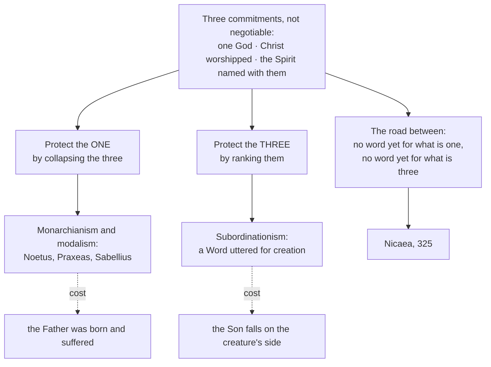

# The Triune God · Lesson 2.4: From confession to creed: the second- and third-century grammar

> ⏱ ~15 min · Module 2: The Trinity revealed · Builds on: [2.2](02-02-the-father-and-the-son-in-the-new-testament.md), [2.3](02-03-the-holy-spirit-in-the-new-testament.md) · Unlocks: [3.1](03-01-nicaea.md), [3.2](03-02-one-ousia-three-hypostaseis.md)

## Why this matters

In 325 a council writes into the Church's creed a word that is not in scripture. The charge that this was a Greek philosophical takeover of a simpler gospel is old, serious, and what you answer in this module's boss problem — and you cannot answer it from the New Testament alone, because the question is about the two centuries in between. This lesson is that stretch of road. It is also where you learn what the failures on it were *for*. Nobody was trying to shrink Christ.

## The idea

By about the year 100 the Church holds three things and will drop none of them: **there is one God**; **Jesus Christ is Lord and is worshipped**; **the Spirit is named with the other two at the font and in prayer**. That is the faith, and it arrives as practice, not as a theory.

What she does not have is a grammar. No word for *what* is one in God, none for *what* is three, and no settled way of saying how the Son and the Spirit stand to the Father before there was a world. The available Greek and Latin were built for other jobs, and every term, used of God, says slightly too much or slightly too little.

So the second and third centuries are not the period in which the doctrine gets invented. They are the period in which the Church has it as a practice and reaches for language — and the reaching goes wrong in two opposite directions. Each wrong turn is a real attempt to protect one of the three commitments at the price of another. The road to Nicaea is best learned by its ditches.

## Source

The church of Smyrna's account of its bishop's death, written soon after about 155. Polycarp prays at the stake (*Martyrdom of Polycarp* 14, Roberts and Donaldson in the *Ante-Nicene Fathers*, pronouns modernized):

> Wherefore also I praise You for all things, I bless You, I glorify You, along with the everlasting and heavenly Jesus Christ, Your beloved Son, with whom, to You, and the Holy Ghost, be glory both now and to all coming ages. Amen.

Nobody is arguing here. A man is dying, and this is the shape of his prayer.

## The argument

1. **Christian initiation names three, from the earliest evidence we have.** The Didache's baptismal rubric and Justin's Roman baptism both give the threefold naming ([`patristics` 1.2](../../patristics/lessons/01-02-first-clement-and-the-didache.md), [1.4](../../patristics/lessons/01-04-justin-martyr.md)); the formula's sacramental law belongs to [`sacraments-and-liturgy`](../../sacraments-and-liturgy/syllabus.md). *In words:* before any theologian writes a line, the way of making a Christian has three names in it.
2. **Christian prayer glorifies the Son and the Spirit along with the Father.** The Source is a dying man's doxology, not a controversial text — which is what makes it evidence. *In words:* she prays to what she takes to be God.
3. **From 1 and 2: the Church's worship already commits her.** You do not baptize into a creature, and you do not give glory to one. The inference has a name — [*lex orandi, lex credendi*](../reference.md#lex-orandi-lex-credendi), the law of prayer is the law of belief, condensed from a fifth-century formula usually attributed to Prosper of Aquitaine. *In words:* what the Church does in worship is evidence of what she holds, usable against a theologian who says otherwise.
4. **The [rule of faith](../reference.md#rule-of-faith) states the same shape in words a catechumen can hold.** Irenaeus's summary and Tertullian's are tripartite, and both present them as received, not composed ([`patristics` 2.1](../../patristics/lessons/02-01-irenaeus-against-the-gnostics.md), [2.3](../../patristics/lessons/02-03-tertullian.md)). *In words:* the three are not a topic in the faith; they are its skeleton.
5. **But nothing in 1–4 supplies the missing words.** A rule of faith tells you whom to confess, not what you are asserting when you say the Son is God and also that God is one. *In words:* practice outruns vocabulary, and the gap is where the errors grow.
6. **Therefore the questions Nicaea answers are generated in this period, and so are the two standing ways of getting them wrong.**

**Mark the level before going on.** The *content* of 1–4 is what the creeds later define: dogma. The writers' *explanations* of it sit nowhere on the ladder ([`fundamental-theology` 4.4](../../fundamental-theology/lessons/04-04-the-ladder-of-doctrinal-authority.md)) — private theology, some later received, some discarded. Reading Tertullian or Theophilus as though a Father's sentence were a definition is the commonest error in this territory.

## The road and its ditches

### What monarchianism and modalism were protecting

Start with the motive: it is the whole reason the error was attractive.

Noetus of Smyrna was summoned twice by his presbyters. Hippolytus reports his defence at the second hearing (*Against Noetus* 1, Salmond in the *Ante-Nicene Fathers*): "What evil, then, am I doing in glorifying Christ?" That is not a man reducing Jesus. He is protecting the **full divinity of Christ** in the only way his vocabulary allowed: if Christ is God without remainder, and there is one God, then Christ is the one God — the Father himself. At Rome a generation later, Praxeas's party carried a slogan: they maintained the *monarchy*, the sole rule of the one God, and charged their opponents with preaching two (Tertullian, *Against Praxeas* 3). The second protected thing is **monotheism**. Both motives are correct, and the Church defines both.

Then the cost. If the Son just is the Father under a second name, the Father was born, suffered and died — **[patripassianism](../reference.md#patripassianism)**, which is why Tertullian says of Praxeas that he put the Paraclete to flight and crucified the Father. And the gospel becomes theatre: the one praying in Gethsemane and the one prayed to are the same actor in two costumes. The distinction the New Testament reports ([2.2](02-02-the-father-and-the-son-in-the-new-testament.md)) dissolves into a sequence of appearances, which is why the position is called **[modalism](../reference.md#monarchianism-and-modalism)** — three modes of one subject, not three who are.

Sabellius gives the error its other name, with a caution: what we know of him comes from later and hostile reporters. Name the doctrine; hedge the biography.

### Subordinationism, the other ditch

The opposite protection is just as well motivated: keep the Father's uniqueness as **source**, and take seriously the texts that rank — "the Father is greater than I", and Proverbs 8:22 in Greek, where Wisdom is *created* ([2.2](02-02-the-father-and-the-son-in-the-new-testament.md)).

The tool of choice was [Logos theology](../reference.md#logos-theology-and-its-ambiguity), and its ambiguity is the hinge of the period. Theophilus of Antioch, about 180, says the Word always exists, residing within the heart of God as his own mind and counsel — and then that when God willed to make what he had determined on, he begot this Word, *uttered*, the firstborn of all creation (*To Autolycus* II.10, 22). Read it twice. The Word is eternal **as God's own reason**; the Word is a distinct someone **from the moment God turns toward creating**. On that account the Son's distinct existence is a function of the world's, and God without the world is not yet a Father. Theophilus also supplies the first surviving use of *trias* — and his triad is "God, and His Word, and His wisdom" (II.15), which is not Father, Son and Holy Spirit. The vocabulary arrives before its referents are fixed.

Tertullian inherits the problem, hands the Latin West *trinitas*, *substantia* and *persona*, and also calls the Son a derivation and portion of the whole — a ranking Nicaea had to discard. That is [`patristics` 2.3](../../patristics/lessons/02-03-tertullian.md)'s territory, and it makes one correction you must carry: the tag *una substantia, tres personae* is a **later condensation** and is not found in *Against Praxeas*; do not quote it as his. Origen closes the ambiguity from the other side with **eternal generation** — the Father is never without the Son, so there is no moment of utterance ([`patristics` 2.5](../../patristics/lessons/02-05-clement-of-alexandria-and-origen.md)). It is the great pre-Nicene gain, and his own idiom elsewhere still ranks the three.

### Both named at once, about 260

Dionysius of Rome writes to Alexandria condemning, in one letter, those who split the divine monarchy into three separate subsistences *and* those who make the Son a work (preserved by Athanasius, *On the Decrees of the Council of Nicaea* 26; you read it in P1). Both ditches are marked sixty-five years before Nicaea. What he still has no word for is the middle of the road.

## Worked examples

**Example 1 (clean: running the argument from worship).** A modalist grants that Christ is worshipped — that is his starting point. Does the Source touch him? Run step 3 carefully. The force is in the prepositions: glory is given to God *along with* Jesus Christ, and *with whom*, to God *and* the Holy Ghost. One is addressed in the company of two others, named as distinct from him. A modalist has to read "along with" as a figure of speech, and a man burning to death is not usually reaching for a figure of speech. What the passage establishes: a settled practice, by about 155, of worship naming the three together and not interchangeably. What it does not establish: that they are one in substance, or what "Son" and "Holy Ghost" name — that is 325 and 381. Basil later turns this same argument from the shape of prayer into a formal one ([`patristics` 3.2](../../patristics/lessons/03-02-basil-the-great.md), taken up in [3.3](03-03-constantinople-i-and-the-divinity-of-the-spirit.md)).

**Example 2 (where it strains: counting words).** Run the move on vocabulary instead of practice and it breaks. Theophilus uses *trias* before anyone else, and a careless argument concludes that the Trinity was in place by 180. But his three are God, his Word and his Wisdom, and in the same work the Word is begotten *when God wills to create*. The word is there and the doctrine is not — nor is its denial, since Theophilus is not choosing against a position nobody has yet formulated. This is why the development question ([`fundamental-theology` 5.1](../../fundamental-theology/lessons/05-01-vincent-of-lerins.md)–[5.2](../../fundamental-theology/lessons/05-02-newmans-theory-of-development.md)) has to be argued on Newman's ground rather than Vincent's: asking what was held *everywhere, always, by all* returns a mess here, since universal explicit agreement is exactly what is missing. Newman's live notes are **anticipation of its future** (the font and the doxology, long before the definition) and **power of assimilation** (did the faith eat the Greek vocabulary, or did it eat the faith?). Neither Vincent's canon nor Newman's notes is taught by any magisterial act; what *is* taught is the growth clause of *Dei Filius* ch. 4 — growth in understanding, in the same doctrine, the same sense, the same meaning. Boss 2(d) is where you argue it out.

## Watch out

- **You might think "God is Father in creation, Son in redemption, Spirit in the Church" is a harmless summary.** It is Sabellius with a calendar: three roles of one subject in sequence, which is the modalist thesis exactly, and the commonest error in preaching. Name what it reaches for — the unity of God's action — then say the true thing: the three act inseparably, and appropriating a work to one is a different move ([4.5](04-05-common-proper-appropriated.md)).
- **You might treat pre-Nicene [subordinationist](../reference.md#subordinationism) idiom as Arianism.** Arius denies the Son is from the Father's substance; Theophilus and Tertullian assert he is, and then rank him. Naming the ranking is right; calling it the fourth-century heresy imports a category that did not exist ([3.1](03-01-nicaea.md)).
- **You might quote *una substantia, tres personae* as Tertullian's.** It is a later condensation of his vocabulary, not a sentence of his ([`patristics` 2.3](../../patristics/lessons/02-03-tertullian.md)).
- **You might promote a second-century writer's explanation to doctrine — or demote the faith he was explaining to his opinion.** Both are graded strictly. The rule of faith's content is dogma; Theophilus on how the Word was uttered is one man's theology ([`fundamental-theology` 4.4](../../fundamental-theology/lessons/04-04-the-ladder-of-doctrinal-authority.md)).

## One-liner

> For two centuries the Church baptized and prayed her way into a doctrine she had no words for, and both heresies of the period were honest attempts to say it with the wrong ones.

## Problems

**P1 (🟢) *(Exegetical.)*** Dionysius of Rome, quoted by Athanasius, *On the Decrees of the Council of Nicaea* 26 (Newman and Robertson, *Nicene and Post-Nicene Fathers*, second series):

> Next, I may reasonably turn to those who divide and cut to pieces and destroy that most sacred doctrine of the Church of God, the Divine Monarchy, making it as it were three powers and partitive subsistences and god-heads three. I am told that some among you who are catechists and teachers of the Divine Word, take the lead in this tenet, who are diametrically opposed, so to speak, to Sabellius's opinions; for he blasphemously says that the Son is the Father, and the Father the Son, but they in some sort preach three Gods … Equally must one censure those who hold the Son to be a work, and consider that the Lord has come into being, as one of things which really came to be.

(a) Name the two errors this passage condemns and quote the words that carry each. (b) The letter marks both ditches. Name the one thing it does **not** supply, and say how you can tell from the passage itself. **Two sentences per part.**

**P2 (🟡) *(Exegetical.)*** An invented parish hymn text, written for this problem:

> One God in three great masks you wear, / the Maker's face, the Saviour's care, / the Spirit's fire upon our days: / three seasons of a single praise. / No second Lord, no lesser throne, / no rival god beside your own.

(a) State what the verse is protecting, in one sentence, before naming anything wrong with it. (b) Name the position it lands in and the two costs of that position, each in the terms this lesson used. (c) Name one second-century motive the verse shares with Noetus, citing the text where Noetus states it. **120 words or fewer in total.**

**P3 (🔴, optional) *(Exegetical.)*** Theophilus of Antioch holds that the Word always exists within God as his own mind and counsel, and that God begot the Word, uttered, when he willed to make what he had determined on (*To Autolycus* II.22).

(a) Reconstruct that account in three or four numbered premises ending in a conclusion about when the Son exists as distinct from the Father, and name the premise that does the damage. (b) At what level does Theophilus's account stand, and what act would be needed to fix a level to a claim of this kind? Name the act, not just the level. **Two sentences for (b).**

Solutions

**P1** *(Exegetical.)*

**Must hit, strict (a):** (i) **Tritheism** — dividing the one God into three separate gods: "making it as it were three powers and partitive subsistences and god-heads three", and "in some sort preach three Gods". (ii) **The Son as a creature** — the error Nicaea will condemn in Arius: "those who hold the Son to be a work, and consider that the Lord has come into being, as one of things which really came to be". Credit for noting that Sabellius is named in passing as the error the tritheists are reacting against ("the Son is the Father, and the Father the Son"), so three positions appear, two of them condemned here.
**Must hit, strict (b):** it supplies no positive vocabulary for what is three. The tell is in the passage: the only word available for the three is *subsistences*, and Dionysius uses it exclusively as a term of abuse — a plurality of subsistences just is the tritheist error. A writer with a settled term for the threeness would not have to reach for the word he is condemning. (Equally good: he has no term for what is one that is not simply "the Monarchy" or "the Monad", both of which name the oneness without leaving room for the three.)
**Wrong turns:** calling the first error modalism because "Monarchy" appears — the monarchy here is what is being *defended*, not the error; reading "partitive subsistences" as Nicaea's *hypostasis* in its later sense, which is the whole point of [3.2](03-02-one-ousia-three-hypostaseis.md) and is not yet available in 260; treating the passage as a conciliar definition rather than a bishop's letter reported by a later Father.
**Model answer:** (a) Tritheism — "three powers and partitive subsistences and god-heads three", "in some sort preach three Gods"; and the Son as a creature — "those who hold the Son to be a work … as one of things which really came to be". (b) It supplies no word for what is three: the only available term, *subsistences*, appears solely as the name of the error. That is the missing middle of the road, and the vocabulary that fills it is still sixty-five years and one council away.

---

**P2** *(Exegetical.)*

**Must hit, strict (a):** the oneness of God and the full divinity of the one who saves — "No second Lord, no lesser throne" refuses both polytheism and a ranked, lesser Christ. Both are things the Church defines; the verse is guarding real ground.
**Must hit, strict (b):** **modalism** (monarchianism in its modalist form). Costs: (i) **patripassianism** — if the Saviour's face is simply the Maker under another name, the Father was born and suffered; (ii) the **loss of the real distinction** the New Testament reports, so that the Son praying to the Father becomes one subject in two costumes rather than two who are. "Masks", "faces" and "seasons" are the words that carry it; the sequencing of creation, salvation and sanctification is Sabellius with a calendar.
**Must hit, strict (c):** the motive of glorifying Christ without qualification — Noetus's own defence before his presbyters, "What evil, then, am I doing in glorifying Christ?", reported by Hippolytus, *Against Noetus* 1. (Equally acceptable: the defence of the monarchy, with Tertullian, *Against Praxeas* 3.)
**Wrong turns:** naming subordinationism — the verse denies a lesser throne, which is the opposite error; skipping (a) and going straight to the condemnation, which is the failure this archetype is built to catch; calling the sequencing a legitimate **appropriation**, which is a different move and belongs to [4.5](04-05-common-proper-appropriated.md) — an appropriation attributes a *common* work to one person by resemblance, and does not make the three into phases.
**Model answer:** It is protecting the oneness of God and a Christ who is God without remainder — "no second Lord, no lesser throne". But "masks", "faces" and three seasons of one praise make the three modes of a single subject, which is modalism. Two costs: the Father is then the one born and crucified, and the Son's prayer to the Father becomes a performance. The motive is Noetus's own — "What evil, then, am I doing in glorifying Christ?" (*Against Noetus* 1).

---

**P3** *(Exegetical.)*

**Must hit, strict (a):** a reconstruction along these lines, with the damaging premise identified.
- P1. God has his own reason, mind and counsel eternally within him, and this is the Word.
- P2. Being God's own mind, the Word within is not a distinct someone over against God.
- P3. When God willed to create, he begot the Word, uttering him as the firstborn of all creation.
- ∴ C. The Word exists as distinct from the Father only from the moment God turns toward creation.

The damaging premise is **P3**, because it makes the begetting an event with a *purpose outside God*: the Son's distinct existence is conditioned on the world's. Full credit for naming the consequence — God without the world would not yet be a Father, so fatherhood becomes accidental to God — and for noting that Origen's eternal generation ([`patristics` 2.5](../../patristics/lessons/02-05-clement-of-alexandria-and-origen.md)) is the repair. P2 is accepted as a fair reading of the account rather than attacked; the argument's problem is where the distinction is *introduced*, not that the Word is God's reason.
**Must hit, strict (b):** **no level at all.** Theophilus is a second-century apologist writing private theology; a bishop's or a theologian's explanation acquires a level only by a magisterial act — for the top rung, a solemn definition by pope or council, or the infallible teaching of the ordinary universal magisterium ([`fundamental-theology` 4.4](../../fundamental-theology/lessons/04-04-the-ladder-of-doctrinal-authority.md)). Naming the act is the point of the part: "the Church later rejected it" is not an act, and "it is patristic" is not a level.
**Wrong turns:** calling the account heresy — there is no definition yet to contradict, which is exactly what makes the period hard to grade; calling it dogma because Theophilus is early and a bishop, which is the promotion error this course grades strictly; answering (b) with a level and no act.
**Model answer (b):** None. *To Autolycus* is a private theologian's book, and nothing a Father writes acquires a level by being written; a claim reaches the top rung only when a pope or an ecumenical council solemnly defines it, or when the ordinary universal magisterium teaches it as divinely revealed. Theophilus's *account* therefore stands nowhere on the ladder, even though the thing he was trying to say — that the Word is God's own and eternal — is later defined.

## Flashback

**From Lesson [2.2](02-02-the-father-and-the-son-in-the-new-testament.md) (The Father and the Son in the New Testament):** *(Exegetical.)* Colossians 1:15-17 (Douay-Rheims):

> Who is the image of the invisible God, the firstborn of every creature: For in him were all things created in heaven and on earth, visible and invisible, whether thrones, or dominations, or principalities, or powers: all things were created by him and in him. And he is before all, and by him all things consist.

(a) Run the ledger, one sentence per column: what this passage establishes about the Son's **distinction** from the Father, what it establishes about his **divinity**, and what it leaves open. (b) Name the phrase a fourth-century subordinationist would quote, state the inference he draws from it, and name the step of that inference the Church denies — pointing to the words in the passage that block it. **Two sentences for (b).**

Solution

**Must hit, strict (a):**
- *Distinction:* "the image of the invisible God" — an image is the image of another, so the Son is not the one whose image he is; "in him were all things created" has someone else creating in him.
- *Divinity:* "all things were created by him and in him" with "in him were all things created in heaven and on earth, visible and invisible" — whatever made everything that was made is not among the things made — reinforced by "he is before all, and by him all things consist", since holding all things in being is God's own work.
- *Leaves open:* how the Son and the Father are one God (no word here for what they share), the Spirit entirely, and how the one in whom all things were created stands to the man Jesus.

**Must hit, strict (b):** "**the firstborn of every creature**." The inference: the firstborn *of* a class is a member of that class, so the Son is a creature — the first and highest, but made. The Church denies the move from "firstborn of" to "one of": the next clause opens with **"For"** and gives the reason for the title — he is called firstborn *because* in him all things were created — which puts him on the making side, so the phrase states primacy over everything created, not membership among it. Credit for noticing that the Douay's own note reports Chrysostom's gloss, first begotten rather than first created, and for adding that a printed annotation is not an act of the Magisterium.

**Wrong turns:** saying the passage settles consubstantiality — it fills both columns strongly and still leaves the *how* of the one God untouched; naming "image" as the subordinationist's phrase, when an image may be exact and the word does not rank; answering (b) by denying that "firstborn" has any creaturely surface at all, which is not honest exegesis and is how a catechist loses the argument.

**Model answer:** (a) Distinction: "the image of the invisible God" requires another whose image he is. Divinity: "all things were created by him and in him", and "by him all things consist" — the maker and sustainer of everything made is not among the things made. Left open: how the two are one God, the Spirit, and the relation of this Son to the man Jesus. (b) "The firstborn of every creature", from which he infers that the Son is the first of the creatures. The denied step is that "firstborn of" means "one of": verse 16 begins "For", grounding the title in the fact that all things were created in him, so it names his primacy over creation rather than a place inside it.

## Connections

- **Backward:** [2.2](02-02-the-father-and-the-son-in-the-new-testament.md) supplied the ranking texts that make subordinationism tempting, and [2.3](02-03-the-holy-spirit-in-the-new-testament.md) the triadic formulas that make the baptismal argument of step 1 available. The Fathers read as theologians in their own right are [`patristics`](../../patristics/syllabus.md) 2.1, 2.3 and 2.5; the doctrinal outcome is here.
- **Forward:** [3.1](03-01-nicaea.md) is the answer to the ditch on the right and [3.2](03-02-one-ousia-three-hypostaseis.md) supplies the vocabulary Dionysius lacked; [3.3](03-03-constantinople-i-and-the-divinity-of-the-spirit.md) turns the argument from worship into a conciliar definition about the Spirit. Boss 2(d) runs the development question against Harnack's charge.
- **Sideways:** development as machinery is [`fundamental-theology` 5.1](../../fundamental-theology/lessons/05-01-vincent-of-lerins.md)–[5.2](../../fundamental-theology/lessons/05-02-newmans-theory-of-development.md), and levels throughout come from its [4.4](../../fundamental-theology/lessons/04-04-the-ladder-of-doctrinal-authority.md). Nicaea as an event, with its politics and its emperor, is [`church-history` 2.1](../../church-history/lessons/02-01-nicaea-and-the-imperial-church.md). The baptismal formula as sacramental law belongs to [`sacraments-and-liturgy`](../../sacraments-and-liturgy/syllabus.md), and what the second-century evidence proves against later challengers to [`apologetics-catholic-claims`](../../apologetics-catholic-claims/syllabus.md).
