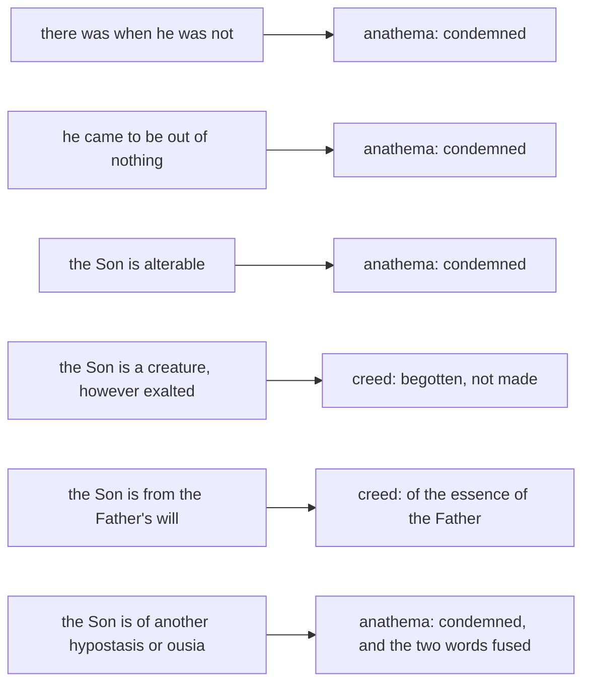

# The Triune God · Lesson 3.1: Nicaea (325)

> ⏱ ~15 min · Module 3: The dogma in its defining texts · Builds on: [2.4 From confession to creed](02-04-from-confession-to-creed.md), [2.2 The Father and the Son in the New Testament](02-02-the-father-and-the-son-in-the-new-testament.md) · Unlocks: [3.2 One ousia, three hypostaseis](03-02-one-ousia-three-hypostaseis.md)

## Why this matters

Every defining text after this one — the creed of 381, the Athanasian Creed, Lateran IV, Florence — is downstream of a council that met in the summer of 325 and put four unfamiliar phrases into a baptismal creed. Nicaea is the Church's first ecumenical definition, and it is the standing example of how a definition works: not by explaining a mystery but by closing off the sentences that get it wrong. It is also the standing example of what a definition leaves undone. Nicaea settled the Son and left the vocabulary in a condition that took another two generations to repair.

## The idea

Take Arius at his strongest, which is not where his opponents leave him.

Arius, a presbyter of Alexandria who died in 336, was defending the premise everyone in the argument shared: God is one, unoriginate, without parts ([1.3](01-03-simplicity-as-doctrine.md)). Ask how a Son can be *from* such a God and the options look bad. A piece cut off divides him. An emanation makes him change. What is left is production by will — the way everything else comes from God. Arius took that road and then protected the Son's dignity as far as it would go: produced before all ages, before time itself, the one through whom everything else was made, but on the creature's side of the line. His own letter to his bishop says it in one breath:

> We acknowledge One God, alone Ingenerate, alone Everlasting, alone Unbegun, alone True … perfect creature of God, but not as one of the creatures; offspring, but not as one of things begotten.
>
> — Arius and his presbyters to Bishop Alexander, in Athanasius, *De Synodis* 16 (NPNF)

*Alone* unoriginate guards monotheism and simplicity; *perfect creature* keeps the Son out of the ordinary herd. That is a serious position, and it was not obviously the loser in 325.

His opponents report him more bluntly, and the report reaches us through their pens. Athanasius quotes from Arius's *Thalia* the line "Thus there is a Triad, not in equal glories," and hands down the slogans: *there was when he was not*, *out of nothing*, *he is alterable*. Treat a polemicist's summary as evidence about the polemicist first ([`patristics` 3.1](../../patristics/lessons/03-01-athanasius.md)) — but Arius's own letter concedes the substance, so on the main point the report is fair.

The council did not out-argue him. Nobody at Nicaea explained how a Son can be from the Father without division, change, or a decision. The bishops did something narrower and more durable: they wrote into the creed words through which Arius's sentences cannot be spoken, and then attached a list of the sentences themselves, condemned by name.

## Source

The creed of 325, in Schaff's public-domain English, with the closing anathemas. Schaff brackets a few words that the later received text drops; the brackets are dropped here because this is the 325 text.

> We believe in one God, the Father Almighty, Maker of all things visible and invisible. And in one Lord Jesus Christ, the Son of God, begotten of the Father, the only-begotten; that is, of the essence of the Father, God of God, Light of Light, very God of very God, begotten, not made, being of one substance (*homoousion*) with the Father; by whom all things were made … And in the Holy Ghost. But those who say: "There was a time when he was not;" and "He was not before he was made;" and "He was made out of nothing," or "He is of another substance" or "essence," or "The Son of God is created," or "changeable," or "alterable" — they are condemned by the holy catholic and apostolic Church.
>
> — Schaff, *Creeds of Christendom*, vol. I

Two of Schaff's renderings are looser than the Greek, and the looseness matters. The first anathema is *ēn pote hote ouk ēn*, which has no word for time in it: this lesson's translation is **"there was when he was not."** The second is *prin gennēthēnai ouk ēn*, **"before being begotten he was not"** — begotten, not "made."

## The argument

Arius's case, reconstructed:

1. God is one, unoriginate and altogether simple. *In words:* whatever is God has no source and no parts.
2. Whatever is not unoriginate has a source, and so is produced. *In words:* there are exactly two classes, source and produced.
3. The Son is from the Father, so the Son is produced. *In words:* he falls on the produced side by his own name.
4. Production by division or emanation would make God divisible or changeable, which premise 1 forbids. *In words:* the only surviving mechanism is the Father's will.
5. What is produced by will, before all ages and through whom all else is made, is the highest of creatures. ∴ The Son is a perfect creature, and God alone is unoriginate.

Premise 2 is the hinge, and it is metaphysical, not scriptural: *unoriginate* and *produced* are treated as an exhaustive pair. The creed denies exactly that, by supplying a third term — *begotten* — and refusing to let it collapse into either.

Four phrases do the work.

- **"of the essence of the Father"** (*ek tēs ousias tou patros*). *In words:* the Son comes from what the Father *is*, not from what the Father *decides*. This is the clause aimed at premise 4. Arius could say "from God"; everything is from God. He could not say "from the *ousia* of God."
- **"begotten, not made."** *In words:* begetting and making are different acts, so an exalted creature is still a creature. Arius used "begotten" too — his own creed of 328 says the Son was "begotten of him before all ages" — so the word alone was not enough; it needed the phrase above to fix its sense.
- **[*homoousios*](../reference.md#homoousios)**, "of one substance with the Father." *In words:* whatever it is to be God, the Son has it, not a resemblance of it. It is not a scriptural word, and the council knew it; why they used it anyway is Athanasius's argument, and it is [`patristics` 3.1](../../patristics/lessons/03-01-athanasius.md)'s.
- **the anathemas.** *In words:* the creed says what to confess; the anathemas name the sentences that are now outside the faith. They are part of the definition, not an appendix — as the next section shows, one of them carries a load no positive clause carries.

Level, marked once and for all: the creed of 325 is defined dogma, the top rung of the [ladder of doctrinal authority](../../fundamental-theology/lessons/04-04-the-ladder-of-doctrinal-authority.md), fixed by the solemn definition of an ecumenical council and received by the whole Church, which reaffirmed it at Chalcedon. The *explanations* of it in this course — how a relation can distinguish without dividing, what "person" will come to mean — are not on that rung and never became defined as such.

## The rule

Read it as a fence, not a picture of God. Each Arian sentence on the left is met by the clause on the right, and nothing on the right explains anything. The last row is the one to remember: in condemning "another *hypostasis* or *ousia*" the council used the two words as a single pair, as though they meant the same thing.

## Worked examples

**Example 1 (clean).** A catechist writes: *"The Son is the first and greatest of all that the Father brought into being, made before time and before the ages, through whom everything else was made."* Run the creed on it.

"Brought into being" and "made" are struck twice over: by **begotten, not made**, and by the anathema against saying the Son is *created*. "Through whom everything else was made" is untouched — the creed says it too. And notice what does *not* do the work: "before time and before the ages" sounds orthodox and is not. Arius said it. The creed never uses the word *eternal* of the Son at all; what excludes a Son who once was not is the anathema, "there was when he was not." Remove the anathemas and the creed's positive clauses could still be signed by a very careful Arian. That is why they are part of the definition.

**Example 2 (where it strains).** *Homoousios* is underdetermined, and the council left it that way. Two men are *homoousioi* in the obvious sense: same kind, two beings. Read the creed that way and it licenses two gods. Read it as strict identity of the one concrete being and it seems to leave nothing for Father and Son to differ in — which is why the word had frightened bishops before 325 and went on frightening them after.

The repair the next generation needed was a second word for the concrete distinct one, with *ousia* kept for what the three share. The obvious candidate was *hypostasis*. But Nicaea's final anathema condemns saying the Son is "of another *hypostasis* or *ousia*," treating the pair as interchangeable — and Arius's own letter had used *hypostasis* in the other sense, confessing "three subsistences." So a bishop who wanted to say *three hypostaseis*, meaning three who are really distinct, found his word standing under a Nicene anathema, while a bishop who said *one hypostasis* could be heard denying the distinction altogether. Fifty-six years of contested formulas follow from a single fused word pair. Separating the two terms without touching the faith they express is [3.2](03-02-one-ousia-three-hypostaseis.md).

## Watch out

- **"There was a time when he was not" is not what the Greek says.** Arius denied that there was any time before the Son; he placed the Son before time. Import the word *time* and you hand him an escape. The claim condemned is that there is a *when*, of any kind, in which the Son was not.
- **Nicaea does not by itself stop modalism.** Every positive clause of the creed can be signed by someone who thinks Father and Son are one and the same subsisting God under two descriptions, and the anathema against "another *hypostasis*" sounds, to later ears, positively friendly to him. Marcellus of Ancyra, one of the creed's own defenders, was anathematized in the eastern creeds of the 340s in the same breath as Sabellius. The rule against confounding the persons comes from the Latin texts of [3.4](03-04-the-latin-rules-of-speech.md), not from 325.
- **The creed of 325 says nothing about the Spirit** beyond "And in the Holy Ghost." That is not a doubt; it is a question nobody had yet forced. Citing Nicaea for the Spirit's divinity overstates the act. What the Church defines about the Spirit is [3.3](03-03-constantinople-i-and-the-divinity-of-the-spirit.md)'s.
- **The creed you recite on Sunday is not this creed.** The received text is the creed of 381, which differs in its clauses and drops the anathemas; treat 325 as its own document and do not quote one for the other. Their relation is [3.3](03-03-constantinople-i-and-the-divinity-of-the-spirit.md)'s.
- **Who convened, who signed, who was exiled** is [`church-history` 2.1](../../church-history/lessons/02-01-nicaea-and-the-imperial-church.md)'s, and nothing in the event settles what the text defines. A definition is read from its words.

## One-liner

> Nicaea did not explain the Son; it fenced him — and built the fence out of one word doing two jobs, which is the next lesson's repair.

## Problems

**P1 (🟢) *(Exegetical.)*** Using the Source only.
(a) Two phrases in the creed's second article exclude a made Son. Name them, and say what each excludes that the other does not.
(b) The creed never calls the Son eternal. Which clause does the work the word *eternal* would do, and what does its Greek literally say?
Two sentences per part.

**P2 (🟡) *(Exegetical.)*** Two sentences invented for a parish handout:

> (i) "The Father is God in the fullest sense. The Son is God too, in the way a torch lit from a fire is fire — real, but second, and dependent for his being on the Father's decision."
>
> (ii) "One God wearing three faces: Father while creating, Son while redeeming, Spirit while sanctifying. Three roles, one actor."

For each, name the error, then either give the words of the creed of 325 that condemn it or state plainly that 325's text does not reach it, and why. 150 words or fewer in total.

**P3 (🔴, optional) *(Exegetical.)*** Level assignment, strict. For each claim, give its rung on the [ladder](../../fundamental-theology/lessons/04-04-the-ladder-of-doctrinal-authority.md) **and name the act that fixes it** — and where Nicaea's act is not the one that fixes it, say so.
(i) The Son is of one substance with the Father.
(ii) The Son is not a creature.
(iii) The divine essence is numerically one, not a kind shared out among three.
(iv) *Homoousios* is the only legitimate word for what the creed teaches.
One sentence each.

Solutions

**P1** *(Exegetical.)*

**Must hit, strict (a):** **"of the essence of the Father"** (*ek tēs ousias tou patros*) and **"begotten, not made."** The first fixes what the Son is *from* — the Father's own being, not the Father's will or decision — and so blocks production; "from God" alone would not have done it, since everything is from God. The second fixes the *act*: begetting and making are different, so being produced before all ages and above everything else still leaves you on the made side. Neither alone suffices: "from the essence" without "not made" can be heard as made out of God's stuff, and "begotten, not made" without "from the essence" leaves *begotten* free to mean produced — which is how Arius himself used it.

**Must hit, strict (b):** the first anathema, "there was when he was not" (*ēn pote hote ouk ēn*). The Greek contains no word for time; Schaff's "There was a time when he was not" adds one. The clause denies that there is any *when* at all in which the Son was not, which is stronger than denying a stretch of time before him — and it has to be, because Arius also placed the Son before time.

**Wrong turns:** naming *homoousios* for (a) — it is the creed's strongest word but it states what the Son *is*, not that he is unmade, and it is compatible on its face with more than one reading; answering (b) with "begotten of the Father," which Arius could sign; treating "before the ages" as the eternity clause.

**Model answer:** (a) "Of the essence of the Father" says the Son comes from what the Father is rather than from what he wills, which is the clause Arius's position cannot survive; "begotten, not made" says the act is generation and not production, so no height of dignity turns a made thing into a Son. Each covers the other's gap: without the first, "begotten" can mean produced, as Arius used it; without the second, "from the essence" can be heard materially. (b) The first anathema, "there was when he was not," literally with no word for time — it excludes any *when* whatever in which the Son was not, which is what is needed, since Arius placed the Son before time.

---

**P2** *(Exegetical.)*

**Must hit, strict (i):** subordinationism, in Arius's own form. The decisive words are "dependent for his being on the Father's decision" — that is production by will. Condemned by **"of the essence of the Father"**, by **"begotten, not made"**, and by the anathema against saying the Son is "of another substance or essence" or "created."

**Must hit, strict (ii):** modalism (Sabellianism), and 325's text **does not reach it**. Every positive clause can be signed by a modalist, and the anathema against "another *hypostasis* or *ousia*" tells against him not at all. The point to make is that the creed was built against one error and is silent on the opposite one, which is why its defenders had to be distinguished from Marcellus later.

**Wrong turns:** claiming *homoousios* condemns (ii) — the word was suspected of Sabellianism precisely because it can be read that way; calling (i) tritheism; objecting to the torch image itself, when the error is located in the clause about the Father's decision; citing the Athanasian Creed or Florence as if 325 contained them.

**Model answer:** (i) Subordinationism: the Son's being is made to depend on the Father's decision, which puts him among things produced by will. Nicaea condemns it directly — "of the essence of the Father," "begotten, not made," and the anathema on "of another substance or essence" and "created." (ii) Modalism: one subject taking three roles, so the three are not really distinct. The creed of 325 does not reach it. Its clauses say where the Son is from and what he is, all of which a modalist can confess, and its anathema on "another *hypostasis* or *ousia*" gives him nothing to fear. That silence is real: the rule against confounding the persons had to come from later texts.

---

**P3** *(Exegetical.)*

**Must hit, strict:**
(i) **Rung 1, defined dogma.** The act: the solemn definition of the ecumenical council of Nicaea, 325, received by the whole Church and reaffirmed at Chalcedon.
(ii) **Rung 1.** The same act, carried by "begotten, not made" together with the anathemas on "out of nothing" and "created."
(iii) **Rung 1 — but not by Nicaea's act.** The 325 text does not say which sense of *homoousios* it intends, and that was fought over for decades; what defines one altogether simple essence is the later conciliar tradition, Lateran IV's *Firmiter* above all ([1.2](01-02-the-one-true-god-and-what-reason-can-reach.md), [3.4](03-04-the-latin-rules-of-speech.md)). Naming Nicaea as the act here is the error.
(iv) **No rung; no act fixes it.** It is a claim about a word, not about God. The Latin Church confesses the same faith saying *consubstantialem*, and Hilary renders the creed *unius substantiae*. Nothing is owed to the Greek term as a term.

**Wrong turns:** putting (iii) on rung 1 *as Nicaea's definition* — the most common overstatement in this module; demoting (i) or (ii) to "the theology of the Nicene party," which is the opposite error; treating (iv) as rung 4 because the term is universally used.

**Model answer:** (i) Defined dogma, rung 1, by the solemn definition of Nicaea in 325, received by the Church and reaffirmed at Chalcedon. (ii) The same rung and the same act: "begotten, not made" with the anathemas on "out of nothing" and "created." (iii) Defined, but by a later act — Nicaea's text leaves the sense of *homoousios* open, and one altogether simple essence is defined by the later tradition, *Firmiter* in particular; citing 325 for it overstates what that council did. (iv) Not taught at any rung. It is a claim about vocabulary; the Latin creed says *consubstantialem* and confesses the same thing.

## Flashback

**From Lesson [2.3](02-03-the-holy-spirit-in-the-new-testament.md) (The Holy Spirit in the New Testament):** *(Exegetical.)* Three data about the Spirit, all Douay-Rheims:

> (i) And grieve not the holy Spirit of God: whereby you are sealed unto the day of redemption. (Ephesians 4:30)
>
> (ii) But all these things one and the same Spirit worketh, dividing to every one according as he will. (1 Corinthians 12:11)
>
> (iii) One body and one Spirit … One Lord, one faith, one baptism. One God and Father of all, who is above all, and through all, and in us all. (Ephesians 4:4-6)

(a) Sort each into one of that lesson's three streams of evidence — what the Spirit **does**, where he is **ranked**, how he is **spoken of** — and give in one clause the easy reply an opponent of the Spirit's divinity has to it. (b) In one sentence, say what the three together still do not establish, and where the doctrine's authority actually comes from.

Solution

**Must hit, strict (a):**
- **(i) How the Spirit is spoken of.** Grieving takes a subject who can be grieved, which a force cannot. Easy reply: personal verbs give you *someone*, not a divine someone — a creature can be grieved too.
- **(ii) How the Spirit is spoken of** — accept *what he does* with a reason, since distributing graces is also a work. The load-bearing words are "according as he will": a will of his own, not an instrument's. Easy reply: a steward distributes his master's gifts at his own discretion, so discretion does not prove divinity.
- **(iii) Where he is ranked** — a triadic formula, three named side by side and not merged. Easy reply: co-listing proves less than it looks, since Paul charges Timothy before God, Christ and the elect angels (1 Timothy 5:21).

**Must hit, strict (b):** none of them, alone or together, says the Spirit is God — the New Testament nowhere predicates deity of him, and the step to "therefore God" needs a premise scripture does not supply (the works no creature can do, and the worship no creature may receive). The divinity of the Holy Spirit is defined dogma, defined by the Church and not read off any verse.

**Wrong turns:** calling (iii) the strongest of the three because it names all three at once — its weakness is exactly the one the lesson flags; treating "grieve not" as evidence of divinity rather than of personal distinctness; concluding from (b) that the doctrine is uncertain, when "not stated in so many words" is not "not taught" — nothing in the New Testament says *consubstantial* either.

**Model answer:** (a) (i) How he is spoken of: one who can be grieved is a someone, though an opponent replies that creatures can be grieved as well. (ii) How he is spoken of, and arguably what he does: "according as he will" gives him a will of his own, to which the reply is that a steward distributes another's gifts at his own discretion. (iii) Where he is ranked: a triadic formula, answered by the co-listing objection, since Paul names the elect angels alongside God and Christ. (b) They do not establish that the Spirit is God, because no New Testament text calls him God; the dogma is defined by the Church, which argued to it from what the Spirit does and from how she worships him.

## Connections

- **Backward:** [2.4](02-04-from-confession-to-creed.md) supplied the grammar the council inherited — a rule of faith and a baptismal confession pressed from both sides by monarchianism and subordinationism. The Latin vocabulary Tertullian coined is [`patristics` 2.3](../../patristics/lessons/02-03-tertullian.md), and eternal generation before Nicaea is [`patristics` 2.5](../../patristics/lessons/02-05-clement-of-alexandria-and-origen.md). Arius's pressure comes from simplicity, which is [1.3](01-03-simplicity-as-doctrine.md).
- **Forward:** [3.2](03-02-one-ousia-three-hypostaseis.md) separates *ousia* from *hypostasis* and shows why that is not a change of faith; [3.3](03-03-constantinople-i-and-the-divinity-of-the-spirit.md) takes the clause Nicaea did not write; [3.4](03-04-the-latin-rules-of-speech.md) supplies the rule against confounding the persons that 325 lacks; [4.4](04-04-four-relations-three-persons.md) finally says what distinguishes the Son from the Father without dividing the essence.
- **Sideways:** the council as an event — who convened it, who signed, what followed — is [`church-history` 2.1](../../church-history/lessons/02-01-nicaea-and-the-imperial-church.md). Athanasius's own defence of the word, and the charge that it was unscriptural, is [`patristics` 3.1](../../patristics/lessons/03-01-athanasius.md). Whether a non-scriptural term can be a legitimate development is argued with Vincent's canon in [`fundamental-theology` 5.1](../../fundamental-theology/lessons/05-01-vincent-of-lerins.md), and is one of this module's boss questions.

Terms on the card: [homoousios](../reference.md#homoousios), [the creed of 325 and its anathemas](../reference.md#the-creed-of-325-and-its-anathemas), [ousia](../reference.md#ousia), [hypostasis](../reference.md#hypostasis), [subordinationism](../reference.md#subordinationism), [modalism](../reference.md#modalism).
