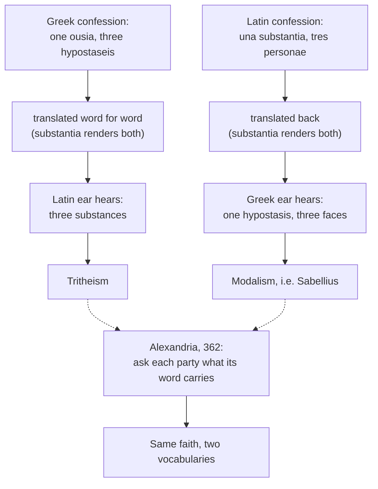

# The Triune God · Lesson 3.2: One ousia, three hypostaseis

> ⏱ ~15 min · Module 3: The dogma in its defining texts · Builds on: [3.1 Nicaea (325)](03-01-nicaea.md), [2.4 From confession to creed](02-04-from-confession-to-creed.md) · Unlocks: [3.3 Constantinople I (381)](03-03-constantinople-i-and-the-divinity-of-the-spirit.md), [4.4 Four relations, three persons](04-04-four-relations-three-persons.md)

## Why this matters

Nicaea won a word for the Son and left the Church a dictionary problem. For half a century after 325, Greek bishops who believed exactly what Latin bishops believed could not say so without appearing to confess a condemned heresy, and the Latins had the same trouble in reverse. The fault lay not in the faith but in two Greek words, *ousia* and *hypostasis*, and in the one Latin word that had to carry both. Clearing it up is what made "three persons, one God" a sentence rather than a contradiction. It also left behind the rule that governs everything in Module 4: **the three are distinguished by origin, and by nothing else.**

## The idea

The decades between the two councils are a story of formulas, not of one heresy. After 325 the fight moved from Arius to Nicaea's own word: some pressed *homoiousios*, "of like substance", as safer than *homoousios*, "of the same substance"; imperial pressure then produced the *homoios* formulas — the Son simply "like the Father", with *ousia* banned from creeds altogether — accepted at the twin councils of Ariminum and Seleucia in 359 and ratified at Constantinople in 360. That Homoian ascendancy held in the East until Theodosius. The politics belong to [`church-history` 2.1](../../church-history/lessons/02-01-nicaea-and-the-imperial-church.md). What matters here is the pressure it created: the pro-Nicene bishops had to say what their word meant, and discovered they had no agreed vocabulary for the three.

The Greek solution is two words for two questions. *[Ousia](../reference.md#one-ousia-three-hypostaseis)* answers **what is it**, and is common to the three. *[Hypostasis](../reference.md#one-ousia-three-hypostaseis)* answers **which one**, the concrete subsistent in which that nature actually stands. Basil of Caesarea's argument for the distinction is [`patristics` 3.2](../../patristics/lessons/03-02-basil-the-great.md); this course takes the outcome. One *ousia*, three *hypostaseis*.

Now [the trouble](../reference.md#substantia-the-translation-trap). Latin has *substantia*, which is the natural rendering of *ousia* **and** of *hypostasis* — both words say "what stands under". So the Greek formula translated word for word comes out as "one essence, three substances", which to a Latin ear says three beings: tritheism. And the Latin formula, *una substantia, tres personae*, translated back, gives a Greek "one *hypostasis*", which is what Sabellius was condemned for saying — while the Greek word matching *persona*, *prosopon*, could mean a face or a part in a play, and so did not by itself exclude the Sabellian reading. Each side heard the other confess a heresy it had never held.

## Source

Athanasius, [*Tomus ad Antiochenos*](../reference.md#tome-to-the-antiochenes) 5-6, the synodal letter of the council he held at Alexandria in 362, between his return from exile in February and his expulsion in October; NPNF second series, vol. 4 (H. Ellershaw):

> As to those whom some were blaming for speaking of three Subsistences … we made enquiry of them, whether they meant, like the Arian madmen, subsistences foreign and strange, and alien in essence from one another … or whether, like other heretics, they meant three Beginnings and three Gods. … Having accepted then these men's interpretation and defense of their language, we made enquiry of those blamed by them for speaking of One Subsistence, whether they use the expression in the sense of Sabellius, to the negation of the Son and the Holy Spirit … But they in their turn assured us that they neither meant this nor had ever held it.

Ellershaw renders *hypostasis* as "Subsistence", which is the whole difficulty in one translator's choice. Watch the procedure: nobody is asked to drop a word. Each party is asked what its word carries — and once both have answered, the letter records that each accepted the other's confession. A local council, not a definition; an agreement about language, reached by interrogating language.

## The argument

1. **In the fourth century both words mean roughly "real being".** Nicaea's final anathema condemns saying the Son is of another *hypostasis* or *ousia*, using the pair as one term ([3.1](03-01-nicaea.md)). *In words: the council that fixed the doctrine had not yet fixed the dictionary.*
2. **The settlement assigns them different levels of generality.** *Ousia* is what is common, *hypostasis* what is particular; a divine person is the whole Godhead together with what is proper to him. *In words: "three" and "one" now answer different questions, so they stop colliding.*
3. **Latin cannot copy the fix word for word,** because *substantia* is the obvious translation of both. Augustine states the impasse from inside it (*De Trinitate* V.8-9; Haddan, NPNF first series vol. 3):

   > They indeed use also the word hypostasis; but they intend to put a difference, I know not what, between οὐσία and hypostasis … we do not dare to say one essence, three substances, but one essence or substance and three persons.

   *In words: a Latin theologian who can read Greek reports that the Greek distinction will not cross into his language, and picks a different word rather than a mistranslation.*
4. **So the two traditions confess one faith in two vocabularies:** one *ousia* and three *hypostaseis*; one *substantia* and three *personae*. The equivalence holds only once you say what each noun carries, which is exactly what Alexandria did in 362 and what Augustine is doing in Book V. *In words: the identity of the two formulas is an achievement, not an accident of translation.*
5. **A change of vocabulary is therefore not a change of doctrine** — provided the new words say what the old words meant. That proviso is the whole burden of proof, and it is what a critic of the development has to attack. The defined content, that there are three persons in one simple divine nature, is stated in the Latin texts read in [3.4](03-04-the-latin-rules-of-speech.md) and sits on the top rung of the ladder in [`fundamental-theology` 4.4](../../fundamental-theology/lessons/04-04-the-ladder-of-doctrinal-authority.md). The technical vocabulary itself is the Church's settled language for that content, not a further dogma.
6. **The persons are [distinguished only by origin](../reference.md#distinction-only-by-origin).** The Father is unbegotten, the Son begotten, the Spirit proceeding — and there the list of differences stops. Not by nature, not by power, not by degree of divinity, not by any perfection: Gregory of Nazianzus insists that the Spirit lacks nothing, since God has no deficiency, and that it is the bare fact of being unbegotten, begotten or proceeding that gives the three their names (*Oration* 31.9). The Catechism states the same rule flatly: the persons are really distinct, and distinct in their relations of origin (CCC 254-255). *In words: if you can say what makes one person not another without mentioning where he is from, you have said something the Church's texts do not allow.* What a relation of origin **is**, metaphysically, is the Latin explanation of [4.4](04-04-four-relations-three-persons.md) and is not itself defined.
7. **The [monarchy of the Father](../reference.md#monarchy-of-the-father) is the Greek grammar of unity.** Why is there one God and not three? The Greek answer does not begin from the shared essence; it begins from the Father, who alone is without principle and who is the single source of the Son and of the Spirit. Unity is secured at its origin: there is one God because there is one *arche*, one unoriginate principle from whom the other two have everything except being him. *In words: on this account the three are one not because they are alike, but because two of them are wholly from one.*

## The trap

The dotted edges are the point. Nothing in the diagram is resolved by choosing the better word; it is resolved by asking what the word is being used to deny.

## Worked examples

**Example 1 (clean: run the trap and then defuse it).** A Latin bishop receives a Greek confession reading "one *ousia*, three *hypostaseis*", and renders it with his dictionary: *una substantia, tres substantiae*. He reads that as three distinct beings sharing a name, writes to Rome that the East has gone tritheist, and is completely wrong. Now defuse it by the 362 procedure. Ask the Greeks the first question: do you mean three beings alien in essence from one another, or three Beginnings and three Gods? They say no — each *hypostasis* is the whole Godhead, and there is one *ousia*. Ask the Latins the second: by "one *substantia*" do you deny that the Son and the Spirit are anyone distinct, as Sabellius did? They say no — *substantia* here translates *ousia*, the common nature, and *persona* carries what *hypostasis* carries. Both denials land; the confessions are the same confession. Notice what the procedure never does: it does not explain how three are one. It clears the charges.

**Example 2 (where it strains: is the monarchy subordination?).** Take the Father as the one unoriginate principle, as premise 7 states it, and press. If the Son has his divinity **from** another and the Father has it from no one, is the Father not richer? The Greek answer is that "from another" is an origin claim and nothing more: what the Son receives is the whole, identical divinity, so the receiving cannot make it less. Gregory of Nazianzus is explicit that the difference of names rests on the relations, not on any deficiency, and he grants that the Father is greater *in respect of being the Cause* while refusing the inference that he is greater by nature (*Oration* 29.15). The strain is real and it is where the two traditions diverge in emphasis rather than in faith: a Latin theologian, starting from the one essence, hears any priority of the Father as a risk, while a Greek hears the Latin start as a risk of making the essence a fourth thing behind the three. Neither is a heresy. [5.2](05-02-the-greek-doctrine-and-the-addition.md) takes this up properly; do not settle it here, and do not state the Greek position as though its only content were what the Latin summary of it retains.

## Watch out

- **You might think that if the Church changed its words it changed its mind.** The whole force of the 362 procedure is that the test for a word is what it denies. Vocabulary that keeps the old denials in place is the same faith; vocabulary that quietly drops one is not. The burden is to show the denials are kept, not to assume it either way.
- **You might think "three *hypostaseis*" is just "three substances".** If it were, the Greek formula would be tritheism, and the Latin refusal of it would be right. The word does not translate; the sense does.
- **"They are distinguished by what each of them does for us" lands in modalism.** Creating, redeeming and sanctifying are the works of the one God, and distinguishing the persons by them makes Father, Son and Spirit three names for God in three roles — Sabellius's position, condemned. Only origin distinguishes. ([4.5](04-05-common-proper-appropriated.md) says what may legitimately be *appropriated* to one person, and why that is not a distinction.)
- **"The Father is the source, therefore the Father is more fully God" is subordinationism,** and it is the misreading the monarchy invites. Origin is not degree. Stating the monarchy without stating that the Son and Spirit receive the whole and identical divinity is where a homily goes wrong.
- **Do not promote the vocabulary to dogma, or demote the dogma to vocabulary.** That there are three persons in one divine nature is defined ([3.4](03-04-the-latin-rules-of-speech.md)); that we say it with *hypostasis* and *persona* rather than some other pair of words is the Church's settled technical language, and the two claims have different weights ([`fundamental-theology` 4.4](../../fundamental-theology/lessons/04-04-the-ladder-of-doctrinal-authority.md)).

## One-liner

> One faith needed two vocabularies because one Latin word covered two Greek ones; the settlement fixed the words by fixing what each was being used to deny, and left one rule standing — nothing distinguishes the three but where they are from.

## Problems

**P1 (🟢) *(Exegetical.)*** Five proposals for what distinguishes the divine persons. For each, say whether the rule of distinction by origin permits it, and where it does not, name the error it lands in (modalism, subordinationism or tritheism). **One line each.**

1. The Father is unbegotten, the Son begotten, the Spirit proceeding.
2. The Father alone is without principle, and the Son and the Spirit are from him.
3. The Son is God in a lesser degree, since he has his divinity from another.
4. Father, Son and Spirit are the one God under three names, as creator, redeemer and sanctifier.
5. Each has his own divinity, the three being one as Peter, James and John are one in humanity.

**P2 (🟡) *(Exegetical.)*** An invented parish catechetical handout, written for this problem:

> **Who is God?** God the Father is the one true God, the source of all. Because he is the source, he holds the fullness of divinity, which he shares out to the Son and the Spirit in the measure each needs for his task. That is why we can tell the three apart: the Father plans, the Son carries out the plan on earth, and the Spirit applies it in our hearts. The Church has always defined that the Father is greater, and any other view was condemned at Nicaea.

Name **three** errors, one of each kind: **(i)** a statement about the persons' distinction that the rule of origin forbids, **(ii)** a claim that lands in a named heresy, **(iii)** a claim overstated as to authority level. Correct each in one sentence. **150 words or fewer.**

**P3 (🔴, optional) *(Exegetical.)*** Gregory of Nazianzus, *Oration* 29.2 (the Third Theological Oration); NPNF second series, vol. 7 (Browne and Swallow):

> But Monarchy is that which we hold in honour. It is, however, a Monarchy that is not limited to one Person, for it is possible for Unity if at variance with itself to come into a condition of plurality; but one which is made of an equality of Nature and a Union of mind, and an identity of motion, and a convergence of its elements to unity — a thing which is impossible to the created nature — so that though numerically distinct there is no severance of Essence. … The Father is the Begetter and the Emitter; without passion of course, and without reference to time, and not in a corporeal manner. The Son is the Begotten, and the Holy Ghost the Emission.

(a) Which words rule out reading "Monarchy" as the rule of a single person over two lesser ones?
(b) The passage names what tells the three apart. Quote it, and say what kind of distinction it is.
(c) What does "though numerically distinct there is no severance of Essence" deny, and to which of the three errors in P1 is that denial addressed?
**Two sentences or fewer per part.**

Solutions

**P1** *(Exegetical — strict.)*

**Must hit, strict:**

1. **Permitted.** This is the list of origins itself, and it is the only list the Church's texts allow (CCC 254).
2. **Permitted.** That the Father alone is without principle is a claim about origin, not about degree — the monarchy of the Father, and the Greek tradition's way of securing the unity.
3. **Forbidden — subordinationism.** It converts an origin into a quantity of divinity; what the Son receives is the whole and identical nature, so "from another" cannot mean "less".
4. **Forbidden — modalism.** The three are distinguished by roles in the economy rather than by origin, which makes them names for one subject; this is Sabellius's position, and it also denies the real distinction.
5. **Forbidden — tritheism.** Three divinities united only by a shared kind is exactly "three substances", the reading the Latin ear feared, and it denies that God is one being.

**Wrong turns:** rejecting 2 because it sounds like 3 — the two differ precisely in that 2 says only where the persons are from; treating 4 as harmless because the Church really does associate creation with the Father (that is appropriation, not distinction, and the difference is [4.5](04-05-common-proper-appropriated.md)'s); calling 5 modalism, when it is the opposite error — multiplying beings rather than collapsing them into one subject.

**Model answer:** 1 permitted (origin, and the only permitted list). 2 permitted (origin again: the Father as principle without principle). 3 forbidden, subordinationism — origin is not degree. 4 forbidden, modalism — roles are not origins. 5 forbidden, tritheism — a shared kind is not one God.

**P2** *(Exegetical — strict.)*

**Must hit, strict:** three errors, one of each kind.

**(i) Forbidden distinction.** "That is why we can tell the three apart: the Father plans, the Son carries out, the Spirit applies." The persons are distinguished only by relations of origin; the outward works are the works of the whole Trinity, and what is said of one by association is appropriated, not proper.

**(ii) Named heresy.** "He holds the fullness of divinity, which he shares out … in the measure each needs" is subordinationism: it makes divinity a quantity distributed in degrees, whereas the Son and the Spirit have the whole identical nature. "In the measure each needs for his task" is the decisive phrase: it makes divinity a quantity.

**(iii) Overstated level.** "The Church has always defined that the Father is greater" — false as to authority and as to content: what Nicaea defined is that the Son is of the same substance as the Father, and the council condemned the view that the Son is of another substance or a creature, not "any other view" of the Father's greatness. A handout cannot make a school's phrasing a definition.

**Wrong turns:** naming the first sentence ("God the Father is the one true God, the source of all") as an error — it is unobjectionable, and read as the monarchy it is what the Greek tradition says; treating "the Son carries out the plan on earth" as a Christological error about the Incarnation, which is not what is asked; answering (iii) by disputing the date or the acts of Nicaea rather than the level claimed; denying flatly that "the Father is greater" may ever be said — it may, in respect of being the cause (*Oration* 29.15), and the fault here is the sense the handout gives it and the definition it invents.

**Model answer:** First, the handout distinguishes the persons by their works — planning, carrying out, applying. Only relations of origin distinguish them; the outward works are the whole Trinity's, and associating one with a person is appropriation, not a property. Second, "shares out divinity in the measure each needs" is subordinationism: the Son and the Spirit receive the whole and identical divinity, so origin cannot mean a smaller share. Third, "the Church has always defined that the Father is greater" overstates and misstates: Nicaea defined the Son to be of the same substance as the Father and anathematized the claim that he is of another substance or a creature. It defined nothing of the kind the handout reports.

**P3** *(Exegetical — strict.)*

**Must hit, strict (a):** "not limited to one Person" is decisive, supported by "equality of Nature" and by "no severance of Essence". Gregory explicitly declines the political sense of monarchy as government by one individual, and redefines it as a unity that is not reduced to a single subject.

**Must hit, strict (b):** "The Father is the Begetter and the Emitter … The Son is the Begotten, and the Holy Ghost the Emission." These are distinctions of origin and nothing else — begetting, being begotten, being emitted — which is exactly the rule of this lesson. Credit for noting the qualifications "without passion … without reference to time … not in a corporeal manner", which strip the origin language of everything creaturely.

**Must hit, strict (c):** it denies that the numerical distinction of the three divides the divine being, i.e. that three really distinct persons amount to three beings. The denial is addressed to error 5 in P1, tritheism.

**Wrong turns:** answering (a) with "Monarchy is that which we hold in honour", which states the thesis rather than excluding the misreading; giving (b) as "the Father is greater", which is not in this passage; reading (c) as aimed at subordinationism — the sentence protects the unity of essence against division, not the equality of the persons against degrees.

**Model answer:** (a) "A Monarchy that is not limited to one Person", reinforced by "an equality of Nature" — Gregory takes the word and refuses its obvious political sense. (b) "The Father is the Begetter and the Emitter; the Son is the Begotten, and the Holy Ghost the Emission": pure relations of origin, with every creaturely connotation explicitly denied. (c) It denies that being three divides the one being — aimed at tritheism, proposal 5.

## Flashback

**From Lesson [2.4](02-04-from-confession-to-creed.md) (From confession to creed: the second- and third-century grammar):** *(Exegetical.)* Noetus of Smyrna, called before his presbyters, defended himself by asking what evil there was in glorifying Christ; at Rome a generation later the party of Praxeas said they were maintaining the monarchy, the sole rule of the one God. (a) Reconstruct their route in three numbered premises and a conclusion that Christ is the Father himself, and mark which premises the Church affirms. (b) Name the premise the Church denies, and say what the second and third centuries did not yet have that would have let a monarchian avoid it. (c) Name the two costs of the position, in that lesson's terms. **One line per premise; one sentence each for (b) and (c).**

Solution

**Must hit, strict (a):** premises of this shape, in any wording, with the first two marked as the Church's own.
- **P1.** There is one God. *(Affirmed by the Church.)*
- **P2.** Christ is God without remainder, and is worshipped as God. *(Affirmed by the Church.)*
- **P3.** Two who are really distinct would be two Gods — nothing in God can be really distinct without dividing him. *(Denied.)*
- **∴ C.** Christ is the one God himself, the Father under a second name; Father, Son and Spirit are three names or modes of one subject.

**Must hit, strict (b):** P3. What was missing is the vocabulary: no word for what is three that does not mean a second being, and no word for what is one that leaves room for three — exactly the pair this lesson supplies, one *ousia* and three *hypostaseis*, one *substantia* and three *personae*. Credit for saying that the monarchian is not reasoning badly from his own terms; he has no term in which real distinction is anything but division.

**Must hit, strict (c):** **patripassianism** — if the Son just is the Father under another name, the Father was born and suffered, which is why Tertullian says of Praxeas that he crucified the Father; and the **loss of the real distinction** the New Testament reports, so that the one praying in Gethsemane and the one prayed to become a single actor in two costumes.

**Wrong turns:** denying P1 or P2 — both are the Church's own, and the point of the reconstruction is that the heresy grows out of two true commitments; calling the position subordinationism, which is the opposite ditch; answering (b) with "they should have read scripture more carefully", when the texts were not in dispute and the words were; naming Sabellius as the author of the argument, when what we have of him comes through later and hostile reporters.

**Model answer:** (a) P1, there is one God (affirmed). P2, Christ is God without remainder and is worshipped (affirmed). P3, two really distinct would be two Gods, since a distinction in God would divide him. Therefore Christ is the Father under another name, and the three are modes of one subject. (b) P3 is denied, and what was missing was the vocabulary: a word for the three that does not mean three beings, and a word for the one that does not swallow them. (c) The Father is then the one born and crucified, and the real distinction of the Son from the Father dissolves into a performance.

## Connections

- **Backward:** [3.1](03-01-nicaea.md) supplied the anathema in which *hypostasis* and *ousia* are one word, which is the problem this lesson inherits; [2.4](02-04-from-confession-to-creed.md) supplied the second- and third-century grammar that the fourth century had to make precise. Basil's argument for the distinction is [`patristics` 3.2](../../patristics/lessons/03-02-basil-the-great.md), and Gregory of Nyssa's *To Ablabius* answer to "why not three gods?" — that the three never act separately, so there is nothing to count — is [`patristics` 3.3](../../patristics/lessons/03-03-the-two-gregories.md). The events between the councils are [`church-history` 2.1](../../church-history/lessons/02-01-nicaea-and-the-imperial-church.md).
- **Forward:** [3.3](03-03-constantinople-i-and-the-divinity-of-the-spirit.md) applies the settled vocabulary to the Spirit; [3.4](03-04-the-latin-rules-of-speech.md) reads the Latin texts that turn it into rules of speech, including Florence's sentence about the opposition of relation. [4.4](04-04-four-relations-three-persons.md) formalizes the origin rule into four real relations and three subsistent persons, and [4.5](04-05-common-proper-appropriated.md) separates what is proper from what is appropriated. The monarchy of the Father returns as a doctrine in its own right in [5.2](05-02-the-greek-doctrine-and-the-addition.md).
- **Sideways:** that relations in God are **real** and not merely relations of reason is the point [`thomistic-synthesis` 4.3](../../thomistic-synthesis/lessons/04-03-the-names-of-god.md) flags as the groundwork this course needs; [4.1](04-01-augustine-relation-substance-and-predication.md) takes up *De Trinitate* V for the rules of predication that Augustine is working out in the passage quoted above. See the course [syllabus](../syllabus.md) for how Module 3's texts are divided.
