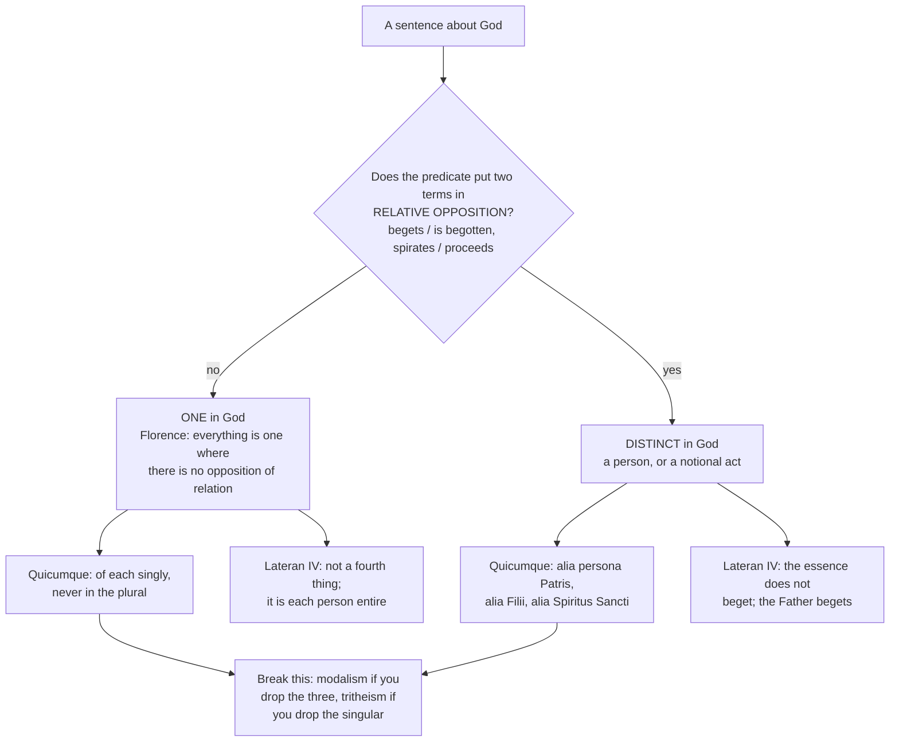

# The Triune God · Lesson 3.4: The Latin rules of speech: Quicumque, Lateran IV, Florence

> ⏱ ~15 min · Module 3: The dogma in its defining texts · Builds on: [3.2](03-02-one-ousia-three-hypostaseis.md), [3.3](03-03-constantinople-i-and-the-divinity-of-the-spirit.md) · Unlocks: [4.4](04-04-four-relations-three-persons.md), [4.5](04-05-common-proper-appropriated.md), [5.1](05-01-the-latin-doctrine.md)

## Why this matters

Nicaea and Constantinople gave the Church words to *confess*. The three Latin texts here give her rules for *speaking* — filters that pass or fail a sentence about God before anyone asks if it edifies. Almost every heresy in this neighbourhood arrives as a devout-sounding sentence breaking a rule nobody had stated. And one clause from Florence licenses the whole machinery of Module 4.

## The idea

A rule of speech adds nothing to what is believed; it tells you which sentences may carry it. Three texts, three rules, each with an error on either side:

- **The [Athanasian Creed](../reference.md#the-athanasian-creed).** Confess the three without confusing them, and the one without dividing it. Confuse them and you get **modalism**; divide the substance and you get **tritheism**.
- **Lateran IV.** The divine essence is not a fourth thing standing beside the three. And no likeness you state between God and a creature is ever as great as the unlikeness left over.
- **Florence.** In God everything is one *except* where relation sets two terms in opposition. Unity is the default; a distinction has to be bought, in one currency only.

The first says what to avoid, the second what not to posit, the third exactly when you may say *two*.

## Source

The Athanasian Creed, or *Quicumque*, verses 3-5 and 19-20 (Latin and sixteenth-century English as Philip Schaff prints them, *Creeds of Christendom* vol. 2; his brackets):

> 3. *Fides autem catholica haec est: ut unum Deum in Trinitate, et Trinitatem in Unitate veneremur;* — And the Catholic Faith is this: That we worship one God in Trinity, and Trinity in Unity;
> 4. *Neque confundentes personas: neque substantiam separantes.* — Neither confounding the Persons: nor dividing the Substance [Essence].
> 5. *Alia est enim persona Patris: alia Filii: alia Spiritus Sancti.* — For there is one Person of the Father: another of the Son: and another of the Holy Ghost.
> 19-20. For like as we are compelled by the Christian verity: to acknowledge every Person by himself to be God and Lord: So are we forbidden by the Catholic Religion: to say, There be three Gods, or three Lords.

## The argument

### Text one - the drumbeat creed

Three uncontested facts. It is **Latin** and was never received in the East — Schaff notes there is no authorized Greek text. It is **not by Athanasius**, who wrote in Greek and died in 373. It is of the **fifth or sixth century**, Western, most likely southern Gaul; the Western Office sang it for a thousand years, which is how a document with no council behind it came to work as a test of orthodoxy.

Its method is a drumbeat. A predicate is said of each person singly, then denied in the plural: uncreated, unlimited (*immensus*), eternal, almighty, God, Lord. *The Father is X, the Son is X, the Spirit is X — and yet not three Xs but one X.*

Verses 19-20 state the rule the drumbeat enacts, as obligations rather than metaphysics. We are **compelled** to confess each person *singulatim*, by himself, God and Lord; we are **forbidden** to add them up. In words: three times in the singular, never once in the plural.

Verse 4 names the two failures: [neither confounding nor dividing](../reference.md#neither-confounding-nor-dividing). *Neque confundentes personas* — do not run the persons together; verse 5's *alia... alia... alia* (another, another, another) is the guard, and dropping it is **modalism**, the persons as masks of one actor. *Neque substantiam separantes* — the verb is *separare*, to pull apart; do not treat the divinity as a stock the three draw on, which is **tritheism**. Verses 21-23 supply the only permitted ground of difference: the Father from none, the Son from the Father alone, the Spirit from Father and Son — origin, and nothing else. That is [3.2](03-02-one-ousia-three-hypostaseis.md)'s Cappadocian settlement in Latin dress, and verses 25-26 seal it: nothing prior or posterior, nothing greater or less.

**Level.** The *Quicumque* is not a conciliar definition but a received symbol of the Western Church, quoted as such in the Catechism. What it professes is *de fide*, rung 1 on the ladder in [`fundamental-theology` 4.4](../../fundamental-theology/lessons/04-04-the-ladder-of-doctrinal-authority.md) — by the councils and the ordinary and universal magisterium, not by the creed's own act.

### Text two - Lateran IV and the fourth thing

The Fourth Lateran Council (1215) opens with *Firmiter*: *Firmiter credimus et simpliciter confitemur, quod unus solus est verus Deus... tres quidem personae, sed una essentia, substantia seu natura simplex omnino.* This lesson's translation: *We firmly believe and straightforwardly confess that there is one only true God... three persons indeed, but one essence, substance or nature, altogether simple.* Three persons and an essence **altogether simple** — which is why [1.3](01-03-simplicity-as-doctrine.md) came first, and why the analysis to come is under pressure.

The council's second constitution takes up Joachim of Fiore's charge against Peter Lombard, who had written that there is a supreme reality (*summa res*) which is Father, Son and Spirit and which neither begets nor is begotten nor proceeds. Joachim called that a **quaternity** — three persons plus a common essence as a fourth item — and offered instead a collective unity, the three one as a people is one. The council sides with Lombard. There is one supreme reality which truly *is* Father and Son and Spirit, the three together and each singly; therefore in God there is only trinity, not quaternity — *in Deo solummodo Trinitas est, non quaternitas* — because each of the three **is** that reality. And that reality does not beget, is not begotten and does not proceed; the Father begets, the Son is begotten, the Spirit proceeds, so that the distinctions are in the persons and the unity in the nature.

Two rules come out of that, and a third at the end of the same constitution.

1. **[The essence is not a fourth thing](../reference.md#the-essence-is-not-a-fourth-thing).** Not a shared stuff, not a container, not a committee's charter. It is each person entire.
2. **The essence is not a subject of the notional acts.** "The divine nature begets the Son" is a forbidden sentence — the Father begets.
3. **The [greater dissimilarity rule](../reference.md#the-greater-dissimilarity-rule).** Between creator and creature no likeness can be stated without a greater unlikeness having to be stated. Analogy is licensed and capped in one breath; the theory is [`thomistic-synthesis` 4.4](../../thomistic-synthesis/lessons/04-04-analogy.md).

**Level.** Both are solemn acts of an ecumenical council proposing the faith, the anti-Joachim constitution closing on a heresy clause: rung 1.

### Text three - Florence, and the rule that governs Module 4

Florence's decree for the Jacobites (1442) restates the faith and, in one subordinate clause, hands the Latin tradition its [working principle](../reference.md#no-opposition-of-relation):

> *...quia trium est una substantia, una essentia, una natura, una divinitas, una immensitas, una aeternitas, omniaque sunt unum ubi non obviat relationis oppositio.*
>
> This lesson's translation: *...because the three have one substance, one essence, one nature, one divinity, one immensity, one eternity, and everything is one where there is no opposition of relation.*

Read the last clause as an instruction. Take any predicate and ask: does it put two terms in **relative opposition**, requiring an opposite number as *father* requires *son*? If not, it is one in God, and the *Quicumque*'s drumbeat applies: said of each, never counted. If it does, you have a distinction, exactly there. The clause is licence and limit at once: it allows three and forbids four ([4.4](04-04-four-relations-three-persons.md) finds four relations and only three persons, because one of the four opposes nothing).

Two cautions. **The attribution of the formula is traditional, not verified here.** It is regularly traced to Anselm's *De processione Spiritus Sancti*, and it was a scholastic commonplace long before Florence — William of Ockham quotes the same words in his *Summa logicae*, which this lesson checked. The Anselmian source it could not; take the attribution as the tradition's, not as established. Second, the Florentine context is the filioque: the same decree teaches that Father and Son are not two principles of the Spirit but one, and the union decree with the Greeks, *Laetentur Caeli* (1439), had already said the Spirit proceeds from both *tamquam ab uno principio et unica spiratione* — as from one principle and by a single spiration. That doctrine is [5.1](05-01-the-latin-doctrine.md)'s; what matters here is that the relational rule and the filioque were stated together, which is no accident.

The Catechism's paragraphs 253-255 (checked on vatican.va) compress all three texts: the persons do not share the divinity among themselves; they are really distinct, and "Father", "Son", "Spirit" are not names for modes; their distinction lies solely in the relations — and Florence's clause is quoted to close the point.

## The rule

## Worked examples

**Example 1 - the machinery on a clean case.** *"The Father is almighty, the Son is almighty, the Spirit is almighty."* Almighty is not relative; nothing in it demands an opposite number. Florence's rule therefore says it is one in God; the *Quicumque* supplies the form — verse 13 says it three times, verse 14 refuses the plural, *non tres omnipotentes, sed unus omnipotens* — and Lateran IV adds that the one almightiness is not property held in common ownership but the simple essence which each of the three is. Notice what you may *not* conclude: not "each almighty in his own way" (that divides), nor "almighty is really the name of the one God behind the three" (that confounds, and posits the fourth thing).

**Example 2 - where it strains.** *"The divine essence begets the Son."* This passes most readers' ear and fails the rules. *Begets* is exactly a relative term with an opposite, so by Florence's clause it marks a distinction — and an essence common to the three cannot be one term of a distinction internal to the three. Lateran IV says it flatly: that supreme reality is not begetting, not begotten, not proceeding. Push the sentence and it yields Joachim's quaternity from the other side, an essence acting as a fourth party. The repair is not a softer verb but a change of subject: *the Father begets the Son.* The notional acts take persons as subjects; forgetting it is the commonest mistake in writing about the Trinity.

## Watch out

- **You might think "three faces of one God" is a harmless simplification.** It confounds the persons: modalism. Face, mask, mode and side all name one actor's presentations, which verse 5's *alia... alia... alia* exists to exclude.
- **You might think the fix is to stress that the three are genuinely three.** Overcorrect and you divide the substance: three almighties, three centres of divine life, divinity shared out in portions. The errors are adjacent; verse 4 refuses both in one line.
- **You might think the greater dissimilarity rule makes God-talk useless.** It presupposes that a likeness has been stated and caps it rather than cancelling it. A rule forbidding all likeness would forbid itself.
- **You might think Florence's clause proves the Trinity.** It sorts predicates given the faith; it is no argument from reason for three persons. The Trinity is a mystery strictly so called ([1.2](01-02-the-one-true-god-and-what-reason-can-reach.md)).
- **Do not promote the explanation to the level of the rule.** That relative opposition alone distinguishes in God is conciliar language. That the persons therefore *are* subsistent relations, and that there are exactly two processions by way of intellect and will, is Latin explanation carried by the common doctor and never defined ([4.3](04-03-the-two-processions.md), [4.4](04-04-four-relations-three-persons.md)). Both confusions are graded strictly.

## One-liner

> Say every non-relative thing of each person and never in the plural, never let the essence become a fourth party or a subject of begetting, and count two only where relation opposes.

## Problems

**P1 (🟢) *(Exegetical.)*** For each invented sentence, name the rule it breaks — the *Quicumque*'s "neither confounding nor dividing", Lateran IV's ruling on the essence, or Florence's clause on relative opposition — and the heresy or error it lands in. **One sentence each.**

(a) "Father, Son and Spirit are three almighties acting as one."
(b) "The one God meets us as Father in creation, as Son in redemption, and as Spirit in the Church."
(c) "The divine nature, which the three have in common, begets the Son."
(d) "The Spirit is distinct from the Father and the Son because he is holy in a way they are not."

**P2 (🟡) *(Exegetical.)*** An invented hymn stanza, submitted for a parish hymnal:

> "One God in three great names we sing: the Maker's hand, the Saviour's blood, the Spirit's fire within. Three ways the one God comes to us, three faces of one love."

(a) Which half of the *Quicumque*'s verse 4 does it break, and which words carry the break? (b) Name the error, and the true thing the stanza is reaching for. (c) A reviser proposes "three great Gods in one" to fix it. Say what that does. **120 words or fewer in total.**

**P3 (🔴, optional) *(Exegetical.)*** From Lateran IV's second constitution, in this lesson's translation of the Latin, with the deciding words printed:

> "When Truth prays to the Father for his faithful, saying 'I will that they be one in us, as we also are one', this word 'one' is taken for the faithful so that a union of charity in grace is understood, but for the divine persons so that a unity of identity in nature is regarded — as elsewhere Truth says, 'Be perfect, as also your heavenly Father is perfect', as if to say more plainly: be perfect with the perfection of grace, as your heavenly Father is perfect with the perfection of nature, each of the two, that is, in its own way (*utraque videlicet suo modo*), because between creator and creature no likeness can be noted without a greater unlikeness having to be noted between them (*non potest similitudo notari, quin inter eos maior sit dissimilitudo notanda*)."

(a) The council states two senses of "one". Give each, and say why Joachim's reading of the divine unity makes the distinction necessary. (b) The greater dissimilarity rule is stated in the act of asserting a likeness. Which Latin words show that, and what reading of the rule does that exclude? **150 words or fewer in total.**

Solutions

**P1** *(Exegetical — strict.)*

**Must hit, strict:**
- (a) **Dividing the substance** (*Quicumque* v. 4, second half; v. 14 refuses the plural, *non tres omnipotentes, sed unus omnipotens*). Almighty is non-relative, so by Florence's clause it is one in God: saying it of each singly is required, and pluralizing it is **tritheism**.
- (b) **Confounding the persons** (v. 4, first half; v. 5's *alia... alia... alia*). One subject in three presentations is **modalism**. Credit for noticing that the sentence is a corrupted appropriation — the underlying assignment of creation, redemption and sanctification is legitimate as appropriation, which is [4.5](04-05-common-proper-appropriated.md)'s subject — but the error named must be modalism, since "the one God meets us as" makes the three modes of one.
- (c) **Lateran IV**: that supreme reality neither begets nor is begotten nor proceeds; the Father begets. Making the common essence the subject of a notional act reinstates Joachim's **quaternity** — a fourth party acting alongside the three.
- (d) **Florence**: distinction in God only where relation opposes. Holiness is not a relative term, so it cannot distinguish; and a distinction drawn by a perfection makes the persons differ in nature, which the *Quicumque* forbids (nothing greater, nothing less, vv. 25-26) and which [3.2](03-02-one-ousia-three-hypostaseis.md) settled as distinction by origin alone.

**Wrong turns:** calling (a) modalism and (b) tritheism, which is the two errors swapped; treating (c) as a harmless synonym for "the Father begets"; answering (d) with "subordinationism" alone without naming the rule that fails — the sentence is not about greater and less but about the wrong kind of ground for a distinction, though credit if the answer names the relational rule and then observes that a difference in holiness would be subordinationist.

**Model answer:** (a) Dividing the substance; tritheism. (b) Confounding the persons; modalism, with the appropriations abused into modes. (c) Lateran IV's ruling that the essence is not generating; the essence becomes a fourth thing that acts. (d) Florence's clause: only relative opposition distinguishes, and holiness is common to the three.

---

**P2** *(Exegetical — strict.)*

**Must hit, strict (a):** the **first** half of verse 4, *neque confundentes personas*. The carrying words are "three great **names**", "three **ways** the one God comes to us", and "three **faces** of one love" — each makes the three presentations of a single subject rather than three who. Verse 5's *alia est persona Patris, alia Filii, alia Spiritus Sancti* is what the stanza drops.

**Must hit, strict (b):** **modalism**. What it is reaching for is real and is taught: the works of the three outside God are undivided and the economy is appropriated to the persons — the Maker's hand, the Saviour's blood, the Spirit's fire are genuine appropriations ([4.5](04-05-common-proper-appropriated.md)) — and "one love" rightly refuses three gods. The error is turning appropriations into modes of one subject.

**Must hit, strict (c):** it swaps one error for the other. "Three great Gods in one" divides the substance (verse 4's second half; verses 16 and 20 forbid saying three Gods) and lands in **tritheism**. The repair has to keep both halves of verse 4 at once: three who, one what.

**Wrong turns:** treating "names" as the only problem and proposing "three persons" as a one-word patch while leaving "three faces"; calling the stanza subordinationist, which requires greater and less and is not present; ruling the appropriations themselves illegitimate.

**Model answer:** (a) The first half, *neque confundentes personas*: "names", "ways" and "faces" all make the three presentations of one subject, and verse 5's *alia... alia... alia* is dropped. (b) Modalism. It is reaching for something true — the undivided outward works and the standard appropriations of creating, redeeming and sanctifying — but turns appropriations into modes. (c) It replaces modalism with tritheism, since verses 16 and 20 forbid saying three Gods; both halves of verse 4 have to hold together.

---

**P3** *(Exegetical — strict.)*

**Must hit, strict (a):** for the faithful, "one" means a **union of charity in grace** — many who are made one by love, remaining many. For the divine persons it means a **unity of identity in nature** — one and the same reality, which each of the three is. Joachim read the divine unity on the model of the first sense, as collective or similitudinary (many made one as a people is one people), which is why he could call Lombard's one supreme reality a fourth thing. The council therefore has to fix two senses of the word before it can let John 17:22's *sicut* ("as we also are one") stand without making the Trinity a group.

**Must hit, strict (b):** *similitudo notari, quin... dissimilitudo notanda* — the construction *non potest... quin* means the unlikeness is a rider on a likeness that **is** being noted, not a replacement for it; and *utraque videlicet suo modo*, "each of the two, that is, in its own way", explicitly preserves both of the perfections just compared, the creature's of grace and God's of nature. The reading excluded is that the sentence is a denial of all likeness, that is, equivocity or agnosticism about God-talk. The rule caps analogy; it does not cancel it — which is exactly the use [`thomistic-synthesis` 4.4](../../thomistic-synthesis/lessons/04-04-analogy.md) makes of it.

**Wrong turns:** reading the greater dissimilarity rule as apophatic in the strong sense, which would forbid the council's own sentence; saying the two senses of "one" are "loose" and "strict" without naming charity-in-grace and identity-in-nature; attributing the collective reading to Lombard rather than to Joachim.

**Model answer:** (a) For the faithful, "one" is a union of charity in grace, in which the many remain many; for the persons it is a unity of identity in nature, one reality which each of the three is. Joachim took the divine unity in the first sense, as collective, and so charged Lombard's supreme reality with being a fourth thing; the council must distinguish the senses to let Christ's *sicut* stand. (b) *Non potest similitudo notari, quin... maior sit dissimilitudo notanda*, with *utraque videlicet suo modo*: the likeness is asserted and then capped, not withdrawn. That excludes reading the rule as a denial of all likeness between God and creatures.

## Flashback

**From Lesson [3.2](03-02-one-ousia-three-hypostaseis.md) (One ousia, three hypostaseis):** *(Exegetical.)* A study group is handed three statements and told all three are "what the Church teaches". For each, say whether it is **defined dogma** or the **Church's settled technical language and its explanation**, and name what fixes the level — the act, or the absence of one. Overstating and understating are both errors. **One sentence each.**

1. There are three persons in one divine nature.
2. Nothing distinguishes the three but their relations of origin — not nature, not power, not any perfection, not any work done for us.
3. The right words for the three are Greek *hypostasis* and Latin *persona*, rather than some other pair.

Solution

**Must hit, strict:**

1. **Defined dogma.** Fixed by solemn conciliar act — the creed of 381, restated by Lateran IV's *Firmiter* ("three persons indeed, but one essence, substance or nature, altogether simple") and by Florence. Credit for naming any one of those acts.
2. **Defined dogma likewise.** The permitted list of differences is fixed in the defining texts: the Father from none, the Son from the Father, the Spirit proceeding, and there the list stops (the creeds; the *Quicumque*'s verses 21-23; CCC 254-255 states it flatly). Denying it is heresy. What a relation of origin *is*, metaphysically, is a separate claim and is not defined.
3. **Not a dogma.** No act proposes the vocabulary as revealed; it is the Church's settled technical language for the defined content, adopted because it keeps the old denials in place. That a change of words would not be a change of doctrine, provided the denials survive, is exactly why the words themselves do not carry the weight of the thing said.

**Wrong turns:** promoting 3 because the terms are ancient, universal and used in conciliar texts — age and currency are not an act, and the *Quicumque* itself professes the faith without the word *hypostasis*. Demoting 2 to "the Latin explanation" because the metaphysics of subsistent relations is below the seam — the rule and the account of the rule are two claims with two weights. Answering 1 with "central" or "important" instead of naming the act.

**Model answer:** 1. Defined dogma, by the creed of 381 and restated as such at Lateran IV. 2. Defined dogma as well: the defining texts allow origin and nothing else as the ground of difference, and the Catechism repeats it; the *account* of what such a relation is, however, is not defined. 3. Not a dogma but the Church's settled technical vocabulary, proposed by no act as revealed, and chosen for what it lets the Church deny.

## Connections

- **Backward:** [3.2](03-02-one-ousia-three-hypostaseis.md) settled that the persons are distinguished by origin alone; the *Quicumque*'s verses 21-23 are that settlement in Latin, and Florence's clause is its rule-of-thumb form. [3.3](03-03-constantinople-i-and-the-divinity-of-the-spirit.md) supplied the Spirit's clause that these texts assume. [1.3](01-03-simplicity-as-doctrine.md) is why *Firmiter*'s "altogether simple" makes the problem hard. Nyssa's answer to the counting objection is [`patristics` 3.3](../../patristics/lessons/03-03-the-two-gregories.md).
- **Forward:** Florence's clause is the hinge of Module 4 — [4.4](04-04-four-relations-three-persons.md) uses it to get four relations and three persons, and [4.5](04-05-common-proper-appropriated.md) uses it to sort what is common from what is proper. [5.1](05-01-the-latin-doctrine.md) takes up the one principle and the single spiration that Florence states in the same breath. [4.1](04-01-augustine-relation-substance-and-predication.md) goes back to Augustine to show where the relational move came from in the first place.
- **Sideways:** the greater dissimilarity rule is analogy as a conciliar constraint; the theory is [`thomistic-synthesis` 4.4](../../thomistic-synthesis/lessons/04-04-analogy.md), and simplicity is its [3.4](../../thomistic-synthesis/lessons/03-04-divine-simplicity-and-the-attributes.md). Levels come from [`fundamental-theology` 4.4](../../fundamental-theology/lessons/04-04-the-ladder-of-doctrinal-authority.md). The reunion councils of Lyons and Florence as events belong to [`church-history` 4.2](../../church-history/lessons/04-02-east-and-west-the-long-estrangement.md).
