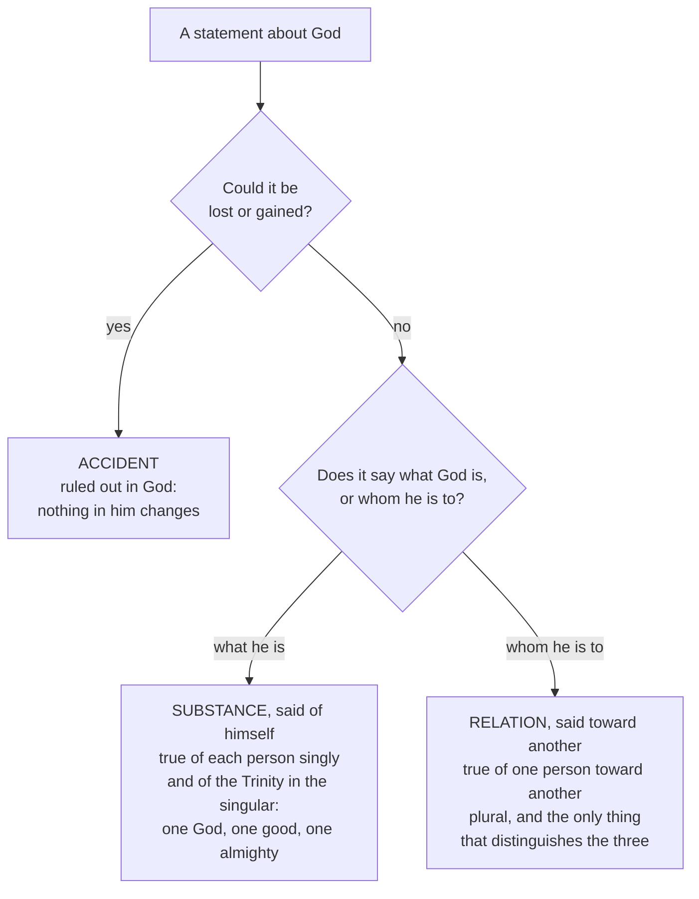

# The Triune God · Lesson 4.1: Augustine: relation, substance and the rules of predication

> ⏱ ~15 min · Module 4: Processions, relations, persons · Builds on: [1.3](01-03-simplicity-as-doctrine.md), [3.2](03-02-one-ousia-three-hypostaseis.md), [3.4](03-04-the-latin-rules-of-speech.md) · Unlocks: [4.2](04-02-augustine-the-image-in-the-mind.md), [4.4](04-04-four-relations-three-persons.md)

## Why this matters

Module 3 ended with rules of speech — neither confound the persons nor divide the substance; everything is one where there is no opposition of relation. Rules are not a defence. An Arian of Augustine's generation had an argument, four lines long and apparently valid, that three real distinctions inside a God with no parts is a flat contradiction. Books 5 to 7 of *De Trinitate* answer it, and the answer is logic rather than piety: it changes what kinds of predicate there are. The Latin tradition is built on it.

## The idea

Start with the box-sorting the argument assumes. Of any ordinary thing, what you say either tells you what it is — Socrates is a man — or tells you something that could have been otherwise and could be lost: Socrates is pale, Socrates is in the market. The first is **substance**, the second **accident**.

Now put God in the boxes. Accidents go at once: an accident is what a thing might lose or gain, and nothing in God can be lost or gained ([1.3](01-03-simplicity-as-doctrine.md), [1.4](01-04-immutability-eternity-immensity.md)). One box left. So everything said of God is said of his substance — and if "unbegotten" and "begotten" differ, the Father's substance and the Son's differ. That is the whole Arian case, and it runs on the Catholic's own doctrine of simplicity.

Augustine's move is to notice that the two boxes were never exhaustive. Some things are said of a thing **in respect of itself** (*ad se*), and some **toward another** (*ad aliquid*). "Socrates is a man" answers *what is he*; "Socrates is a father" answers *whose is he*, and says nothing about Socrates except that someone else stands to him in a certain way. In creatures such relative terms are accidents, because a man can stop being a father — a fact about creatures, not about relation. Take a case where the relation cannot be lost, and you have something that is neither accident, since it cannot change, nor substance, since it does not say what the thing is.

The Father is Father only because he has a Son, eternally and unchangeably — exactly that case. Relation in God is a **[third way of predicating](../reference.md#relation-as-a-third-way-of-predicating)**, and the Arian argument never had a box for it.

## Source

*De Trinitate* Book 5, ch. 5 (Haddan, *Nicene and Post-Nicene Fathers*), the hinge of the treatise:

> But in God nothing is said to be according to accident, because in Him nothing is changeable; and yet everything that is said, is not said, according to substance. For it is said in relation to something, as the Father in relation to the Son and the Son in relation to the Father, which is not accident; because both the one is always Father, and the other is always Son. … Wherefore, although to be the Father and to be the Son is different, yet their substance is not different; because they are so called, not according to substance, but according to relation, which relation, however, is not accident, because it is not changeable.

Three things the words are doing.

**"And yet" carries the whole lesson.** The first clause concedes the Arian's premise in its strongest form — *nothing* in God is accidental — and the concession is the setup, not a retreat. Having granted it, Augustine still denies that everything said of God is substantial.

**"Because it is not changeable" is the argument, not decoration.** The only reason relatives were ever filed under accident is that in creatures they come and go. Remove the changeability and the filing has no ground. Simplicity and immutability, which created the problem, are here made to solve it.

**"Although … different … yet … not different"** is the shape of every Trinitarian sentence in the Latin tradition: a real difference located in one register and refused in another.

## The argument

### The Arian dilemma

Augustine reports [the objection](../reference.md#the-arian-dilemma) before answering it, calling it the opponents' "most crafty device." Its first premise, in his summary: "whatsoever is said or understood of God, is said not according to accident, but according to substance." Set out:

1. Whatever is said of anything is said either substantially or accidentally.
2. Nothing is said of God accidentally, since nothing in God can change.
3. So whatever is said of God is said substantially. *(1, 2)*
4. "Unbegotten" is said of the Father and "begotten" of the Son.
5. Unbegotten and begotten are different.
6. So the Father's substance and the Son's are different — the Son is not *homoousios*. *(3, 4, 5)*

*In words:* if the only thing a word about God can report is what God is, then two different words report two different whats. The argument is valid, and premise 2 is the Church's own teaching. Everything depends on premise 1.

Augustine's first reply is a trap rather than a refutation. Take "I and the Father are one" (John 10:30, Douay-Rheims). Is *that* said substantially? If yes, Father and Son are one substance and the conclusion fails. If no, premise 1 is gone. Either way the Arian loses — which shows premise 1 was doing hidden work all along.

### Why the three are not three gods

Denying premise 1 buys a **[rule of singular and plural](../reference.md#the-rule-of-singular-and-plural)**, stated in Book 5 ch. 8 and thereafter simply applied. Whatever is said of God in respect of himself is said of each person separately *and* of the Trinity in the singular: the Father is God, the Son is God, the Spirit is God, and not three Gods but one God. Great, good, almighty, eternal run the same way — three bearers, never three greatnesses. Whatever is said toward another is said of one person toward another, is plural, and never applies to the Trinity as a whole: the Trinity is not its own Father.

The doctrine therefore needs no arithmetic: the three are not three of anything counted in the first column.

### The comeback, and the negation rule

An alert Arian presses back. Grant that "Father" is relative; "unbegotten" is not, since you could call a being unbegotten who had begotten nobody. So it is said of the Father in respect of himself, hence substantially — and the Son is not unbegotten.

Augustine answers with a general rule: [prefixing a negative denies in the same category](../reference.md#negation-keeps-the-category) in which the positive affirmed. "He is not a man" denies about substance; "he is not near" denies about relation. Now "begotten" just means *son*, and *son* is relative. So "unbegotten" means *not from a begetter* — a relative denial, reporting not what the Father is but what he is not. A denial in the relative column cannot yield a substantial difference.

### One substance, therefore one work

Two consequences Augustine takes as settled. The persons are **equal**, since equality is a matter of substance and there is one substance. And their [action outward is undivided](../reference.md#inseparable-operation): Father, Son and Holy Spirit, he writes in Book 1, "as they are indivisible, so work indivisibly." One nature, one power, one operation — no outward work belongs to one person to the exclusion of the others, a rule [4.5](04-05-common-proper-appropriated.md) uses to sort the proper from the merely appropriated.

## The rule

The Arian claim is that once accidents are gone the substance branch is all that survives. Augustine's case is that the relative branch exists, and that the distinction of persons lives there entirely, with nothing added on the substance side.

## Worked examples

**Example 1 — clean: "the Father is almighty."** Could almightiness be lost? No, so not an accident. Does it say what God is, or whom he is to? What he is. So it takes the substance branch and the rule fires: true of the Son and the Spirit as well, and of the Trinity in the singular. Three who are almighty, one almighty. Contrast "the Father begets the Son": unchangeable, so not an accident, but it says whom the Father is to — the relative branch, true of the Father only, not said of the Trinity at all.

**Example 2 — where it strains: the word "person" itself.** In Book 7 Augustine runs his own rule on his own vocabulary and it comes out wrong. Is "person" said toward another? Plainly not: we never call the Father the person *of* the Son, as we call him the Father of the Son. So "person" is said in respect of himself — and the rule then demands it be said of the Trinity in the singular, as "God" and "great" are. By Augustine's own logic the answer is *one* person, not three.

He does not patch the rule. He reports [the breakdown](../reference.md#person-as-a-word-of-last-resort):

> The answer, however, is given, three persons, not that it might be [completely] spoken, but that it might not be left [wholly] unspoken.

*In words:* asked what the three are, Latin has nothing that fits, so it supplies a word — not because the word states the thing, but because silence would be worse. The bracketed adverbs are the translator's; the Latin says only *non ut illud diceretur sed ne taceretur*. This is the most quoted sentence in Trinitarian theology, usually quoted to license vagueness. It licenses the opposite: Augustine names exactly which job the word fails at and why he keeps it. The distinction is carried by the relations, not by the noun "person."

It also explains a translation quarrel. *Substantia*, the natural Latin for *hypostasis*, was already the Latins' word for the *one* thing, so "three *hypostaseis*" sounded like tritheism in Latin; while *persona*, whose Greek cousin *prosopon* could mean a mask or a role, sounded like modalism in Greek ([3.2](03-02-one-ousia-three-hypostaseis.md)). Augustine's verdict: both traditions say the same thing badly, in opposite directions.

## Watch out

- **You might think relation in God is a link between three things.** Then there are three things, which is tritheism. There is one substance, and the relations are not extra items added to it — they are the *only* thing distinguishing Father, Son and Spirit. "Distinguish without dividing" is not a slogan here; it is the output of the box-sort. What relation *is* in God, once it distinguishes but adds nothing, is the question [4.4](04-04-four-relations-three-persons.md) inherits.
- **You might think "unbegotten" names something the Father has and the Son lacks.** That is subordinationism — the Arian comeback in devotional dress. The negation rule is the answer: the word denies in the relative column and says only what the Father is not from.
- **You might think "person" here means a centre of consciousness.** Three of those in one God is tritheism; one of them with three names is modalism. Augustine's admission guards against reading his own word in the modern sense, and against the charge — pressed at [4.2](04-02-augustine-the-image-in-the-mind.md) and [6.4](06-04-social-trinitarianism-and-its-critics.md) — that the Latin tradition made the persons into faculties of a single mind.
- **Do not promote the analysis to dogma.** That the three persons are one altogether simple essence which they do not divide is defined — Lateran IV's *Firmiter*, restated in Florence's decree for the Jacobites ([3.4](03-04-the-latin-rules-of-speech.md)). The apparatus of *ad se* and *ad aliquid* is one Father's explanation, received and built on, never itself defined. Demoting the first or promoting the second is this course's signature error; the ladder is [`fundamental-theology` 4.4](../../fundamental-theology/lessons/04-04-the-ladder-of-doctrinal-authority.md).
- **Not every relative predicate is Trinitarian.** "Lord" is said relatively too, but toward the creature, and it began to be true in time — which is why Book 5 argues separately that a relation acquired in time still puts no change in God. Relations toward creatures are relations of reason ([`thomistic-synthesis` 4.3](../../thomistic-synthesis/lessons/04-03-the-names-of-god.md)); the Trinitarian ones are real, and that is what makes them persons.

## One-liner

> The Arians left two boxes, substance and accident; Augustine found a third, and the whole Latin doctrine of the Trinity fits inside it.

## Problems

**P1 (🟢) *(Exegetical.)*** For each statement, say whether it is said of God in respect of himself or toward another, and then how it must be said of the Trinity — of each person and in the singular, of one person only, or not of the Trinity at all. **One sentence each.**

(a) God is eternal.
(b) The Son is begotten.
(c) The Holy Spirit is the Gift of God.
(d) The Father is unbegotten.

**P2 (🟡) *(Exegetical.)*** *De Trinitate* Book 5, ch. 7 (Haddan), answering the objection that "unbegotten" is said of the Father in respect of himself:

> Now the prefixing of that negative particle does not make that to be said according to substance, which, without it, is said relatively; but that only is denied, which, without it, was affirmed. … For as begotten is not said in relation to self, but in that he is of a begetter; so when one is called unbegotten, he is not so called in relation to himself, but it is declared that he is not of a begetter. Both meanings, however, turn upon the same predicament, which is called that of relation. But that which is asserted relatively does not denote substance, and accordingly, although begotten and unbegotten are diverse, they do not denote a different substance.

(a) Which words state the general rule about negation, and which sentence applies it to "unbegotten"? (b) The conclusion needs one step that the excerpt uses without stating. Name it. (c) What would an opponent have to establish to break the argument? **Two sentences per part.**

**P3 (🔴, optional) *(Exegetical.)*** An invented paragraph from a parish homily:

> "Before anything at all existed, God was alone, with no one to be a Father to. Then he begot the Son, and in that moment he became Father, and the Trinity began. And since the Father alone is unbegotten, he alone is God in the fullest sense; the Son and the Spirit are God because the Father shares his divinity with them."

(a) Name the two distinct errors, and for each give the move in Book 5 that corrects it. (b) Name the heresy the paragraph as a whole lands in. (c) A parishioner objects that the second sentence is merely the eternal generation put in simple words. Say why it is not. **120 words or fewer in total.**

Solutions

**P1** *(Exegetical — strict.)*

**Must hit, strict:**
- (a) **In respect of himself.** So it is said of each person separately and of the Trinity in the singular: the Father is eternal, the Son eternal, the Spirit eternal, and not three eternals but one eternal.
- (b) **Toward another** — the Son is begotten in that he is of a begetter, the Father. So it is said of one person only, and never of the Trinity.
- (c) **Toward another.** Book 5 ch. 11 makes gift and giver a reciprocal pair: the gift of the giver, the giver of the gift, both said relatively. Said of the Spirit only. Credit for noting that the relation is not visible in the name "Holy Spirit" itself, which is why Augustine reaches for "Gift" to expose it.
- (d) **Toward another**, despite the grammar. "Unbegotten" is "not begotten," and a negation denies in the category in which the positive affirms; so it denies that the Father is from a begetter. Said of the Father only, and not of the Trinity.

**Wrong turns:** filing (c) as substantial because "Gift" sounds like a description of what the Spirit is; filing (d) as substantial because no second term appears in the sentence — the very slip Augustine's opponents make; saying (a) is said of the Trinity in the plural, which is precisely the reading that produces three gods.

**Model answer:** (a) In respect of himself: true of each person and of the Trinity in the singular, one eternal, not three. (b) Toward another, of the Son alone, never of the Trinity. (c) Toward another — gift and giver are reciprocal — and so of the Spirit alone. (d) Toward another, because "unbegotten" is a relative denial, and so of the Father alone.

---

**P2** *(Exegetical — strict.)*

**Must hit, strict (a):** the rule is carried by "the prefixing of that negative particle does not make that to be said according to substance, which, without it, is said relatively; but that only is denied, which, without it, was affirmed" — a negation stays in the category of what it negates. It is applied by the sentence beginning "For as begotten is not said in relation to self …," which shows that "unbegotten" denies being from a begetter, and is therefore relative.

**Must hit, strict (b):** the identification of **"begotten" with "son"** — that to be begotten just is to be a son, and so that "begotten" is a relative term in the first place. Without it the negation rule has nothing to operate on. Augustine states it in Book 5 just before this excerpt begins, and inside the excerpt simply uses it.

**Must hit, strict (c):** the opponent must show that "begotten" is *not* relative — that it names something the Son is in respect of himself rather than in that he is of a begetter. Credit also for the alternative route: show that a negation can change category, so that a relative denial can yield a substantial affirmation.

**Wrong turns:** answering (b) with "the Father has no accidents," which the passage does not need and which Augustine argues for a different conclusion; treating (c) as answerable by scripture, when the passage's claims are about predication and would have to be beaten there; reading the last sentence as the argument rather than as its conclusion.

**Model answer:** (a) The rule is in "the prefixing of that negative particle does not make that to be said according to substance, which, without it, is said relatively"; it is applied in the sentence comparing begotten and unbegotten, which makes "unbegotten" the denial that the Father is of a begetter. (b) The assumed step is that "begotten" means "son" and so is relative to start with. (c) The opponent would have to show that "begotten" names something said in respect of self, or that a negation can shift a term out of the relative category into the substantial one.

---

**P3** *(Exegetical — strict.)*

**Must hit, strict (a):** two errors, each with its corrective.
1. **The Father becomes Father in time; the Trinity has a beginning.** Book 5 ch. 5 is explicit that the Son was always born and never began to be Son, so the Father never begins to be Father; a relation that began would be accidental, and there are no accidents in God. This also contradicts the immutability of [1.4](01-04-immutability-eternity-immensity.md).
2. **"Unbegotten" is read as a substantial superiority, making the Son and Spirit God derivatively.** The negation rule of ch. 7 corrects it: "unbegotten" denies relatively that the Father is from a begetter, and denies nothing about substance. Book 5 ch. 8's rule finishes the job — "God" is said in respect of self, hence of each person fully and of the Trinity in the singular, never in degrees.

**Must hit, strict (b):** **subordinationism**, in its Arian form — both errors point the same way, and "the Trinity began" is a paraphrase of the "there was when he was not" that Nicaea anathematized ([3.1](03-01-nicaea.md)). Naming Arianism is equally correct. Naming modalism or tritheism is not.

**Must hit, strict (c):** eternal generation asserts that the Son is *eternally* from the Father, with no before and no change in the begetter; the homily asserts a first moment at which the Father begot and so became Father. Origin without beginning is the whole point, and "then he begot" throws it away.

**Wrong turns:** treating "the Father alone is unbegotten" as itself the error — it is true, and is the Father's proper mark; the error is the inference drawn from it. Calling the first sentence modalism: it is not one God in three appearances but a God who acquires persons, which is the opposite mistake. Answering (c) by saying eternal generation is a mystery, which concedes the parishioner's reading instead of correcting it.

**Model answer:** (a) The Trinity is given a beginning, corrected by Book 5 ch. 5 — the Son was always born, so the Father never began to be Father, and a relation begun would be an accident in God. And "unbegotten" is turned into a substantial superiority, corrected by ch. 7's rule that a negation denies in the category of the positive: it says only that the Father is not from a begetter. (b) Subordinationism. (c) Eternal generation has no first moment; "then he begot" supplies one, which makes the Father's fatherhood acquired.

## Flashback

**From Lesson [3.3](03-03-constantinople-i-and-the-divinity-of-the-spirit.md) (Constantinople I (381) and the divinity of the Spirit):** *(Exegetical.)* The party the creed of 381 was written against had already granted the Son's uncreated divinity and refused the same step for the Spirit, holding him the highest of the things made. Three of their supports: scripture calls the Son God outright (John 1:1; John 20:28) and nowhere, in so many words, calls the Spirit God; the verbs used of the Spirit are verbs of being handled — he is sent, given, poured out; and the Church's older doxology ran "glory to the Father *through* the Son *in* the Holy Spirit", which reads on its face as a ranking.

(a) Reconstruct their case in numbered premises and a conclusion — **at most four premises**, and mark the one that is not a report of evidence but the bridge to the conclusion.
(b) Name one premise the Church **grants outright**, and name the predicate of the creed of 381 that defeats the conclusion **without** denying that premise. **Two sentences for (b).**

Solution

**Must hit, strict (a):** premises of this shape, in any wording, with P4 (or whichever premise plays its part) marked as the bridge.

- **P1.** Scripture calls the Son God outright, and never calls the Spirit God in so many words.
- **P2.** The verbs scripture uses of the Spirit are verbs of being handled — sent, given, poured out — which fit what is disposed of rather than the one who disposes.
- **P3.** The Church's own older doxology places the Spirit at the bottom of an order, glorifying the Father through the Son in the Spirit.
- **P4 (the bridge).** What scripture never names God, speaks of as handled, and the Church's prayer ranks lowest, stands outside the one indivisible Godhead.
- **∴ C.** The Spirit is not God but a minister, the first and highest of the things made.

**Must hit, strict (b):** the Church grants **P1** without qualification — the creed of 381 itself declines to call the Spirit God or consubstantial, so the reticence is conceded, not explained away. The predicate that defeats the conclusion anyway is **"with the Father and the Son together worshipped and glorified"**: the *syn-* in both compounds puts the Spirit inside the single act of adoration offered to the Father and the Son, and no creature is ever inside it. Equal credit for "giver of life" as a second, weaker route, provided the doxological predicate is named as the one that bites.

**Wrong turns:** writing the case as Arian — these opponents conceded the Son's uncreated divinity, and stating it otherwise fails the requirement to put the objection at its strength. Answering (b) with "the creed says the Spirit is God", which is exactly what it does not say. Granting P3 as the conceded premise without noticing that the doxology's wording is precisely what was being contested. Treating the bridge premise as evidence rather than as the inference the council's answer attacks.

**Model answer:** (a) P1, scripture calls the Son God and never the Spirit; P2, the Spirit is spoken of as sent, given and poured out, the language of being handled; P3, the Church's older doxology ranks him third, through the Son and in the Spirit; P4 (bridge), what is never named God, is handled, and is ranked lowest falls outside the Godhead. Therefore the Spirit is the highest of creatures, not God. (b) The Church grants P1 outright: the creed of 381 itself never says "God" or "of one substance" of the Spirit. It defeats the conclusion by the predicate "with the Father and the Son together worshipped and glorified" — the "together with" puts him inside the one adoration, which is offered to nothing made.

## Connections

- **Backward:** [1.3](01-03-simplicity-as-doctrine.md) and [1.4](01-04-immutability-eternity-immensity.md) supplied the premise the Arian used and Augustine turned — no accidents in God — and this is where it pays. [3.2](03-02-one-ousia-three-hypostaseis.md) set up the vocabulary quarrel this lesson resolves from the Latin side; [3.4](03-04-the-latin-rules-of-speech.md) gave the rules of speech that the relative predicate now explains.
- **Forward:** [4.2](04-02-augustine-the-image-in-the-mind.md) is the second half of Augustine's project — having shown the mystery is sayable, he looks for its image. [4.3](04-03-the-two-processions.md) and [4.4](04-04-four-relations-three-persons.md) are Aquinas systematizing exactly this: relations opposed to one another, and a person as a relation that subsists. [4.5](04-05-common-proper-appropriated.md) takes over the undivided outward works, and [5.1](05-01-the-latin-doctrine.md) takes over Augustine's *principaliter* for the Spirit's procession.
- **Sideways:** [`patristics` 2.3](../../patristics/lessons/02-03-tertullian.md) has the Latin words — *trinitas*, *substantia*, *persona* — two centuries before Augustine had to justify them, and warns that *tres personae* is a later condensation. [`thomistic-synthesis` 4.3](../../thomistic-synthesis/lessons/04-03-the-names-of-god.md) has the relations of reason that God bears toward creatures, and flags that the Trinitarian relations are real, which is what makes them persons. [`metaphysics`](../../metaphysics/syllabus.md) 6.5 owns Boethius's definition of person, the next attempt at the word Augustine kept under protest.
