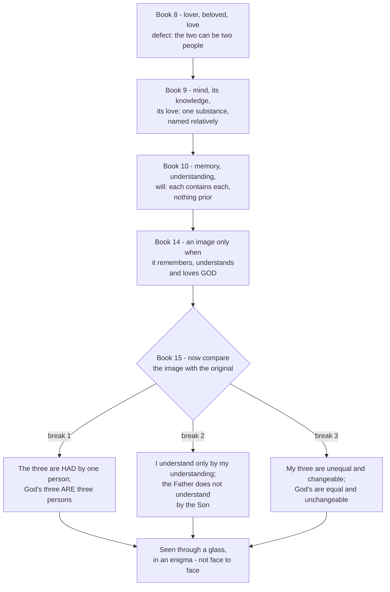

# The Triune God · Lesson 4.2: Augustine: the image in the mind

> ⏱ ~15 min · Module 4: Processions, relations, persons · Builds on: [4.1 Augustine: relation, substance and the rules of predication](04-01-augustine-relation-substance-and-predication.md) · Unlocks: [4.3 The two processions](04-03-the-two-processions.md)

## Why this matters

[4.1](04-01-augustine-relation-substance-and-predication.md) won a defensive victory: some things are said of God *ad se* and some *ad aliquid*, so "begotten" and "unbegotten" do not name two substances, and the doctrine is not a contradiction. That clears the charge. It does not give you anything to look at. Augustine spends the second half of *De Trinitate* on a different question — whether anywhere in creation you can *see* a three that is genuinely one — and answers it by looking at the mind. What he found is the most influential single piece of Trinitarian theology the Latin West produced, and the piece most often mistaken for a proof, or for dogma. Augustine makes neither mistake, and Book 15 is where he says so at length.

## The idea

The search [runs inward](../reference.md#the-road-inward-in-de-trinitate) in stages, each fixing a defect in the last.

**Book 8: love.** Where scripture says God is love, Augustine finds three things in any act of love — the lover, the beloved, and the love that joins them (VIII.10.14). The defect is obvious once named: the lover and the beloved can be two different people, so the three are not one thing. This is a trace, not an image.

**Book 9: the mind that loves itself.** Turn the love inward and the two collapse into one. Now you have *the mind, its knowledge of itself, and its love of itself* — three, in one substance. Augustine is precise about the "in": these are not qualities in a subject the way colour is in a body, since the mind can also know and love things beyond itself; they exist substantially, and yet are named relatively to one another, as two men are substances but are called friends relatively (IX.4.4-5). That is exactly the grammar of [4.1](04-01-augustine-relation-substance-and-predication.md), now found in a creature.

**Book 10: memory, understanding, will.** The Book 9 triad still depends on the mind *doing* something — turning to look at itself. Book 10 finds a three that is there all at once, without any act being performed: *memoria, intelligentia, voluntas*. Each contains the other two whole. I remember that I have memory, understanding and will; I understand that I understand, will and remember; and so round. Nothing is prior, nothing waits.

**Book 14: the object decides.** Then the sharpest turn of the whole search. The triad is not the image of God because the mind remembers, understands and loves *itself*. It is the image because the mind can remember, understand and love *God*:

> This trinity, then, of the mind is not therefore the image of God, because the mind remembers itself, and understands and loves itself; but because it can also remember, understand, and love Him by whom it was made. *(XIV.12.15)*

The image is not a structure you possess. It is a capacity that can be turned toward its original or away from it.

## Source

*De Trinitate* X.11.18 (Haddan's translation, public domain), the passage that fixes what the analogy claims:

> Since, then, these three, memory, understanding, will, are not three lives, but one life; nor three minds, but one mind; it follows certainly that neither are they three substances, but one substance. ... And hence these three are one, in that they are one life, one mind, one essence; and whatever else they are severally called in respect to themselves, they are called also together, not plurally, but in the singular number. But they are three, in that wherein they are mutually referred to each other; and if they were not equal, and this not only each to each, but also each to all, they certainly could not mutually contain each other; for not only is each contained by each, but also all by each.

Three claims are packed in, and they map onto what 4.1 established. **One substance**, not three. **Three, in that they are mutually referred to each other** — distinct by relation and by nothing else. **Each contains each** — a creaturely likeness of what the Greeks call *perichoresis* ([4.5](04-05-common-proper-appropriated.md)). Notice what the passage does *not* say: that the mind's three powers are persons, or that God's persons are powers.

## The argument

What the [psychological analogy](../reference.md#the-psychological-analogy) asserts, stated so that the limits are part of the assertion:

1. **There is an image of the Trinity in the rational creature's mind.** *In words:* something created is genuinely like the Triune God, not by accident of language but because God made it so.
2. **The likeness is of structure, not of content:** one substance, three really distinct by mutual reference alone, each whole in each. *In words:* the shape matches; the things having the shape are not remotely alike.
3. **The image is read in the light of a faith already held, not used to establish it.** Augustine looks for the image *because* he believes the dogma. Aquinas later makes the rule explicit: the Trinity cannot be reached by natural reason, and non-cogent arguments for the faith expose it to the ridicule of unbelievers (ST I q.32 a.1).
4. **The image is obscure, and the obscurity is scriptural.** Augustine's controlling text is Paul's "we see now through a glass, in an enigma". Book 15 insists on the preposition: we do not see a glass, we see *through* a glass.
5. **The image is realized, not merely possessed:** it images God when turned to God (Book 14).

**Level.** This is where the course's [governing distinction](../reference.md#dogma-and-its-explanation) bites. Run the procedure of [`fundamental-theology` 4.4](../../fundamental-theology/lessons/04-04-the-ladder-of-doctrinal-authority.md): find the act, ask what it proposes the claim *as*. That there are three persons in one divine nature is proposed as divinely revealed — rung 1, defined. The psychological analogy is proposed by nobody. No council defines it, no papal act proposes it as revealed or as definitively to be held. It falls below the seam entirely: a theologian's construction, carried for sixteen centuries because it works, and **freely disputed** in its details. Treating it as dogma is an error graded exactly as strictly as demoting the dogma it images.

## The road inward, and where it stops

Book 15 is not a footnote of modesty appended to a finished argument. It is where Augustine turns the analogy around and measures it against what it images — [three breaks](../reference.md#book-15s-three-breaks), in his own words.

**Break 1 (XV.22.42).** The three belong to one person who is none of them:

> In brief, by all these three things, it is I that remember, I that understand, I that love, who am neither memory, nor understanding, nor love, but who have them.

A man *has* three powers and *is* one person. God does not *have* three persons; in God there are three persons and one substance. The analogy fails at the point it was built to illuminate.

**Break 2 (XV.7.12).** In us the powers are the only instruments of their own acts: I remember by nothing but memory, understand by nothing but understanding. Push that across and you get the absurdity Augustine spells out and rejects — the Father understanding only by the Son, each person being the others' faculty. That would make the Father wise by a wisdom he begot rather than by his own essence, which Book 7 had already destroyed.

**Break 3 (XV.23.43).** In us memory can outrun understanding, or love outrun both; the three are mutually unequal and will change. In God they are equal and unchangeable, and were never otherwise. Augustine's conclusion is the reverse of deflating: the Trinity of three persons is *more* indivisible than this image of one.

## Worked examples

**Example 1 (the machinery on a clean case: the inner word).** When I know something and then say it silently in my heart, a word is born of my knowledge — Augustine's [*verbum cordis*](../reference.md#verbum-cordis), a word belonging to no language. Run the structure: the word is not a piece of the mind broken off but the whole knowledge formed; it is of the same nature as the mind that begets it; and it is not later than the knowing. Now the payoff. Scripture calls the Son *Word*; the analogy gives that name a content. Generation in God can be conceived as an intelligible utterance that stays inside the utterer, which is why it is neither creation nor change. And the second procession is marked off by the same means: love proceeds from the mind's knowledge, joining memory and understanding as what Augustine calls common to parent and offspring — so it is neither parent nor offspring, which is why the Spirit proceeds and is not begotten. That is the engine [4.3](04-03-the-two-processions.md) runs on, and it is Augustine's.

**Example 2 (where it strains: are the persons faculties?).** The modern charge at its strength: if the Trinity is modelled on one mind's three activities, the divine three look like three moments of a single divine subject — one "I" who remembers, knows and loves — and that is modalism dressed in psychology. Colin Gunton pressed this against Augustine in *The Promise of Trinitarian Theology* (1991); it is one strand in the wider complaint that the Latin tradition starts from the one essence and struggles to reach real distinction, and it is why several twentieth-century theologians preferred an interpersonal model ([6.4](06-04-social-trinitarianism-and-its-critics.md)).

The reply is not that the charge misfires but that Augustine made it first. Breaks 1 and 2 are exactly it, and he rejects the faculties reading as absurd. Readers including Lewis Ayres and Michel Barnes argue further that the charge depends on taking Books 8-15 without Books 5-7 and without Book 15, and on the de Régnon contrast that [1.1](01-01-the-treatise-and-its-order.md) already flagged as a modern construction.

What stays genuinely open is not whether Augustine avoided the error, but whether an analogy needing this much correction is a good instrument — whether it illuminates or distorts. Catholic theologians take both sides, and this lesson takes none.

## Watch out

- **You might think the analogy explains the Trinity; it proves nothing.** It supplies a likeness for something already believed on other grounds. "The mind has three powers and is one, therefore God can be three and one" is precisely the non-cogent argument Aquinas warns exposes the faith to ridicule (ST I q.32 a.1).
- **"The Father is God's memory, the Son his understanding, the Spirit his will" is not a slight overstatement of Augustine — it is the thing he calls absurd** (XV.7.12). Distributing one subject's faculties among the three lands in **modalism**: one God in three functions. The persons are distinguished by relations of origin, by nothing else.
- **Do not let Book 15 devour the dogma in the other direction either.** "Augustine only meant a poetic comparison, so the three are just ways of speaking" demotes a defined truth to a school opinion. Book 15 shrinks the *analogy*, never the Trinity — its last word is that God's three persons are more indivisible than the image, not less real.
- **This is knowledge of God, not the doctrine of the image of God.** What the *imago Dei* is in man, how sin defaces it and grace restores it, belongs to `creation-grace-last-things`.
- **The relations here are real, and that is the whole difference.** The relations of reason of [`thomistic-synthesis` 4.3](../../thomistic-synthesis/lessons/04-03-the-names-of-god.md) exist only in our way of speaking about God. The relations of Module 4 are in God, which is what lets them be persons.

## One-liner

> Augustine went looking for the Trinity in the mind, found the best likeness anyone has found, and then spent a book showing how far short it falls — which is why it is an image and not a proof.

## Problems

**P1 (🟢) *(Exegetical.)*** Sort each claim into **defined dogma**, **the Latin tradition's explanation**, or **Augustine's likeness drawn from a creature**, and name in one clause the act (or the absence of any act) that fixes the level.
(a) There are three persons in one divine nature.
(b) The Son proceeds as a word proceeds from the mind's knowledge.
(c) Memory, understanding and will in the human mind are an image of the Trinity.
One sentence per item.

**P2 (🟡) *(Exegetical.)*** Close-read *De Trinitate* XV.23.43 (Haddan):

> A thing itself, then, which is a trinity is different from the image of a trinity in some other thing. ... But in that Highest Trinity, which is incomparably above all things, there is so great an indivisibility, that whereas a trinity of men cannot be called one man, in that, there both is said to be and is one God, nor is that Trinity in one God, but it is one God. Nor, again, as that image in the case of man has these three things but is one person, so is it with the Trinity; but therein are three persons... A thing certainly wonderfully ineffable, or ineffably wonderful, that while this image of the Trinity is one person, but the Highest Trinity itself is three persons, yet that Trinity of three persons is more indivisible than this of one.

(a) Which words carry the denial that God's three are related to the divine essence the way the mind's three are related to the mind? (b) The passage also rules out a *second* bad model, one that is not the faculties model. Name it and quote the clause that rules it out. (c) Does the last sentence weaken the claim that God is one? 120 words or fewer in total.

**P3 (🔴) *(Exegetical (a) · Evaluative (b).)*** An invented parish bulletin paragraph:

> Think about your own soul for a moment. You remember, you understand, you choose — three powers, one you. The Trinity is just like that. The Father is God's memory, the Son is God's understanding, and the Spirit is God's will. Three things the one divine mind does. So when we say three persons, we mean the three ways the one God operates.

(a) Name the heresy this lands in and the single move that lands there, and cite the place where Augustine himself rules it out. Two sentences.
(b) Any verdict: given how easily the analogy slides into (a), does Book 15 show the analogy to be a well-guarded instrument or one whose cost exceeds its yield? 120 words or fewer.

Solutions

**P1** *(Exegetical.)*

**Must hit, strict:**
(a) **Defined dogma**, rung 1. Fixed by solemn conciliar act: the creeds of Nicaea and 381, and the Latin texts of [3.4](03-04-the-latin-rules-of-speech.md), propose it as divinely revealed and to be believed. Credit for naming any one of those acts.
(b) **The Latin tradition's explanation.** No magisterial act proposes it; it is Augustine's, systematized by Aquinas, and sits below the seam as a theologians' question, freely disputed in its details. The answer must say that no act proposes it — that absence is what fixes the level.
(c) **Augustine's likeness drawn from a creature**, and below the seam likewise: an image read in the light of a faith already held, and stated by its author as obscure. Credit for noting that *man is made in God's image* is scriptural, while *the mind's triad images the Trinity specifically* is Augustine's construction; the doctrine of the *imago Dei* itself is ceded to `creation-grace-last-things`.

**Wrong turns:** promoting (b) or (c) by appeal to how long the tradition has held them, or to Aquinas's authority — neither is a magisterial act, and the ladder grades acts. Demoting (a) to "the Church's way of speaking" because the explanation of it is disputed. Answering (c) by asking how *important* the claim is rather than which act proposed it.

**Model answer:** (a) Defined dogma, proposed as divinely revealed by the creed of 381 and restated as such by Lateran IV. (b) The Latin tradition's explanation: no council or papal act proposes it, so it sits below the seam as a theologians' question and is freely disputed. (c) Augustine's likeness in a creature, proposed by no act at all and presented by Augustine himself as seen through a glass, in an enigma.

---

**P2** *(Exegetical.)*

**Must hit, strict (a):** the has/is contrast in "Nor, again, as that image in the case of man **has** these three things but **is** one person, so is it with the Trinity" — read the construction as "nor is it with the Trinity as it is with the image", which is what the opening *Nor* governs. The mind *has* three powers and *is* one person; God does not have three persons. Equivalent credit for the parallel clause "nor is that Trinity *in* one God, but it *is* one God", which denies that the Trinity is something the divine essence possesses.

**Must hit, strict (b):** the **tritheist** model — three persons as three instances of a shared nature, on the model of three human beings. Ruled out by "whereas a trinity of men cannot be called one man, in that, there both is said to be and is one God". The passage therefore blocks the faculties model on one side and the three-men model on the other.

**Must hit, strict (c):** No — it strengthens it. "That Trinity of three persons is more indivisible than this of one" says the divine three are *less* separable than the mind's three, not more. Any reading on which the sentence loosens God's unity has misread "indivisible".

**Wrong turns:** taking "image" to mean the passage is comparing two trinities of equal standing; reading "more indivisible than this of one" as a paradox Augustine leaves unresolved rather than as an assertion about God; naming modalism for (b), which is the model the has/is contrast of (a) blocks, not this one.

**Model answer:** (a) The has/is contrast: the human image *has* three things but *is* one person, and the Trinity is not like that — reinforced by "nor is that Trinity in one God, but it is one God". (b) Tritheism, blocked by "whereas a trinity of men cannot be called one man, in that, there both is said to be and is one God". (c) No. "More indivisible than this of one" claims a tighter unity in God than in the single mind, so it presses the oneness harder, not less.

---

**P3** *(Exegetical (a) · Evaluative (b).)*

**Must hit, strict (a):** **Modalism.** The move is the identification of the persons with the powers of one subject — "the Father is God's memory" — which makes the three into operations of a single divine "I" and reduces person to mode of operation; the bulletin's last sentence says so outright ("the three ways the one God operates"). Augustine rules it out at XV.7.12, where he sets out this very reading — the Father as memory for all three, the Son as understanding for all three, the Spirit as love for all three — and rejects it as absurd, since it would make the Father wise by a wisdom he begot; and again at XV.22.42, "who am neither memory, nor understanding, nor love, but who have them." Credit for noting that the analogy has been reversed: Augustine reads the creature in the light of the dogma, the bulletin reads the dogma off the creature.

**Must hit, any verdict (b):** state what the analogy actually yields (a likeness of structure — one substance, three distinguished only by mutual reference, each whole in each — and a content for the scriptural names Word and Love, hence for two processions and only two); state at least one of Book 15's breaks precisely; and say whether the corrective is *internal* to the instrument or an external patch. An answer that only reports that Augustine issued warnings has not made the second move.

**Wrong turns:** naming tritheism — the bulletin's error is the opposite one, collapsing the three into one subject's functions. Answering (b) by asserting that Augustine's intentions settle whether the analogy works in use; the question is about the instrument, not the author. Treating the analogy's disputed status as licence to call the dogma itself disputed.

**Model answer (a):** It lands in modalism: identifying each person with a power of one divine mind makes the three into ways the single subject operates, which is what the closing sentence states. Augustine himself sets out and rejects that reading at XV.7.12, and at XV.22.42 he notes that the one who has memory, understanding and love is none of them — whereas God's three *are* three persons.

**Model answer (b), one of several:** Well guarded. The corrective is not bolted on; it is produced by the same analysis. Book 15 finds the breaks by pressing the analogy's own terms — in me the powers are had by one person and each act runs through exactly one power, and both facts fail in God — so the instrument reports its own limits. What it yields is not decorative: without the inner word there is no account of why generation is neither creation nor change, and no way to distinguish a second procession that is not a second begetting. An answer arguing the other way is equally admissible: an image that needs a third of the treatise to disarm is one most readers will use undisarmed, and the bulletin is what that looks like.

## Flashback

**From Lesson [3.4](03-04-the-latin-rules-of-speech.md) (The Latin rules of speech: Quicumque, Lateran IV, Florence):** *(Exegetical.)* The three rules, restated: **Florence** — everything in God is one where no opposition of relation stands in the way (this course's rendering of the Latin). **Lateran IV** — the one supreme reality is not a fourth thing beside the three but is each of them entire, and it neither begets nor is begotten nor proceeds; the essence is altogether simple. **The Athanasian Creed** — a non-relative predicate is said of each person singly and never in the plural.

Run the filter on three sentences from an invented confirmation handout. For each, say whether the predicate puts two terms in relative opposition, then whether the sentence is permitted; where it is not, name the rule broken and the error it lands in. **One sentence each.**

1. "The Father is merciful, the Son is merciful, the Spirit is merciful — three merciful ones, one mercy."
2. "The Son is begotten of the Father."
3. "The three persons together make up the one God."

Solution

**Must hit, strict:**

1. **Not relative.** Mercy demands no opposite number, so by Florence's clause it is one in God, and the *Quicumque*'s form is obligatory: said of each singly, refused in the plural. "Three merciful ones" pluralizes a non-relative predicate and so **divides the substance** — **tritheism**. The trailing "one mercy" does not repair it; it leaves three bearers drawing on one perfection, which is the shared-stock picture the rule exists to forbid.
2. **Relative**, and opposed — *begotten* requires a begetter. So it marks a distinction exactly there and is **permitted**: said of the Son alone, never of the Trinity, and never with the essence as the other term, since Lateran IV rules that the supreme reality is not begotten.
3. **Not relative, and not a distinction at all.** "Make up" makes the three constituents of a whole, so the one God becomes a sum and the persons its parts — against Lateran IV, where the one reality *is* each of the three entire, and against *Firmiter*'s "altogether simple". It divides the substance and lands in **tritheism**, now with a composite God.

**Wrong turns:** calling 2 an error because it distinguishes — the rules license a distinction wherever relation opposes, and this is the clean case; passing 1 because every clause in it is individually orthodox, which is how the plural slips through; diagnosing 3 as the Joachimite **quaternity**, which is the opposite fault (an essence standing beside the three, not a whole composed of them), though credit for noticing that both errors treat the essence as a thing in its own right.

**Model answer:** 1. Non-relative, so one in God; "three merciful ones" pluralizes it, divides the substance and lands in tritheism. 2. Relative and opposed, so permitted — a distinction of the Son from the Father, said of neither the Trinity nor the essence. 3. Non-relative and no distinction; "make up" makes the persons parts of a sum, against Lateran IV and against the simplicity of *Firmiter*, and so is tritheism with a composite God.

## Connections

- **Backward:** [4.1](04-01-augustine-relation-substance-and-predication.md) supplied the grammar this lesson finds in a creature — substance and relation, *ad se* and *ad aliquid*. Augustine's certainty that the mind knows itself, which Book 10 leans on throughout, is treated philosophically in [`ancient-medieval-philosophy` 5.1](../../ancient-medieval-philosophy/lessons/05-01-augustine-certainty-and-illumination.md).
- **Forward:** [4.3](04-03-the-two-processions.md) turns the inner word and the love that follows it into ST I q.27's two processions, and answers why there are exactly two; [4.4](04-04-four-relations-three-persons.md) turns the relations into persons. [4.5](04-05-common-proper-appropriated.md) takes up Word, Image, Love and Gift as proper names, and the mutual containment of the Source under its Greek and Latin names. [6.4](06-04-social-trinitarianism-and-its-critics.md) returns to the charge of Example 2 from the other end, where an interpersonal model is offered in place of this one.
- **Sideways:** the relations of reason of [`thomistic-synthesis` 4.3](../../thomistic-synthesis/lessons/04-03-the-names-of-god.md) are the contrast case that makes Module 4's *real* relations intelligible; the level assigned here comes from the procedure in [`fundamental-theology` 4.4](../../fundamental-theology/lessons/04-04-the-ladder-of-doctrinal-authority.md). What the image of God is in man, and what grace does to it, belongs to `creation-grace-last-things`, not to this course.
