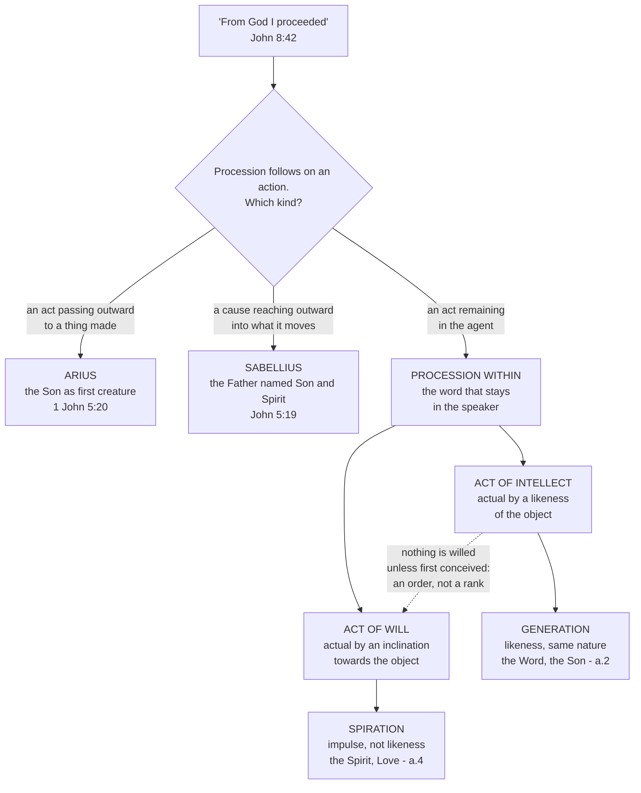

# The Triune God · Lesson 4.3: The two processions

> ⏱ ~15 min · Module 4: Processions, relations, persons · Builds on: [4.1](04-01-augustine-relation-substance-and-predication.md), [4.2](04-02-augustine-the-image-in-the-mind.md) · Unlocks: [4.4](04-04-four-relations-three-persons.md), [4.5](04-05-common-proper-appropriated.md)

## Why this matters

The creeds say the Son is *begotten* of the Father and the Spirit *proceeds* from him. Catholics confess those words weekly without being able to say what they mean, and the difficulty is not laziness: in a God who is altogether simple, unchangeable and outside time ([1.3](01-03-simplicity-as-doctrine.md), [1.4](01-04-immutability-eternity-immensity.md)), nothing can come *out* of God without landing outside him, and nothing outside God is God.

Question 27 of the *Summa* is where the Latin tradition takes that objection seriously enough to be changed by it. It is also the most seductive stretch of the treatise: the analysis clicks, and a reader who has just understood it wants to say *this is the doctrine of the Trinity*. It is not. It is one tradition's way of holding the doctrine without contradiction — and here is where that distinction is hardest to hold.

## The idea

Aquinas starts from a grammatical observation, not a metaphysical one. Scripture uses words of procession about God — "From God I proceeded" (John 8:42). So something is being said; the question is what.

Two readings were available, and both were tried. **Arius** read procession as an effect coming from a cause: the Son is the Father's first creature. **Sabellius** read it the other way, as a cause reaching into its effect: the one God is called *Son* in taking flesh and *Spirit* in sanctifying us. Aquinas's diagnosis of the pair is one diagnosis, not two, and it is the hinge of the question. Both take procession as an act going *outward*, so **neither puts procession in God at all** — one puts it in the creature produced, the other in the creature acted on.

That leaves what both overlooked. Every procession follows on an action, and actions come in two kinds: those that pass out into external matter, and those that stay in the agent. So there can be "an inward procession corresponding to the act remaining within the agent" — and the clearest case is understanding. Whenever you understand something, something comes to be in you by that very act: a conception of the thing understood, which the spoken word expresses and which Aquinas calls the *word of the heart*. It proceeded, and it stayed.

[Procession in God](../reference.md#procession-in-god) is therefore neither a spilling-out nor a making, but an intelligible emanation: the word that proceeds from a speaker and remains in him.

## Source

ST I q.27 a.4, "Whether the procession of love in God is generation?" — the *respondeo*, English Dominican Province translation. This is the article that decides why the two processions genuinely differ.

> I answer that, The procession of love in God ought not to be called generation. In evidence whereof we must consider that the intellect and the will differ in this respect, that the intellect is made actual by the object understood residing according to its own likeness in the intellect; whereas the will is made actual, not by any similitude of the object willed within it, but by its having a certain inclination to the thing willed. Thus the procession of the intellect is by way of similitude, and is called generation, because every generator begets its own like; whereas the procession of the will is not by way of similitude, but rather by way of impulse and movement towards an object. So what proceeds in God by way of love, does not proceed as begotten, or as son, but proceeds rather as spirit.

*In words:* when you understand a thing, a likeness of it comes to be in you. When you want a thing, no likeness comes to be in you; what comes to be is a leaning towards it. Two different inner events, so two differently named processions.

The article nowhere makes the Spirit later or lower; it argues only that *begotten* is the wrong word. The *sed contra* has already fixed the right one by quoting Athanasius — not made, nor begotten, but proceeding ([3.4](03-04-the-latin-rules-of-speech.md)).

## The argument

### Why the first procession counts as generation

Article 2 splits the word, because "generation" in its commonest sense — change from not-being to being — is exactly what cannot happen in God. The other sense belongs to living things: the origin of a living being from a conjoined living principle. It has conditions. A hair grows from a living thing and is not begotten; a worm bred from an animal has a generic likeness and is not begotten either. **What is begotten proceeds by way of likeness in the same specific nature** — man from man, horse from horse.

Run those marks on the procession of the Word: a vital operation, from a conjoined principle, by way of likeness (a concept is a likeness of what is conceived), and in the same nature, because in God understanding and existing are the same. Four out of four, the first sense excluded outright. Hence [generation by way of intellect](../reference.md#generation-by-way-of-intellect), and hence the proceeding Word is called Son.

The fourth mark does the work, and our own case fails it: your inner word is not of the same nature as you, since your intellect is not your substance ([`thomistic-synthesis` 4.1](../../thomistic-synthesis/lessons/04-01-how-a-human-intellect-knows.md)). The analogy has to be corrected, not applied flat.

### Why there are exactly two

Articles 3 and 5 together. The argument is short:

1. A procession in God must follow on an action that remains in the agent, since an action passing outward produces a creature, not a divine person.
2. In an intellectual nature the actions that remain in the agent are two: understanding and willing.
3. Sensation looks like a third and is not: it belongs to no purely intellectual nature, and it is completed by the sensible object acting on the sense.
4. Power and goodness supply no third. Power is the principle by which one thing acts on *another*, so it points outward, to creatures; goodness belongs to the essence, not to an operation.

∴ **The only processions possible in God are the procession of the Word and the procession of Love** ([why exactly two](../reference.md#why-there-are-exactly-two-processions)).

*In words:* count the ways a mind can act without reaching outside itself. There are two. So there are two.

Nor does the count run away upward. In us one word leads to another; in God there is one act of understanding and one of willing, so one perfect Word and one perfect Love, and love terminates the series rather than starting a new one. And since in creatures generation is the only way a nature is communicated, our language had no word for [the second procession](../reference.md#the-procession-of-love) at all; Aquinas proposes **spiration**.

### What is defined and what is not

On the ladder of [`fundamental-theology` 4.4](../../fundamental-theology/lessons/04-04-the-ladder-of-doctrinal-authority.md). The [two errors](../reference.md#dogma-and-its-latin-explanation) this course grades strictly sit either side of the line:

| Claim | Level |
|---|---|
| The Son is begotten of the Father, not made | **Rung 1.** Defined at Nicaea ([3.1](03-01-nicaea.md)) |
| The Spirit proceeds and is not begotten | **Rung 1.** The creed of 381 ([3.3](03-03-constantinople-i-and-the-divinity-of-the-spirit.md)); the distinction from generation carried in the West by the Athanasian Creed ([3.4](03-04-the-latin-rules-of-speech.md)) |
| Three persons in one nature; procession in God is neither creation nor change | **Rung 1.** Nicaea, 381, Lateran IV's *Firmiter* |
| The Son's generation is an act of the divine intellect, a Word proceeding as a concept does | **Below the seam.** No act of the Magisterium proposes it; the common teaching of the Latin schools |
| The Spirit proceeds by way of will, as Love, and that procession is called spiration | **Below the seam.** Same |

Scripture and the creed give the name *Word*; that the generation is an act of understanding is Augustine's inference and Aquinas's, and the Greek tradition holds the same dogma without it ([5.2](05-02-the-greek-doctrine-and-the-addition.md)).

## The derivation

Both rejected branches make one mistake: each takes procession outward, and so puts it somewhere other than in God.

## Worked examples

**Example 1 — the machinery on a clean case: what "eternal generation" rules out.** Grant that the Son is begotten, and ask the natural question: begotten *when*, and does the Father change in begetting?

Generation in the first sense — passage from non-being to being, and so from potency to act — was excluded at the start of a.2, so there is no moment before which the Son was not. Question 42 a.2 gives the reason in full: what proceeds is later than its principle only if the agent chose a time, or had to grow into its power, or acted successively, and none of the three is true here. The reply to that article's first objection is the cleanest line on the point: the intellectual word is posterior to its source only "in an intellect passing from potentiality to act; and this cannot be said of God."

So: no priority in time, no change, no passive potency in the Father — nothing in him waiting to become a father ([`thomistic-synthesis` 2.1](../../thomistic-synthesis/lessons/02-01-act-and-potency-extended.md)). "Eternal generation" is not a very long generation; it is generation with the apparatus of becoming deleted.

**Example 2 — where it strains: intellect and will are the same in God.** The hardest objection in the question is the third of a.3. In God the will *is* the intellect; simplicity requires it ([1.3](01-03-simplicity-as-doctrine.md)). If the processions are distinguished *by* intellect and will, and those are not two, then the processions are not two either — and the analysis collapses into one, which is one person too few.

Aquinas concedes the premise and denies the inference. Will and intellect are not diverse in God; but the notion of each requires that their processions stand in an *order*, since love proceeds only from what the intellect has conceived. The distinction is taken not from two faculties but from the order of one procession to the other.

Feel the strain honestly. The reply does not show that the processions ground a *real* distinction of persons; only that the analysis is not self-defeating. What turns an order between processions into three who are really distinct is relative opposition — [4.4](04-04-four-relations-three-persons.md)'s work.

## Watch out

- **You might think you have just learned the doctrine of the Trinity.** You have learned the Latin tradition's explanation of it. Preaching the analysis as the faith is the same kind of error as calling the creed's *begotten, not made* a school opinion — opposite directions, one mistake.
- **You might think the Son is the Father's idea of himself and the Spirit their mutual affection.** Then the three are acts of one subject, and the subject is the Father: modalism with a psychological accent, refuted in a.1's *respondeo* from John 5:19. Word and Love here are not acts of a person; [4.4](04-04-four-relations-three-persons.md) says what they are.
- **You might think procession means being further from the source.** That grades the persons by distance and makes the divine life leak outward in stages: emanationism, whose Christian form is subordinationism. Article 1 removes the picture at the root — the more perfectly something proceeds within, the more closely it is one with its source.
- **You might think an intellect and a will make two minds in God.** Three centres of consciousness is tritheism. There is one intellect, one act of understanding, one will; what is threefold is not the apparatus but who subsists in it.
- **Do not read spiration as a demotion.** That love is not called generation is a claim about the word, not the rank; q.42 answers that the three are co-eternal and co-equal.

## One-liner

> Procession in God is nothing going out and everything staying in: the word a mind speaks to itself, and the love that follows it, in a nature where both are God.

## Problems

**P1 (🟢) *(Exegetical.)*** Assign a level to each claim and **name the act that fixes it** — one sentence each. Where nothing magisterial proposes the claim, say so and say what it is instead.

(a) The Son is begotten of the Father, not made.
(b) The Holy Spirit proceeds and is not begotten.
(c) The Son proceeds by an act of the divine intellect, as a concept proceeds in a mind.
(d) The procession of the Spirit is by way of will, and is rightly called spiration.

**P2 (🟡) *(Exegetical.)*** Two invented sentences, one from a parish hymn-sheet note and one from a confirmation handout:

> (i) "The Father is God knowing himself, the Son is the thought he thinks, and the Spirit is the warm feeling that passes between them."
>
> (ii) "Out of the Father comes the Son, and out of the Son, one step further from the source, comes the Spirit — the divine life spilling outward, stage by stage, until at last it reaches us."

Name the error in each, name the part of ST I q.27 that corrects it, and say in one clause what true thing each sentence is reaching for. **120 words or fewer in total.**

**P3 (🔴, optional) *(Exegetical.)*** The reply to the second objection of ST I q.27 a.1 (English Dominican Province). The objection was: everything that proceeds differs from its source; in God there is no diversity but supreme simplicity; therefore no procession.

> "Whatever proceeds by way of outward procession is necessarily distinct from the source whence it proceeds, whereas, whatever proceeds within by an intelligible procession is not necessarily distinct; indeed, the more perfectly it proceeds, the more closely it is one with the source whence it proceeds. For it is clear that the more a thing is understood, the more closely is the intellectual conception joined and united to the intelligent agent; since the intellect by the very act of understanding is made one with the object understood. Thus, as the divine intelligence is the very supreme perfection of God, the divine Word is of necessity perfectly one with the source whence He proceeds, without any kind of diversity."

(a) Which words concede the objection's principle, and which words limit it? (b) A reader takes "without any kind of diversity" to mean the Word is not distinct from the Father at all. Say what the reply does and does not establish, and name the heresy the misreading lands in. **Two sentences per part.**

Solutions

**P1** *(Exegetical — strict.)*

**Must hit, strict:**
- (a) **Rung 1, defined dogma.** The act is the creed of Nicaea (325), an ecumenical council's solemn definition, with *begotten, not made* and *consubstantial with the Father* and the anathemas against "there was when he was not" ([3.1](03-01-nicaea.md)).
- (b) **Rung 1.** The act is the creed of Constantinople I (381), which confesses the Spirit as proceeding from the Father and adored and glorified with the Father and the Son ([3.3](03-03-constantinople-i-and-the-divinity-of-the-spirit.md)); that his procession is *not* generation is the constant faith — the *sed contra* of q.27 a.4 cites Athanasius for it, that the Holy Ghost is not made, nor begotten, but proceeding, and the Athanasian Creed carries the same rule in the West ([3.4](03-04-the-latin-rules-of-speech.md)). Credit for naming the ordinary and universal magisterium as the route for the second half.
- (c) and (d) **Below the seam — no magisterial act proposes either.** They are the common teaching of the Latin schools, carried by Augustine and Aquinas; theological explanation of the dogma, not dogma. The correct answer names the absence of an act, not a lower rung of teaching authority.

**Wrong turns:** promoting (c) because "Word" is scriptural and creedal — the name *Word* is given; that the generation is an act of understanding is the inference, and it is the theologians'. Promoting (d) because *spiration* sounds technical and old, or because the Western texts on the filioque use the word ([5.1](05-01-the-latin-doctrine.md)) — the age or currency of a term is not an act of the Magisterium, and what those texts settle is the Son's part in the Spirit's origin, not that the procession is an act of will. Demoting (a) or (b) to "the Latin explanation" — the reflex of a reader who has just learned to be careful and over-applies it. Answering "important" or "central" instead of naming an act.

**Model answer:** (a) Rung 1, by the solemn definition of Nicaea in 325. (b) Rung 1: the creed of 381 defines the procession; that it is not generation is taught by the ordinary and universal magisterium and stated in the West by the Athanasian Creed. (c) No magisterial act proposes it; it is the common teaching of the Latin schools and belongs below the seam. (d) Likewise below the seam — the name *spiration* is Aquinas's proposal for a procession our language had left unnamed.

---

**P2** *(Exegetical — strict.)*

**Must hit, strict (i):** **modalism**, in psychological dress. It makes the Father the one subject and the Son and Spirit his act and his affect, so the three are states of one knower rather than three who subsist; it also reduces the Spirit to a feeling. Corrected by the *respondeo* of **a.1**, which rejects Sabellius on the ground that the Lord's own words show the Father is not the Son (John 5:19), and by **a.4**, where what proceeds by love proceeds *as spirit* — one who proceeds, not an atmosphere between two others. Reaching for: that the processions really are by way of intellect and will, and that God's inner life is not inert.

**Must hit, strict (ii):** **emanationism, and so subordinationism.** "One step further from the source" and "spilling outward, stage by stage" make procession an outward act and grade the persons by distance from an origin. Corrected by the *respondeo* of **a.1** — procession in God follows an action remaining in the agent, not one tending to external matter — and by **a.1 ad 2**, where inward procession makes what proceeds *more* one with its source. Reaching for: the real order of origin among the persons, and that the Trinity does reach us (the missions, [6.1](06-01-the-missions-of-the-son-and-the-spirit.md)).

**Wrong turns:** treating (ii) as an error about the filioque. Saying the Spirit is from the Son is Catholic doctrine ([5.1](05-01-the-latin-doctrine.md)); the error is the outwardness and the grading, and it would be just as wrong in a sentence naming only the Father. Diagnosing (i) as tritheism — it has the opposite defect, too few subjects, not too many. Objecting to the tone of either sentence rather than to what it asserts.

**Model answer:** (i) Modalism with a psychological accent: the Father alone is the subject, the Son his thought and the Spirit their mood, so none of the three subsists. Article 1's *respondeo* refutes Sabellius from John 5:19, and a.4 has what proceeds by love proceed *as spirit*. It is reaching for the two processions by intellect and will. (ii) Emanationism, and subordinationism with it: "one step further from the source" grades the persons and makes procession an outward spilling, where a.1 puts it in an act remaining in the agent and a.1 ad 2 makes the perfect procession *more* united to its source. It is reaching for the order of origin, and for the missions.

---

**P3** *(Exegetical — strict.)*

**Must hit, strict (a):** the concession is "**Whatever proceeds by way of outward procession is necessarily distinct from the source whence it proceeds**" — the objection's principle is granted in full, for outward procession. The limitation is carried by "**whereas, whatever proceeds within by an intelligible procession is not necessarily distinct**," and is then reversed into a positive claim by "**the more perfectly it proceeds, the more closely it is one with the source**." Full credit notes that the reply works by distinguishing the objection's middle term rather than denying its premise.

**Must hit, strict (b):** the reply establishes that procession in God entails no **diversity** — no difference of nature between the Word and his source, which is all the objection from simplicity required. It does not establish, and does not here address, whether the Word is really distinct as a person; that question is q.28's and is settled by relative opposition ([4.4](04-04-four-relations-three-persons.md)). Two things block the misreading: the article's own grammar, which keeps two terms, one proceeding and one from whom he proceeds, and the *respondeo* immediately above it, which has just refuted Sabellius by the Lord's own words. The misreading lands in **modalism**.

**Wrong turns:** reading "not necessarily distinct" as Aquinas's verdict on the divine Word — it is a statement about intelligible procession as such, and the human inner word is the case in which no distinction of persons follows. Taking the reply to prove the real distinction of persons, which overshoots q.27 by a whole question. Answering (b) with "tritheism," which is the error at the other end.

**Model answer:** (a) The reply concedes "whatever proceeds by way of outward procession is necessarily distinct from the source," and limits it with "whatever proceeds within by an intelligible procession is not necessarily distinct" — then turns the limit into a positive claim, that the more perfectly a thing proceeds within, the more closely it is one with its source. (b) All it establishes is that inward procession requires no diversity of nature, which is exactly what the objection from simplicity demanded; whether the Word is really distinct as a person is untouched here and waits on the relations of q.28. The misreading — no diversity, therefore no distinction — is modalism, already refuted in the *respondeo* above, against Sabellius.

## Flashback

**From Lesson [4.1](04-01-augustine-relation-substance-and-predication.md) (Augustine: relation, substance and the rules of predication):** *(Exegetical.)* Close reading. *De Trinitate* Book 5, ch. 11 (Haddan, *Nicene and Post-Nicene Fathers*), where Augustine runs his own two columns — said in respect of itself, said toward another — on the names of the persons:

> ... the Trinity cannot in the same way be called the Father, except perhaps metaphorically, in respect to the creature, on account of the adoption of sons. ... Neither can the Trinity in any wise be called the Son, but it can be called, in its entirety, the Holy Spirit, according to that which is written, God is a Spirit; because both the Father is a spirit and the Son is a spirit, and the Father is holy and the Son is holy. ... But yet that Holy Spirit, who is not the Trinity, but is understood as in the Trinity, is spoken of in His proper name of the Holy Spirit relatively, since He is referred both to the Father and to the Son. ... But the relation is not itself apparent in that name, but it is apparent when He is called the gift of God.

(a) Which words explain why the whole Trinity may be called "the Holy Spirit" and may not be called "the Son"? Say which column each of the two uses of "Holy Spirit" falls in.
(b) "The relation is not itself apparent in that name." State the difficulty Augustine is flagging and what it shows about how a term's column is settled, and name the other Book 5 term where the same trap catches his opponents.
**Two sentences or fewer per part.**

Solution

**Must hit, strict (a):** the explanation is carried by "**because both the Father is a spirit and the Son is a spirit, and the Father is holy and the Son is holy**" — taken that way, "spirit" and "holy" are said of God in respect of himself, so they are true of each person and of the Trinity in the singular. "Son" is said only toward another, and what is said relatively is never said of the Trinity as a whole, which is why that name cannot travel. So one phrase sits in both columns: "Holy Spirit" said of the whole Trinity is substantial, and "Holy Spirit" as the third person's proper name is relative — "referred both to the Father and to the Son".

**Must hit, strict (b):** the difficulty is that "Holy Spirit", unlike "Father" and "Son", does not announce its partner, so a name can be relative without looking relative; the column is therefore settled by asking whether the term is said toward another, not by the shape of the word — which is why Augustine reaches for "gift of God", where giver and gift are visibly reciprocal. The other term is **"unbegotten"**, which looks absolute and is a relative denial (ch. 7), and mistaking its column is precisely the Arian comeback.

**Wrong turns:** concluding from "the Trinity can be called the Holy Spirit" that the third person *is* the Trinity — the same sentence says he "is not the Trinity, but is understood as in the Trinity". Reading "except perhaps metaphorically, in respect to the creature" as licensing the Trinity to be called Father in the Trinitarian sense; that relation is toward creatures, by adoption, and is not the paternity of the first person. Answering (b) with "Gift", which is Augustine's remedy rather than the trap he is naming.

**Model answer:** (a) "Because both the Father is a spirit and the Son is a spirit, and the Father is holy and the Son is holy": spirit and holy are said in respect of self, hence of each person and of the Trinity in the singular, whereas "Son" is said toward another and so never of the Trinity. The Trinity-wide "Holy Spirit" is substantial; the third person's proper name "Holy Spirit" is relative, referred to the Father and the Son. (b) A relative name need not look relative — "Holy Spirit" hides its second term where "Father" and "Son" display theirs — so what decides the column is whether the term is said toward another, which "gift of the giver, giver of the gift" makes plain. The same trap is "unbegotten", absolute in appearance and a relative denial in fact.

## Connections

- **Backward:** [4.1](04-01-augustine-relation-substance-and-predication.md) cleared the logical ground by showing that some things are said of God relatively, which is what lets a procession inside God not multiply substances; [4.2](04-02-augustine-the-image-in-the-mind.md) supplied the mind's word and love as the place to look, and its own warning about how far the image carries. [1.3](01-03-simplicity-as-doctrine.md) set the constraint the whole question is working against. From [`thomistic-synthesis`](../../thomistic-synthesis/syllabus.md): act and potency ([2.1](../../thomistic-synthesis/lessons/02-01-act-and-potency-extended.md)) for what "no passive potency in the Father" denies, and the account of the inner word ([4.1](../../thomistic-synthesis/lessons/04-01-how-a-human-intellect-knows.md)) that this question redeploys at the top of the ladder.
- **Forward:** [4.4](04-04-four-relations-three-persons.md) turns two processions into four relations and three persons, and only there does the analysis deliver a real distinction. [4.5](04-05-common-proper-appropriated.md) needs *Word* and *Love* fixed as proper names of the Son and the Spirit before it can sort what is merely appropriated. [5.1](05-01-the-latin-doctrine.md) makes the order between the processions carry weight in the argument for the filioque.
- **Sideways:** [`patristics` 2.5](../../patristics/lessons/02-05-clement-of-alexandria-and-origen.md) has Origen's argument for eternal generation, which arrived generations before the vocabulary that could guard it; [`thomistic-synthesis` 4.3](../../thomistic-synthesis/lessons/04-03-the-names-of-god.md) has the relations of *reason* in q.13 a.7, and warns that the relations met in [4.4](04-04-four-relations-three-persons.md) are of the opposite kind. Levels throughout come from [`fundamental-theology` 4.4](../../fundamental-theology/lessons/04-04-the-ladder-of-doctrinal-authority.md).
