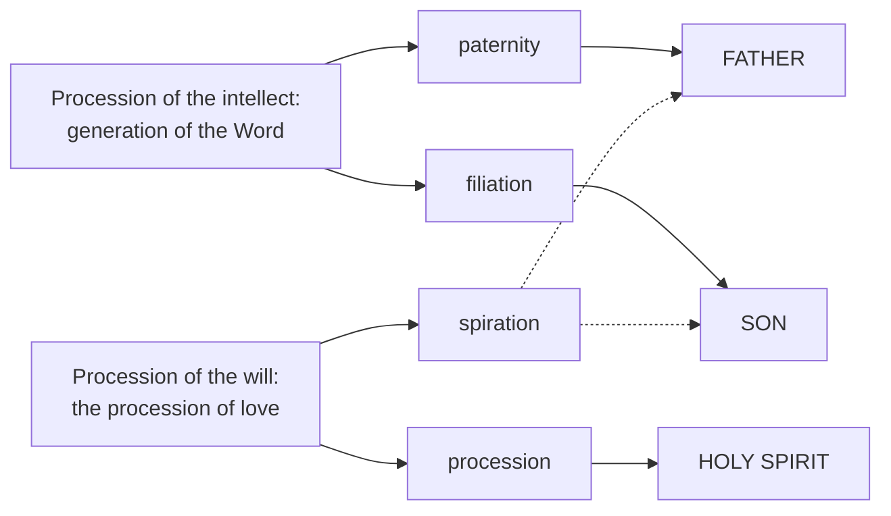

# The Triune God · Lesson 4.4: Four relations, three persons

> ⏱ ~15 min · Module 4: Processions, relations, persons · Builds on: [4.3](04-03-the-two-processions.md), [3.4](03-04-the-latin-rules-of-speech.md), [1.3](01-03-simplicity-as-doctrine.md) · Unlocks: [4.5](04-05-common-proper-appropriated.md), [5.1](05-01-the-latin-doctrine.md)

## Why this matters

[4.3](04-03-the-two-processions.md) ended with two processions and not one person. But the Church does not confess two processions; she confesses three who are adored together. Getting from the one to the other is the most technical stretch in the treatise, and the place where every guardrail bites at once: God is altogether simple ([1.3](01-03-simplicity-as-doctrine.md)), so whatever distinguishes the three cannot be a thing added to God; Florence rules that everything in God is one where no opposition of relation stands in the way ([3.4](03-04-the-latin-rules-of-speech.md)). This lesson runs the Latin derivation — two processions, four real relations, three subsistent persons — and then the rules of speech that keep it from sliding into modalism on one side or tritheism on the other. Mark the level before you start. **Defined:** three really distinct persons in one simple divine nature. **Not defined:** that a person *is* a subsistent relation. That is the common doctor's explanation of the dogma, and the course grades the two apart.

## The idea

The problem in one line: in a God with no composition at all, any real distinction must be a distinction that adds nothing.

Exactly one kind of thing fits. Think of "to the right of". Its whole content points outward; taken strictly it tells you nothing about what the thing itself *is*. Augustine had already used that to break the Arian dilemma ([4.1](04-01-augustine-relation-substance-and-predication.md)): "Father" and "Son" are said *ad aliquid*, toward another, so they need not name two substances. Aquinas turns it into a system. Because a [relation](../reference.md#real-relation-in-god) is nothing but a regard to another, it can be really identical with the divine essence and still be really distinct from its own opposite number. Paternity is God. Filiation is God. Yet paternity is not filiation — because each is nothing but the facing of one toward the other, and facing-from cannot be facing-toward.

Two cautions are built in from the first move. **First**, this works only if the relations are *real in God*. If they were relations of reason — regards that exist only because our minds compare — then the three would be three ways of thinking about one and the same person, which is Sabellius. **Second**, "relation" here is not thin. In God it subsists; it *is* the essence; it is a someone.

## Source

ST I q.28 a.1, from the *respondeo* (English Dominican Province) — the step the whole module rests on:

> Sometimes, however, this regard to another, signified by relation, is to be found only in the apprehension of reason comparing one thing to another, and this is a logical relation only... But when something proceeds from a principle of the same nature, then both the one proceeding and the source of procession, agree in the same order; and then they have real relations to each other. Therefore as the divine processions are in the identity of the same nature... these relations, according to the divine processions, are necessarily real relations.

"Logical relation" is this translation's word for *relatio rationis*, what [`thomistic-synthesis` 4.3](../../thomistic-synthesis/lessons/04-03-the-names-of-god.md) calls a relation of reason. Same thing, older English.

The hinge is **identity of the same nature**. God's relation to creatures is of reason in God, because the creature proceeds in a *different* nature and God stands outside the created order. The divine processions stay inside one nature — and that, precisely, is what makes their relations real. The article's *sed contra* names the stake without softening it: if there were no real paternity and filiation in God, God would be Father and Son only in our manner of understanding, and that is the Sabellian heresy.

## The argument

Six steps, ST I qq.28-30.

**1. The relations are real (q.28 a.1).** The Source above. *In words:* the Father's fatherhood is in God, not in our heads.

**2. Each relation is the divine essence (q.28 a.2).** In a creature a relation is an accident inhering in a subject. In God there are no accidents, so a relation really in God has the existence of the divine essence and differs from it only in our mode of understanding. Aquinas reports that Gilbert de la Porrée made the relations externally affixed to the essence and retracted at the council of Rheims. *In words:* paternity is not something the Father *has*. It is God.

**3. The relations are really distinguished from each other (q.28 a.3).** The idea of relation means a regard of one to another *as relatively opposed*. So a real relation carries a real [opposition](../reference.md#relative-opposition), and opposition of itself includes distinction. Hence real distinction in God — not on the side of the absolute, the essence, "wherein there is supreme unity and simplicity", but on the side of the relative. *In words:* facing-toward and facing-from cannot be the same term, and that is the only distinction God will admit.

**4. There are exactly four (q.28 a.4).** Relations rest either on quantity or on action. God has no quantity; his relations to creatures are not real in him; so only immanent action is left. There are two immanent operations and therefore two processions ([4.3](04-03-the-two-processions.md)), and each procession yields two opposed relations — one on the side of the principle, one on the side of what proceeds. Generation gives **paternity** and **filiation**. The procession of love gives **spiration** and **procession**. Aquinas notes that the second pair has no better names because the procession of love has none. *In words:* [four](../reference.md#the-four-real-relations), because two processions have two ends each.

**5. A divine person is a subsistent relation (q.29).** Boethius's definition — an individual substance of a rational nature — belongs to philosophy, and [`metaphysics` 6.5](../../metaphysics/lessons/06-05-what-a-person-is.md) owns it. Aquinas keeps it (a.1) and then asks what it signifies *in God* (a.4). "Person" in any nature signifies what is distinct in that nature: in a man, this flesh and these bones. In God distinction is only by relation of origin, and relation in God is not an accident but the essence itself, so it subsists. Therefore a divine person signifies **relation as subsisting** — relation signified by way of substance, a hypostasis subsisting in the divine nature. "Person" names relation directly, essence indirectly. The definition is stretched, not dropped: "individual" has to mean incommunicable subsistence rather than a thing marked off by matter, as a.3 ad 4 spells out.

**6. Therefore three persons, not four (q.30 a.2).** The persons are the subsisting relations that are really distinct, and real distinction comes only from relative opposition. Paternity and filiation are opposed: two persons. Spiration and procession are opposed to each other, but to neither of the first two. So spiration cannot constitute a third person, and belongs to the Father and the Son together; what remains, procession, is the person of the Holy Spirit. Spiration is a real relation but not a **personal property**, since a property belongs to one person alone. *In words:* the count of persons is a count of oppositions, not a count of relations.

## The derivation

Solid arrows are the three personal properties, each constituting one person. The dashed pair is [common spiration](../reference.md#common-spiration): a real relation with no opposite of its own among paternity and filiation, so it does not make a fourth person but is shared by the two it already belongs to.

## Worked examples

**Example 1 — the clean case: who breathes the Spirit?** Florence's decree for the Jacobites gives the counting rule: everything in God is one where no opposition of relation stands in the way (this lesson's rendering of the Latin; the text itself is read in [3.4](03-04-the-latin-rules-of-speech.md)). Now ask whether the Father and the Son are one spirator or two. They are distinct by paternity and filiation. Spiration is opposed to neither. With respect to spiration, therefore, nothing opposes them — so they are one principle of the Spirit, by a single spiration. The same decree says it in so many words — the Father and the Son are not two principles of the Holy Spirit but one principle — and [5.1](05-01-the-latin-doctrine.md) takes it up as the Latin doctrine of the filioque. You have just derived it from a counting rule rather than from a proof text. Notice what the same rule refuses to say: with respect to *generation* an opposition does stand in the way, so the Father and the Son are not one person.

**Example 2 — where it strains: the rules of speech (q.31).** Correct doctrine is not yet correct speech, and q.31 a.2 is Aquinas steering between two ditches he names: Arius, who put a trinity of substance alongside the trinity of persons, and Sabellius, who put unity of person alongside unity of essence. Against Arius: say "distinction", never "diversity" or "difference"; never "separation" or "division"; never "alien" or "discrepant". Against Sabellius: never "singularity", never "solitary", and not "only" in a way that cancels the number of persons. Then the licit one. Masculine *alius*, "other", marks a distinct *suppositum*, so "the Son is other than the Father" is true. Neuter *aliud*, "another thing", would mark a distinct essence, so "the Son is something else than the Father" is false. Aquinas's own summary: the Father is other than the Son, but not something else; they are one thing, but not one person. Question 31 a.1 adds that "Trinity" signifies the determinate number of persons — which is why "the Trinity is trine" is forbidden, since that would multiply the number by itself and give three subjects of the Trinity.

## Watch out

- **You might think the Trinitarian relations work like "God is Lord".** They do not, and this is the likeliest single error in the course. [`thomistic-synthesis` 4.3](../../thomistic-synthesis/lessons/04-03-the-names-of-god.md) reads ST I q.13 a.7, where "Lord" and "Creator" import relations that are real in the creature and of reason in God — and it warns you off in one line: "Do not carry this into the Trinity. The relations there are **real in God**, which is exactly what makes them persons." The reason is in q.28 a.1: creation proceeds in another nature, the processions in the same nature.
- **You might think a subsistent relation is less than a someone.** "The Father is a relationship God is in" is modalism wearing scholastic clothes. Q.29 a.4 says person signifies relation *by way of a hypostasis* — a subsisting, incommunicable this. The relation does not replace the someone; it is what the someone is distinguished by.
- **You might think four relations means four somethings in God.** That was objection 1 of q.30 a.2, and the answer is that spiration is a relation but not a personal property, because it is not the property of one person. Counting relations gives four; counting persons means counting opposed pairs.
- **You might think the derivation is the dogma.** That the three persons are really distinct, and distinct by relations of origin and not by anything absolute, is taught in the defining texts and denying it is heresy. That "person" in God *means* subsistent relation in the precise Thomist sense is the common teaching of the Latin schools, not a defined article — the Greek tradition holds the same faith by starting from the monarchy of the Father instead ([3.2](03-02-one-ousia-three-hypostaseis.md), [5.2](05-02-the-greek-doctrine-and-the-addition.md)). Levels come from [`fundamental-theology` 4.4](../../fundamental-theology/lessons/04-04-the-ladder-of-doctrinal-authority.md).

## One-liner

> Count oppositions, not relations: four real relations in God, but only three of them face an opposite of their own, and those three are the persons.

## Problems

**P1 (🟢) *(Exegetical.)*** The four real relations of ST I q.28 a.4 are paternity, filiation, spiration and procession. (a) Pair them into the relatively opposed pairs, and say for each of the four whether it is a personal property. (b) In two sentences, state the rule that gets you from four relations to three persons, and name the one relation that is real without constituting a person, saying why.

**P2 (🟡) *(Exegetical.)*** Two sentences from an invented parish study guide. No real person wrote either.

> (i) "Father, Son and Spirit are the three relationships God stands in — just as he is Creator and Lord in relation to us, so he is Father in relation to the Son."
> (ii) "Since the Father and the Son together breathe the Spirit, spiration is a fourth relation, and so there is a fourth reality in God alongside the three."

For each: name the error, name the heresy or false conclusion it lands in if pressed, and cite the article that corrects it. 150 words or fewer in total.

**P3 (🔴, optional) *(Exegetical.)*** Close reading. From ST I q.31 a.2 (English Dominican Province):

> Thus, to avoid the error of Arius we must shun the use of the terms diversity and difference in God, lest we take away the unity of essence: we may, however, use the term "distinction" on account of the relative opposition... This word "other" [alius], however, in the masculine sense, means only a distinction of "suppositum"; and hence we can properly say that "the Son is other than the Father," because He is another "suppositum" of the divine nature, as He is another person and another hypostasis.

(a) Which words license "the Son is other than the Father" and which words forbid "the Son is something else than the Father"? Quote them. (b) The passage bans "diversity" and "difference" but permits "distinction". State in one sentence what each banned word would take away, and what licenses the permitted one. 120 words or fewer in total.

Solutions

**P1** *(Exegetical (a) · Exegetical (b))*

**Must hit, strict (a):** the opposed pairs are paternity–filiation (from the generation of the Word) and spiration–procession (from the procession of love). Paternity, filiation and procession are personal properties, constituting the Father, the Son and the Holy Spirit respectively. Spiration is **not** a personal property.

**Must hit, strict (b):** a real distinction in God arises only from relative opposition (q.28 a.3), so only relations that face an opposite of their own can constitute distinct persons. Spiration is opposed to procession but to neither paternity nor filiation, so it cannot separate the Father from the Son; it belongs to both, and a property must belong to one person only (q.30 a.2 and its reply to objection 1).

**Wrong turns:** pairing paternity with spiration, on the thought that both are "giving" relations — they are not opposed to each other, which is the entire point. Saying spiration is not real, when q.28 a.4 lists it among the four real relations; it is real and not *personal*. Concluding four persons from four relations, which is the objection the article answers, not the answer.

**Model answer:** Opposed pairs: paternity–filiation; spiration–procession. Personal properties: paternity (the Father), filiation (the Son), procession (the Holy Spirit). Spiration is not one. The rule: persons are constituted by really distinct subsisting relations, and real distinction in God comes only from relative opposition, so a relation with no opposite among the others cannot mark off a new person. Spiration is the case — opposed only to procession, and standing in no opposition to paternity or filiation, so the Father and the Son share it and it constitutes nobody.

**P2** *(Exegetical)*

**Must hit, strict (i):** it assimilates the Trinitarian relations to God's relations to creatures, which by ST I q.13 a.7 are real in the creature and only of reason in God ([`thomistic-synthesis` 4.3](../../thomistic-synthesis/lessons/04-03-the-names-of-god.md)). If the relations in God were of that kind, the three would be three ways our minds regard one and the same subject — modalism, and q.28 a.1's *sed contra* names it Sabellianism outright. The corrective is q.28 a.1: relations following a procession *within the same nature* are real, and creation proceeds in a different nature.

**Must hit, strict (ii):** the counting error. Spiration is a real relation (q.28 a.4), but relations in God are not additional realities — each *is* the divine essence (q.28 a.2), and a fourth *reality* in God would be composition, denied by simplicity. Nor is spiration a fourth person: it lacks opposition to paternity and to filiation, so it is not a personal property (q.30 a.2 ad 1). Credit for naming the false conclusion as a quaternity in God, which is exactly what Lateran IV's second constitution against Joachim rules out ([3.4](03-04-the-latin-rules-of-speech.md)).

**Wrong turns:** answering (i) with "God has no relation to creatures at all" — he does; the relation is real at the creature's end. Answering (ii) by denying that spiration is real, rather than by denying that it is personal. Treating (i) as tritheism: its slide is the opposite one.

**Model answer:** (i) treats the divine relations as relations of reason on the model of "Creator" and "Lord", which q.13 a.7 makes real in the creature and of reason in God; on that reading the three are three regards of one subject, which is modalism. Q.28 a.1 corrects it: the processions are within one and the same nature, so their relations are real in God. (ii) confuses relations with things and real relations with personal properties. Each relation *is* the essence (q.28 a.2), so no relation is an extra reality; and spiration, having no opposite among paternity and filiation, constitutes no person (q.30 a.2 ad 1). Pressed, (ii) yields a quaternity.

**P3** *(Exegetical)*

**Must hit, strict (a):** what licenses it is "in the masculine sense" together with "means only a distinction of 'suppositum'" — the masculine *alius* reaches the subject, the *who*, and the Son is "another 'suppositum' of the divine nature, as He is another person and another hypostasis". What forbids the neuter is the same clause read backwards: "only a distinction of suppositum" withholds any distinction of essence, and the passage's ban on "diversity and difference" is explicitly aimed at protecting "the unity of essence" — which "something else" would deny. Credit for noting that the passage supplies the reason by way of the danger it names (Arius), not by a separate argument.

**Must hit, strict (b):** "diversity" and "difference" would take away the unity of essence, since they imply a distinct substance or a distinct form. "Distinction" is licensed "on account of the relative opposition" — that is, by the opposed relations of origin of q.28 a.3, which distinguish without diversifying.

**Wrong turns:** saying the passage forbids "other" and permits "another thing", reading the genders backwards. Treating "distinction" as merely a milder synonym for "difference" rather than a term with its own warrant in relative opposition. Importing the Sabellius half of the article into (b), which asks only about the Arian side.

**Model answer:** (a) "in the masculine sense", "means only a distinction of 'suppositum'", and "another person and another hypostasis" license "the Son is other than the Father": *alius* reaches the who, not the what. The same "only a distinction of suppositum", with the ban on terms that "take away the unity of essence", forbids the neuter — "something else" would assert a distinct essence. (b) "Diversity" and "difference" would remove the unity of essence, implying a second substance or form; "distinction" is permitted "on account of the relative opposition", the opposed relations of origin, which distinguish the persons without dividing the essence.

## Flashback

**From Lesson [4.2](04-02-augustine-the-image-in-the-mind.md) (Augustine: the image in the mind):** *(Exegetical.)* An invented paragraph from a review of a popular book on the Trinity. No real book, author or reviewer.

> "The strength of this book is that it finally makes the Trinity intelligible. The author shows that every human mind is already a trinity — memory, understanding and will, three in one — and that this is why the doctrine had to be true: once you have seen the structure in yourself, three-in-one stops being a mystery and becomes a necessity. The Church's teaching that God is triune is, in the end, her endorsement of Augustine's discovery, and a Catholic is bound to hold it in exactly that form."

(a) Name the **two errors of level** — one about the analogy, one about the dogma — and say what fixes each. One sentence each.
(b) The review also treats the analogy as establishing the doctrine. Say what is wrong with that, and name one break in Book 15 at which the structure itself fails to match. **Two sentences.**

Solution

**Must hit, strict (a):** two errors, each with what fixes it.
1. **The analogy promoted to dogma** — "a Catholic is bound to hold it in exactly that form". No magisterial act proposes the psychological analogy; it falls below the seam as a theologian's construction, freely disputed in its details, and the absence of any act is what fixes the level.
2. **The dogma demoted to the endorsement of a theologian's discovery.** That there are three persons in one divine nature is proposed as divinely revealed by solemn conciliar act — the creed of 381, restated at Lateran IV — and is held on that authority, not on Augustine's; nor is it held "in that form", since the Greek tradition holds the same dogma without the analogy at all.

**Must hit, strict (b):** the analogy is read in the light of a faith already held and establishes nothing — the Trinity is a mystery strictly so called, and Aquinas warns that non-cogent arguments for it expose the faith to the ridicule of unbelievers (ST I q.32 a.1), so "had to be true" inverts the order of reading. Any one of Book 15's breaks will do, stated precisely: the mind's three are *had* by one person who is none of them, whereas God's three *are* three persons (XV.22.42); or each of my acts runs through exactly one power, which would make the Father understand by the Son (XV.7.12); or my three are unequal and changeable, and God's are not (XV.23.43).

**Wrong turns:** naming modalism — the review never identifies a person with a power, and its faults are about level and about what the analogy can do; concluding that the analogy should therefore be dropped, which is the opposite overcorrection and is not what Book 15 does, since its last word is that God's three persons are more indivisible than the image; answering (b) with "the Trinity is a mystery" and stopping, without naming the inversion or a break.

**Model answer:** (a) First, the analogy is made binding, when no act of the Magisterium proposes it and it sits below the seam as a disputed theological construction. Second, the dogma is made the Church's ratification of Augustine, when it is defined by the creed of 381 and restated at Lateran IV, and is held in no particular school's form. (b) The analogy supplies a likeness for something believed on other grounds and proves nothing, so "had to be true" reverses the direction of reading and is exactly the non-cogent argument ST I q.32 a.1 warns against. And the structure does not even match: at XV.22.42 Augustine notes that the one who remembers, understands and loves is none of the three but has them, while in God the three are three persons.

## Connections

- **Backward:** the two immanent operations that yield exactly two processions are [4.3](04-03-the-two-processions.md), and step 4 does nothing but count their ends. The claim that a relation can be the essence and still be distinct from its opposite is Augustine's *ad se* / *ad aliquid* distinction ([4.1](04-01-augustine-relation-substance-and-predication.md)) made into metaphysics. Simplicity, which forbids any distinction on the absolute side, is [1.3](01-03-simplicity-as-doctrine.md); Florence's counting rule is [3.4](03-04-the-latin-rules-of-speech.md).
- **Forward:** [4.5](04-05-common-proper-appropriated.md) needs the three personal properties of step 6 to sort what is proper from what is merely appropriated, and takes over spiration as a *notion* that is not a property. [5.1](05-01-the-latin-doctrine.md) turns Example 1 into the Latin argument for the filioque — that without an opposition between the Son and the Spirit there would be no distinction between them. [6.4](06-04-social-trinitarianism-and-its-critics.md) asks whether a subsistent relation can bear the weight social trinitarianism puts on the word "person". Boss 4 supplies q.28 a.3 and q.29 a.4 to be close-read whole.
- **Sideways:** Boethius's definition as a live philosophical proposal, including his own *Contra Eutychen*, is [`metaphysics` 6.5](../../metaphysics/lessons/06-05-what-a-person-is.md) — worth reading against step 5, since this lesson stretches a definition that course examines on its own terms. The distinction between real relations and relations of reason comes wholesale from [`thomistic-synthesis` 4.3](../../thomistic-synthesis/lessons/04-03-the-names-of-god.md), and [`christology`](../../christology/syllabus.md) will need step 5's stretched notion of person before it can state the hypostatic union at all.
