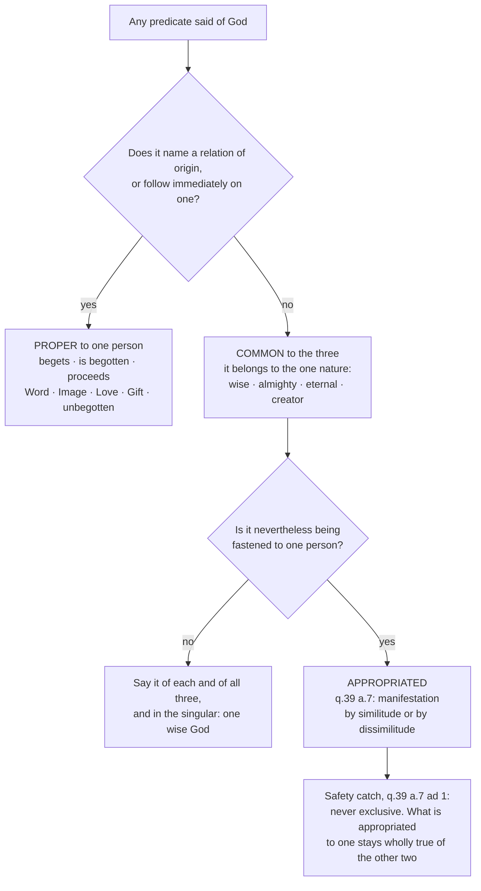

# The Triune God · Lesson 4.5: What is common, what is proper, what is appropriated

> ⏱ ~15 min · Module 4: Processions, relations, persons · Builds on: [4.3](04-03-the-two-processions.md), [4.4](04-04-four-relations-three-persons.md) · Unlocks: [5.1](05-01-the-latin-doctrine.md), [6.1](06-01-the-missions-of-the-son-and-the-spirit.md)

## Why this matters

You now have three persons distinguished by nothing whatever except relative opposition ([4.4](04-04-four-relations-three-persons.md)). That settles what a person *is* and leaves a practical question wide open: of any sentence about God — God is merciful; the Spirit sanctifies; the Father is unbegotten — which of the three is it about, and why? Sort too generously and you get three specialists with three departments, which is tritheism with a friendly face. Sort too timidly and the Son's mission tells you nothing about the Son. Nearly every bad sentence about the Trinity that survives into ordinary preaching is a sorting error, and Aquinas spends ten questions (ST I qq.33-42) on the sorting.

## The idea

[Three boxes](../reference.md#common-proper-and-appropriated), and every predicate of God goes in exactly one.

**Common** — the tradition says *essential*. True of each person and of the three together, because it belongs to the one nature: wise, almighty, eternal, merciful, creator. Not shared out in thirds; each person is the whole of it.

**Proper** — *personal*, or *notional*. True of one person and impossible of the others, because it is a relation of origin, or follows immediately on one: the Father begets, the Son is begotten, the Spirit proceeds.

**Appropriated** — a *common* attribute assigned to one person anyway, not because it is his alone but because it resembles what is his alone. Power to the Father, wisdom to the Son, goodness to the Spirit.

The sorting rule is one line, and it is [4.4](04-04-four-relations-three-persons.md)'s line: in God nothing distinguishes but relative opposition — everything is one where no opposition of relation stands in the way (Florence, decree for the Jacobites). So **whatever is not a relation of origin is common**, without exception. A predicate fastened to one person that is *not* a relation of origin is therefore being fastened for some other reason, and appropriation is the name of that reason.

The [proper names](../reference.md#the-proper-names-of-the-persons) Aquinas argues for one at a time, each defended as proper and not merely appropriated:

| Person | Proper names | Article |
|---|---|---|
| Father | principle without principle; unbegotten (*innascibilitas*) | q.33 a.1; q.33 a.4 |
| Son | Word; Image | q.34 a.2; q.35 a.2 |
| Spirit | Love; Gift | q.37 a.1; q.38 a.2 |

Watch the trap built into the table. "Love" and "Word" are also said of God *essentially* — God is love, God knows himself — and said that way they are common to the three. Each of those articles asks whether the name can *also* be said personally, and answers yes. The same word lands in two different boxes depending on how it is said.

## Source

ST I q.39 a.7, "Whether the essential names should be appropriated to the persons?" — the *respondeo*, abridged, with the first reply (English Dominican Province):

> For the manifestation of our faith it is fitting that the essential attributes should be appropriated to the persons. For although the trinity of persons cannot be proved by demonstration ... nevertheless it is fitting that it be declared by things which are more known to us. ... And such a manifestation of the divine persons by the use of the essential attributes is called "appropriation." The divine person can be manifested in a twofold manner by the essential attributes; in one way by similitude ... in another way by dissimilitude; as power is appropriated to the Father, as Augustine says, because fathers by reason of old age are sometimes feeble; lest anything of the kind be imagined of God.
>
> **Reply to Objection 1.** The essential attributes are not appropriated to the persons as if they exclusively belonged to them; but in order to make the persons manifest by way of similitude, or dissimilitude.

Three things are decided here. [Appropriation](../reference.md#appropriation) is a device of **manifestation**, not of attribution: its job is to make persons we cannot demonstrate visible through attributes we can reason about. It works in **two directions** — by likeness (intellect to the Son, who proceeds as Word) and by *un*likeness (power to the Father, precisely because human fathers grow feeble and the image needs correcting). And the reply is the whole safety catch: **never exclusive**. Whatever is appropriated to one remains wholly true of the other two.

## The argument

1. **Real distinction in God comes only from relative opposition** ([4.4](04-04-four-relations-three-persons.md); Florence). *In words:* the only thing that can make one person not another is standing at the opposite end of an origin.
2. **Therefore every perfection of the nature is common.** *In words:* if being wise or almighty distinguished a person, it would be a fourth kind of distinction, and there is none.
3. **Therefore every work toward creatures is common too.** One nature, one power, one operation; so the three are not three principles of the creature but one principle (Florence, decree for the Jacobites, this lesson's rendering of the Latin; CCC 258 quotes the sentence). Augustine had laid the rule down long before (*De Trinitate* I.4.7): the three being indivisible, they work indivisibly — and his very next chapter asks how, working indivisibly, they yet do some things severally. The scholastic tag is *opera Trinitatis ad extra indivisa sunt*, [the undivided outward works](../reference.md#the-undivided-outward-works). Its ancestor is Gregory of Nyssa's argument from the single divine operation in *To Ablabius*, which [`patristics` 3.3](../../patristics/lessons/03-03-the-two-gregories.md) reads as a Father arguing *toward* an axiom that arrives later — the argument is fourth-century, the axiom's formula is not.
4. **But scripture and the creed do parcel out the works.** The Father is creator of all things visible and invisible; through the Son all things were made; the Spirit is Lord and giver of life. If each clause named a work proper to one person, premise 2 collapses and you have three agents.
5. **So the parcelling is of another kind: appropriation** (q.39 a.7). *In words:* the creed is teaching you to recognize the persons, not dividing the labour.
6. **And it is not arbitrary.** The appropriated attribute is chosen by its likeness to what is proper — wisdom to the Son because a word is just the concept of wisdom; goodness to the Spirit because goodness is what love is love *of* (q.39 a.8, where Aquinas sorts three separate traditional schemes, Hilary's and Augustine's among them).
7. **Nor is the undivided work undifferentiated.** Each person performs the one common work *according to his own personal property* (CCC 258): the Father makes the creature through his Word and through his Love, so the order of the processions is really present in the work without splitting it (q.45 a.6).

One more support, easy to skip and load-bearing. The persons are not merely co-workers on one job; each is *in* the others. ST I q.42 a.5 argues it three ways — by essence, by relation, and by origin — the last being the cleanest: the word conceived does not leave the mind that conceives it. The Greek tradition calls this [mutual indwelling](../reference.md#mutual-indwelling) *perichoresis*, the Latin *circumincessio*. One operation is not a coincidence of three wills; it follows on three who are never outside one another.

## The rule

## Worked examples

**Example 1 — the clean case: "the Son is Wisdom."** Run the tree. Does wisdom name a relation of origin? No — so it is common, and the Father is wise, the Spirit is wise, and the three are one wise God, in the singular (q.39 a.3). Is it being fastened to the Son anyway? Yes, and scripture does it first: Christ the power of God and the wisdom of God (1 Corinthians 1:24, the *sed contra* of q.39 a.7). So: appropriated, by similitude — the Son proceeds by way of intellect ([4.3](04-03-the-two-processions.md)), and a word is the concept of wisdom.

Now the safety catch, and this is the sentence worth memorizing. Aquinas, citing Augustine, insists the Father is **not** wise by the wisdom he begets (q.39 a.7 ad 2). If he were, one person would stand to another as form to subject, the Father would be wise by something received, and the Son would be the Father's wisdom in the way a quality is a man's. Each is of himself wisdom, and both together are one wisdom. "The Son is Wisdom" is true twice over: proper if it means the Word proceeding as the Father's concept, appropriated if it means the divine attribute.

**Example 2 — where it strains: creation.** Here the appropriation has a real foothold, and both the crude readings fail. Say the Father is *the* creator and you have contradicted q.45 a.6, which reasons that since every agent produces its like, and creation produces *being*, its principle must be the divine essence, common to the three. Say instead that the creed's three clauses are merely decorative and you have contradicted premise 7: the persons do have a causality in creation according to their processions, the Father acting through Word and Love, and even the *power* of creating is one but possessed in order — the Son having it from the Father, the Spirit from both (q.45 a.6 ad 2). The truth is two-layered, and only the second layer is appropriation.

The genuine exception is worth flagging now because [6.1](06-01-the-missions-of-the-son-and-the-spirit.md) lives on it. Only the Son became man. The whole Trinity effects the Incarnation, and the union is the Son's alone — so a mission is *not* just an appropriation, and the rule about undivided works has to be stated carefully enough to let that through.

## Watch out

- **You might think an appropriation tells you which person did which bit.** It tells you nothing of the kind: the attribute stays wholly true of the other two (q.39 a.7 ad 1). Preaching an appropriation as a property — handing each person a department and a job title — produces three cooperating agents, which is **tritheism**, and it is the single most common error in catechesis about the Trinity. The correction is premise 3, in the conciliar form: not three principles of the creature but one principle.
- **You might over-correct into the opposite error.** If the persons make no difference at all to what God does toward us, the economy becomes uninformative and the three names are three masks on one actor — **modalism**, and the complaint [6.3](06-03-rahners-rule-and-the-immanent-trinity.md) takes up under Rahner's name. Premise 7 is what keeps both doors shut.
- **Innascibility is not a rank.** That the Father is unbegotten (q.33 a.4) is proper to him and marks an order of origin, not a degree of divinity; reading it as superiority is **subordinationism** in one step.
- **Do not promote the apparatus.** That the Father begets the Son is defined in the creeds. That there are five notions, that power is appropriated to the Father, that the Son proceeds by way of intellect — these are the Latin tradition's explanation, and Aquinas says so himself (q.32 a.4). Levels come from [`fundamental-theology` 4.4](../../fundamental-theology/lessons/04-04-the-ladder-of-doctrinal-authority.md), and promoting the explanation is as much an error as demoting the dogma.

## One-liner

> Only relations of origin distinguish, so everything else is common — and an appropriation is a common thing lent to one person to make him visible, never given to him to keep.

## Problems

**P1 (🟢) *(Exegetical.)*** ST I q.45 a.6, "Whether to create is proper to any person?" (English Dominican Province), abridged:

> **Objection 2.** Further, the divine Persons are distinguished from each other only by their processions and relations. ... But the causation of creatures is diversely attributed to the divine Persons; for in the Creed, to the Father is attributed that "He is the Creator of all things visible and invisible"; to the Son is attributed that by Him "all things were made"; and to the Holy Ghost is attributed that He is "Lord and Life-giver." Therefore the causation of creatures belongs to the Persons according to processions and relations.
>
> **I answer that,** To create is, properly speaking, to cause or produce the being of things. And as every agent produces its like, the principle of action can be considered from the effect of the action ... And therefore to create belongs to God according to His being, that is, His essence, which is common to the three Persons. Hence to create is not proper to any one Person, but is common to the whole Trinity. Nevertheless the divine Persons, according to the nature of their procession, have a causality respecting the creation of things.

(a) Which words of the *respondeo* carry the denial, and what premise licenses them? (b) The last sentence grants the persons a causality in creation. In **two sentences**: what does it add, and why is it not a retraction of (a)?

**P2 (🟡) *(Exegetical.)*** An invented parish-bulletin paragraph, written for this problem:

> "The Father is majesty, the Son is mercy, and the Spirit is the Church's energy — the power that gets things done. A parish that feels tired has lost contact with the third person, whose department is enthusiasm. The Father and the Son have finished their work; this is the Spirit's age, and he is in charge of it now."

(a) One kind of error runs through the paragraph twice — once about attributes, once about actions. Name the kind, say where each form of it falls, and give the rule and the text that correct it. (b) One phrase commits a different error, about what a divine person *is*. Name it. (c) In one sentence, say what the writer could legitimately have kept. **150 words or fewer in total.**

**P3 (🔴, optional) *(Exegetical.)*** ST I q.32 a.4 asks whether contrary opinions about the notions are permissible, and answers *sed contra* with one flat sentence: "The notions are not articles of faith." A reader concludes that the whole apparatus of this module is furniture, so "the Father begets the Son" is a school opinion like any other.

(a) Place each claim on the ladder of [`fundamental-theology` 4.4](../../fundamental-theology/lessons/04-04-the-ladder-of-doctrinal-authority.md), **naming the act that fixes the level**: (i) the Son is begotten of the Father; (ii) there are five notions in God; (iii) power is appropriated to the Father. **One sentence each.** (b) Name the reader's conflation, in one sentence.

Solutions

**P1** *(Exegetical — strict.)*

**Must hit, strict (a):** the carrying words are "to create belongs to God according to His being, that is, His essence, which is common to the three Persons. Hence to create is not proper to any one Person, but is common to the whole Trinity." The licensing premise is stated just before: **every agent produces its like, so the principle of an action is read off its effect** — creation's effect is *being* itself, so its principle is the divine *esse*, which is the common essence and not any relation of origin.

**Must hit, strict (b):** it adds that the persons act in creation **according to their processions** — the Father producing the creature through his Word and through his Love, so the processions are the type of the production. It is not a retraction because what is proper supplies the *order and manner* within one operation, not a separate operation: the power of creating is one and is possessed in order, the Son having it from the Father and the Spirit from both (ad 2), which is also why the creed's three clauses are appropriations rather than three jobs.

**Wrong turns:** taking objection 2's creed clauses at face value as proper works — they are the objection, and the *respondeo* denies them that status; concluding that the persons make no difference at all to creation, which contradicts the last sentence of the passage; reading "one principle" as "one person".

**Model answer:** (a) "To create belongs to God according to His being, that is, His essence, which is common to the three Persons. Hence to create is not proper to any one Person" — licensed by the principle that every agent produces its like, so an action's principle is read from its effect, and creation's effect is being, which is the common essence. (b) It adds that the one act is performed according to the order of the processions, the Father creating through his Word and his Love. That is not a retraction, because the causality it grants belongs to the persons within a single operation whose power is one, received in order, and it is exactly what makes the creed's three clauses fitting appropriations rather than three separate works.

---

**P2** *(Exegetical — strict.)*

**Must hit, strict (a):** the kind is **an appropriation preached as a property**. Majesty, mercy and power are perfections of the one nature, so each person is wholly majestic, wholly merciful, wholly powerful; the rule is that nothing distinguishes in God but relative opposition, so nothing but a relation of origin can be proper to one person. The text is q.39 a.7 ad 1 — the essential attributes are not appropriated as if they exclusively belonged to a person. "Department" and "in charge now" then commit the same error at the level of *action*, dividing the outward works against the conciliar rule that the three are not three principles of the creature but one principle (Florence, decree for the Jacobites; CCC 258; the ancestor of the axiom is Nyssa's single-operation argument, [`patristics` 3.3](../../patristics/lessons/03-03-the-two-gregories.md)). The result is **tritheism** — three agents with three jobs — and "the Father and the Son have finished their work" adds a succession of ages, which the mutual indwelling of q.42 a.5 and the missions of [6.1](06-01-the-missions-of-the-son-and-the-spirit.md) both rule out: a mission does not retire the sender.

**Must hit, strict (b):** "energy — the power that gets things done" (equally "enthusiasm") makes the Spirit an impersonal force. The Spirit's proper names are **Love** and **Gift**, and both are argued as names of a *person* (q.37 a.1; q.38 a.2); *power*, in any case, is what the tradition appropriates to the Father (q.39 a.8). Depersonalizing the Spirit is the old Pneumatomachian instinct that the creed of 381 answers by adoring him with the Father and the Son ([3.3](03-03-constantinople-i-and-the-divinity-of-the-spirit.md)).

**Wrong turns:** calling the paragraph modalist — it errs in the opposite direction, multiplying agents rather than collapsing them; rejecting appropriation as such, when q.39 a.7 calls it fitting and the creed itself does it; treating "energy" as merely bad style rather than a category mistake.

**Model answer:** The first two sentences preach appropriations as properties. Majesty, mercy and power are common to the one nature, so each person has all of them wholly; only a relation of origin can be proper to one (q.39 a.7 ad 1). Giving each a department divides the outward works, against the rule that the three are one principle of the creature, not three (Florence's decree for the Jacobites, quoted at CCC 258) — the error is tritheism, dressed as piety, and "the Father and the Son have finished their work" adds a succession the mutual indwelling forbids. Calling the Spirit "energy" is a second, different error: it makes a person into a force, when Love and Gift are the proper names of someone. What could be kept: the Spirit may be named in the sanctifying of the parish as the creed names him, said as an appropriation and not as his private assignment.

---

**P3** *(Exegetical — strict. Overstating or understating any level is the error.)*

**Must hit, strict (a):**
- (i) **Rung 1.** The act is a solemn profession of an ecumenical council — the creed of Nicaea (325), reaffirmed at Constantinople (381) — proposing it as the faith of the Church; obstinate denial after baptism is heresy.
- (ii) **Below the seam, rung 5.** No magisterial act proposes a count of five notions; it is Aquinas's own reckoning in q.32 a.3, and a.4 of the same question explicitly permits contrary opinions provided nothing against faith follows.
- (iii) **Also below the seam.** No act proposes it; q.39 a.8 presents it as the holy doctors' *fitting* appropriation, argued from likeness and unlikeness. Rung 5, or rung 4 if the doctors' agreement is weighed as common teaching — either passes provided the answer says plainly that no magisterial act proposes it.

**Must hit, strict (b):** he has conflated the dogma with the vocabulary that explains it. The notions *count and name* distinctions the creeds already confess; the counting and naming are theology, while what is counted — that the Father begets and the Son is begotten — is defined. Aquinas's own sentence says the notions are not articles of faith; it does not say the Trinity is not.

**Wrong turns:** putting (ii) or (iii) at rung 3 because Aquinas is a Doctor of the Church — a Doctor's title is not a magisterial act, and nothing he wrote becomes Church teaching by his standing; putting (i) at rung 2 on the ground that the *word* "begotten" is technical; reading q.32 a.4 as licence to hold contrary opinions about the persons, when the article restricts the permission to the notions and withdraws it the moment consequences against faith are seen.

**Model answer:** (i) Rung 1 — professed by the creed of 325 and reaffirmed at 381, an ecumenical council's solemn act proposing it as revealed; obstinate denial is heresy. (ii) Rung 5 — no magisterial act fixes the number; it is q.32 a.3's reckoning, and q.32 a.4 permits contrary opinions about it. (iii) Rung 5 (rung 4 if the doctors' consensus is counted as common teaching) — q.39 a.8 offers it as a fitting appropriation of the holy doctors, and no act proposes it. (b) He has confused the explanation with what it explains: the notions are the tradition's way of counting distinctions the creeds already confess, so their optional status says nothing about the begetting they are counting.

## Flashback

**From Lesson [4.3](04-03-the-two-processions.md) (The two processions):** *(Exegetical.)* ST I q.27 a.2 asks whether any procession in God can be called generation, and answers that the procession of the Word is. Reconstruct that *respondeo* in numbered premises and a conclusion — **five premises or fewer** — and then name in one clause the single premise carried by divine simplicity rather than by the analysis of the word "generation".

Solution

**Must hit, strict:** premises of this shape, in any wording.

- **P1.** "Generation" has two senses: one common to whatever is subject to generation and corruption, in which it is nothing but change from non-existence to existence; one proper to living things, the origin of a living being from a conjoined living principle, which is properly birth.
- **P2.** Not everything of that second kind is *begotten*. Only what proceeds by way of similitude, and the likeness must be in the same specific nature: a hair has not the aspect of generation and sonship, and a worm bred from an animal has only a generic likeness, whereas man proceeds from man and horse from horse.
- **P3.** In God nothing passes from potentiality to act, so the first sense is excluded outright and only the second is in question.
- **P4.** The procession of the Word meets the second sense on every mark: it is an intelligible action, which is a vital operation; from a conjoined principle; by way of similitude, since the concept of the intellect is a likeness of the object conceived; and in the same nature, because in God the act of understanding and his existence are the same.
- **∴ C.** The procession of the Word in God is generation, and the Word proceeding is called Son.

**The premise carried by simplicity:** the fourth mark of P4 — that in God understanding and existing are the same ([1.3](01-03-simplicity-as-doctrine.md)) — which is what lifts the Word into the *same nature* and is the one mark our own inner word fails. Credit also for P3, which excludes the first sense because there is no potency in God.

**Wrong turns:** listing the four marks without P1 and P3 — the article's whole strategy is to split the word first, and the Word's procession counts as generation in one sense precisely because it cannot be generation in the other; treating likeness as enough, when the worm has a likeness and is not begotten; supporting the same-nature mark from the human inner word, which is the case that fails it, since a man's act of understanding is not the substance of his intellect; arguing from the name "Son" in scripture instead of from the argument, which is what the *sed contra* (Psalm 2:7) is for.

**Model answer:** P1, "generation" means either change from non-existence to existence, common to what is generated and corrupted, or the origin of a living thing from a conjoined living principle. P2, and of that second kind only what proceeds by way of similitude in the same specific nature is *begotten* — not a hair, not a worm with a merely generic likeness, but man from man. P3, in God there is no passage from potency to act, so the first sense is excluded entirely. P4, the Word's procession is a vital operation, from a conjoined principle, by way of similitude since a concept is a likeness of what is conceived, and in the same nature, because God's act of understanding is his existence. Therefore it is generation, and the Word is Son. The premise carried by simplicity is the last: the identity of understanding and being in God.

## Connections

- **Backward:** [4.4](04-04-four-relations-three-persons.md) supplied the only sorting rule there is — distinction by relative opposition alone — and this lesson is that rule applied to every remaining predicate. [4.3](04-03-the-two-processions.md) supplied the processions that make the appropriations non-arbitrary: wisdom goes to the Son because he proceeds by way of intellect. [`patristics` 3.3](../../patristics/lessons/03-03-the-two-gregories.md) has the ancestor of the undivided-works axiom in Nyssa's *To Ablabius*, and says plainly that the argument comes first and the axiom later. [`thomistic-synthesis` 3.4](../../thomistic-synthesis/lessons/03-04-divine-simplicity-and-the-attributes.md) is why the common box is so large: with no composition in God, no attribute can belong to a part.
- **Forward:** [5.1](05-01-the-latin-doctrine.md) needs the same conciliar sentence about one principle, this time for the Father and the Son spirating the Spirit. [6.1](06-01-the-missions-of-the-son-and-the-spirit.md) takes the one genuine qualification of the undivided works — the Incarnation is effected by the three and the union is the Son's alone. [6.3](06-03-rahners-rule-and-the-immanent-trinity.md) presses the opposite worry: whether a doctrine this careful about undivided works can let the economy say anything about the persons at all.
- **Sideways:** [`ecclesiology-and-mariology`](../../ecclesiology-and-mariology/syllabus.md) inherits this lesson's rule when it speaks of the Spirit and the Church, which is the setting in which appropriations most often harden into properties; [`fundamental-theology` 4.4](../../fundamental-theology/lessons/04-04-the-ladder-of-doctrinal-authority.md) supplies every level used above. See the course [syllabus](../syllabus.md) for what Module 4 owns and what it cedes.
