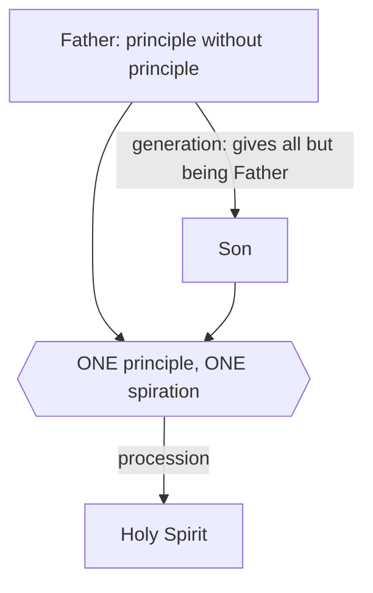

# The Triune God · Lesson 5.1: The Latin doctrine

> ⏱ ~15 min · Module 5: The filioque · Builds on: [4.4 Four relations, three persons](04-04-four-relations-three-persons.md), [4.5 What is common, what is proper, what is appropriated](04-05-common-proper-appropriated.md) · Unlocks: [5.2 The Greek doctrine, and the history of the addition](05-02-the-greek-doctrine-and-the-addition.md)

## Why this matters

One word gets added to a creed, and a thousand years of separation follow it. Before anyone can ask whether the separation was necessary — that is [5.2](05-02-the-greek-doctrine-and-the-addition.md) and [5.3](05-03-the-clarifications.md) — someone has to say precisely what the Latin word claims. Most of the heat comes from claims the West does not make: that the Spirit has two sources, that he is breathed twice, that the Father is now first among equals. So half of this lesson is the doctrine and its argument, and half is the denials. Get the denials wrong and the next two lessons are unreadable.

## The idea

The West holds that the Holy Spirit's **eternal** origin is from the Father *and the Son*. Not two wells. The claim is that the Father and the Son are **one single source of the Spirit, breathing once**, and that the Son is inside that source only because the Father put him there. Everything the Father has, he gives to the Son in begetting him, except being Father; and among the things given is that the Spirit proceeds from the Son too. So the doctrine does not set up a rival origin beside the Father. It says the one origin works through what it has handed over.

Two levels, and keep them apart. **Defined**, on rung 1 of the ladder ([`fundamental-theology`](../../fundamental-theology/lessons/04-04-the-ladder-of-doctrinal-authority.md)): that [the Spirit proceeds eternally from the Father and the Son](../reference.md#procession-from-the-father-and-the-son), as from one principle, by a single spiration — fixed by two ecumenical councils, Lyons II (1274) and Florence (1439), each in a definitional act. **Not defined**: the Latin argument for it from [relative opposition](../reference.md#relative-opposition), the common doctor's and still a school explanation. Promoting that argument to dogma is the same size of mistake as demoting the definition to opinion.

## Source

John 15:26 (Douay-Rheims), the verse the whole argument is anchored to:

> But when the Paraclete cometh, whom I will send you from the Father, the Spirit of truth, who proceedeth from the Father, he shall give testimony of me.

Read what is there. The Son **sends**; the Spirit **proceeds from the Father**. The verse does not say the Spirit proceeds from the Son. The West's move is an inference from sending, and from three further texts: the Spirit "shall receive of mine," followed at once by "All things whatsoever the Father hath, are mine" (John 16:14-15); "the Spirit of Christ" (Romans 8:9); "God hath sent the Spirit of his Son into your hearts" (Galatians 4:6). The Son sends him, he is called the Son's own Spirit, and what he takes and gives is the Son's.

Be honest, because [5.2](05-02-the-greek-doctrine-and-the-addition.md) will press it: no text in the New Testament states that the Spirit's eternal origin is from the Son. The West reads these texts as disclosing the eternal relation in the temporal one. A Greek theologian reads the same texts and hears only the mission. The Greek verb standing under "proceedeth" here is the one word that carries most of the dispute, and it gets its own treatment in the next lesson.

## The argument

**Augustine supplies the shape** (*De Trinitate* XV.17.29, Haddan's translation):

> God the Father alone is He from whom the Word is born, and from whom the Holy Spirit principally proceeds. And therefore I have added the word principally, because we find that the Holy Spirit proceeds from the Son also. But the Father gave Him this too... whatever He gave to the only-begotten Word, He gave by begetting Him.

*In words:* the Spirit comes from the Father [principally](../reference.md#principally-from-the-father) — *principaliter* — and from the Son derivatively, because the Son's power to spirate is itself part of what being begotten gave him. Augustine repeats the point at XV.26.47: the Father "has given to the Son that the same Holy Spirit should proceed from Him."

**Aquinas turns it into a proof.** ST I q.36 a.2 argues that the Spirit *must* be from the Son, on pain of losing the Trinity. Reconstructed:

1. The divine persons cannot be distinguished by anything said of God absolutely, since whatever is said absolutely belongs to the one essence ([1.3](01-03-simplicity-as-doctrine.md)).
2. Therefore they are distinguished **only by relations** ([4.4](04-04-four-relations-three-persons.md)).
3. Relations distinguish persons only when they are **opposed**. Evidence from within the doctrine: the Father bears two relations, one to the Son and one to the Spirit, and because these are not opposed to each other they do not make two Fathers.
4. Suppose the Spirit did not proceed from the Son. Then Son and Spirit each bear only a relation to the Father, and those two relations are not opposed to each other.
5. By (3), unopposed relations do not distinguish. So Son and Spirit would be one person — exactly as the Father's two unopposed relations leave him one person.
6. That conclusion destroys the faith in the Trinity, so (4) is false.
7. The only relations that can be opposed in God are **relations of origin**: principle, and what is from the principle.
8. So either the Son is from the Spirit — which no one holds — or the Spirit is from the Son.

*In words:* in a God with no composition, the only thing left to tell two persons apart is which came from which. Take away the Son's part in the Spirit's origin and there is nothing left to tell the Son and the Spirit apart — they fuse.

Aquinas adds two confirmations, not proofs. The **order of the processions**: the Son proceeds as Word, the Spirit as Love ([4.3](04-03-the-two-processions.md)), and love proceeds from a word, since we love nothing we have not first conceived. And the **order of nature**: two things never come from one without some order between them, except where they differ merely by matter.

**The councils define the doctrine, not the argument.** Lyons II's constitution on the procession of the Holy Spirit (the lesson's own translation; no public-domain English exists):

> *Fideli ac devota professione fatemur quod spiritus sanctus aeternaliter ex patre et filio, non tanquam ex duobus principiis sed tanquam ex uno principio, non duabus spirationibus sed unica spiratione procedit.*

"With faithful and devoted profession we confess that the Holy Spirit proceeds eternally from the Father and the Son, not as from two principles but as from one principle, not by two spirations but by a single spiration." The same constitution then condemns two errors by name: denying that the Spirit proceeds eternally from the Father and the Son, **and** asserting that he proceeds from them *tanquam ex duobus principiis* — as from two principles. Both are ruled out by the same act.

Florence's *Laetentur Caeli* defines the same thing and adds the hinge (again the lesson's own translation): the Spirit has his essence and his subsistent being from the Father and the Son together, and proceeds from both eternally *tanquam ab uno principio et unica spiratione* — as from one principle and by a single spiration. It glosses the Fathers' phrase "from the Father **through** the Son" as meaning that the Son too is what the Greeks call *cause* and the Latins call *principle* of the Spirit's subsistence; and it makes Augustine's point doctrine: everything that is the Father's, the Father gave his only-begotten Son in begetting him, except being Father — so the Son has from the Father, eternally, that the Spirit proceeds from him.

## The rule

The Son sits inside the box only because of the arrow above him. Read from the diagram what the doctrine denies:

- **Not two principles.** There is one box, not two. Lyons II condemns the "two principles" formula explicitly.
- **Not two spirations.** [One spirative power](../reference.md#one-principle-and-one-spiration), in one act. Two acts would make the Spirit doubly caused, and a composite God ([1.3](01-03-simplicity-as-doctrine.md)).
- **Not two spirators.** Aquinas is willing to say Father and Son are "two spirating" — an adjective takes its number from the persons — but not "two spirators," since the noun takes its number from the one form it names (q.36 a.4).
- **Not a diminished Father.** The Father remains [principle without principle](../reference.md#principle-without-principle), the only one from no one. The Son's share in the spiration is itself the Father's gift, which is the whole work done by Augustine's *principaliter*.

## Worked examples

**Example 1 — the machinery on a clean case: "the Spirit of his Son" (Galatians 4:6).** Sort the predicate first ([4.5](04-05-common-proper-appropriated.md)). Is "of the Son" common, proper, or appropriated? It is **proper**, and it names an origin — a genitive of source, as "Son of the Father" is. Now the chain the West runs. The verse reports a **mission**: God sends the Spirit of his Son into hearts. A mission is an eternal procession plus a new presence in a creature ([6.1](06-01-the-missions-of-the-son-and-the-spirit.md)), and the sender is the one from whom the sent person proceeds. So if the Spirit is sent as the Son's, the Son is among those from whom he proceeds — and since nothing in God is new, that relation is eternal. The weight rests not on the verse but on the rule linking mission to procession: deny the rule and the verse says only that the Spirit is given by Christ in time.

**Example 2 — the hard case: "from the Father alone."** Fathers and liturgies say the Spirit proceeds from the Father, sometimes with an exclusive word attached. Does that contradict the doctrine? Aquinas's answer (q.36 a.2, reply to the first objection) is a rule about how exclusive words work: it is a rule of scripture that what is said of the Father applies to the Son even with an exclusive term added, **except** where the opposed relations that distinguish them are concerned. Being the principle of the Spirit is not something Father and Son are opposed in — they are opposed only as Father and Son. So "alone" does not reach it, any more than "no one knoweth the Son but the Father" excludes the Son's knowledge of himself.

That is elegant, and it is where the analysis strains. The rule tells you how a *Latin* sentence behaves; it does not tell you what a *Greek* sentence means. The Greek tradition's word for the Spirit's coming-forth is narrower than the Latin *procedere*, and on that reading "from the Father alone" is not a loose formula waiting to be tidied but a precise claim about the sole cause. That is the real question of [5.2](05-02-the-greek-doctrine-and-the-addition.md), and this course settles nothing about it here.

## Watch out

- **"The Father and the Son are two sources who pool their effort."** That is the formula Lyons II condemns, not the doctrine it defines. It also wrecks [simplicity](01-03-simplicity-as-doctrine.md): a Spirit assembled from two contributions is a composite, and a God with parts is not the God of Lateran IV. This is the tritheist ditch, entered through arithmetic rather than through the word "gods."
- **"The Son is a secondary cause, an instrument the Father spirates through."** Aquinas rules this out directly: if the Son had a *numerically distinct* spirative power he would be a secondary and instrumental cause, and the Spirit would proceed more from the Father than from the Son (q.36 a.3). The power is one and the same. The error is plain subordinationism.
- **"The nature spirates."** If you locate the one principle in the divine essence rather than in the Father and the Son as possessing one spirative power, the Spirit proceeds from himself, since he is that essence. The persons become three faces of an acting essence — modalism, arrived at by trying to protect unity.
- **"The relative-opposition argument is the dogma."** It is not. It is the Latin school's explanation, held with the respect due a strong theological consensus and no more. A Catholic may find it unpersuasive and still hold everything Lyons II and Florence define — which is precisely the space [5.3](05-03-the-clarifications.md) works in.

## One-liner

> The West does not add a second source beside the Father: it says the one source gave the Son everything except being the source, and the Spirit comes forth from what was given, once.

## Problems

**P1 (🟢) *(Exegetical.)*** ST I q.36 a.4, *respondeo* (English Dominican Province), on whether the Father and the Son are one principle of the Holy Ghost:

> The Father and the Son are in everything one, wherever there is no distinction between them of opposite relation. Hence since there is no relative opposition between them as the principle of the Holy Ghost it follows that the Father and the Son are one principle of the Holy Ghost.

(a) Which words state the general rule, and which words state the particular fact the rule is applied to? (b) In one sentence, name the earlier rule from [4.4](04-04-four-relations-three-persons.md) that this passage is a special case of.

**P2 (🟡) *(Exegetical.)*** An invented paragraph from a parish bulletin explaining the creed:

> "When we say the Spirit proceeds from the Father and the Son, we mean the Spirit is what the Father and the Son have in common — the love that passes between them. He depends on both equally, and so, unlike the Son, he has two origins rather than one. That is why the creed puts him last: he is the one person who needs the other two in order to be."

Name the two distinct errors, say for each which text corrects it, and say what true thing the paragraph was reaching for. 150 words or fewer.

**P3 (🔴) *(Exegetical.)*** Assign a level on the ladder to each claim below, and **name the act that fixes it**. One line each; do not use the subject matter to decide, use the act.

(a) The Holy Spirit proceeds eternally from the Father and the Son as from one principle and by a single spiration.
(b) If the Spirit did not proceed from the Son, the Son and the Spirit would not be personally distinct.
(c) The Father and the Son may be called "two spirating" but not "two spirators."

Solutions

**P1** *(Exegetical — strict.)*

**Must hit, strict (a):** The **rule** is "The Father and the Son are in everything one, wherever there is no distinction between them of opposite relation" — the operative words are *in everything one* and *no distinction of opposite relation*. The **particular fact** is "there is no relative opposition between them as the principle of the Holy Ghost": being the principle of the Spirit is not a respect in which Father and Son stand opposed, since their opposition is paternity against filiation. The conclusion follows by applying the first to the second.

**Must hit, strict (b):** it is a special case of the rule that in God the persons are distinguished **only** by opposed relations of origin, so that everything not carrying such an opposition is common to them ([4.4](04-04-four-relations-three-persons.md); Florence's sentence on the opposition of relation, [3.4](03-04-the-latin-rules-of-speech.md)).

**Wrong turns:** reading "in everything one" as "one person" — it is a statement about what is common, and the opposed relations are precisely what it exempts. Treating "one principle" as meaning the divine essence is the principle; the passage locates it in the Father and the Son, who are one *here* because unopposed *here*.

**Model answer:** (a) Rule: "in everything one, wherever there is no distinction... of opposite relation." Fact: as principle of the Spirit, Father and Son are not relatively opposed. (b) It is the general Trinitarian rule that only opposed relations of origin distinguish, applied to spiration.

---

**P2** *(Exegetical — strict.)*

**Must hit, strict:**
- **Two origins.** "He has two origins rather than one" is the formula Lyons II condemns by name — the Spirit proceeds from the Father and the Son *not as from two principles but as from one principle*, and not by two spirations but by a single spiration. The bulletin has stated the condemned proposition, not the defined one.
- **A dependent, lesser Spirit** — "the one person who needs the other two in order to be," with "that is why the creed puts him last." This makes procession a deficiency and the Spirit a third-rank person: subordinationism. The persons are wholly equal and are distinguished only by origin ([4.4](04-04-four-relations-three-persons.md)); the creed's order is the order of origin, not of dignity. Credit also for catching that "what the Father and the Son have in common" drifts toward making the Spirit the *essence* rather than a person, which is the "the nature spirates" error.
- **What it was reaching for:** the genuine Latin teaching that the Spirit proceeds by way of will as Love ([4.3](04-03-the-two-processions.md)), and that he proceeds from Father and Son *together* — which the tradition states as one principle and one spiration, with the Son holding the spirative power as the Father's gift (Augustine's *principaliter*; Florence).

**Wrong turns:** calling the whole paragraph modalist — Love is a *proper* name of the Spirit in the Latin tradition, not an appropriation, so "the love that passes between them" is legitimate as long as he remains a person; the sentence that actually fails is "two origins." Also: objecting that a creature-like dependence is merely bad wording, when "two origins" is a defined error, not a clumsy phrase.

**Model answer:** Two errors. First, "two origins": Lyons II defines that the Spirit proceeds from Father and Son as from one principle, by a single spiration, and expressly condemns the two-principles formula. Second, treating the Spirit as needy and therefore last: procession is not deficiency, the persons are equal, and creedal order tracks origin, not rank — subordinationism. The paragraph is reaching for something true, that the Spirit proceeds as Love from the Father and the Son together; the tradition holds that by saying the Father gave the Son the one spirative power in begetting him, so that the two spirate as one principle and the Father remains the source from whom all is given.

---

**P3** *(Exegetical — strict. Overstating or understating a level is the error here.)*

**Must hit, strict:**
- (a) **Rung 1, defined dogma.** The act: definitional acts of two ecumenical councils — Lyons II's constitution on the procession of the Holy Spirit (1274) and Florence's *Laetentur Caeli* (1439), which defines that this truth be believed by all Christians. Lyons II also attaches a condemnation to the contrary.
- (b) **Rung 4, theologically certain / common teaching.** The act: none. This is ST I q.36 a.2's argument, the Latin school's explanation, carried by the common doctor and by the tradition following him. No council defines the inference — the councils define the conclusion about the procession, not the argument from relative opposition.
- (c) **Rung 5, freely disputed.** The act: none. It is a point of theological grammar, and Aquinas reports it as contested and argues for his preference rather than asserting it ("some say... it seems, however, better to say," q.36 a.4, reply to the seventh objection).

**Wrong turns:** promoting (b) to rung 1 because it appears in the *Summa* and is universally taught in the Latin manuals — universality of a school's explanation is not a magisterial act. Demoting (a) to rung 4 because the Greek tradition does not receive the formula; reception by a party is not what fixes a level. Treating (c) as dogma because it uses conciliar vocabulary.

**Model answer:** (a) Rung 1 — defined by Lyons II and by Florence's *Laetentur Caeli*, with a condemnation attached at Lyons. (b) Rung 4 — Aquinas's explanation in q.36 a.2, common teaching, never defined. (c) Rung 5 — a disputed point of usage, which Aquinas argues for rather than asserts.

## Flashback

**From Lesson [4.4](04-04-four-relations-three-persons.md) (Four relations, three persons):** *(Exegetical.)* Three claims about paternity, the Father's relation to the Son. Say for each whether ST I q.28 a.2 licenses it or rules it out, with the reason in a clause; then say in one sentence what that article holds a relation in God *does* differ from the essence in. **Two sentences per item at most.**

(i) Paternity is really the same as the divine essence.
(ii) Paternity is in God as an accident is in its subject.
(iii) Paternity is assistant to the divine essence, affixed to it from outside.

Solution

**Must hit, strict (i):** **licensed** — whatever has an accidental existence in creatures has a substantial existence when transferred to God, since there is no accident in him and all in him is his essence; so a relation really existing in God has the existence of the divine essence. Paternity is not something the Father *has*.

**Must hit, strict (ii):** **ruled out**, by the very step that licenses (i): simplicity admits no accident in God ([1.3](01-03-simplicity-as-doctrine.md)), which is the premise from which the identity in (i) follows. Full credit sees that (ii) is not an independent error but the denial of (i)'s reason.

**Must hit, strict (iii):** **ruled out.** It is the position Aquinas reports of Gilbert de la Porrée — that the divine relations are assistant, or externally affixed — revoked, he says, at the council of Rheims. The diagnosis is that Gilbert considered relation in one mode only, as a regard tending to something outside, and left out how it *exists*; in God that existence is the essence.

**The one sentence:** they differ only in **mode of intelligibility** — the name "relation" expresses a regard to the opposite term, which the name "essence" does not express — and in reality relation and essence in God are one and the same.

**Wrong turns:** accepting (iii) on the ground that a relation looks outward and so cannot be the essence, which is exactly Gilbert's half-truth taken for the whole; rejecting (i) in order to protect simplicity, when the denial of accidents in God is what makes (i) follow; answering the last sentence with a small real difference, when the article's claim is that there is no difference in reality at all; deciding these by relative opposition, which is the next article's business and settles how paternity stands to filiation, not how it stands to the essence.

**Model answer:** (i) Licensed: no accident can exist in God, so a relation really in him has the existence of the divine essence — paternity is God. (ii) Ruled out, and for the same reason: an accident inheres in a subject, and there is nothing accidental in God. (iii) Ruled out as Gilbert de la Porrée's error, which he revoked at Rheims; he took relation only as a regard toward another and forgot that in God its existence is the essence. Relation and essence differ only in our mode of understanding them: "relation" names a regard to the opposite term and "essence" does not, and that is the whole difference.

## Connections

- **Backward:** this lesson is [4.4](04-04-four-relations-three-persons.md) cashed out. The rule that only opposed relations of origin distinguish the persons does no visible work until it is asked to decide something contested; here it decides the filioque. Florence's sentence on the opposition of relation ([3.4](03-04-the-latin-rules-of-speech.md)) is the same rule in conciliar words, and [4.5](04-05-common-proper-appropriated.md)'s sorting of predicates is what Example 1 runs.
- **Forward:** [5.2](05-02-the-greek-doctrine-and-the-addition.md) states the Greek doctrine on its own terms, beginning from the monarchy of the Father ([3.2](03-02-one-ousia-three-hypostaseis.md)) and from the Greek verb under John 15:26; [5.3](05-03-the-clarifications.md) asks what the modern clarifications claim is terminological. [6.1](06-01-the-missions-of-the-son-and-the-spirit.md) supplies the mission-to-procession rule that Example 1 leans on. The argued dispute with Orthodox theology belongs to [`apologetics-catholic-claims`](../../apologetics-catholic-claims/syllabus.md), not here.
- **Sideways:** the clause's actual history — Spain, Francia, its late acceptance at Rome, and 1054 — is [`church-history`](../../church-history/lessons/04-02-east-and-west-the-long-estrangement.md), which cedes the doctrine to this module. And the distinction that keeps the whole analysis from collapsing is [`thomistic-synthesis`](../../thomistic-synthesis/lessons/04-03-the-names-of-god.md)'s: relations said of God in q.13 a.7 are relations *of reason*, while the Trinitarian relations argued over here are **real** — which is exactly why they can distinguish persons.
