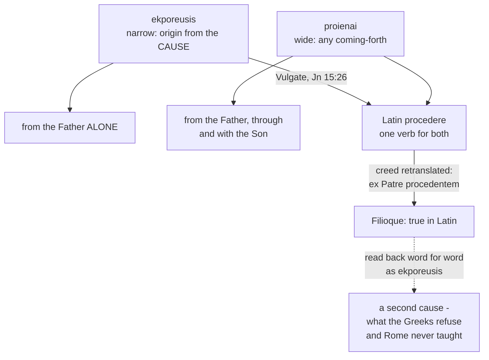

# The Triune God · Lesson 5.3: The clarifications

> ⏱ ~15 min · Module 5: The filioque · Builds on: [5.1](05-01-the-latin-doctrine.md), [5.2](05-02-the-greek-doctrine-and-the-addition.md), [3.3](03-03-constantinople-i-and-the-divinity-of-the-spirit.md) · Unlocks: [6.1](06-01-the-missions-of-the-son-and-the-spirit.md), [`apologetics-catholic-claims`](../../apologetics-catholic-claims/syllabus.md)

## Why this matters

Module 5 has put two doctrines on the table. [5.1](05-01-the-latin-doctrine.md) gave the Latin one — the Spirit proceeds from the Father and the Son as from one principle, defined at Lyons II and Florence. [5.2](05-02-the-greek-doctrine-and-the-addition.md) gave the Greek one as Greek theologians give it — the Father alone is the cause, and the Spirit comes from him through the Son. A reader who stopped there would have to guess whether the Church takes these for one faith in two languages or for two faiths.

Since 1995 there is an official Catholic answer, and it is more precise, and narrower, than partisans on either side would like. This lesson reads it, separates what it claims is terminological from what it does not concede, and hands the argued dispute to [`apologetics-catholic-claims`](../../apologetics-catholic-claims/syllabus.md). Two texts are in play with very different weights, and telling those weights apart is half the skill.

## The idea

One pair of verbs carries almost everything.

Greek has two words where Latin has one. [*Ekporeusis*](../reference.md#ekporeusis-and-processio) is narrow: it names a person's taking origin from the principle that has no principle — from the *aitia*, the cause, which in the Greek grammar of divine unity is the [Father alone](../reference.md#monarchy-of-the-father) ([5.2](05-02-the-greek-doctrine-and-the-addition.md)). *Proienai* is wide: any coming-forth, including the communication of the one divinity from the Father to the Son, and from the Father, through and with the Son, to the Spirit. Latin *procedere* covers both senses and cannot tell them apart.

Then the accident. The Vulgate rendered John 15:26 with *procedit*; the Latins rendered the creed's Greek participle with *procedentem*. So the verb in the Latin creed is the wide one wearing the narrow one's clothes. Inside Latin, *Filioque* is then a sayable and true addition. Translated back into Greek word for word, it would assert that the Son is a second *aitia* — which the Catholic Church has never taught, and which the Orthodox are right to refuse.

The 1995 clarification's central move is to name that mismatch. It buys something real: the Greek refusal of *kai tou Huiou* in the creed and the Latin confession of *Filioque* are not, as they stand, contradictory sentences. It does not buy what deflationary readers want from it — that the Latin claim was only ever a translator's slip, and that the Son has no part in the Spirit's *eternal* origin. The clarification reaffirms Lateran IV and Lyons II and says it is setting out the authentic doctrinal meaning of the *Filioque*, not withdrawing it.

## Source

Three short public-domain lines. First, the third article of the creed of 381 in its Greek:

> τὸ ἐκ τοῦ Πατρὸς ἐκπορευόμενον

The lesson's own translation: *the one going forth out of the Father*. Now the same clause in the Latin liturgical creed:

> qui ex Patre Filioque procedit

*who proceeds from the Father and the Son.* And John 15:26, the verse both clauses lean on, in the Vulgate and then in the Douay-Rheims:

> qui a Patre procedit — "who proceedeth from the Father"

The Greek behind that last line is *para tou Patros ekporeuetai*: the creed's verb exactly. So Latin uses one verb, *procedere*, at every point where Greek chooses between two. Nothing in the Latin text is false; what is missing is the distinction. A Greek reader retranslating *ex Patre Filioque procedit* has only *ekporeuetai* to reach for, and gets a sentence the Greek Fathers condemn — while the Latin speaker saying it means nothing of the kind.

## The argument

[The 1995 clarification](../reference.md#the-1995-clarification) of the Pontifical Council for Promoting Christian Unity, *The Greek and Latin Traditions regarding the Procession of the Holy Spirit*, published in *L'Osservatore Romano* in September 1995 at John Paul II's request, runs roughly as follows. (The document is under copyright: the quoted phrases below are short and exact, the rest is paraphrase.)

**1.** The creed professed in Greek at Constantinople in 381 has conciliar, ecumenical, normative and irrevocable value, and no profession proper to one liturgical tradition may contradict it. *In words:* the Greek text is the standard, not one version among several.

**2.** In that creed and in John 15:26, the verb is *ekporeuesthai*, and it marks origin from the Father alone as the principle without principle. The Spirit takes his origin from the Father alone, the text says, "in a principal, proper and immediate manner". The two traditions therefore agree that the monarchy of the Father means the Father is the sole Trinitarian cause (*aitia*) or principle (*principium*) of the Son and of the Spirit — the Latin side of that agreement being Augustine's *principaliter* ([5.1](05-01-the-latin-doctrine.md)).

**3.** The Greek tradition does not thereby deny every eternal relation of the Spirit to the Son. The clarification collects the Eastern witnesses itself: Basil, Maximus the Confessor, John Damascene, and the patriarch Tarasius at Nicaea II in 787, all using *dia tou Huiou* — through the Son ([5.2](05-02-the-greek-doctrine-and-the-addition.md)).

**4.** Latin *processio* is the wider term, for the communication of consubstantial divinity. Because the Vulgate and the Latin creed used it for the narrow Greek verb, the text says, "a false equivalence was involuntarily created" between the Eastern theology of *ekporeusis* and the Latin theology of *processio*. *In words:* the two traditions were not answering the same question in the same words.

**5.** Maximus the Confessor, writing from Rome in the seventh century (his *Letter to Marin*), had already reported that the Latins do not make the Son the Cause of the Spirit; they say he comes *through* the Son.

**6.** Therefore the doctrine of the *Filioque* must be understood and presented in such a way that it cannot appear to contradict the monarchy of the Father, or the fact that he is the sole origin of the Spirit's *ekporeusis*. And therefore the Catholic Church refuses the addition of *kai tou Huiou* to the Greek formula in the churches — including those of Latin rite — that recite the creed in Greek; that [original text remains always legitimate](../reference.md#the-greek-creed-in-catholic-use) in the Catholic Church.

**What the clarification does not concede.** It cites Lateran IV's dogma that the substance neither generates nor is begotten nor proceeds, and Lyons II's teaching that the Spirit proceeds eternally from the Father and the Son not as from two principles but as from one. It warns that the *Filioque*, rightly situated, must not lead to a **subordination of the Holy Spirit**. And it reads the Catechism's judgement of the two traditions (CCC 246-248) as its own frame: the East expresses first that the Father is the first origin of the Spirit, the West first the consubstantial communion of Father and Son, and their [complementarity is legitimate](../reference.md#legitimate-complementarity) — *provided it does not become rigid*. The Son's role in the Spirit's eternal origin is not surrendered. What is claimed to be terminological is which verb, not whether the Son is involved.

## The asymmetry

Solid arrows are the real road the words travelled. The dashed arrow is the misreading the whole 1995 text exists to block — in both directions, since a Latin who hears the Greek refusal as a denial of the *Filioque* has made the same mistake backwards.

## Worked examples

**Example 1 — the machinery on a clean case.** Sort three sentences. *(i)* "The Spirit proceeds from the Father and the Son." *(ii)* "The Spirit takes his origin from the Father alone." *(iii)* "The Son is a cause of the Holy Spirit."

Run the verb rule. (i) is true in the wide verb and is defined Catholic doctrine ([5.1](05-01-the-latin-doctrine.md)); in the narrow verb it would be false, which is why the Greek creed is never amended. (ii) is true in the narrow verb and is affirmed by both traditions — the Father is the sole *aitia*; in the wide verb, read as excluding the Son from the communication of divinity, it would contradict Florence. (iii) is false in either tradition: the Father and the Son are [one principle by one spiration](../reference.md#one-principle-and-one-spiration), never two causes. The lesson of the sort is that (i) and (ii) are both true and are not competitors.

**Example 2 — where it strains.** The [2003 agreed statement](../reference.md#the-2003-agreed-statement) of the **North American Orthodox-Catholic Theological Consultation**, *The Filioque: A Church-Dividing Issue?* (Washington, 25 October 2003), ends with recommendations to the members and bishops of both churches. Among them: that both sides stop labelling the other's tradition heretical on this point; that theologians distinguish the Spirit's divinity and hypostatic identity, which is received dogma, from the manner of his origin, which still awaits full ecumenical resolution; that the Catholic Church use the original Greek text alone when making translations of the creed for catechesis and liturgy; and that the Catholic Church declare Lyons II's condemnation of those who deny that the Spirit proceeds eternally from the Father and the Son "no longer applicable".

Now weigh it. This is a bilateral consultation of theologians, not a magisterial act by anyone. Its recommendations are addressed *to* bishops; they are not teaching *by* bishops. So the last recommendation, the sharpest, is a proposal that a rung-1 conciliar condemnation be reinterpreted — and only the authority that condemned can do that. Notice, too, that the third recommendation goes further than the 1995 clarification: Rome refuses the addition in the *Greek* creed and keeps the Latin version in the Latin liturgy, while the consultation asks that the Greek text alone govern all translations. That gap is exactly where the open question of Boss 5(d) sits.

## Watch out

- **You might think the 1995 text says the *Filioque* was a mistranslation, so the West should drop it.** It says the *equivalence* of the two verbs was a mistranslation, and then defends the Latin doctrine as true in its own verb, citing Lateran IV and Lyons II. Deflating the doctrine into a clerical error is as much a misreading as denying there was ever an asymmetry.
- **You might think it concedes that the Son's role is only economic.** It does not. It affirms an eternal communication of the consubstantial divinity from the Father and the Son to the Spirit. Reading it as reducing the Son's role to the mission of the Spirit in time is precisely what [5.2](05-02-the-greek-doctrine-and-the-addition.md)'s Byzantine "eternal manifestation" positions debate, and the clarification takes no side in that debate.
- **The heresy under the loose phrasing is subordinationism** — in both directions. Press "the Father alone is cause" until the Son and the Spirit are lesser, and you have the fourth century's error. Press the *Filioque* until the Spirit is the joint product of two collaborating principles and you have the Spirit as an effect of the other two, which is why the 1995 text explicitly warns that the *Filioque* must not lead to a subordination of the Spirit.
- **Do not promote either document.** The 1995 clarification is a curial text interpreting doctrine already taught; it defines nothing, and where an act's mode is not manifest the rule is to default down ([`fundamental-theology` 4.4](../../fundamental-theology/lessons/04-04-the-ladder-of-doctrinal-authority.md)). The 2003 statement carries no magisterial weight at all. What they interpret — [the procession from the Father and the Son](../reference.md#procession-from-the-father-and-the-son) — is rung 1.
- **Keep CCC 248's qualifier.** The complementarity is legitimate *provided it does not become rigid*. Quoting the word "complementarity" without the condition turns a careful judgement into a slogan.

## One-liner

> Greek needs two verbs where Latin has one; the clarifications say the quarrel rides on the missing verb, and then decline to give up what the Latin verb actually claims.

## Problems

**P1 (🟢) *(Exegetical.)*** Assign a level to each of the following on the ladder of [`fundamental-theology` 4.4](../../fundamental-theology/lessons/04-04-the-ladder-of-doctrinal-authority.md), and **name the act that fixes it**. One sentence each.

(a) That the Holy Spirit proceeds eternally from the Father and the Son as from one principle.
(b) That *ekporeusis* and *processio* are not equivalent terms, so the *Filioque* does not contradict the monarchy of the Father.
(c) That the condemnation issued by the Second Council of Lyons against those who deny the procession from the Son is no longer applicable.

**P2 (🟡) *(Exegetical.)*** Two invented passages. Name the error in each, name the text that corrects it, and say in one sentence what true thing each is reaching for. Answer in 40 words or fewer per passage.

(i) From a parish bulletin insert: "Rome has now admitted that the Filioque was a translation mistake. We keep the words out of habit, but the Spirit really comes from the Father alone, and the Son has nothing to do with it."

(ii) From a book review: "The 1995 document at last concedes what Photius saw: that on the Latin account the Spirit depends on two causes, the Father and the Son together, and so is doubly derived."

**P3 (🔴) *(Exegetical.)*** The 2003 consultation recommends that the Catholic Church "use the original Greek text alone in making translations of that Creed for catechetical and liturgical use". (a) State precisely what the 1995 clarification already establishes as Catholic practice about the Greek creed, and where the 2003 recommendation goes beyond it. (b) Name what would have to happen for the Catholic Church to adopt the recommendation, and why the 2003 statement itself cannot do it. 120 words for both parts.

Solutions

**P1** *(Exegetical — strict. Overstating or understating a level is the error this problem tests.)*

**Must hit, strict (a):** **Rung 1**, defined dogma. The act: the solemn definitions of the Second Council of Lyons (1274) and of Florence, both ecumenical councils, proposing the procession from the Father and the Son as of faith. Not "the common teaching of Latin theologians", which understates it.

**Must hit, strict (b):** **Not a definition, and no act of the magisterium proper is identifiable.** The document is of the Pontifical Council for Promoting Christian Unity (1995), a curial dicastery, published at the pope's request as a clarification and an interpretation of doctrine already taught. It proposes nothing new as to be believed or held; the underlying doctrine it interprets is (a)'s rung 1. The answer must decline to promote it — canon 749 §3's discipline, default down where the mode is not manifest. Credit either "no rung, because no pope, council or body of bishops teaching together is identified" or "rung 3 at the very most, and only if one holds the pope's request and the publication to make it his own authentic teaching", provided the reasoning is given.

**Must hit, strict (c):** **No level.** There is no act. It is a recommendation made in 2003 by the North American Orthodox-Catholic Theological Consultation, a bilateral body of theologians, addressed to the bishops of both churches; the recommendation has not been adopted. Saying so is the whole answer.

**Wrong turns:** calling (b) rung 3 merely because a Vatican office issued it, with no argument from the pope's request or approval — a dicastery's clarification is not by that fact an act of the authentic magisterium, and the ladder's step 1 asks *who taught*, not *where it was printed*; treating (c) as though a bilateral statement could modify a conciliar condemnation; deciding (a) is "only theological consensus" because Lyons and Florence were reunion councils whose reunions failed — the failure of the reunion does not unmake the definition.

**Model answer:** (a) Rung 1 — conciliar definitions at Lyons II and Florence. (b) Not a definition and not clearly a magisterial act at all: a curial clarification of 1995 interpreting the dogma of (a); default down. (c) No level — a 2003 recommendation by a consultation of theologians, not adopted by anyone with authority.

**P2** *(Exegetical — strict. Both passages are invented for this problem.)*

**Must hit, strict (i):** the error is **deflation** — treating the whole Latin doctrine as a translator's slip, and then denying the Son any role in the Spirit's eternal origin. Corrected by Lyons II and Florence, which define that procession, and by the 1995 clarification itself, which reaffirms them and presents the authentic doctrinal meaning of the *Filioque* rather than retracting it; it calls the *equivalence of the two verbs* the mistake, not the doctrine. Reaching for: something true — that the Father alone is the *aitia*, the principle without principle, which both traditions confess.

**Must hit, strict (ii):** the error is **two principles**, condemned at Lyons II, which teaches that the Spirit proceeds from Father and Son not as from two principles but as from one, by a single spiration. The clarification concedes nothing of the kind; on the contrary it cites Maximus's report that the Latins do not make the Son the Cause of the Spirit, and warns that the *Filioque* must not lead to a subordination of the Spirit. Reaching for: something true — that a doctrine of two causes really would be an error, and that Photius was right to refuse it.

**Wrong turns:** answering (i) with "modalism" or (ii) with "tritheism" — neither passage is about the persons collapsing or multiplying; naming the heresies in general rather than the text that corrects each; treating (ii) as a fair report of the Greek position, which it is not (the Greek objection is that the Son is made *a* cause, not that the Spirit has two causes in Catholic teaching).

**Model answer:** (i) Deflation: the clarification calls the equated verbs a mistranslation, not the doctrine, and reaffirms Lyons II and Florence; what it reaches for rightly is the Father's sole causality. (ii) Two principles, excluded by Lyons II's single principle and single spiration and by the clarification's own warning against subordinating the Spirit; what it reaches for rightly is that a doctrine of two causes would indeed be an error.

**P3** *(Exegetical — strict.)*

**Must hit, strict (a):** the 1995 clarification establishes that the Catholic Church refuses the addition of *kai tou Huiou* to the creed's Greek formula in churches that recite it in Greek, **including those of Latin rite**, and that this original Greek text remains always legitimate in the Catholic Church. It does **not** say the Latin liturgical version with *Filioque* is withdrawn or that every translation must be made from the Greek without the clause. The 2003 recommendation goes beyond it on exactly that point: it asks that the Greek text alone govern all catechetical and liturgical translations, which would reach the Latin creed too.

**Must hit, strict (b):** it would take an act of the competent authority — the pope, or the pope with the bishops, in a disciplinary and liturgical decision — since the 2003 consultation is a bilateral body of theologians with no jurisdiction and no teaching office; its own text presents the item as a recommendation to the bishops of both churches. Credit the observation that the change asked for is liturgical and disciplinary rather than doctrinal, since the doctrine is not being asked to change.

**Wrong turns:** saying the 1995 text already requires what 2003 recommends (it does not — it governs the Greek recitation, not the Latin one); claiming the recommendation would require a new dogmatic definition, which confuses a liturgical norm with a doctrinal one; arguing the merits of the recommendation, which the problem does not ask for.

**Model answer:** (a) Rome already refuses *kai tou Huiou* in the Greek creed wherever it is sung in Greek, Latin-rite churches included, and holds that original text always legitimate; it keeps the Latin creed with *Filioque*, which is what 2003 asks it to give up. (b) Only the Holy See, by a liturgical and disciplinary act, could make that change; the consultation has no authority and says as much by framing the item as a recommendation.

## Flashback

**From Lesson [5.1](05-01-the-latin-doctrine.md) (The Latin doctrine):** *(Exegetical.)* Close reading. ST I q.36 a.3, reply to the second objection (English Dominican Province):

> "If the Son received from the Father a numerically distinct power for the spiration of the Holy Ghost, it would follow that He would be a secondary and instrumental cause; and thus the Holy Ghost would proceed more from the Father than from the Son; whereas, on the contrary, the same spirative power belongs to the Father and to the Son; and therefore the Holy Ghost proceeds equally from both, although sometimes He is said to proceed principally or properly from the Father, because the Son has this power from the Father."

(a) The reply turns on a conditional Aquinas refuses. State its antecedent and the two consequences he draws from it, and quote the words in which he denies the antecedent. (b) The passage says the Spirit proceeds "equally from both" and also, sometimes, "principally or properly from the Father". Say what makes those consistent here, and what would have to be true for them to conflict. **Two sentences per part.**

Solution

**Must hit, strict (a):** the antecedent is that the Son received from the Father a **numerically distinct** spirative power. The two consequences are that the Son "would be a secondary and instrumental cause", and that "the Holy Ghost would proceed more from the Father than from the Son". The denial is "the same spirative power belongs to the Father and to the Son". Full credit notes that the instrumental Son is the picture being refused, not Aquinas's account of him.

**Must hit, strict (b):** the reconciliation is in the final clause, "because the Son has this power from the Father". "Equally" is said of the **power**, which is numerically one, so neither person supplies more of it; "principally" is said of the **order of origin**, that the Son holds that one power as received while the Father holds it from no one — Augustine's *principaliter* ([5.1](05-01-the-latin-doctrine.md)) in Thomist form. They would conflict only if "principally" meant a larger share or a higher grade of spirative power, and that requires two powers, one first and one derived, which is the antecedent already denied.

**Wrong turns:** reading "principally or properly from the Father" as a concession that the Son's part is lesser or later, when the passage grounds it in the gift of the one power; attributing "secondary and instrumental cause" to Aquinas as his own description of the Son; taking "equally from both" to make the Father and the Son two spirating causes, which the next article rules out by making them one principle; treating this Latin article as a report of what Greek theologians mean by "through the Son" — that tradition is stated in its own terms in [5.2](05-02-the-greek-doctrine-and-the-addition.md), and nothing here is evidence about it.

**Model answer:** (a) The antecedent is that the Son received a numerically distinct power of spiration from the Father; from it would follow that he is "a secondary and instrumental cause" and that the Spirit "would proceed more from the Father than from the Son". Aquinas denies it flatly: "the same spirative power belongs to the Father and to the Son." (b) They are consistent because the final clause distinguishes what each word is about — the power is one and undivided, so the procession is equal, while "principally" registers that the Son has that power from the Father and the Father from no one. They would conflict only on the refused hypothesis of two spirative powers, a primary and a derived one, where "principally" would mean a greater share rather than an order of origin.

## Connections

- **Backward:** [5.1](05-01-the-latin-doctrine.md) supplied the Latin doctrine and Augustine's *principaliter*; [5.2](05-02-the-greek-doctrine-and-the-addition.md) supplied *ekporeusis*, *dia tou Huiou* and the canonical objection from Ephesus that [3.3](03-03-constantinople-i-and-the-divinity-of-the-spirit.md) introduced. This lesson only asks what the two, once stated fairly, come to.
- **Level discipline:** [`fundamental-theology` 4.4](../../fundamental-theology/lessons/04-04-the-ladder-of-doctrinal-authority.md) is the ladder every problem here runs; the seam between magisterial acts and theological work is the whole difference between the 1995 and the 2003 texts.
- **Forward:** [6.1](06-01-the-missions-of-the-son-and-the-spirit.md) takes the eternal processions into the missions, where the Spirit's being sent by the Son is uncontroversial in both traditions — a useful reminder of how narrow the disputed ground actually is.
- **Sideways:** [`church-history` 4.2](../../church-history/lessons/04-02-east-and-west-the-long-estrangement.md) has Lyons, Florence and the estrangement as events; [`apologetics-catholic-claims`](../../apologetics-catholic-claims/syllabus.md) takes Module 5 whole and argues the case this course deliberately does not argue.
