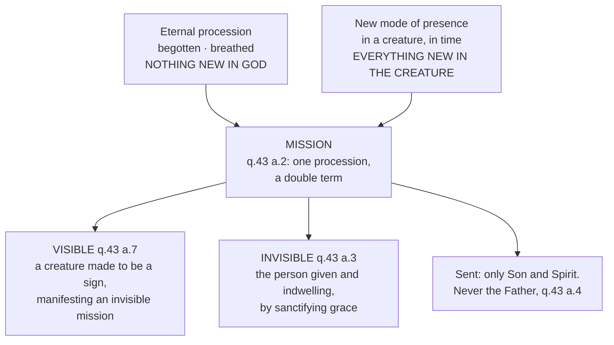

# The Triune God · Lesson 6.1: The missions of the Son and the Spirit

> ⏱ ~15 min · Module 6: The missions, and modern Trinitarian theology · Builds on: [4.3 The two processions](04-03-the-two-processions.md), [4.5 What is common, what is proper, what is appropriated](04-05-common-proper-appropriated.md), [5.1 The Latin doctrine](05-01-the-latin-doctrine.md) · Unlocks: [6.2 The Trinity in the economy, the liturgy and prayer](06-02-the-trinity-in-the-economy-liturgy-and-prayer.md)

## Why this matters

Five lessons of Module 4 built the Trinity in itself: two processions, four relations, three persons, and not one word about us. Then [4.5](04-05-common-proper-appropriated.md) flagged the one place the machinery bends — the whole Trinity effects the Incarnation, and only the Son became man. This lesson is that exception made into a doctrine. It is also the hinge where careless preaching does its worst damage, because "the Father sent the Son" sounds exactly like a story in which God moves, changes and takes turns. Aquinas's answer is a single formula, and almost everything in the treatise up to here is required to make it work.

## The idea

*Missio* means a sending, and a sending seems to require two things God cannot do: leaving somewhere and arriving somewhere else. God is everywhere already ([1.4](01-04-immutability-eternity-immensity.md)) and cannot change ([1.4](01-04-immutability-eternity-immensity.md)). So either the New Testament's constant language of sending is a figure of speech, or "sending" means something other than motion.

The answer is an addition with one very lopsided sum:

> **[A mission is the eternal procession, plus a new way of being present in a creature.](../reference.md#mission)**

Look at what each term contributes. The first addend is the [procession](../reference.md#procession-in-god) — the Son's being begotten, the Spirit's being breathed — and it is eternal, so it contributes no newness at all. The second addend is entirely on the creature's side. Add them and you get something genuinely new; but every bit of the newness sits at one end. **Nothing new in God, everything new in the creature.**

That asymmetry is not invented for this occasion. It is the same shape [`thomistic-synthesis` 4.3](../../thomistic-synthesis/lessons/04-03-the-names-of-god.md) found in the word "Lord": God was not Lord until there was a creature subject to him, and the relation is real at the creature's end and of reason at God's. A mission works the same way, with one difference in scale — what arrives in the creature is not a title but a divine person.

Two consequences drop out immediately, and both are worth holding now. First, if a mission contains an eternal procession, then a person who proceeds from no one cannot be sent, and the Father never is. Second, what is given in a mission is the person himself, not a parcel of his effects.

## Source

*Summa Theologiae* I q.43 a.2, "Whether mission is eternal, or only temporal?" — the *respondeo* abridged, and the third reply (English Dominican Province):

> Others express the temporal term with the relation to the principle, as "mission" and "giving." For a thing is sent that it may be in something else, and is given that it may be possessed; but that a divine person be possessed by any creature, or exist in it in a new mode, is temporal. ...
>
> **Reply to Objection 3.** ... it includes the eternal procession, with the addition of a temporal effect. For the relation of a divine person to His principle must be eternal. Hence the procession may be called a twin procession, eternal and temporal, not that there is a double relation to the principle, but a double term, temporal and eternal.

Three words carry the article. **Term**: what is doubled is not the relation of origin but the endpoint. **Twin**: there are not two processions but one, counted twice because it now has two endpoints. And the clause that forbids the obvious misreading — *not that there is a double relation to the principle* — rules out the idea that the Son acquires some second dependence on the Father in time. He does not. The relation of origin is exactly what it was from eternity.

The second reply of the same article says where the novelty does live: a divine person's newly existing in someone does not come from change in the divine person but from change in the creature, just as God is called Lord in time by a change in the creature.

## The argument

1. **Mission names two relations at once**: of the one sent to the sender, and of the one sent to the term he is sent to (a.1). *In words:* every sending has a "from whom" and a "to where," and both have to be given an account.
2. **In God the "from whom" can only be procession of origin.** Aquinas lists the alternatives — a master sends a servant by command, a counsellor sends a king by advice — and rules both out, because each makes the sender greater. What is left is origin, "as a tree sends forth its flowers" (a.1), and origin in God is according to equality (a.1 ad 1). *In words:* being sent says where you are from, never what rank you hold.
3. **Therefore the Father is never sent** (a.4). He is from no one, so the first addend of the sum is simply missing for him. Augustine had already noticed that scripture never says it (*De Trinitate* II.5, Haddan's translation).
4. **The "to where" is not a place.** The person sent does not begin to exist where he was not, nor cease to be where he was (a.1 ad 2); what is new is the manner of his presence, not his location. *In words:* the Son was in the world before Bethlehem, and after it he is in the world in a new way.
5. **So mission is a temporal word, though the procession inside it is eternal** (a.2). *In words:* one addend eternal, one temporal, and we call the whole thing temporal because that is where the news is. The article's *sed contra* is the obvious text: Galatians 4:4, God sending his Son when the fulness of the time was come.
6. **The sender can be read in two senses, and both are true** (a.8). Take "sender" to mean the principle of the *person sent*, and only the Father sends the Son, and the Father and the Son send the Spirit ([5.1](05-01-the-latin-doctrine.md)). Take "sender" to mean the principle of the *effect* — the new presence produced in the creature — and the whole Trinity sends, because that effect is an outward work and [outward works are undivided](../reference.md#the-undivided-outward-works) ([4.5](04-05-common-proper-appropriated.md)). *In words:* the three do the sending and one of them is what is sent. Augustine reached the same place from scripture: the Father sends the Son by his Word, and his Word is the Son, so the Son is sent by the Father and by himself — while the form of a servant is the Son's person and not the Father's (*De Trinitate* II.5).

**Mark the levels.** That the Son was sent and the Spirit was sent is revealed and confessed in the creed. The *analysis* — mission as procession plus temporal term, the visible and invisible division, the two senses of sender — is the Latin theological tradition's explanation, common teaching and theologically certain, never defined. Calling the formula a dogma is the same error as calling the dogma a school opinion ([syllabus](../syllabus.md), Authority discipline).

## The derivation

## Worked examples

**Example 1 — the machinery on a clean case: the dove at the Jordan.** Which person? The Holy Ghost. First addend: passive spiration from the Father and the Son, eternal, and not touched by anything that happens at a river. Second addend: a dove-shaped creature, made for that moment to be a sign and then gone. So this is a [visible mission](../reference.md#visible-and-invisible-missions) of the Spirit (a.7).

Now the fine print, which is where most accounts go wrong. The Spirit did not *assume* the dove — unlike the Son, who took the visible creature into the unity of his person, so that what is said of that creature is said of him (a.7 ad 1). Nothing said of the bird is said of the Spirit. And the visible mission to Christ manifests an invisible mission made to him not at the Jordan but at the first moment of his conception (a.7): the sign appears when it is useful to the Church, not when the grace begins. Who sends? Father and Son, in the origin sense; the three, in the effect sense.

**Example 2 — where it strains: the burning bush, and the three visitors at Mamre.** Here is a visible creature, made by God, manifesting God to a man, and passing away when its work is done. By the description so far it should be a visible mission. Aquinas denies it, and the denial is the most useful thing in the article: the Old Testament apparitions "cannot be called visible missions," because they were not given to designate the indwelling of a divine person by grace but to manifest something else (a.7 ad 6, following Augustine's *De Trinitate* II).

So the definition carries a clause we have not been leaning on: a visible mission is visible *of an invisible one*. A sign that signifies no indwelling is a theophany, not a mission. Augustine's own version of the test is sharper still — if appearing in a creature were enough to be sent, the Father would have been sent in the fire of the bush, and scripture never says he was.

**Where this lesson stops.** The invisible mission happens "according to the gift of sanctifying grace" (a.3), and that clause is a door into another treatise. What sanctifying grace is, whether the indwelling requires a created effect in the soul and how the schools dispute it, what divinization amounts to — all of that belongs to `creation-grace-last-things` ([syllabus](../../creation-grace-last-things/syllabus.md)). Likewise the *term* of the Son's visible mission, the assumed human nature and the union that makes it his, belongs to [`christology`](../../christology/syllabus.md). This lesson owns the sending; those courses own what was sent into.

## Watch out

- **You might think being sent implies taking orders.** In creatures it usually does, which is why Aquinas answers the objection first: mission implies inferiority only where it means procession by command or by counsel, and in God it means procession of origin alone, which is according to equality (a.1 ad 1). Reading "the Father sent me" as a chain of command is **subordinationism**, and it is the oldest misreading of the missions there is.
- **You might think the missions are three episodes.** The Father in Israel, the Son for thirty-three years, the Spirit from Pentecost onward — one God working a shift rota. That is **modalism** dressed as history. All three persons are wholly present throughout; what changes is the mode of presence in creatures, and the Father, who is never sent, is not thereby absent (a.4 ad 2).
- **You might think a mission is just an appropriation.** It is not, and this is the one real qualification to [4.5](04-05-common-proper-appropriated.md)'s rule. An appropriation is never exclusive: what is appropriated to one stays wholly true of the other two. A mission terminates in one person and not the others — only the Son was made man. Collapse that and you lose the Incarnation; over-correct it into three persons with three departments and you have **tritheism**.

## One-liner

> A mission is the same eternal procession with a new end point: God gains nothing, the creature gains God.

## Problems

**P1 (🟢)** *(Exegetical)* Read this passage from *Summa Theologiae* I q.43 a.4, "Whether the Father can be fittingly sent?" (English Dominican Province):

> **On the contrary,** Augustine says (De Trin. ii, 3), "The Father alone is never described as being sent."
>
> **I answer that,** The very idea of mission means procession from another, and in God it means procession according to origin, as above expounded. Hence, as the Father is not from another, in no way is it fitting for Him to be sent; but this can only belong to the Son and to the Holy Ghost, to Whom it belongs to be from another.
>
> **Reply to Objection 2.** Although the effect of grace is also from the Father, Who dwells in us by grace, just as the Son and the Holy Ghost, still He is not described as being sent, for He is not from another.

(Aquinas's chapter reference follows his Latin Augustine; in Haddan's translation the sentence stands at *De Trinitate* II.5.)

(a) Which words of the *respondeo* do the deciding, and what would have to be false about the Father for the conclusion to fail? (b) The objection had argued from John 14:23 ("We will come to him and make Our abode with him") that the whole Trinity dwells in us, so each person is sent. In two sentences, state exactly what the reply concedes and exactly what it denies.

**P2 (🟡)** *(Exegetical)* Two events, neither of them the Incarnation. **(i)** The bright cloud at the Transfiguration, with the voice saying "Hear ye him." **(ii)** The pillar of cloud and fire that went before Israel in the desert. For each, in two sentences: is it a visible mission, of which person if so, and what exactly is created? Then name in one sentence the clause of the definition that separates case (ii) from case (i). 120 words total.

**P3 (🔴)** *(Exegetical)* An invented handout for a parish confirmation class contains these two sentences:

> "The Father stayed in heaven and sent the Son down to earth; when the Son's work was done he went back up, and the Father then sent the Spirit to take his place."
>
> "Being sent means taking orders from the one who sends you, and that is why the Son comes second and the Spirit third."

For each sentence: name the error it lands in, cite the article or reply of q.43 that corrects it, and say in one sentence what true thing the author was reaching for. 120 words total.

Solutions

**P1** *(Exegetical (a) · Exegetical (b))*

**Must hit, strict (a):** the deciding words are **"procession from another"** — the whole inference runs from mission's *meaning* containing an origin-from-another, so a person who is from no one cannot satisfy the definition. Credit any answer that isolates that phrase, or "not from another" in the *hence* clause, and explains that the argument is analytic, not a matter of fittingness in the weak sense: it is not that the Father *declines* to be sent, but that the concept has no purchase on him. What would have to be false: the Father would have to proceed from someone — i.e. he would have to not be unbegotten, which is his personal property ([4.4](04-04-four-relations-three-persons.md)). Nothing about grace, power or willingness would change the answer.

**Must hit, strict (b):** the reply **concedes** the whole of the objection's premise — the Father genuinely dwells in the justified by grace, and the effect of grace is from him just as much as from the Son and the Spirit. It **denies** only the inference to "therefore he is sent," on the single ground that sending adds a relation to a principle, and the Father has none. The point to hit is that the concession is total and the denial is narrow: indwelling and mission are not the same predicate.

**Wrong turns:** saying the Father is not sent "because he is greater" or "because he stays in heaven" — both contradict a.1 ad 1 and a.1 ad 3 respectively, and the second re-imports local motion. Saying the reply denies that the Father indwells; it says the opposite in its first clause. Treating "fittingly" in the title as aesthetic taste rather than as Aquinas's usual word for a conclusion drawn from what a thing is.

**Model answer (b):** It concedes that the Father dwells in us by grace exactly as the Son and the Spirit do, and that the effect of grace comes from him too. It denies only that this makes him *sent*, because mission signifies procession from a principle and the Father is from no one — so the objection's true premise cannot reach its conclusion.

**P2** *(Exegetical)*

**Must hit, strict:** **(i)** Yes, a visible mission, of the **Holy Ghost**, in the appearance of a bright cloud (a.7, which glosses its purpose as showing the abundance of Christ's teaching — hence "Hear ye him"). What is created is the cloud, a sign made for that purpose and not assumed into the unity of any person; nothing eternal is created, and nothing in God is new. Credit for adding that the voice is not a mission of the Father, since the Father is never sent (a.4). **(ii)** **No.** The pillar is a genuine divine manifestation but not a visible mission: Aquinas rules at a.7 ad 6 that the apparitions given to the fathers of the Old Testament cannot be called visible missions. **The clause that separates them:** a visible mission must designate the *indwelling of a divine person by grace* — it is the visible sign of an invisible mission. The Old Testament apparitions were given to manifest something else.

**Wrong turns:** answering (ii) "yes, a visible mission of the Holy Ghost" on the strength of the fire, which is the whole trap — and a.7 ad 2 grants that the pillar really does resemble the dove and the tongues, all of them bodily appearances made to signify and then pass away, which is why resemblance cannot be the test. Saying the cloud is "assumed" by the Spirit — only the Son assumed his visible creature (a.7 ad 1). Saying the Transfiguration is a mission of the *Son*, who is already visibly present and whose visible mission is the Incarnation.

**P3** *(Exegetical)*

**Must hit, strict, sentence 1:** **modalism**, in narrative form — three persons taking successive turns on the stage, one vacating so the next can occupy, which is one subject under three roles rather than three who are always all present. Carried along with it, and worth naming second, is a God who moves and changes locally. Correcting articles: a.1 ad 2 and ad 3 (the person sent neither begins to exist where he was not nor ceases to be where he was; the objection from local motion rests on a notion of mission that is not in God), with a.2 ad 2 for where the change actually is — in the creature. The true thing reached for: the missions really are events, datable, and not merely our way of talking; something genuinely new happens, and it happens in us.

**Must hit, strict, sentence 2:** **subordinationism.** Corrected by a.1 ad 1: mission implies inferiority only when it means procession by command or counsel; in God it means procession of origin, which is according to equality. The true thing reached for: there is a real order among the persons — the order of origin, which is why the Father is never sent — and order of origin is not rank.

**Wrong turns:** calling sentence 1 tritheism; it has too few agents, not too many. Calling sentence 2 modalism because it mentions numbering. Answering sentence 2 by denying that there is any order at all in God, which contradicts [4.4](04-04-four-relations-three-persons.md) and [5.1](05-01-the-latin-doctrine.md) as badly as the handout does.

## Flashback

**From Lesson [5.2](05-02-the-greek-doctrine-and-the-addition.md) (The Greek doctrine, and the history of the addition):** *(Exegetical.)* An **invented** revision card, written for this problem and not the words of any real person:

> **Filioque — what to remember.** *How it got into the Creed:* Pope Leo III inserted "and the Son" at Rome in 809, and the clause spread outward from Rome into Francia and Spain over the following two centuries. *Why the East refuses it:* the Greeks make the Father the sole cause of the Son and of the Spirit, so on their scheme the other two come out lesser than the Father — and they cannot accept a clause that moves the Son up onto the giving side.

(a) Correct the history: where does the Latin creed with the clause first appear, which way did it travel, and what did Leo III actually do? (b) Name what the card misunderstands about *aitia*, name the heresy it is imputing to the Greek tradition, and give that tradition's own answer to the imputation. **Two sentences per part.**

Solution

**Must hit, strict (a):** the Latin creed with *Filioque* first appears in **Visigothic Spain**, around the Third Council of Toledo (589), and who inserted it is not known. It travelled the opposite way from the card's account — Spain, then through Francia, defended at Friuli (796) and at Aachen (809) — and reached Rome last, the clause at Rome being generally dated to 1014. **Leo III did the reverse of what the card credits him with:** he approved the doctrine while declining to alter the creed.

**Must hit, strict (b):** *aitia* in Greek Trinitarian usage is not the cause of creatures, which makes something less than itself; the Father gives the whole divine nature entire, so what is caused is a distinct manner of existing (*tropos hyparxeos*) and not a smaller share of divinity. *Aitia* says where the three stand to one another, not how much divinity each has. The heresy imputed is **subordinationism**, and Nicaea's "true God from true God" is the guard that blocks the inference. Credit for seeing that the card also misstates the refusal: the objection is that a second name after the verb of origin splits the monarchy, which is the Greek account of *why God is one*, not that a ranking has been disturbed.

**Wrong turns:** reading "reached Rome last" as "Rome never received it" — the clause stands in the Latin creed from the eleventh century, and the doctrine is defined at Lyons II and Florence; conceding the card's premise and answering that the Greek scheme merely "risks" subordinationism, when the tradition blocks it by its own rule about what the cause communicates; answering (b) by arguing that the Latin doctrine is true, which is neither asked nor this course's business.

**Model answer:** (a) It first appears in Visigothic Spain, around the Third Council of Toledo in 589, with no known author, and travelled the other way about — through Francia, defended at Friuli in 796 and Aachen in 809, reaching Rome last, where the clause is generally dated to 1014. Leo III did the opposite of inserting it: he approved the doctrine and refused to change the creed. (b) *Aitia* here communicates the whole and undiminished Godhead, so being caused is a manner of existing and not a grade of divinity, and the subordinationism the card imputes is what Nicaea's "true God from true God" already excludes. The tradition's own answer is that rank was never the issue: a second term after the verb of origin would split the single source, which is its account of why God is one.

## Connections

- **Backward:** [4.5](04-05-common-proper-appropriated.md) named this lesson as the one genuine qualification of the undivided outward works, and premise 6 is how the qualification is paid for — two senses of "sender," one effect, one term. [4.3](04-03-the-two-processions.md) supplies the eternal addend of the sum, and [5.1](05-01-the-latin-doctrine.md) decides who sends the Spirit in the origin sense. [`thomistic-synthesis` 4.3](../../thomistic-synthesis/lessons/04-03-the-names-of-god.md) supplies the asymmetry the whole formula runs on: a relation real in the creature and of reason in God, which is why "God became Lord" and "the Spirit was sent" leave God untouched.
- **Forward:** [6.2](06-02-the-trinity-in-the-economy-liturgy-and-prayer.md) takes the missions into the shape of prayer and the liturgy — to the Father, through the Son, in the Holy Spirit is the missions run backwards. [6.3](06-03-rahners-rule-and-the-immanent-trinity.md) asks the hard question this lesson sets up: if a mission adds nothing to God, how much can the economy tell us about God in himself, and does Rahner's rule claim more than q.43 permits?
- **Sideways:** [`christology`](../../christology/syllabus.md) owns the term of the Son's visible mission — the assumed nature and the hypostatic union; `creation-grace-last-things` ([syllabus](../../creation-grace-last-things/syllabus.md)) owns everything downstream of a.3's "according to sanctifying grace." See the course [syllabus](../syllabus.md) for both cessions.
