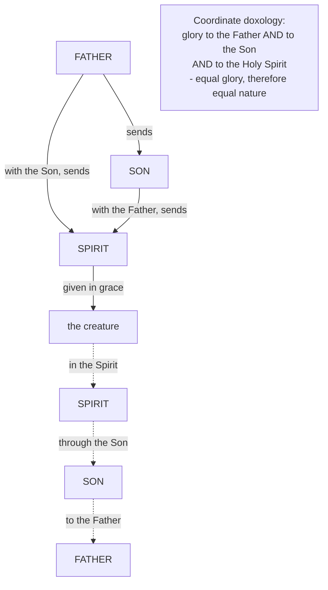

# The Triune God · Lesson 6.2: The Trinity in the economy, the liturgy and prayer

> ⏱ ~15 min · Module 6: The missions, and modern Trinitarian theology · Builds on: [4.5](04-05-common-proper-appropriated.md), [6.1](06-01-the-missions-of-the-son-and-the-spirit.md) · Unlocks: [6.3](06-03-rahners-rule-and-the-immanent-trinity.md), [`sacraments-and-liturgy`](../../sacraments-and-liturgy/syllabus.md)

## Why this matters

You have five modules of apparatus behind you, and almost nobody in the pews has any of it. Yet a Catholic who could not define a subsistent relation still ends every prayer in a Trinitarian shape and marks the doctrine on his own body before he begins. The Catechism calls the Trinity the central mystery of Christian faith **and life** — the mystery of God in himself, the source of all the other mysteries and the light that enlightens them (CCC 234). This lesson reads worship twice over: as the oldest evidence there is for the doctrine, and as the place where its most delicate distinction gets used weekly by people who have never heard of it.

## The idea

Christian prayer has [two shapes](../reference.md#the-two-shapes-of-christian-prayer), both ancient, both orthodox.

**The prepositional shape:** *to the Father, through the Son, in the Holy Spirit*. It is the shape of the Roman collect — addressed to the Father, closed through the Son, naming the Spirit — and of the Canon's final doxology, *per ipsum et cum ipso et in ipso*, through him and with him and in him. It maps the **economy**: the road God took to us, walked in reverse.

**The coordinate shape:** *Glory to the Father, and to the Son, and to the Holy Spirit*. Three names, one conjunction, nothing distributed. It asserts **rank**: equal glory, therefore equal nature.

The older of the two is the prepositional one. Up to the Arian crisis "Glory to the Father, through the Son, in the Holy Spirit" was the commoner form (the *Catholic Encyclopedia* cites 1 Clement 58–59 and Justin's *First Apology* 67 — read as Fathers in [`patristics` 1.2](../../patristics/lessons/01-02-first-clement-and-the-didache.md) and [1.4](../../patristics/lessons/01-04-justin-martyr.md)), and its sense is not a ladder:

> This latter form is indeed perfectly consistent with Trinitarian belief: it, however, expresses not the coequality of the Three Persons, but their operation in regard to man.
>
> — Joyce, "The Blessed Trinity," *Catholic Encyclopedia* (1912)

That sentence is the hinge of the lesson: a liturgical form can be *true and silent* about something, and silence is what a controversy eventually makes intolerable.

Behind both stands the rule of [2.4](02-04-from-confession-to-creed.md): [*lex orandi, lex credendi*](../reference.md#lex-orandi-lex-credendi), what the Church does in worship is admissible evidence of what she holds. That is why a lesson about prayer sits in a dogmatic treatise.

## Source

Augustine, *De Trinitate* VI.10.12 (Haddan, NPNF first series vol. 3), abridged:

> Therefore all these things which are made by divine skill, show in themselves a certain unity, and form, and order … When therefore we regard the Creator, who is understood by the things that are made, we must needs understand the Trinity of whom there appear traces in the creature, as is fitting … Let him who sees this, whether in part, or through a glass and in an enigma, rejoice in knowing God; and let him honor Him as God, and give thanks; but let him who does not see it, strive to see it through piety, not to cavil at it through blindness … Neither are we to take the words, of whom, and through whom, and to whom are all things, as used indiscriminately; nor yet to denote many gods, for to Him, be glory for ever and ever. Amen.

Three things are decided in that paragraph, and the last one is why it is here rather than in Module 4.

**Traces, not proofs.** *Vestigia*, "traces" in Haddan's rendering, is all any created triad amounts to. Augustine has just borrowed Hilary's "eternity in the Father, form in the Image, use in the Gift" and generalized it: everything made is *one* something, has *a* form, and keeps *an* order. He does not say this shows the Trinity to anyone. He says the man who sees it should give thanks and the man who does not should try harder in piety — an instruction to a believer, not an argument to an unbeliever. That is [2.1](02-01-the-one-god-of-israel.md)'s rule about [proof and confirmation](../reference.md#proof-and-confirmation), sixteen centuries early.

**The glass.** "Through a glass and in an enigma" is the same Pauline governor Augustine puts on the psychological analogy in [4.2](04-02-augustine-the-image-in-the-mind.md). The [vestigia](../reference.md#vestigia-trinitatis) are that inward image's outward, weaker cousin: a trace is what a foot leaves, and you can name the walker from it only if you already know him.

**The prepositions.** The last sentence is Romans 11:36 — of whom, through whom, to whom — and Augustine's ruling on it is the ruling the doxologies need. Do not flatten the three prepositions into one (that loses the distinction of persons); do not read them as three deities (that loses the unity). The liturgy's *to · through · in* lives under that double refusal.

## The argument

1. **The worship is evidence.** *Lex orandi, lex credendi* ([2.4](02-04-from-confession-to-creed.md)). *In words:* the rite is testimony against a theologian who says the Church never believed this.
2. **The standard Latin prayer is addressed to the Father.** Fortescue's article on the collect reports that the great majority begin *Deus, qui*, a few later ones address the Son, none the Holy Ghost; the day's collect always takes the long conclusion, *Per Dominum* — through our Lord. *In words:* the rite's grammar is Trinitarian before its words are.
3. **That grammar is [6.1](06-01-the-missions-of-the-son-and-the-spirit.md)'s missions run backwards.** The Father sends the Son; Father and Son send the Spirit; the creature receives. Prayer travels the same road the other way. *In words:* we go home the way God came.
4. **Prepositions are underdetermined.** "Through" can name a road or a rank; "in" an element or an instrument. The fourth century found that ambiguity being exploited, which is why Basil had to defend "with the Spirit" alongside "in the Spirit" ([`patristics` 3.2](../../patristics/lessons/03-02-basil-the-great.md)). *In words:* words that had carried the faith for two centuries could suddenly be read as a chain of command.
5. **So the Church added a form; she did not replace one.** The coordinate doxology became universal, and the West appended *Sicut erat in principio* — which the Second Synod of Vaison in 529 says was used at Rome, in the East and in Africa against Arianism, and ordered it said in Gaul. Fortescue notes the synod errs about the East: a council can be right in what it commands, wrong in its history.
6. **Both shapes are kept because the doctrine asserts two things.** There is a real order of origin, and it really appears in the economy; and there is no inequality whatever in the nature. Drop the coordinate form and the economy reads as a hierarchy — **subordinationism**. Drop the prepositional form and the missions stop signifying: three interchangeable names for one addressee, which is **modalism** in practice.
7. **Levels, and the standing trap.** That the Spirit is adored and glorified together with the Father and the Son is rung 1, defined at Constantinople (381) ([3.3](03-03-constantinople-i-and-the-divinity-of-the-spirit.md)). The *wording* of any particular doxology is liturgical law, which the Church makes and can change: the Mozarabic rite said *Gloria et honor Patri et Filio et Spiritui sancto*, ordered by the Fourth Synod of Toledo in 633. Reading a rubric as a dogma is [4.5](04-05-common-proper-appropriated.md)'s error — promoting the explanation — in liturgical dress. Levels come from [`fundamental-theology` 4.4](../../fundamental-theology/lessons/04-04-the-ladder-of-doctrinal-authority.md).

## The two directions

Solid edges: the economy, the missions of [6.1](06-01-the-missions-of-the-son-and-the-spirit.md). Dashed: the collect. The box is what the dashed edges cannot say alone.

## Worked examples

**Example 1 — the clean case: the creed, sorted.** Run [4.5](04-05-common-proper-appropriated.md)'s rule over two clauses of the creed (Schaff's public-domain English for 325).

- "Maker of all things visible and invisible," said of the Father. Does it name a relation of origin? No: creating is a work of the one nature and common to the three (ST I q.45 a.6). Is it fastened to one person anyway? Yes. So it is **appropriated** — and non-arbitrarily, by likeness to the Father's being principle without principle. The Father is not *the* creator; the three are one principle of the creature.
- "begotten, not made," said of the Son. A relation of origin, so **proper**, and impossible of the other two.

Now generalize. The creed's tripartite shape is three articles hung on a very few proper relations and decorated throughout with appropriated works. A reader who takes the articles as three job descriptions has silently rewritten the creed as three gods with a division of labour. This is [appropriation](../reference.md#appropriation) at work in the one text every Catholic recites weekly — and P1 asks you to finish the sorting.

**Example 2 — the hard case: the sign of the cross.** A Catholic touches forehead, breast, left shoulder, right shoulder, saying *In nomine Patris et Filii et Spiritus Sancti* — in the name of the Father and of the Son and of the Holy Spirit; the rubric at the foot of the altar attaches the words to the gesture in that order. What is he claiming?

**First, one name.** *Nomine* is singular and governs three genitives — the grammar of Matthew 28:19, "baptizing them in the name of the Father, and of the Son, and of the Holy Ghost," where the Catechism draws the inference: not *in their names*, for there is only one God (CCC 233). Unity of essence and distinction of persons, by a case ending.

**Second, both halves of the treatise at once.** The words name the Trinity as it is in itself; the figure traced is the cross, the term of the Son's visible mission ([6.1](06-01-the-missions-of-the-son-and-the-spirit.md)). The Catechism's pair is *theologia* and *oikonomia* — God's inmost life, and the works by which he reveals it (CCC 236). The gesture holds both, which is why it is the best short answer to the question [6.3](06-03-rahners-rule-and-the-immanent-trinity.md) will press.

**Third, what it is not.** Not an appropriation of body parts: the head is not the Father's, the shoulders not the Spirit's. Nothing is distributed, because the persons are not parts and the name is one.

**Where it strains.** The formula was not always this one. The earliest evidence is a small cross traced on the forehead with the thumb (Tertullian describes the habit around 200), and the words varied for centuries — "the sign of Christ," "in the name of Jesus" — the large cross and the settled Trinitarian formula arriving much later. So the [sign of the cross](../reference.md#the-sign-of-the-cross) is a developed form carrying a defined faith: premise 7 in miniature.

## Watch out

- **You might think the prepositional form ranks the three.** It maps the economy. But the misreading is in good company: it is exactly what the fourth century had to answer, and the answer was to add the coordinate form, not to abolish the prepositions. Treating *through the Son* as *beneath the Son* is **subordinationism** in one step.
- **You might think the liturgy shows three agents dividing the work.** The Father creates, the Son redeems, the Spirit sanctifies — recited as three jobs, that is **tritheism** with a friendly face. [4.5](04-05-common-proper-appropriated.md) has the correction: the outward works are undivided, and the clauses are appropriations, never exclusive.
- **You might over-correct into three names for one addressee.** If the prepositions are decorative, prayer goes to an undifferentiated God under three labels — **modalism**. The missions forbid it: to be sent is not to be renamed.
- **Do not read a trace as a proof.** Augustine's unity-form-order, Hilary's triad, every clover leaf preached on Trinity Sunday: by his own instruction these confirm a faith already held and demonstrate nothing. The Catechism affirms that creation bears traces of God's Trinitarian being (CCC 237) without endorsing any particular triad; Augustine's is a theologian's construction, below the seam.
- **Do not promote a rubric.** The baptismal formula as sacramental law — what makes a baptism valid — belongs to [`sacraments-and-liturgy`](../../sacraments-and-liturgy/syllabus.md); here it is doctrinal data only.

## One-liner

> The Church prays *to* the Father *through* the Son *in* the Spirit, and gives glory to the Father *and* the Son *and* the Spirit — one road and one rank, and whoever signs himself claims both at once.

## Problems

**P1 (🟢) *(Exegetical.)*** Sort each of these five clauses of Christian worship into **common**, **proper**, or **appropriated**, and give in each case the rule that decides — **one line each**.

1. "by whom all things were made" (creed of 325, of the Son).
2. "who proceedeth from the Father" (creed of 381, of the Spirit).
3. "the Lord and Giver-of-Life" (creed of 381, of the Spirit).
4. "who with the Father and the Son together is worshipped and glorified" (creed of 381, of the Spirit).
5. "through our Lord Jesus Christ" (the collect's conclusion, of the Son).

**P2 (🟡) *(Exegetical.)*** An invented note from a parish worship committee, written for this problem:

> "Our prayers still end in the old chain of command — to the Father, through the Son, in the Spirit — as though we had to work our way up through the ranks to reach God. On Trinity Sunday we will address each of the three prayers to one person in turn: the first to the Father, who made us; the second to the Son, who saved us; the third to the Spirit, who lives in us. Then each person gets equal time, and none of them is left as a mere channel."

(a) Name the misreading of the prepositional form in the first sentence, and say what the form actually asserts — and what the fourth century did about that very misreading. (b) The proposed replacement commits a *different* error, of the kind [4.5](04-05-common-proper-appropriated.md) names. Name it and give the rule that corrects it. (c) In one sentence, say what the committee could legitimately keep. **150 words or fewer in total.**

**P3 (🔴, optional) *(Exegetical.)*** Assign a level on the ladder of [`fundamental-theology` 4.4](../../fundamental-theology/lessons/04-04-the-ladder-of-doctrinal-authority.md) to each claim, **naming the act that fixes it** — one sentence each.

(i) The Holy Spirit is to be adored and glorified together with the Father and the Son.
(ii) A Christian should begin his prayers with the words "in the name of the Father and of the Son and of the Holy Spirit."
(iii) The unity, form and order found in every creature are a trace of the Trinity.

Then, in one sentence: name the conflation committed by a reader who calls all three "the Church's teaching" without distinction.

Solutions

**P1** *(Exegetical — strict.)*

**Must hit, strict:**
1. **Appropriated.** The making of all things is a work of the one nature and so common to the three (ST I q.45 a.6); it is fastened to the Son by likeness to what is proper to him, since he proceeds as Word and a maker works through his conception.
2. **Proper.** A relation of origin, and the only kind of thing that can distinguish a person at all — everything is one in God where no opposition of relation stands in the way.
3. **Appropriated.** Giving life is common; it is fastened to the Spirit by likeness to his procession as Love and Gift.
4. **Common** — and deliberately so: the clause exists to assert the equality of glory, which is an assertion about the one nature. (Equal credit for noting that adoration is offered to each person and to the three.)
5. **Not appropriated: proper.** This is the trap in the set. Christ's mediation is true of the Son alone, and not by likeness to anything — it rests on the Incarnation, the term of the visible mission, which is the one genuine qualification of the undivided-works rule that [4.5](04-05-common-proper-appropriated.md) flags and [6.1](06-01-the-missions-of-the-son-and-the-spirit.md) develops. "Through" here names the economy, not a rank, and the mediation belongs to the assumed humanity, not to a lesser divinity.

**Wrong turns:** calling 1 **proper** because the creed attaches it to the Son — the creed's attachment is exactly what appropriation explains; calling 4 **proper** to the Spirit because the clause stands in his article; calling 5 **appropriated** on the strength of its resemblance to 1 and 3, when nothing is being fastened by likeness and only the Son is incarnate; treating 5 as evidence that the Son is a channel or an instrument (see P2).

**Model answer:** 1 appropriated — making all things is common to the three (q.45 a.6), assigned to the Son by likeness to his procession as Word. 2 proper — a relation of origin, the only source of real distinction in God. 3 appropriated — life-giving is a common work, assigned by likeness to the Spirit's procession as Love and Gift. 4 common — the clause asserts equal glory and so speaks of the one nature; that is the point of the article. 5 proper, not appropriated — the mediation is the incarnate Son's alone, resting on a mission whose term is his humanity, which is exactly where the undivided-works rule takes its one qualification.

---

**P2** *(Exegetical — strict.)*

**Must hit, strict (a):** the misreading takes the prepositions as a **hierarchy of rank** — subordinationism — when the form asserts the *order of the economy*: God comes to us from the Father through the Son in the Spirit, and prayer returns along the same road. What the fourth century did is the decisive historical point: faced with that very exploitation of the prepositions, the Church **added** the coordinate doxology (glory to the Father, and to the Son, and to the Holy Spirit) and kept the older form, rather than abolishing it — so the prepositional shape is not a relic that survived Arianism by accident; it was retained as true.

**Must hit, strict (b):** the replacement preaches **appropriations as properties** — making, saving and indwelling handed out as three departments — and the result is three agents, i.e. **tritheism**. The rule: nothing is proper to a person in God but a relation of origin, so every work toward creatures is common, the three being one principle of the creature and not three ([4.5](04-05-common-proper-appropriated.md)). "Equal time" makes it worse, since it treats equality as a quantity to be shared out rather than a nature wholly possessed by each.

**Must hit, strict (c):** any one-sentence answer that keeps something the tradition really does — e.g. that the persons may be named severally in prayer, and that the Church does address prayers to the Son and hymns to the Spirit, provided the works named are said as appropriations and not as private assignments.

**Wrong turns:** diagnosing the committee as modalist (they multiply the persons' roles rather than collapsing them); conceding that "through the Son" is a channel and merely asking for politer language; claiming that addressing a prayer to the Son or the Spirit is illegitimate — it is not, and the collect's Father-directedness is a liturgical norm, not a doctrinal rule about who may be prayed to.

**Model answer:** The first sentence reads the prepositions as rank; they name the order of the economy, the road God came and prayer takes back, and the fourth century answered exactly this misreading by *adding* the coordinate doxology while keeping the older form. The replacement then commits the opposite error: making, saving and sanctifying are common works of the one nature, so parcelling them out as three assignments preaches appropriations as properties and yields three agents — tritheism — against the rule that only a relation of origin is proper to a person. "Equal time" compounds it, treating equality as a quantity. What may be kept: naming the persons severally in prayer, as the Church herself does, provided each named work is said as an appropriation.

---

**P3** *(Exegetical — strict. Overstating or understating any level is the error.)*

**Must hit, strict:**
- (i) **Rung 1.** The act is the solemn profession of an ecumenical council — Constantinople I (381), whose creed confesses the Spirit as the one "who with the Father and the Son together is worshipped and glorified" — proposing it as the faith of the Church.
- (ii) **Not on the doctrinal ladder at all: liturgical law and devotional custom.** No act proposes it as revealed or as definitively to be held; the words and even the gesture varied for centuries, and the Church's authority over rites is what fixes the present form. Credit for adding that what the formula *confesses* is rung 1, while the requirement to use it is not doctrine.
- (iii) **Below the seam** — a theologian's construction, Augustine's in *De Trinitate* VI, offered by him as a trace and not a proof. Full credit requires the distinction: the Catechism affirms that God has left traces of his Trinitarian being in creation (CCC 237), which is authentic teaching about traces in general, and endorses no particular triad; Augustine's unity-form-order is his own and freely disputable.

**Must hit, strict (last sentence):** he has collapsed three different things the Church does — **defining** a truth, **regulating** a rite, and **tolerating** a theological construction — into one word, "teaching." Only the first binds faith; the second binds practice and is changeable; the third binds nobody.

**Wrong turns:** putting (ii) at rung 3 because the sign of the cross appears in the Catechism and the Missal — appearing in an authoritative book is not being proposed as doctrine; putting (iii) at rung 3 by attributing Augustine's triad to CCC 237, which says no such thing; demoting (i) on the ground that the creed does not use the word *homoousios* of the Spirit, which confuses a term with the claim ([3.3](03-03-constantinople-i-and-the-divinity-of-the-spirit.md)).

**Model answer:** (i) Rung 1 — professed by the creed of Constantinople I (381), an ecumenical council proposing it as revealed. (ii) Off the ladder: liturgical and devotional law, fixed by the Church's authority over rites, changeable, and historically variable in both words and gesture; what it confesses is rung 1, but the obligation to use these words is not doctrine. (iii) Below the seam — Augustine's own construction in *De Trinitate* VI, offered as a trace, while CCC 237's affirmation that creation bears traces of the Trinity endorses the genus and not his particular triad. The conflation: treating defining, regulating and tolerating as one act of "teaching," when only the first binds faith.

## Flashback

**From Lesson [5.3](05-03-the-clarifications.md) (The clarifications):** *(Exegetical.)* The 2003 agreed statement of the North American Orthodox-Catholic Theological Consultation recommends that theologians stop running two things together: what both churches already hold as received dogma about the Holy Spirit, and the **manner of his origin**, which the statement says still awaits full ecumenical resolution.

(a) Sort each claim into **received dogma**, **the disputed manner of origin**, or **neither** — one line each.

1. The Holy Spirit is true God, and is adored and glorified together with the Father and the Son.
2. The Holy Spirit is a distinct person, not an impersonal power and not a created gift.
3. The Spirit's *hypostasis* derives from the Father alone, the Son having no part in his *ekporeusis*.

(b) The Catechism's judgement that the Eastern and Western expressions are legitimately complementary carries a qualifying clause. State the clause and say, in **one sentence**, what it settles and what it leaves standing. (No verdict on whether the two are in fact complementary — that is Boss 5(d).)

Solution

**Must hit, strict (a):**

1. **Received dogma.** The Spirit's divinity, professed by both churches in the creed of 381 (Constantinople I); it has never been the disputed ground.
2. **Received dogma.** His hypostatic identity — the second of the two heads the 2003 statement names as already held in common.
3. **The disputed manner of origin.** This is precisely the contested item, and the harder half of the answer is the rider: a Catholic cannot treat it as simply open, since Lyons II and Florence define that the Spirit proceeds eternally from the Father and the Son as from one principle, while the 1995 clarification affirms with the East that the Father alone is the sole Trinitarian cause (*aitia*) or principle. What awaits resolution is the relation between the two formulations, not Catholic doctrine.

**Must hit, strict (b):** the clause is *provided it does not become rigid* (CCC 248). It settles that the complementarity, so qualified, does not affect the identity of faith in the same mystery confessed; what it leaves standing is the condition itself — neither tradition's way of putting the mystery may be hardened into the whole of it — and it is no declaration that the theological question is closed, which is why the 2003 statement can still call the manner of origin unresolved.

**Wrong turns:** sorting 1 or 2 into the disputed column because they turn up in the filioque literature — the Spirit's divinity and his personal distinctness are what both churches confess, and saying otherwise misstates the Orthodox position; answering 3 with "disputed" and stopping, leaving a Catholic with nothing defined; quoting "legitimate complementarity" without its condition, which is how a careful judgement becomes a slogan; giving a verdict in (b).

**Model answer:** (a) 1 received dogma — confessed by both churches in the creed of 381. 2 received dogma — the Spirit's hypostatic identity as a distinct person. 3 the disputed manner of origin; and a Catholic adds at once that Lyons II and Florence define the procession from the Father and the Son as from one principle, while the 1995 clarification affirms with the East that the Father alone is the sole cause, so what is unresolved is how the two formulations stand to each other. (b) "Provided it does not become rigid" — the qualifier makes the complementarity conditional, settling that so qualified it does not touch the identity of faith in the same mystery confessed, while leaving standing both the ban on hardening either expression into the whole truth and the question the 2003 statement still calls unresolved.

## Connections

- **Backward:** [4.5](04-05-common-proper-appropriated.md) supplies the whole sorting apparatus, and this lesson is where it is met in the wild — in the creed a reader says weekly. [6.1](06-01-the-missions-of-the-son-and-the-spirit.md) supplies the economy that the prepositional form maps in reverse. [2.4](02-04-from-confession-to-creed.md) supplies *lex orandi, lex credendi* and the second-century evidence this lesson extends forward; [2.1](02-01-the-one-god-of-israel.md) supplies the proof-and-confirmation rule that governs the *vestigia*, and [4.2](04-02-augustine-the-image-in-the-mind.md) the inward image of which they are the outward cousin. [3.3](03-03-constantinople-i-and-the-divinity-of-the-spirit.md) supplies the defined clause that the coordinate doxology confesses.
- **Forward:** [6.3](06-03-rahners-rule-and-the-immanent-trinity.md) asks whether the economy in which the Church prays is God as he is, and Rahner's complaint that believers are practically monotheist is a complaint about precisely the practice described here. [6.4](06-04-social-trinitarianism-and-its-critics.md) takes up what happens when a movement reads the economy as a social programme.
- **Sideways:** [`sacraments-and-liturgy`](../../sacraments-and-liturgy/syllabus.md) owns the baptismal formula as sacramental law, the rites as rites, and Trinitarian liturgy as such; [`patristics` 3.2](../../patristics/lessons/03-02-basil-the-great.md) owns Basil's defence of the doxological prepositions; [`fundamental-theology` 4.4](../../fundamental-theology/lessons/04-04-the-ladder-of-doctrinal-authority.md) supplies every level assigned above. See the course [syllabus](../syllabus.md) for what Module 6 owns and what it cedes.
