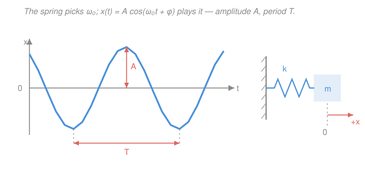

# Waves & Optics · Lesson 1.1: Simple harmonic motion

> ⏱ ~15 min · Module 1: Oscillations & resonance · Builds on: [`mechanics-refresher` 3.1](../../mechanics-refresher/lessons/03-01-simple-harmonic-motion.md), [`ode-refresher` syllabus](../../ode-refresher/syllabus.md) · Unlocks: 1.2 (damped oscillations)

## Why this matters

This whole course is the story of one thing that wiggles. A wave on a string, a sound in air, light through a lens — every one of them is, at bottom, a *field of coupled oscillators* passing a disturbance along. So before we let the wiggle travel, we study it standing still: a single mass bobbing on a spring. That's **simple harmonic motion (SHM)**, and it earns the opening slot for a deep reason — *every* smooth potential-energy well looks like a parabola near its bottom, so *every* small oscillation is SHM to first approximation. Master one spring here and you've seeded the entire waves-and-optics story that follows.

> You may have met this in [`mechanics-refresher` 3.1](../../mechanics-refresher/lessons/03-01-simple-harmonic-motion.md). Same equation — but there it was the capstone of mechanics; here it's the *seed* of waves. Read it with an eye on what happens when you line up a million of these springs in a row (that's [2.1](02-01-wave-equation-traveling-waves.md)).

## The idea

What makes something oscillate? One ingredient: a force that always points *back toward home* and grows with how far you've strayed. Stretch a spring twice as far, it pulls back twice as hard. That's a **linear restoring force**. Because the pull is strongest when you're farthest out, the mass gets yanked back, builds speed, and shoots *past* equilibrium — where the force reverses and brakes it. It can never just settle; it trades position for speed and back again, ringing on — until friction bleeds it away, which is [1.2's job](01-02-damped-oscillations.md).

The payoff is that this back-and-forth traces a **cosine curve in time** — not approximately, exactly. And the tempo of that cosine depends on only two things: how *stiff* the restoring force is and how *heavy* the thing is. Stiffer and lighter ring faster. Crucially, it does **not** depend on how far you pulled — a wide swing and a tiny swing take the *same time*. That amplitude-independence, called **isochronism**, is what lets a pendulum clock keep time, and it's the property that will let us add waves together cleanly later on.

## The formal version

**Hooke's law.** A spring displaced $x$ (meters, measured from equilibrium) pulls back with force

$$F = -kx,$$

where $k$ (newtons per meter, N/m) is the **spring constant** — the stiffness. *In words: the force is proportional to the displacement and points opposite to it* — the minus sign is the "restoring" part.

Feed this into Newton's second law $F = m\ddot x$, with $m$ the mass (kg) and $\ddot x = d^2x/dt^2$ the acceleration:

$$m\ddot x = -kx \qquad\Longrightarrow\qquad \ddot x + \omega_0^2\, x = 0, \qquad \omega_0 \equiv \sqrt{\tfrac{k}{m}}.$$

*In words: acceleration is proportional to displacement and opposite in sign.* This is a second-order constant-coefficient ODE (see the [`ode-refresher` syllabus](../../ode-refresher/syllabus.md)) — its characteristic roots are $r = \pm i\omega_0$, purely imaginary, the *undamped* case. Its general solution is

$$\boxed{\,x(t) = A\cos(\omega_0 t + \phi)\,}$$

with three quantities you read straight off the motion:

- **Amplitude** $A$ (m): the farthest displacement — the height of the cosine. Set by how far you pulled.
- **Natural angular frequency** $\omega_0$ (radians per second, rad/s): the tempo, $\omega_0 = \sqrt{k/m}$. Set by the *system*, not by you. (The subscript $0$ marks it as the *natural* frequency — the rate the system rings on its own, before damping or driving in [1.2–1.3] shift it.)
- **Phase** $\phi$ (rad): where in the cycle you started at $t = 0$. Set by the initial conditions.

From $\omega_0$ come the two everyday timing numbers:

$$T = \frac{2\pi}{\omega_0} \quad (\text{period, seconds}), \qquad f = \frac{1}{T} = \frac{\omega_0}{2\pi} \quad (\text{frequency, hertz, Hz}).$$

*In words: the period is the time for one full swing; the frequency is swings per second.* Note $A$ appears in **none** of these — that is isochronism, falling straight out of the math.

**The simple pendulum.** A mass on a string of length $L$ (m), displaced by angle $\theta$ (rad), feels a restoring tangential force $F = -mg\sin\theta$. That's *not* linear — but for small swings we Taylor-truncate $\sin\theta \approx \theta$ (the first term of $\sin\theta = \theta - \theta^3/6 + \cdots$), giving $mL\ddot\theta = -mg\theta$, i.e. $\ddot\theta + \omega_0^2\theta = 0$ with

$$\omega_0 = \sqrt{\frac{g}{L}}, \qquad T = 2\pi\sqrt{\frac{L}{g}},$$

using $g = 9.8\ \mathrm{m/s^2}$. *In words: for small angles a pendulum is a spring in disguise, with $k/m$ replaced by $g/L$.* The mass cancels — pendula of any weight keep the same time.

**Energy in SHM.** The spring stores potential energy $U = \tfrac12 kx^2$, and the motion carries kinetic energy $K = \tfrac12 m v^2$ with $v = \dot x$. Substituting $x = A\cos(\omega_0 t + \phi)$ and $v = -A\omega_0\sin(\omega_0 t + \phi)$ and using $m\omega_0^2 = k$:

$$E = \tfrac12 kx^2 + \tfrac12 m v^2 = \tfrac12 kA^2 = \text{constant.}$$

*In words: energy sloshes back and forth between spring (potential) and motion (kinetic), but the total stays pinned at $\tfrac12 kA^2$* — all potential at the turning points ($v = 0$), all kinetic at equilibrium ($x = 0$). Keep this picture: a traveling wave is just this same energy hand-off, passed from one oscillator to its neighbor.

## Picture

## Worked examples

**Example 1 (mechanical — read off the numbers).** A 0.5 kg mass on a spring with $k = 200$ N/m is pulled 0.1 m and released. Then

$$\omega_0 = \sqrt{\frac{k}{m}} = \sqrt{\frac{200}{0.5}} = \sqrt{400} = 20\ \mathrm{rad/s}, \qquad T = \frac{2\pi}{20} \approx 0.31\ \mathrm{s}.$$

The mass is fastest at equilibrium, where all the energy is kinetic: $\tfrac12 m v_{\max}^2 = \tfrac12 kA^2$, so $v_{\max} = A\omega_0 = 0.1 \times 20 = 2\ \mathrm{m/s}$. Every timing number came from $k$ and $m$ alone — the 0.1 m pull set only how *big* the swing is, never how *fast*.

**Example 2 (why you'd care — the universal well).** Why does SHM show up *everywhere*, and why open a waves course with it? Take any smooth potential $U(x)$ with a minimum at $x_0$. Taylor-expand about it:

$$U(x) \approx U(x_0) + \underbrace{U'(x_0)}_{=\,0}(x - x_0) + \tfrac12 U''(x_0)(x - x_0)^2 + \cdots$$

The linear term vanishes (it's a minimum), so *to leading order every well is a parabola* $\tfrac12 U''(x_0)(x-x_0)^2$ — a spring with effective stiffness $k_{\text{eff}} = U''(x_0)$. Anything jiggling near a stable equilibrium therefore oscillates with

$$\omega_0 = \sqrt{\frac{U''(x_0)}{m}}.$$

That's why the same $\cos(\omega_0 t + \phi)$ describes a vibrating molecule, a swaying bridge, and a mass on a spring — and, once we chain these wells together, why the same sinusoid describes light. This universality is the reason the course starts *here*.

## Watch out

- **You might think a bigger pull means a longer period.** It doesn't — $A$ is nowhere in $T = 2\pi/\omega_0$. A wider swing just moves *faster* to cover more ground in the same time. (This breaks only when a pendulum's angle gets large and $\sin\theta \approx \theta$ fails.)
- **You might confuse $\omega_0$ and $f$.** They differ by a factor of $2\pi$: $\omega_0$ is in rad/s, $f$ is in cycles/s (Hz). Plug $\omega_0$ — not $f$ — into $\cos(\omega_0 t + \phi)$.
- **You might drop the minus sign in Hooke's law.** Without it the equation is $\ddot x = +\omega_0^2 x$, whose solutions are *exponentials* $e^{\pm\omega_0 t}$ that run away — a push-*away* force, an unstable equilibrium, no oscillation. The restoring sign is the whole game.

## One-liner

> A linear restoring force gives $\ddot x + \omega_0^2 x = 0$, whose solution $A\cos(\omega_0 t + \phi)$ rings at $\omega_0 = \sqrt{k/m}$ — stiffness over inertia — no matter how hard you pull.

## Problems

**P1 (🟢)** A 0.25 kg mass on a spring with $k = 100$ N/m oscillates with amplitude 0.08 m. Find the natural angular frequency $\omega_0$, the period $T$, the frequency $f$, and the maximum speed.

**P2 (🟡)** A simple pendulum has period $T = 2.0$ s. Find its length $L$ (use $g = 9.8\ \mathrm{m/s^2}$). If you moved this pendulum to the Moon, where $g$ is about $1/6$ of Earth's, what would its new period be?

**P3 (🔴, optional)** A diatomic molecule's bond behaves like a spring: its potential near the equilibrium separation is well-modeled by $U(x) = \tfrac12 k_{\text{eff}}(x - x_0)^2$ with $k_{\text{eff}} = 480$ N/m, and the effective (reduced) mass is $m = 1.14\times10^{-26}$ kg. Estimate the vibration frequency $f$. (This is roughly a real C–O-like stretch.)

Solutions

**P1** With $m = 0.25$ kg and $k = 100$ N/m:

$$\omega_0 = \sqrt{\frac{k}{m}} = \sqrt{\frac{100}{0.25}} = \sqrt{400} = 20\ \mathrm{rad/s}, \qquad T = \frac{2\pi}{\omega_0} = \frac{2\pi}{20} \approx 0.31\ \mathrm{s}, \qquad f = \frac{1}{T} \approx 3.2\ \mathrm{Hz}.$$

Max speed is at equilibrium (all kinetic): $v_{\max} = A\omega_0 = 0.08 \times 20 = 1.6\ \mathrm{m/s}$.

*Check.* Units: $\sqrt{(\mathrm{N/m})/\mathrm{kg}} = \sqrt{\mathrm{s^{-2}}} = \mathrm{s^{-1}}$ ✓ (rad is dimensionless), and $A\omega_0 = \mathrm{m\cdot s^{-1}}$ ✓. Sanity: $f = \omega_0/2\pi = 20/6.28 \approx 3.2$ Hz matches $1/T$ ✓.

**P2** Invert $T = 2\pi\sqrt{L/g}$:

$$L = \frac{gT^2}{4\pi^2} = \frac{9.8 \times (2.0)^2}{4\pi^2} = \frac{39.2}{39.48} \approx 0.99\ \mathrm{m}.$$

On the Moon $g_{\text{Moon}} = 9.8/6 \approx 1.63\ \mathrm{m/s^2}$, and $T \propto 1/\sqrt{g}$, so

$$T_{\text{Moon}} = T_{\text{Earth}}\sqrt{\frac{g_{\text{Earth}}}{g_{\text{Moon}}}} = 2.0\,\sqrt{6} \approx 4.9\ \mathrm{s}.$$

*Check.* Units: $\sqrt{(\mathrm{m/s^2})\cdot\mathrm{s^2}} = \mathrm{m}$ ✓, and a near-1 m pendulum giving a 2 s period is the classic "seconds pendulum." Weaker gravity ⇒ slower swing, so $T$ grows ✓.

**P3** Treat it as SHM with $\omega_0 = \sqrt{k_{\text{eff}}/m}$:

$$\omega_0 = \sqrt{\frac{480}{1.14\times10^{-26}}} = \sqrt{4.21\times10^{28}} \approx 2.05\times10^{14}\ \mathrm{rad/s}, \qquad f = \frac{\omega_0}{2\pi} \approx 3.3\times10^{13}\ \mathrm{Hz}.$$

*Check.* Units land in $\mathrm{s^{-1}}$ as in P1. That $f \sim 3\times10^{13}$ Hz sits in the infrared — exactly where molecules absorb, which is *why* infrared spectroscopy reads out bond stiffness. The "universal parabola" of Example 2 is doing real work: a chemical bond is just a very stiff, very light spring. ✓

## Connections

- **Backward:** SHM is the purely-imaginary-roots ($r = \pm i\omega_0$) case of the second-order constant-coefficient ODE from the [`ode-refresher` syllabus](../../ode-refresher/syllabus.md) — no real part means no decay, a ring that never dies. The energy split $\tfrac12 kx^2 \leftrightarrow \tfrac12 mv^2$ is conservation of energy from [`mechanics-refresher` 3.1](../../mechanics-refresher/lessons/03-01-simple-harmonic-motion.md).
- **Forward:** [1.2 damped oscillations](01-02-damped-oscillations.md) adds friction ($-b\dot x$), pushing those roots off the imaginary axis so the ring decays; then [2.1 the wave equation](02-01-wave-equation-traveling-waves.md) lines up a continuum of these springs and lets the oscillation *travel*.
- **Sideways (the universal well):** Example 2's "every smooth minimum is a parabola" is the same second-derivative test that flags a stable equilibrium in calculus and a cost-minimizing point in economics — here it explains why one sinusoid models molecules, bridges, and, soon, light itself.
