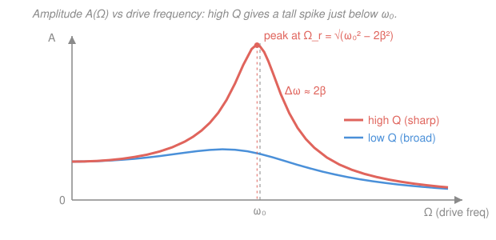

# Waves & Optics · Lesson 1.3: Driven oscillations & resonance

> ⏱ ~15 min · Module 1: Oscillations & resonance · Builds on: [1.2 Damped oscillations](01-02-damped-oscillations.md), [`ode-refresher` 2.3](../../ode-refresher/lessons/02-03-forcing-resonance.md) · Unlocks: [2.1 The wave equation](02-01-wave-equation-traveling-waves.md)

## Why this matters

Left alone, a damped oscillator just rings down and dies ([1.2](01-02-damped-oscillations.md)). But push it *rhythmically* — a hand on a swing, a speaker cone on air, a radio antenna in a passing wave — and something remarkable happens: at one special drive frequency the response swells far out of proportion to the push. That's **resonance**, and it's why a child pumps a swing at just the right tempo, why a soprano can shatter a wineglass, why the Tacoma Narrows bridge tore itself apart, and why your radio picks out one station from the thousand washing over the dial. This is the last piece of the oscillator; the whole rest of the course — waves, sound, light, spectroscopy — is built on selecting frequencies, and resonance is how nature does the selecting.

## The idea

Take the damped oscillator and stop leaving it alone: add a sinusoidal driving force that shoves back and forth at a frequency $\Omega$ *you* choose. At first the motion is a mess — the system's own dying wobble ([1.2](01-02-damped-oscillations.md)) fights the imposed rhythm. But friction erases that transient, and after a few decay times only the **steady state** survives: the mass gives up and oscillates at *your* drive frequency $\Omega$, not its own natural one. It has no choice.

The only freedom left is *how big* the response is and *how far behind* the push it lags — and both depend sharply on how close $\Omega$ sits to the natural frequency $\omega_0$. Drive slowly and the mass just follows the force sluggishly, tracking it. Drive fast and the mass's inertia can't keep up, so it barely moves and lags a full half-cycle behind. But drive *near* $\omega_0$ — hit the system at its own favorite tempo — and each push arrives exactly when it helps, energy piles in faster than damping can bleed it out, and the amplitude balloons. The lighter the damping, the taller and narrower that swell. That peak, and its width, is the whole lesson.

## The formal version

Start from the damped oscillator ([1.2](01-02-damped-oscillations.md)) and add a driving force $F_0\cos(\Omega t)$, with drive amplitude $F_0$ (newtons) and **drive angular frequency** $\Omega$ (rad/s):

$$m\ddot x + b\dot x + kx = F_0\cos(\Omega t).$$

Here $m$ is mass (kg), $b$ the damping coefficient (N·s/m), $k$ the stiffness (N/m). Divide by $m$ and reuse the two shorthands from [1.2](01-02-damped-oscillations.md): the **natural frequency** $\omega_0=\sqrt{k/m}$ (the tempo it would ring at with no friction) and the **damping rate** $\beta = b/(2m)$ (how fast free oscillations decay). *In words: an oscillator with its own preferred pitch $\omega_0$, bleeding energy at rate $\beta$, being shaken at an outside frequency $\Omega$.*

This is a driven second-order linear ODE — exactly [`ode-refresher` 2.3](../../ode-refresher/lessons/02-03-forcing-resonance.md). Its solution is (transient from [1.2](01-02-damped-oscillations.md)) + (particular steady state). The transient dies like $e^{-\beta t}$; once it's gone,

$$\boxed{\,x(t) = A(\Omega)\cos(\Omega t - \delta)\,}$$

— the mass oscillates at the **drive** frequency $\Omega$, trailing the force by a phase lag $\delta$. Plugging this in and matching terms gives the two things we care about:

$$A(\Omega) = \frac{F_0/m}{\sqrt{(\omega_0^2 - \Omega^2)^2 + 4\beta^2\Omega^2}}, \qquad \tan\delta = \frac{2\beta\Omega}{\omega_0^2 - \Omega^2}.$$

*In words: the amplitude is the drive strength divided by "how far off-tune" you are; the phase lag measures how late the mass arrives relative to the push.*

**Reading the phase.** Below resonance ($\Omega \ll \omega_0$) the denominator of $\tan\delta$ is positive and small $\Rightarrow \delta \to 0$: the mass moves **in phase**, riding along with the force. **At** $\Omega = \omega_0$ the denominator vanishes $\Rightarrow \delta = 90^\circ$: the mass lags the force by a quarter cycle — which means the force is exactly in phase with the *velocity*, pumping in power most efficiently. Above resonance ($\Omega \gg \omega_0$) the denominator goes negative $\Rightarrow \delta \to 180^\circ$: the mass moves **antiphase**, fighting the push.

**Where the amplitude peaks.** To maximize $A(\Omega)$, minimize the stuff under the root. Let $u = \Omega^2$ and minimize $g(u) = (\omega_0^2 - u)^2 + 4\beta^2 u$: setting $g'(u) = -2(\omega_0^2 - u) + 4\beta^2 = 0$ gives $u = \omega_0^2 - 2\beta^2$, so the **amplitude-resonance frequency** is

$$\Omega_r = \sqrt{\omega_0^2 - 2\beta^2}.$$

*In words: the peak sits slightly **below** the natural frequency — and the more damping, the more it slides down.* Why below? The damping force $-b\dot x$ drains energy fastest where the velocity is largest, and slowing the drive a touch below $\omega_0$ shifts the response to soften that loss — the system trades a hair of "in-tuneness" for less friction, and nets a taller peak. (Undamped, $\beta = 0$, the peak sits exactly at $\omega_0$ and blows up to infinity.)

**How sharp is the peak? The quality factor.**

$$Q = \frac{\omega_0}{2\beta} = \frac{\omega_0}{\Delta\omega}, \qquad \Delta\omega \approx 2\beta \ \text{(light damping)}.$$

*In words: $Q$ counts how many radians of oscillation the energy survives — high $Q$ means a tall, narrow, ringing resonance; low $Q$ means a broad, dull bump.* $\Delta\omega$ is the **full width** of the peak at $1/\sqrt2$ of its height (the half-power points). A high-$Q$ radio circuit ($Q \sim 100$) rings sharply enough to isolate one station; a low-$Q$ car suspension ($Q \sim 1$) is deliberately mushy so it doesn't keep bouncing. The peak height itself scales with $Q$: for light damping $A(\Omega_r) \approx (F_0/m)/(2\beta\omega_0) = Q\,(F_0/k)$, i.e. **$Q$ times the static push-and-hold deflection** $F_0/k$. Drive a $Q = 100$ system on resonance and it responds 100× harder than a steady shove of the same strength.

## Picture

## Worked examples

**Example 1 (mechanical — locate the peak).** A 0.5 kg mass on a $k = 200$ N/m spring sits in oil with damping $b = 2$ N·s/m, driven by $F_0\cos(\Omega t)$. Then

$$\omega_0 = \sqrt{k/m} = \sqrt{200/0.5} = 20\ \mathrm{rad/s}, \qquad \beta = \frac{b}{2m} = \frac{2}{2(0.5)} = 2\ \mathrm{rad/s}.$$

Since $\beta = 2 \ll \omega_0 = 20$, the free motion is lightly **underdamped**. The amplitude peaks at

$$\Omega_r = \sqrt{\omega_0^2 - 2\beta^2} = \sqrt{400 - 8} = \sqrt{392} \approx 19.8\ \mathrm{rad/s}$$

— just a hair below $\omega_0$, as promised. Its sharpness is $Q = \omega_0/(2\beta) = 20/4 = 5$, so the peak is about 5× taller than a static shove would give, and its half-power width is $\Delta\omega \approx 2\beta = 4$ rad/s.

**Example 2 (why you'd care — the swing and the glass).** Pushing a swing works because a swing *is* this system: $\omega_0 = \sqrt{g/L}$ from its pendulum length, lightly damped by air and friction (high $Q$, maybe 10–20). Shove once per natural period — drive at $\Omega \approx \omega_0$ — and every push lands in phase with the motion, so amplitude grows toward $Q$ times what one shove alone would do; push off-rhythm and you fight yourself ($\delta$ swings past $90^\circ$). A wineglass is the same story with a huge $Q$ (hundreds): sing its pitch and the tiny sound-pressure force, multiplied by that enormous $Q$, drives the rim past its breaking strain. The engineering lesson is the flip side — to *avoid* catastrophe (bridges in wind, buildings in quakes) you either move $\omega_0$ far from any drive frequency, or crank up the damping to kill $Q$.

## Watch out

- **You might think the amplitude peaks exactly at $\omega_0$.** It peaks at $\Omega_r = \sqrt{\omega_0^2 - 2\beta^2}$, always a bit *below*. Three different "resonant" frequencies actually live here: the natural $\omega_0$, the damped free-ringing frequency $\omega_1 = \sqrt{\omega_0^2 - \beta^2}$ from [1.2](01-02-damped-oscillations.md), and this amplitude peak $\Omega_r = \sqrt{\omega_0^2 - 2\beta^2}$. For light damping all three nearly coincide; for heavy damping they split apart, and if $\beta > \omega_0/\sqrt2$ the amplitude peak vanishes entirely.
- **You might expect the mass to oscillate at its natural frequency $\omega_0$.** In steady state it oscillates at the **drive** frequency $\Omega$ — the driver wins. $\omega_0$ only sets *how strongly* it responds. ($\omega_0$ lives on in the dying transient, not the steady state.)
- **You might ignore the phase lag.** At resonance the displacement lags the force by $90^\circ$, not $0^\circ$ — the force leads, syncing with velocity to pour in power. Assuming the mass moves in step with the push gives the wrong energy balance.

## One-liner

> Drive a damped oscillator and it settles at *your* frequency $\Omega$ with amplitude $A(\Omega) = (F_0/m)/\sqrt{(\omega_0^2-\Omega^2)^2+4\beta^2\Omega^2}$, peaking just below $\omega_0$ at a height set by the quality factor $Q = \omega_0/2\beta$.

## Problems

**P1 (🟢)** A 2 kg mass on a $k = 50$ N/m spring is damped by $b = 4$ N·s/m and driven sinusoidally. Find the natural frequency $\omega_0$, classify the free damping (under/critical/over), find the drive frequency $\Omega_r$ that maximizes the steady-state amplitude, and estimate the quality factor $Q$.

**P2 (🟡)** Take the same oscillator ($\omega_0 = 5$ rad/s, $\beta = 1$ rad/s) and drive it exactly at $\Omega = \omega_0 = 5$ rad/s with $F_0 = 10$ N. Find the phase lag $\delta$ and the steady-state amplitude $A$. Then say, without computing, whether the mass moves in phase or antiphase if you instead drive at $\Omega = 12$ rad/s.

**P3 (🔴, optional)** Show that the amplitude peak $\Omega_r = \sqrt{\omega_0^2 - 2\beta^2}$ lies below the natural frequency $\omega_0$, and find the largest damping $\beta$ for which a resonance peak still exists at all (i.e. $\Omega_r$ is real and positive).

Solutions

**P1** Natural frequency:

$$\omega_0 = \sqrt{k/m} = \sqrt{50/2} = \sqrt{25} = 5\ \mathrm{rad/s}, \qquad \beta = \frac{b}{2m} = \frac{4}{2(2)} = 1\ \mathrm{rad/s}.$$

Classify: critical damping needs $\beta = \omega_0$, i.e. $b_c = 2m\omega_0 = 2(2)(5) = 20$ N·s/m. Since $b = 4 < 20$ (equivalently $\beta = 1 < \omega_0 = 5$), the free motion is **underdamped**. Amplitude-resonance frequency:

$$\Omega_r = \sqrt{\omega_0^2 - 2\beta^2} = \sqrt{25 - 2} = \sqrt{23} \approx 4.80\ \mathrm{rad/s}.$$

Quality factor: $Q = \omega_0/(2\beta) = 5/2 = 2.5$.

*Check.* Units of $\omega_0$: $\sqrt{(\mathrm{N/m})/\mathrm{kg}} = \mathrm{s^{-1}}$ ✓. $\Omega_r < \omega_0$ ✓ (peak below natural, as it must be). $Q$ is a modest few — a lightly-underdamped system, so the peak is a real but not razor-sharp bump. ✓

**P2** At $\Omega = \omega_0$ the phase denominator $\omega_0^2 - \Omega^2 = 0$, so $\tan\delta \to \infty$ and

$$\delta = 90^\circ = \pi/2.$$

Amplitude at $\Omega = \omega_0$ (the $(\omega_0^2-\Omega^2)^2$ term drops out):

$$A = \frac{F_0/m}{\sqrt{0 + 4\beta^2\omega_0^2}} = \frac{F_0/m}{2\beta\omega_0} = \frac{10/2}{2(1)(5)} = \frac{5}{10} = 0.5\ \mathrm{m}.$$

At $\Omega = 12$ rad/s $> \omega_0 = 5$, we're above resonance, so $\omega_0^2 - \Omega^2 < 0$, $\delta$ is past $90^\circ$ heading toward $180^\circ$: the mass moves **antiphase** — it lags so far it's fighting the drive.

*Check.* Units: $A = (\mathrm{N/kg})/(\mathrm{s^{-1}\cdot s^{-1}}) = (\mathrm{m/s^2})/(\mathrm{s^{-2}}) = \mathrm{m}$ ✓. Compare to the static deflection $F_0/k = 10/50 = 0.2$ m: the driven amplitude $0.5$ m is $2.5\times$ larger — exactly $Q = 2.5$, matching the peak-height rule. ✓

**P3** Since $\beta^2 \ge 0$, we have $\Omega_r^2 = \omega_0^2 - 2\beta^2 \le \omega_0^2$, so $\Omega_r \le \omega_0$ — the peak never exceeds the natural frequency, and lies strictly below it whenever there's any damping ($\beta > 0$). A real, positive peak needs $\omega_0^2 - 2\beta^2 > 0$, i.e.

$$\beta < \frac{\omega_0}{\sqrt2}.$$

*Check.* At the boundary $\beta = \omega_0/\sqrt2$, $\Omega_r = 0$: the peak has slid all the way down to zero frequency, and beyond it $A(\Omega)$ just decreases monotonically from its $\Omega = 0$ value — no resonant swell at all. Note this threshold ($\beta = \omega_0/\sqrt2$) is *below* critical damping ($\beta = \omega_0$): a still-underdamped system that would visibly ring when plucked can nonetheless show no amplitude peak when driven. ✓

## Flashback

**From Lesson 1.1 / 1.2 (SHM and damping):** A 0.25 kg mass hangs on a spring of stiffness $k = 100$ N/m with a damper of coefficient $b = 4$ N·s/m. Find the natural frequency $\omega_0$ and classify the damping regime. *(Fresh numbers — no driving here.)*

Solution

Natural frequency (from [1.1](01-01-simple-harmonic-motion.md)):

$$\omega_0 = \sqrt{k/m} = \sqrt{100/0.25} = \sqrt{400} = 20\ \mathrm{rad/s}.$$

Damping rate: $\beta = b/(2m) = 4/(2 \cdot 0.25) = 8$ rad/s. Critical damping would need $b_c = 2m\omega_0 = 2(0.25)(20) = 10$ N·s/m. Since $b = 4 < 10$ (equivalently $\beta = 8 < \omega_0 = 20$), the motion is **underdamped** — it rings while decaying.

*Check.* $\beta < \omega_0$ is the underdamped condition from [1.2](01-02-damped-oscillations.md); the damped ring frequency would be $\omega_1 = \sqrt{\omega_0^2 - \beta^2} = \sqrt{400-64} = \sqrt{336} \approx 18.3$ rad/s, real and positive, confirming genuine oscillation. ✓

## Connections

- **Backward:** this bolts a drive onto the damped oscillator of [1.2](01-02-damped-oscillations.md) — the transient that dies here *is* that lesson's decaying solution, and the peak's location depends on $\beta$ from there and $\omega_0$ from [1.1](01-01-simple-harmonic-motion.md).
- **Forward:** [2.1 The wave equation](02-01-wave-equation-traveling-waves.md) promotes one oscillator to a continuum of coupled ones; resonance returns as *normal modes* and standing waves ([2.3](02-03-superposition-standing-waves-beats.md)), where a string rings only at select frequencies — and as the sharp frequency selection behind every spectrometer and radio in the optics half.
- **Sideways (ODEs):** this is precisely the forced second-order linear ODE of [`ode-refresher` 2.3](../../ode-refresher/lessons/02-03-forcing-resonance.md): steady state = particular solution, transient = homogeneous solution, and resonance = the driving frequency near the system's complex eigenfrequency. The same math governs an RLC circuit driven by an AC source, with $Q$ setting a radio's selectivity.
