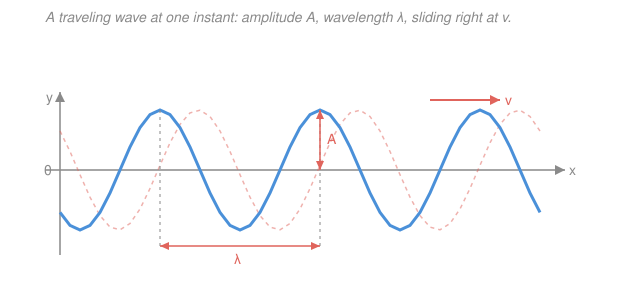

# Waves & Optics · Lesson 2.1: The wave equation & traveling waves

> ⏱ ~15 min · Module 2: Waves & superposition · Builds on: [1.1 Simple harmonic motion](01-01-simple-harmonic-motion.md) · Unlocks: [2.2 Waves on strings & sound](02-02-waves-on-strings-sound.md)

## Why this matters

A single mass on a spring rings in place forever (Lesson 1.1). But tie a whole *row* of masses together with springs, jiggle the one on the end, and the disturbance doesn't stay put — it **travels**: down the chain, along a guitar string, through the air as sound, across the ocean, out into space as light. Every one of those obeys the *same* equation, the **wave equation**, and it has a solution so clean it feels like cheating: *any shape you like*, sliding along at a fixed speed. Learn to spot that structure and you can read a wave's speed, wavelength, and frequency straight off its formula — the toolkit behind all of optics.

## The idea

Take the oscillator from Lesson 1.1 and imagine not one mass but a long line of them, each connected to its neighbors by little springs. Displace one bead sideways. It pulls on its neighbor, which pulls on *its* neighbor, and the bump you made marches down the line. No single bead travels far — each just bobs up and down about its own spot — yet the *pattern* moves. That's the essence of a wave: **a disturbance that propagates through a medium while the medium itself stays home.**

Now let the beads get infinitely dense — a continuum, like a real string. The height of the string at position $x$ and time $t$ is a function $y(x,t)$. Two competing facts govern it. First, a bit of string that's more sharply curved gets pulled harder by its neighbors (curvature in space, $\partial^2 y/\partial x^2$). Second, that pull accelerates the bit up or down (acceleration in time, $\partial^2 y/\partial t^2$). Set "acceleration $\propto$ curvature" and you have the wave equation. The magic is what solves it: **push a bump of any shape to the right at constant speed and it satisfies the equation exactly** — the shape never changes, it just glides.

## The formal version

The **wave equation** in one dimension is

$$\frac{\partial^2 y}{\partial t^2} = v^2\,\frac{\partial^2 y}{\partial x^2},$$

where $y(x,t)$ is the displacement (m), $x$ is position (m), $t$ is time (s), and $v$ (m/s) is a constant — the **wave speed**, set by the medium. *In words: how fast the displacement accelerates in time equals a fixed speed-squared times how sharply it curves in space.* (The $\partial$ symbols are partial derivatives: differentiate with respect to one variable, holding the other fixed.)

**The key theorem — any shape travels.** Let $f$ be *any* twice-differentiable function of one variable. Then

$$y(x,t) = f(x - vt)$$

solves the wave equation. Here's the whole proof, and it's just the chain rule. Set $u = x - vt$, so $y = f(u)$. Then $\partial u/\partial x = 1$ and $\partial u/\partial t = -v$, giving

$$\frac{\partial y}{\partial x} = f'(u), \qquad \frac{\partial^2 y}{\partial x^2} = f''(u),$$
$$\frac{\partial y}{\partial t} = -v\,f'(u), \qquad \frac{\partial^2 y}{\partial t^2} = (-v)\big(-v\,f''(u)\big) = v^2 f''(u).$$

Compare the two second derivatives: $\;y_{tt} = v^2 f'' = v^2 y_{xx}$. Done. *In words: whatever bump $f$ describes, shifting its argument by $vt$ marches that exact bump to the right at speed $v$ — and it can't help but solve the equation.* The same computation with $u = x + vt$ (now $\partial u/\partial t = +v$) shows $g(x+vt)$ is a **left-moving** solution. Because the equation is linear, you can add them:

$$\boxed{\,y(x,t) = f(x - vt) + g(x + vt)\,}$$

is the **general solution** (d'Alembert's form): one bump running right, one running left. Why does $x - vt$ mean "moving right"? A fixed point on the shape rides along a fixed value of $u = x - vt$; to hold $u$ constant as $t$ grows, $x$ must grow — the feature slides toward $+x$.

**The harmonic wave.** The most useful single shape is a cosine:

$$y(x,t) = A\cos(kx - \omega t + \varphi).$$

This is exactly of the form $f(x - vt)$, because $kx - \omega t = k\!\left(x - \tfrac{\omega}{k}t\right)$. Reading off the pieces:

- **Amplitude** $A$ (m): the peak displacement — height of the crest.
- **Wavenumber** $k$ (rad/m): $k = \dfrac{2\pi}{\lambda}$, where $\lambda$ is the **wavelength** (m), the distance between adjacent crests. *In words: $k$ is "radians of cosine per meter" — how many cycles per meter, times $2\pi$.*
- **Angular frequency** $\omega$ (rad/s): $\omega = 2\pi f$, where $f$ is the **frequency** (Hz), the number of full oscillations a fixed point makes per second, and $T = 1/f$ is the **period** (s). This is the very same $\omega$ from SHM (Lesson 1.1): freeze the wave at one $x$ and that point does pure simple harmonic motion in $t$.
- **Phase** $\varphi$ (rad): where in the cycle you are at $x=0,\,t=0$.

The quantity $\phi(x,t) = kx - \omega t + \varphi$ is the **phase**. A "point of constant phase" — say, a particular crest — sits where $\phi$ is fixed. Setting $d\phi = 0$ gives $k\,dx - \omega\,dt = 0$, so it moves at $dx/dt = \omega/k$. That is the **phase velocity**, and pulling the master relation together:

$$\boxed{\,v = \lambda f = \frac{\omega}{k}\,}.$$

*In words: the speed of the wave equals wavelength times frequency, equivalently angular frequency divided by wavenumber.* One relation, three faces — memorize it.

**Transverse vs. longitudinal.** If the displacement $y$ is *perpendicular* to the travel direction $x$ (a string flicked up and down, or light's fields), the wave is **transverse**. If the displacement is *along* the travel direction (air compressing and rarefying as sound passes), it's **longitudinal**. The wave equation is identical; only what "$y$" physically means changes.

## Picture

A frozen snapshot in space: crest-to-crest is $\lambda$, crest height is $A$. The faint dashed curve is the *same* wave an instant later — the whole shape has slid right by $v\,\Delta t$, unchanged. Watch one fixed $x$ and you'd see that point oscillate up and down in time with period $T = 1/f$.

## Worked examples

**Example 1 (read off the numbers).** A wave on a string is $y(x,t) = 0.03\cos(5x - 40t)$ in SI units. Match to $A\cos(kx - \omega t)$:

$$A = 0.03\ \mathrm{m}, \quad k = 5\ \mathrm{rad/m}, \quad \omega = 40\ \mathrm{rad/s}.$$

Then $\lambda = \dfrac{2\pi}{k} = \dfrac{2\pi}{5} \approx 1.26\ \mathrm{m}$, $\;f = \dfrac{\omega}{2\pi} = \dfrac{40}{2\pi} \approx 6.37\ \mathrm{Hz}$, and

$$v = \frac{\omega}{k} = \frac{40}{5} = 8\ \mathrm{m/s}\quad(\text{cross-check: } \lambda f = 1.26 \times 6.37 \approx 8\ \mathrm{m/s}\ \checkmark).$$

The sign pattern $kx - \omega t$ means it travels toward $+x$.

**Example 2 (why "any shape" earns its keep).** A cracked whip sends a lone bump — not a sine — down its length. Suppose at $t=0$ the shape is $y(x,0) = \dfrac{h}{1 + (x/a)^2}$ (a single hump of height $h$, width $\sim a$). If it travels right at speed $v$ without distorting, then at any later time

$$y(x,t) = \frac{h}{1 + \big((x - vt)/a\big)^2}.$$

By the theorem, this solves the wave equation *automatically* — we never had to re-solve anything, we just replaced $x$ with $x - vt$. That's the payoff of d'Alembert: propagation is a rigid shift. (Real strings *do* eventually distort — that's dispersion, Lesson 4.4 — but the ideal wave equation says a pulse holds its shape forever.)

## Watch out

- **You might think each bit of medium travels with the wave.** It doesn't — a cork on a pond just bobs up and down as the ripple passes through it. Energy and shape move; matter stays local.
- **You might swap $k$ and $\omega$, or $f$ and $\omega$.** Keep the units straight: $k$ lives with *space* (rad/m, partners with $\lambda$), $\omega$ lives with *time* (rad/s, partners with $f$ and $T$). And $\omega = 2\pi f$, not $\omega = f$ — a factor of $2\pi$ separates "radians per second" from "cycles per second."
- **You might read the sign backwards.** $kx - \omega t$ moves **right** ($+x$); $kx + \omega t$ moves **left**. Trace a crest: for $kx - \omega t = \text{const}$, larger $t$ needs larger $x$.

## One-liner

> The wave equation $y_{tt} = v^2 y_{xx}$ lets *any* shape $f(x - vt)$ glide rigidly at speed $v$, and for a cosine $A\cos(kx-\omega t)$ that speed is $v = \lambda f = \omega/k$.

## Problems

**P1 (🟢)** A transverse wave is $y(x,t) = 0.02\cos(3.0\,x - 12\,t)$ in SI units. State its amplitude, wavenumber, and angular frequency, then compute the wavelength, frequency, wave speed, and direction of travel.

**P2 (🟡)** Show by direct differentiation that $y(x,t) = 5\,e^{-(x - 3t)^2}$ satisfies the wave equation $y_{tt} = v^2 y_{xx}$, and state the wave's speed and direction. (You should not need the explicit derivative of the Gaussian — use the chain rule with $u = x - 3t$.)

**P3 (🔴, optional)** Starting from "a point of constant phase," derive the phase velocity of $y = A\cos(kx - \omega t + \varphi)$ and evaluate it for the wave in P1. Then, in one period $T$, how far does a given crest advance?

Solutions

**P1** Matching $y = A\cos(kx - \omega t)$: $\;A = 0.02\ \mathrm{m}$, $\;k = 3.0\ \mathrm{rad/m}$, $\;\omega = 12\ \mathrm{rad/s}$.

$$\lambda = \frac{2\pi}{k} = \frac{2\pi}{3.0} \approx 2.09\ \mathrm{m}, \qquad f = \frac{\omega}{2\pi} = \frac{12}{2\pi} \approx 1.91\ \mathrm{Hz},$$
$$v = \frac{\omega}{k} = \frac{12}{3.0} = 4.0\ \mathrm{m/s}, \quad \text{traveling toward } +x \text{ (sign is } kx - \omega t).$$

*Check.* Units: $v = \omega/k = (\mathrm{rad/s})/(\mathrm{rad/m}) = \mathrm{m/s}$ ✓. Cross-check $v = \lambda f = 2.09 \times 1.91 \approx 4.0\ \mathrm{m/s}$ ✓.

**P2** Let $u = x - 3t$, so $y = 5e^{-u^2}$ and $y$ depends on $x,t$ only through $u$. With $\partial u/\partial x = 1$ and $\partial u/\partial t = -3$, the chain rule gives

$$y_x = y_u, \qquad y_{xx} = y_{uu},$$
$$y_t = -3\,y_u, \qquad y_{tt} = (-3)(-3)\,y_{uu} = 9\,y_{uu}.$$

Therefore $y_{tt} = 9\,y_{uu} = 9\,y_{xx}$, which is $y_{tt} = v^2 y_{xx}$ with $v^2 = 9$. So $v = 3\ \mathrm{m/s}$, traveling toward $+x$ (argument is $x - vt$).

*Check.* We never needed the messy $y_{uu} = 5(4u^2 - 2)e^{-u^2}$ — the whole point of the theorem is that *any* $f(x-vt)$ works, so the factor $v^2$ falls out of the argument alone, independent of the bump's shape. ✓

**P3** A crest is a point of constant phase $\phi = kx - \omega t + \varphi$. Hold $\phi$ fixed and differentiate: $\;d\phi = k\,dx - \omega\,dt = 0$, so

$$v_{\text{phase}} = \frac{dx}{dt} = \frac{\omega}{k}.$$

For P1, $v_{\text{phase}} = 12/3.0 = 4.0\ \mathrm{m/s}$ — the same $v$ as before, as it must be. In one period the crest advances

$$\Delta x = v\,T = v\cdot\frac{1}{f} = \frac{v}{f} = \lambda,$$

i.e. exactly one wavelength — which is just the relation $v = \lambda f$ read as "one wavelength per period."

*Check.* Numerically, $T = 1/f = 1/1.91 \approx 0.524\ \mathrm{s}$ and $vT = 4.0 \times 0.524 \approx 2.09\ \mathrm{m} = \lambda$ ✓.

## Flashback

**From Lesson 1.1 (Simple harmonic motion):** A 0.25 kg mass on a spring completes 5 full oscillations in 2.0 seconds. Find the spring constant $k$. *(Fresh variant — you're given the timing and must back out the stiffness.)*

Solution

Frequency $f = 5/2.0 = 2.5\ \mathrm{Hz}$, so $\omega = 2\pi f = 5\pi \approx 15.7\ \mathrm{rad/s}$. From SHM, $\omega = \sqrt{k/m}$, hence

$$k = m\omega^2 = 0.25 \times (5\pi)^2 = 0.25 \times 246.7 \approx 61.7\ \mathrm{N/m}.$$

*Check.* Units: $\mathrm{kg}\cdot(\mathrm{rad/s})^2 = \mathrm{kg/s^2} = \mathrm{N/m}$ ✓ (a newton is $\mathrm{kg\,m/s^2}$). Sanity: a light mass ringing a few times a second needs a moderately stiff spring — 62 N/m is a typical desk spring. ✓ Note $\omega$ here is the same symbol that becomes the wave's *angular frequency* once we go to a chain of these oscillators.

## Connections

- **Backward:** this promotes Lesson [1.1](01-01-simple-harmonic-motion.md)'s single oscillator to a continuum of coupled ones — the wave's $\omega$ and $A$ are literally the SHM of each point, now stitched together across space by $k$.
- **Forward:** [2.2 Waves on strings & sound](02-02-waves-on-strings-sound.md) pins down *what sets $v$* from a medium's properties ($v = \sqrt{T/\mu}$ for a string), and [2.3](02-03-superposition-standing-waves-beats.md) adds left- and right-movers to build standing waves and beats — d'Alembert's two terms colliding.
- **Sideways (PDEs):** $y_{tt} = v^2 y_{xx}$ is *the* canonical **hyperbolic partial differential equation**, and $y = f(x-vt) + g(x+vt)$ is its textbook d'Alembert solution — the same one derived in [`pdes`](../../pdes/syllabus.md). Waves are where that abstract PDE machinery earns its physical meaning.
