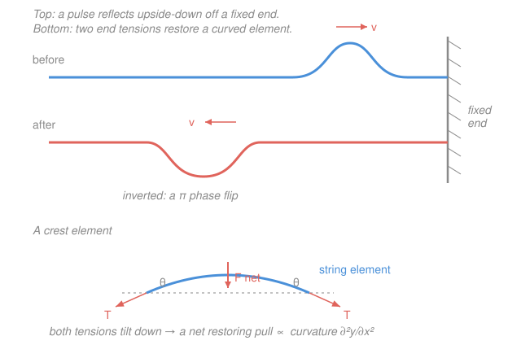

# Waves & Optics · Lesson 2.2: Waves on strings & sound

> ⏱ ~15 min · Module 2: Waves & superposition · Builds on: [2.1 The wave equation & traveling waves](02-01-wave-equation-traveling-waves.md) · Unlocks: [2.3 Superposition, standing waves & beats](02-03-superposition-standing-waves-beats.md)

## Why this matters

In [2.1](02-01-wave-equation-traveling-waves.md) the wave speed $v$ was just a number you read off the wave equation. But where does that number *come from*? Pluck a guitar string and it rings at a pitch set entirely by the string itself — its tension and its thickness. Blow across a bottle and the note depends on the air inside. This lesson turns $v$ from a given into something you **derive from the medium**: tighter and lighter means faster. That single result, $v=\sqrt{T/\mu}$, plus what happens when a wave hits the end of its medium, is the whole engine behind the next lesson's standing waves and every stringed instrument ever built.

## The idea

A stretched string is just a long row of tiny masses, each tied to its neighbors by tension. Lift one bit of string and its neighbors, pulled taut, yank it back down — the disturbance passes to the next bit, and the next, and a pulse travels. Two things set the pace. **Tension** is the restoring force: pull the string tighter and each bit snaps back harder, so the signal races along. **Mass** is the inertia: a heavier string is sluggish, slower to respond. Stiffer/tighter → faster; heavier → slower. That's the entire physical story, and the formula just makes it quantitative.

Sound is the same idea in a gas. Instead of transverse wiggles on a string, air molecules bunch up and spread out along the direction of travel — a **longitudinal pressure wave**. The "tension" is now the springiness of the air (how hard it pushes back when compressed) and the "mass" is its density. Same trade-off, same square root.

And when a wave reaches the *end* of its medium — a string tied to a wall, or clamped at a bridge — it can't just vanish. It bounces. Whether it bounces back **right-side-up or upside-down** depends on one number: the boundary's stiffness compared to the string's. That's what turns a traveling pulse into a trapped, resonating standing wave.

## The formal version

**Wave speed on a string.** Take a small element of string of length $\Delta x$ and mass $\mu\,\Delta x$, where $\mu$ (kg/m) is the **linear mass density** — mass per unit length. The string has uniform tension $T$ (newtons, N), directed along the string at each end of the element. When the string is curved, those two end-tensions don't cancel: they leave a small **net transverse force**. For small slopes, the tension's vertical component at position $x$ is $T\sin\theta \approx T\tan\theta = T\,\partial y/\partial x$, so the net upward force on the element is

$$F_{\perp} \approx T\left.\frac{\partial y}{\partial x}\right|_{x+\Delta x} - T\left.\frac{\partial y}{\partial x}\right|_{x} \approx T\,\frac{\partial^2 y}{\partial x^2}\,\Delta x.$$

*In words: the net sideways pull is proportional to the string's curvature — how sharply it bends.* Newton's second law, $F_\perp = (\mu\,\Delta x)\,\partial^2 y/\partial t^2$, then gives

$$\mu\,\frac{\partial^2 y}{\partial t^2} = T\,\frac{\partial^2 y}{\partial x^2} \qquad\Longrightarrow\qquad \frac{\partial^2 y}{\partial t^2} = \frac{T}{\mu}\,\frac{\partial^2 y}{\partial x^2}.$$

Matching this to the wave equation $\partial^2 y/\partial t^2 = v^2\,\partial^2 y/\partial x^2$ from [2.1](02-01-wave-equation-traveling-waves.md) reads off the speed:

$$\boxed{\,v = \sqrt{\frac{T}{\mu}}\,}$$

*In words: waves run faster on a tighter, lighter string.* The wave equation wasn't handed to us this time — it **fell out of $F=ma$** on a curved element, and the price tag on $v$ came with it.

**Sound as a pressure wave.** The identical argument in a fluid replaces tension by the **bulk modulus** $B$ (pascals, Pa) — the fluid's resistance to compression, $B = -V\,dP/dV$ — and $\mu$ by the mass density $\rho$ (kg/m³):

$$v = \sqrt{\frac{B}{\rho}}.$$

*In words: sound is fast in a stiff, light medium.* For air at room temperature this gives $v \approx 343\ \mathrm{m/s}$ (using the adiabatic $B \approx 1.42\times10^5$ Pa and $\rho\approx1.2\ \mathrm{kg/m^3}$).

**Impedance and reflection.** How a wave splits at a boundary is governed by the **impedance** $Z = \sqrt{T\mu}$ (units kg/s) — loosely, how hard the medium pushes back for a given wiggle speed. When a wave passes from medium 1 into medium 2, the fraction of *amplitude* reflected is

$$r = \frac{Z_1 - Z_2}{Z_1 + Z_2}.$$

*In words: the bigger the impedance mismatch, the more reflects.* Three cases:

- **Fixed end** ($Z_2\to\infty$, an immovable wall): $r = -1$. The pulse reflects **inverted** — a $\pi$ phase flip. (The wall can't move, so it yanks back with an equal-and-opposite kink.)
- **Free end** ($Z_2\to 0$, a frictionless ring on a pole): $r = +1$. The pulse reflects **upright**.
- **Junction of two strings** (same $T$, different $\mu$): partial reflection *and* transmission. Light-to-heavy ($Z_1<Z_2$) gives $r<0$ — the reflection **inverts**, like a fixed end. Heavy-to-light ($Z_1>Z_2$) gives $r>0$ — reflection stays **upright**, like a free end.

**Energy and power.** A wave carries energy. The average power a sinusoidal wave $y=A\cos(kx-\omega t)$ transports down a string is

$$\bar P = \tfrac12\,\mu\,\omega^2 A^2 v.$$

*In words: loudness scales with the square of both frequency and amplitude.* Double the amplitude → four times the power; double the frequency → four times the power.

## Picture

## Worked examples

**Example 1 (mechanical — read the speed off the medium).** A string carries tension $T = 100$ N and has linear density $\mu = 0.010$ kg/m. Its wave speed is

$$v = \sqrt{\frac{T}{\mu}} = \sqrt{\frac{100}{0.010}} = \sqrt{10000} = 100\ \mathrm{m/s}.$$

Now swap in a thinner string of half the density, $\mu = 0.005$ kg/m, same tension:

$$v = \sqrt{\frac{100}{0.005}} = \sqrt{20000} \approx 141\ \mathrm{m/s}.$$

Halving the mass raised the speed by $\sqrt2$ — lighter is faster, and because it's under a square root you need a *fourfold* change to double the speed.

**Example 2 (why you'd care — the helium voice).** Why does breathing helium make your voice squeak? Your vocal tract resonates at frequencies set by $f \propto v$ (next lesson's standing-wave result). Sound speed is $v=\sqrt{B/\rho}$, and helium is far *lighter* than air — about $\rho_{\text{He}}\approx0.18\ \mathrm{kg/m^3}$ versus $\rho_{\text{air}}\approx1.2$ (the bulk modulus barely changes). So

$$\frac{v_{\text{He}}}{v_{\text{air}}} = \sqrt{\frac{\rho_{\text{air}}}{\rho_{\text{He}}}} \approx \sqrt{\frac{1.2}{0.18}} \approx 2.6.$$

Sound travels ~2.6× faster in helium, so every resonant frequency of your vocal tract jumps up by the same factor — hence the cartoon pitch. (Your vocal *cords* still vibrate at their usual rate; it's the tract's resonances that shift.) Same $\sqrt{\text{stiffness}/\text{inertia}}$ law as the string.

## Watch out

- **You might think tension alone sets the speed.** It's the *ratio* $T/\mu$ that matters. A tight but heavy bass string can be slower than a slack but thin one. Always weigh tension against density.
- **You might think doubling the tension doubles the speed.** It's a square root: $v\propto\sqrt T$, so quadrupling $T$ doubles $v$. This trips people up when tuning — a small pitch change needs a surprisingly large tension change.
- **You might expect every reflection to flip.** Only the *fixed* end (or a light-to-heavy transition) inverts. A *free* end reflects upright. The sign of $Z_1-Z_2$ decides it — get that backwards and your standing-wave nodes land in the wrong place next lesson.

## One-liner

> A wave's speed is set by the medium — $\sqrt{\text{restoring stiffness}/\text{inertia}}$, i.e. $\sqrt{T/\mu}$ on a string or $\sqrt{B/\rho}$ in air — and it reflects inverted off anything stiffer than itself.

## Problems

**P1 (🟢)** A string has linear mass density $\mu = 5.0\ \mathrm{g/m}$ and is under tension $T = 125$ N. Find the wave speed. Then: by what factor must you change the tension to *double* the speed?

**P2 (🟡)** A string of length $L = 0.80$ m is fixed at both ends, with $\mu = 0.0040$ kg/m and $T = 64$ N. The lowest mode (the fundamental) fits exactly **half a wavelength** between the ends, so $\lambda_1 = 2L$. Find the wave speed, the fundamental frequency $f_1$, and the third harmonic $f_3$. (This is the setup for Boss Problem 2.)

**P3 (🔴, optional)** Two strings under the *same* tension $T$ are tied together. String 1 (where the wave starts) has density $\mu$; string 2 has density $4\mu$. Using $Z=\sqrt{T\mu}$, find the amplitude reflection coefficient $r$ at the junction, say whether the reflected pulse is upright or inverted, and find the ratio of wave speeds $v_2/v_1$.

Solutions

**P1** Convert density: $\mu = 5.0\ \mathrm{g/m} = 0.0050$ kg/m. Then

$$v = \sqrt{\frac{T}{\mu}} = \sqrt{\frac{125}{0.0050}} = \sqrt{25000} \approx 158\ \mathrm{m/s}.$$

Since $v\propto\sqrt T$, doubling $v$ needs $\sqrt{T'/T}=2$, i.e. $T' = 4T$ — **quadruple** the tension.

*Check.* Units: $\sqrt{\mathrm{N}/(\mathrm{kg/m})} = \sqrt{(\mathrm{kg\,m/s^2})/(\mathrm{kg/m})} = \sqrt{\mathrm{m^2/s^2}} = \mathrm{m/s}$ ✓. The factor-of-4 for a factor-of-2 speed is the square-root law from "Watch out." ✓

**P2** Speed first:

$$v = \sqrt{\frac{T}{\mu}} = \sqrt{\frac{64}{0.0040}} = \sqrt{16000} \approx 126.5\ \mathrm{m/s}.$$

The fundamental has $\lambda_1 = 2L = 1.60$ m, and frequency is speed over wavelength:

$$f_1 = \frac{v}{\lambda_1} = \frac{v}{2L} = \frac{126.5}{1.60} \approx 79.1\ \mathrm{Hz}.$$

Harmonics of a string fixed at both ends are integer multiples, so

$$f_3 = 3f_1 \approx 237\ \mathrm{Hz}.$$

*Check.* Units of $v/2L$: $(\mathrm{m/s})/\mathrm{m} = \mathrm{s^{-1}} = \mathrm{Hz}$ ✓. ~79 Hz sits near the low E of a bass guitar (41 Hz) to a cello C — a plausible low musical pitch for a heavyish 0.8 m string. ✓

**P3** Impedances: $Z_1 = \sqrt{T\mu}$ and $Z_2 = \sqrt{T\cdot4\mu} = 2\sqrt{T\mu} = 2Z_1$. Then

$$r = \frac{Z_1 - Z_2}{Z_1 + Z_2} = \frac{Z_1 - 2Z_1}{Z_1 + 2Z_1} = \frac{-Z_1}{3Z_1} = -\frac13.$$

The negative sign means the reflected pulse is **inverted** (light-to-heavy behaves like a fixed end), with one-third the incident amplitude. Speeds: $v=\sqrt{T/\mu}$, so

$$\frac{v_2}{v_1} = \sqrt{\frac{T/4\mu}{T/\mu}} = \sqrt{\tfrac14} = \tfrac12.$$

*Check.* The heavier string is slower ($v_2 = v_1/2$), matching "heavier → slower." And $|r|<1$ with the rest transmitted, as energy conservation demands. In the fixed-end limit $\mu_2\to\infty$, $Z_2\to\infty$ and $r\to-1$ — full inverted reflection, consistent with the figure. ✓

## Flashback

**From Lesson 2.1 (The wave equation & traveling waves):** A wave on a string is described by $y(x,t) = 0.020\cos(3.0\,x - 12\,t)$ in SI units. Find its wavelength $\lambda$, frequency $f$, speed $v$, and direction of travel.

Solution

Read off the wavenumber and angular frequency from $y=A\cos(kx-\omega t)$: $k = 3.0\ \mathrm{rad/m}$, $\omega = 12\ \mathrm{rad/s}$.

$$\lambda = \frac{2\pi}{k} = \frac{2\pi}{3.0} \approx 2.09\ \mathrm{m}, \qquad f = \frac{\omega}{2\pi} = \frac{12}{2\pi} \approx 1.91\ \mathrm{Hz}, \qquad v = \frac{\omega}{k} = \frac{12}{3.0} = 4.0\ \mathrm{m/s}.$$

The argument is $kx - \omega t$ (a *minus* sign), so the wave moves in the **$+x$ direction** — the pattern that keeps $kx-\omega t$ constant needs $x$ to grow as $t$ grows.

*Check.* Consistency: $v = \lambda f = 2.09 \times 1.91 \approx 4.0\ \mathrm{m/s}$ ✓, matching $\omega/k$. Units of $v$: $(\mathrm{rad/s})/(\mathrm{rad/m}) = \mathrm{m/s}$ ✓.

## Connections

- **Backward:** [2.1](02-01-wave-equation-traveling-waves.md) postulated the wave equation and its speed $v$; here that same equation *emerges* from Newton's second law on a string element, and $v=\sqrt{T/\mu}$ is pinned to the medium. The curvature-driven restoring force is the continuum cousin of the linear restoring force behind [simple harmonic motion](../../mechanics-refresher/lessons/03-01-simple-harmonic-motion.md) — a string is infinitely many coupled oscillators.
- **Forward:** [2.3 Superposition, standing waves & beats](02-03-superposition-standing-waves-beats.md) traps a wave between two fixed ends. The inverted reflection derived here is exactly what makes the incoming and outgoing waves interfere into fixed nodes — and $v=\sqrt{T/\mu}$ sets every harmonic frequency (Boss Problem 2).
- **Sideways (impedance):** the reflection coefficient $r=(Z_1-Z_2)/(Z_1+Z_2)$ reappears verbatim in optics — light reflecting off glass ([3.1 Snell's law](03-01-reflection-refraction-snell.md), thin films in [4.1](04-01-interference-double-slit-thin-films.md)) flips phase going from low to high refractive index, the optical version of a string's light-to-heavy inversion. Same math, different medium.
