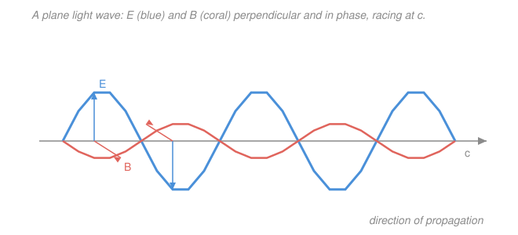

# Waves & Optics · Lesson 2.4: Light as an electromagnetic wave

> ⏱ ~15 min · Module 2: Waves & superposition · Builds on: [2.1 The wave equation & traveling waves](02-01-wave-equation-traveling-waves.md), [`em-refresher` 4.2 Electromagnetic waves](../../em-refresher/lessons/04-02-electromagnetic-waves.md) · Unlocks: [3.1 Reflection, refraction & Snell's law](03-01-reflection-refraction-snell.md)

## Why this matters

For half of this course "a wave" meant a wiggle *in something* — a string, a column of air. Light is the shocking case: it's a wave in the electric and magnetic fields themselves, needing no medium at all, which is how sunlight crosses the vacuum to reach you. The payoff is that everything you've built for waves — speed, wavelength, superposition, interference — transfers wholesale to light, which is what makes the optics half of this course possible. And the single number that falls out, the speed $c$, is stitched together from two constants that have nothing obviously to do with light — a coincidence so loud it told Maxwell what light *is*.

## The idea

Two facts from electromagnetism, taken on faith here (they're derived in [`em-refresher` 4.2](../../em-refresher/lessons/04-02-electromagnetic-waves.md)): a **changing electric field creates a magnetic field**, and a **changing magnetic field creates an electric field**. Put those together and you get a self-feeding loop. Jiggle an electric field somewhere; the *change* births a magnetic field just beyond it; that new magnetic field is itself changing, so it births an electric field a little further on; and so the disturbance leapfrogs through empty space, each field regenerating the other. Neither can stop without the other stopping — they hold each other up, like two people climbing by bracing on one another. That travelling, self-sustaining pair of fields **is** light.

Because it's the fields doing the waving, there's nothing to leave behind — no air, no string, no water. That's why light crosses the vacuum of space and sound doesn't. And the tune it plays — its wavelength — is the *only* thing that separates a radio broadcast from a dentist's X-ray. Same physics, same speed, wildly different wavelength.

## The formal version

**Maxwell's equations** (quoted, not re-derived) are the four laws governing $\mathbf E$, the electric field (volts per meter, V/m), and $\mathbf B$, the magnetic field (tesla, T). In empty space, with no charges around, two of them read

$$\nabla \times \mathbf E = -\frac{\partial \mathbf B}{\partial t}, \qquad \nabla \times \mathbf B = \mu_0\varepsilon_0\,\frac{\partial \mathbf E}{\partial t}.$$

*In words: a changing $\mathbf B$ curls up an $\mathbf E$, and a changing $\mathbf E$ curls up a $\mathbf B$* — the two feedback rules from "The idea," in symbols. Here $\varepsilon_0 = 8.85\times10^{-12}$ (the electric constant, F/m) and $\mu_0 = 4\pi\times10^{-7}$ (the magnetic constant, T·m/A). Combining them (this is the em-refresher's job) makes each field obey the **wave equation** from [2.1](02-01-wave-equation-traveling-waves.md):

$$\frac{\partial^2 E}{\partial t^2} = \frac{1}{\mu_0\varepsilon_0}\,\frac{\partial^2 E}{\partial x^2},$$

and the identical equation for $B$. Matching this to 2.1's template $\partial_{tt} = v^2\,\partial_{xx}$ reads off the wave speed:

$$\boxed{\,c = \frac{1}{\sqrt{\mu_0\varepsilon_0}} \approx 3.00\times10^{8}\ \mathrm{m/s}.\,}$$

*In words: the speed of light is fixed entirely by two electric/magnetic lab constants* — no mention of light in either. Maxwell plugged in the measured $\mu_0,\varepsilon_0$, got the known speed of light, and concluded light must be an electromagnetic wave. That coincidence is the whole discovery.

**The plane-wave solution.** The simplest travelling solution is a sinusoid moving along $x$:

$$E(x,t) = E_0\sin(kx - \omega t), \qquad B(x,t) = B_0\sin(kx - \omega t),$$

with $k$ the wavenumber (rad/m), $\omega$ the angular frequency (rad/s), and $E_0, B_0$ the field amplitudes. Four properties, all forced by Maxwell's equations:

- **Transverse:** both $\mathbf E$ and $\mathbf B$ point *perpendicular* to the travel direction (like a string wave, not a sound wave).
- **Mutually perpendicular:** $\mathbf E \perp \mathbf B$, and $\mathbf E \times \mathbf B$ points the way the wave goes.
- **In phase:** they peak together and vanish together — same $\sin(kx-\omega t)$.
- **Locked ratio:** at every point and instant, $E = cB$. *In words: the electric field is bigger than the magnetic field by exactly the factor $c$* (which is why $B$ looks "weak" — it's not, the units just differ by $c$).

Everything from 2.1 still holds: $c = \lambda f = \omega/k$, tying wavelength $\lambda$ and frequency $f$ together.

**The spectrum.** All electromagnetic waves travel at $c$; only $\lambda$ (equivalently $f = c/\lambda$) changes. In order of increasing frequency:

$$\text{radio} \;\to\; \text{microwave} \;\to\; \text{infrared} \;\to\; \underbrace{\text{visible }(\sim 400\text{–}700\text{ nm})}_{\text{violet}\to\text{red}} \;\to\; \text{ultraviolet} \;\to\; \text{X-ray} \;\to\; \gamma\text{-ray}.$$

Visible light is a sliver: roughly $400$ nm (violet) to $700$ nm (red), where $1\ \mathrm{nm} = 10^{-9}$ m.

**Intensity.** How bright a wave is — its time-averaged power per unit area (the averaged Poynting flux, watts per square meter) — is

$$I = \tfrac12\, c\,\varepsilon_0 E_0^2 \quad (\mathrm{W/m^2}).$$

*In words: brightness grows as the square of the field amplitude*, $I \propto E_0^2$. Double the field and the wave carries four times the energy.

**A medium (preview of Module 3).** Inside glass or water the fields drag on the material's charges, so light slows to $v = c/n$, where $n \ge 1$ is the **refractive index**. The frequency $f$ is set by the source and *cannot* change on crossing a boundary, so from $v = \lambda f$ the wavelength must shrink: $\lambda_{\text{medium}} = \lambda_0/n$. Hold that thought — it's exactly what bends light in [3.1](03-01-reflection-refraction-snell.md).

## Picture

## Worked examples

**Example 1 (mechanical — colour to frequency).** Red light has $\lambda = 700$ nm. Its frequency is

$$f = \frac{c}{\lambda} = \frac{3.00\times10^{8}}{700\times10^{-9}} = 4.3\times10^{14}\ \mathrm{Hz}.$$

That's 430 trillion oscillations per second — you'll never track the wave crests of light directly; you only ever see time-averaged effects like intensity. Violet, at $400$ nm, sits at $7.5\times10^{14}$ Hz: shorter wave, higher frequency, same speed.

**Example 2 (why you'd care — the field behind sunlight).** Bright sunlight delivers about $I = 1000\ \mathrm{W/m^2}$. What electric field is that? Invert the intensity formula:

$$E_0 = \sqrt{\frac{2I}{c\,\varepsilon_0}} = \sqrt{\frac{2(1000)}{(3.00\times10^{8})(8.85\times10^{-12})}} = \sqrt{7.53\times10^{5}} \approx 870\ \mathrm{V/m}.$$

The paired magnetic field is $B_0 = E_0/c = 870/(3.00\times10^8) \approx 2.9\times10^{-6}$ T — tiny in tesla, but it's *not* weaker than $\mathbf E$; the factor is just $c$. Both are pouring the same energy, half from each field.

## Watch out

- **You might think $B$ is the weakling because $B_0 \ll E_0$ numerically.** It isn't — $E = cB$ is a units artifact ($c \approx 3\times10^8$), and the energy is split evenly between the two fields. Neither dominates.
- **You might think $\mathbf E$ and $\mathbf B$ are 90° out of phase, like position and velocity in SHM.** No — in a travelling plane wave they're *in phase*: both peak together, both zero together. The 90° is *spatial* (their planes are perpendicular), not temporal.
- **You might think slowing light in glass lowers its frequency (redder colour).** It doesn't. Frequency is fixed by the source; in a medium it's $\lambda$ that shrinks while $f$ holds. Colour (which the eye reads from frequency) is unchanged underwater.

## One-liner

> Light is a changing $\mathbf E$ and $\mathbf B$ holding each other up as they leapfrog through vacuum at $c = 1/\sqrt{\mu_0\varepsilon_0}$ — transverse, perpendicular, in phase, with $E = cB$.

## Problems

**P1 (🟢)** A green laser pointer emits light of wavelength $\lambda = 532$ nm. Find its frequency $f$.

**P2 (🟡)** A radio wave has electric-field amplitude $E_0 = 600$ V/m. Find (a) its magnetic-field amplitude $B_0$, and (b) its intensity $I$. Use $\varepsilon_0 = 8.85\times10^{-12}$ F/m.

**P3 (🔴, optional)** Light of vacuum wavelength $\lambda_0 = 500$ nm enters glass with refractive index $n = 1.5$. Find its speed $v$, frequency $f$, and wavelength $\lambda_{\text{medium}}$ *inside* the glass. Which of the three changed?

Solutions

**P1** Straight from $c = \lambda f$:

$$f = \frac{c}{\lambda} = \frac{3.00\times10^{8}}{532\times10^{-9}} = 5.64\times10^{14}\ \mathrm{Hz}.$$

*Check.* Units: $(\mathrm{m/s})/\mathrm{m} = \mathrm{s^{-1}} = \mathrm{Hz}$ ✓. It lands between red ($4.3\times10^{14}$) and violet ($7.5\times10^{14}$) — squarely in the visible band, as green should. ✓

**P2** (a) The locked ratio $E = cB$ gives

$$B_0 = \frac{E_0}{c} = \frac{600}{3.00\times10^{8}} = 2.0\times10^{-6}\ \mathrm{T}.$$

(b) Intensity from the field amplitude:

$$I = \tfrac12\, c\,\varepsilon_0 E_0^2 = \tfrac12 (3.00\times10^{8})(8.85\times10^{-12})(600)^2 = \tfrac12(2.655\times10^{-3})(3.6\times10^{5}) \approx 478\ \mathrm{W/m^2}.$$

*Check.* Units of $I$: $(\mathrm{m/s})(\mathrm{F/m})(\mathrm{V/m})^2 = \mathrm{W/m^2}$ after unpacking farads and volts ✓. Magnitude sanity: a few hundred W/m² is a strong local field, roughly half of full sunlight — plausible near a powerful transmitter. ✓

**P3** Frequency is set by the source and is a vacuum property to compute once:

$$f = \frac{c}{\lambda_0} = \frac{3.00\times10^{8}}{500\times10^{-9}} = 6.0\times10^{14}\ \mathrm{Hz}\ (\text{unchanged in the glass}).$$

Speed and wavelength both drop by the factor $n$:

$$v = \frac{c}{n} = \frac{3.00\times10^{8}}{1.5} = 2.0\times10^{8}\ \mathrm{m/s}, \qquad \lambda_{\text{medium}} = \frac{\lambda_0}{n} = \frac{500}{1.5} \approx 333\ \mathrm{nm}.$$

So $v$ and $\lambda$ change; $f$ does not.

*Check.* Consistency inside the medium: $v = \lambda_{\text{medium}}\,f = (333\times10^{-9})(6.0\times10^{14}) = 2.0\times10^{8}\ \mathrm{m/s}$ ✓, matching $c/n$. This is exactly why light bends at a glass surface — the mechanism of [3.1](03-01-reflection-refraction-snell.md). ✓

## Flashback

**From Lesson 2.1 (The wave equation & traveling waves):** A wave on a rope is described by $y(x,t) = 0.02\cos(6x - 300t)$ in SI units. Read off its wavenumber $k$ and angular frequency $\omega$, then find the wavelength $\lambda$, frequency $f$, speed $v$, and direction of travel.

Solution

Match to the standard form $y = A\cos(kx - \omega t)$: $k = 6$ rad/m, $\omega = 300$ rad/s. Then

$$\lambda = \frac{2\pi}{k} = \frac{2\pi}{6} \approx 1.05\ \mathrm{m}, \qquad f = \frac{\omega}{2\pi} = \frac{300}{2\pi} \approx 47.7\ \mathrm{Hz}, \qquad v = \frac{\omega}{k} = \frac{300}{6} = 50\ \mathrm{m/s}.$$

The argument is $kx - \omega t$ (a function of $x - vt$), so the wave moves in the $+x$ direction.

*Check.* Cross-check the speed: $v = \lambda f = (1.05)(47.7) \approx 50$ m/s ✓, agreeing with $\omega/k$. The same $v = \omega/k$ machinery, applied to light, is where $c = \lambda f$ came from in this lesson. ✓

## Connections

- **Backward:** the whole lesson is [2.1](02-01-wave-equation-traveling-waves.md)'s wave equation with $v$ renamed $c$ — every tool from there ($c = \lambda f = \omega/k$, travelling sinusoids, superposition) applies unchanged to light, which is what powers Modules 3 and 4.
- **Forward:** [3.1 Reflection, refraction & Snell's law](03-01-reflection-refraction-snell.md) runs with the $v = c/n$, $\lambda_{\text{medium}} = \lambda_0/n$ preview to bend light at surfaces; the intensity $I \propto E_0^2$ becomes the currency of interference and diffraction in Module 4.
- **Sideways (electromagnetism):** the two curl equations and the result $c = 1/\sqrt{\mu_0\varepsilon_0}$ are *derived*, not just quoted, in [`em-refresher` 4.2](../../em-refresher/lessons/04-02-electromagnetic-waves.md) — this lesson is where that derivation cashes out as "light is an EM wave."
