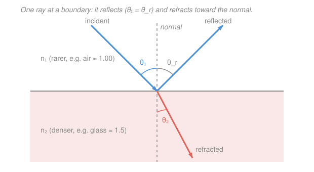

# Waves & Optics · Lesson 3.1: Reflection, refraction & Snell's law

> ⏱ ~15 min · Module 3: Geometric optics · Builds on: [2.4 Light as an electromagnetic wave](02-04-light-as-em-wave.md), [2.1 The wave equation & traveling waves](02-01-wave-equation-traveling-waves.md) · Unlocks: [3.2 Mirrors & image formation](03-02-mirrors-image-formation.md)

## Why this matters

A straw looks bent in a glass of water. A diamond throws fire. A fiber-optic cable pipes your video call across an ocean by trapping light inside a hair-thin thread. All three are the *same* phenomenon: light changing speed as it crosses from one medium into another, and bending because of it. This lesson gives you the two rules — reflection and refraction — that trace any ray across any boundary, plus the one deep principle (Fermat's least time) they both fall out of. Every lens and mirror in the next two lessons is just these rules applied twice.

## The idea

Back in [2.4](02-04-light-as-em-wave.md) light was an electromagnetic wave rippling at speed $c$ in vacuum. In *matter* — water, glass — the wave drags on the medium's electrons and travels **slower**. That slowdown is the whole story. When a wavefront hits a boundary at an angle, one edge of the front enters the slow medium before the other edge does. The lagging edge keeps racing while the leading edge crawls, so the whole front pivots — like a marching band wheeling when the left flank hits mud and the right flank is still on pavement. The ray, always perpendicular to the front, swings with it. That pivot **toward** the slow side is refraction.

First, though, a simplification that makes "rays" legal at all. Light's wavelength is under a millionth of a meter; lenses and mirrors are centimeters. When the wavelength is tiny next to the objects it meets, the wave's spreading (diffraction, Module 4) is negligible and light travels in straight lines you can draw with a ruler. That's the **ray approximation**, and it's the license for all of geometric optics.

## The formal version

**Refractive index.** Each medium slows light by a fixed factor. Define the **index of refraction**

$$n \equiv \frac{c}{v},$$

where $c = 3\times10^8\ \mathrm{m/s}$ is light's vacuum speed and $v$ is its speed in the medium. *In words: $n$ tells you how many times slower light goes here than in vacuum.* Since nothing outruns $c$, always $n \ge 1$: air $\approx 1.00$, water $\approx 1.33$, ordinary glass $\approx 1.5$, diamond $\approx 2.42$.

All angles below are measured **from the normal** — the line perpendicular to the surface — not from the surface itself. This is the single most common slip in optics.

**Law of reflection.** The part of the ray that bounces back leaves at the same angle it arrived:

$$\theta_i = \theta_r.$$

*In words: angle in equals angle out, both measured from the normal, and the incident ray, reflected ray, and normal all lie in one plane.*

**Snell's law of refraction.** The part that crosses obeys

$$\boxed{\,n_1 \sin\theta_1 = n_2 \sin\theta_2\,},$$

with $\theta_1$ the angle in medium 1 (index $n_1$) and $\theta_2$ the angle in medium 2. *In words: the product $n\sin\theta$ is conserved across the boundary.* Read off the direction of the bend: entering a **denser** medium ($n_2 > n_1$) forces $\sin\theta_2 < \sin\theta_1$, so $\theta_2 < \theta_1$ — the ray bends **toward** the normal. Leaving a denser medium, it bends **away**.

**What's conserved across the boundary.** The wave's **frequency $f$ is fixed** — the electrons at the surface are driven at the incoming frequency and re-radiate at exactly that frequency; the color can't change. But speed drops to $v = c/n$, so from $v = \lambda f$ the **wavelength shrinks**:

$$\lambda_{\text{medium}} = \frac{\lambda_{\text{vacuum}}}{n}.$$

*In words: cross into glass and the wave keeps its pitch but its ripples bunch closer together.*

**Total internal reflection (TIR).** Now go the other way — dense to rare, $n_1 > n_2$ — so the ray bends *away* from the normal and $\theta_2 > \theta_1$. Crank $\theta_1$ up and $\theta_2$ races toward $90°$, where the refracted ray skims flat along the surface. Set $\theta_2 = 90°$ in Snell's law ($\sin 90° = 1$) to find the **critical angle**:

$$\sin\theta_c = \frac{n_2}{n_1}.$$

*In words: at $\theta_c$ the refracted ray lies flat along the boundary; push past $\theta_c$ and Snell's law demands $\sin\theta_2 > 1$, which is impossible — so no light escapes and it **all** reflects.* This perfect mirror-without-a-mirror is how optical fibers trap light and why a diamond ($\theta_c \approx 24°$, so almost every internal ray is trapped and recycled) sparkles.

**Fermat's principle — where both laws come from.** Light takes the path of **least time** between two points. That one statement reproduces everything above.

- *Reflection.* Of all bounce paths from $A$ to $B$ off a flat mirror, the shortest (hence quickest, since speed is constant) is the one that makes $\theta_i = \theta_r$. (Trick: reflect $B$ to a mirror-image $B'$ behind the surface; the straight line $A\to B'$ crosses at exactly the equal-angle point.)
- *Refraction.* Crossing from speed $v_1$ to a slower $v_2$, the quickest route isn't the straight line — it's worth spending a little *extra* distance in the fast medium to shorten the slow leg, like a lifeguard who runs farther on sand to swim less. Writing the total time as a function of the crossing point $x$ and setting $dT/dx = 0$ gives

$$\frac{\sin\theta_1}{v_1} = \frac{\sin\theta_2}{v_2},$$

and since $v = c/n$, multiplying through by $c$ turns this straight into $n_1\sin\theta_1 = n_2\sin\theta_2$. Snell's law is just "least time," rearranged.

## Picture

## Worked examples

**Example 1 (refraction into glass).** A ray in air ($n_1 = 1.00$) strikes a glass surface ($n_2 = 1.50$) at $\theta_1 = 40°$ from the normal. Where does it go?

$$\sin\theta_2 = \frac{n_1}{n_2}\sin\theta_1 = \frac{1.00}{1.50}\sin 40° = \frac{0.643}{1.50} = 0.429 \;\Longrightarrow\; \theta_2 = \arcsin(0.429) \approx 25.4°.$$

The ray bends toward the normal ($25.4° < 40°$), exactly as "into a denser medium" predicts. The reflected part, meanwhile, leaves at $\theta_r = 40°$.

**Example 2 (why fibers work — the trapped ray).** Inside a glass fiber ($n_1 = 1.50$) surrounded by air ($n_2 = 1.00$), what's the steepest a ray can hit the wall and still escape? Find the critical angle:

$$\sin\theta_c = \frac{n_2}{n_1} = \frac{1.00}{1.50} = 0.667 \;\Longrightarrow\; \theta_c = \arcsin(0.667) \approx 41.8°.$$

Any ray meeting the glass–air wall at more than $41.8°$ from the normal is totally internally reflected — zero leakage, a flawless mirror. Light zig-zagging down the fiber's core always strikes the wall at a glancing (large) angle, so it stays trapped for kilometers. That's fiber optics in one line.

## Watch out

- **You might measure angles from the surface.** Every angle in reflection and Snell's law is from the **normal**. A ray grazing the surface has $\theta \to 90°$, not $0°$. Measuring from the surface flips every inequality.
- **You might think refraction changes the frequency.** It doesn't — **$f$ is fixed** across the boundary; it's the *wavelength* and *speed* that change ($\lambda \to \lambda/n$, $v \to c/n$). The color you see underwater is the same color that entered.
- **You might expect a critical angle going into glass.** TIR only happens **dense → rare** ($n_1 > n_2$). Going rare → dense, $\theta_2$ is always smaller than $\theta_1$, so it never reaches $90°$ — there's nothing to trap.

## One-liner

> Light slows by a factor $n$ in matter, so a ray bends toward the normal entering a denser medium ($n_1\sin\theta_1 = n_2\sin\theta_2$) and — going dense→rare past $\sin\theta_c = n_2/n_1$ — gets trapped entirely; both laws are just Fermat's least-time path.

## Problems

**P1 (🟢)** A ray of light in water ($n = 1.33$) hits the flat underside of the water–air surface at $30°$ from the normal and refracts out into the air ($n = 1.00$). Find the angle of the refracted ray in air.

**P2 (🟡)** Find the critical angle for light trying to escape from water ($n = 1.33$) into air ($n = 1.00$). A diver looks up: light from the whole sky above squeezes into a cone of what half-angle?

**P3 (🔴, optional)** A ray inside glass ($n = 1.50$) strikes a boundary at $50°$ from the normal. Does it totally internally reflect if the other side is **(a)** air ($n = 1.00$), or **(b)** water ($n = 1.33$)? Decide each with a critical-angle test.

Solutions

**P1** Snell's law, water → air, with $\theta_1 = 30°$ in the water:

$$n_1\sin\theta_1 = n_2\sin\theta_2 \;\Longrightarrow\; \sin\theta_2 = \frac{1.33}{1.00}\sin 30° = 1.33 \times 0.500 = 0.665,$$

$$\theta_2 = \arcsin(0.665) \approx 41.7°.$$

*Check.* Going dense → rare, the ray should bend **away** from the normal: $41.7° > 30°$ ✓. (And $\sin\theta_2 = 0.665 < 1$, so the ray does escape — we're below the critical angle found in P2.)

**P2** Set the refracted angle to $90°$ (light skimming along the surface):

$$\sin\theta_c = \frac{n_2}{n_1} = \frac{1.00}{1.33} = 0.752 \;\Longrightarrow\; \theta_c = \arcsin(0.752) \approx 48.8°.$$

Every ray from the entire sky (incidence $0°$ to $90°$ in air) refracts down into the water within $48.8°$ of the vertical, so the diver sees the whole world compressed into a bright circle — "**Snell's window**" — of half-angle $\approx 48.8°$; beyond it the surface acts as a mirror.

*Check.* Since $30° < 48.8°$, the P1 ray was indeed below critical and escaped, consistent ✓. Limiting sense: a denser medium (bigger $n_1$) gives a smaller $\theta_c$, trapping light more easily — diamond's tiny $\theta_c \approx 24°$ is the extreme. ✓

**P3** Compare $\theta_1 = 50°$ against the critical angle for each pairing (TIR happens when $\theta_1 > \theta_c$):

**(a)** Glass → air: $\displaystyle \sin\theta_c = \frac{1.00}{1.50} = 0.667$, so $\theta_c \approx 41.8°$. Since $50° > 41.8°$, **yes — total internal reflection**; no light enters the air.

**(b)** Glass → water: $\displaystyle \sin\theta_c = \frac{1.33}{1.50} = 0.887$, so $\theta_c \approx 62.5°$. Since $50° < 62.5°$, **no** — the ray refracts and passes into the water.

*Check.* The rarer the second medium, the bigger the index drop and the smaller $\theta_c$, so TIR is *easier* against air than against water — matching the result (trapped by air, not by water). Makes sense: putting a fingerprint (oily, higher $n$) on a fiber can "frustrate" TIR and leak light out. ✓

## Flashback

**From Lesson 2.4 (Light as an electromagnetic wave):** Yellow light from a sodium street-lamp has frequency $f = 5.09\times10^{14}\ \mathrm{Hz}$. Find its wavelength in vacuum, and name the region of the spectrum it belongs to. (Use $c = 3.00\times10^8\ \mathrm{m/s}$.)

Solution

Light in vacuum obeys $c = \lambda f$, so

$$\lambda = \frac{c}{f} = \frac{3.00\times10^8}{5.09\times10^{14}} \approx 5.90\times10^{-7}\ \mathrm{m} = 590\ \mathrm{nm}.$$

That sits in the **visible** band (roughly $400$–$700$ nm), near the yellow-orange middle — exactly the color a sodium lamp glows.

*Check.* Units: $(\mathrm{m/s})/(\mathrm{s^{-1}}) = \mathrm{m}$ ✓. Ties into this lesson: were this beam to enter water ($n = 1.33$), $f$ would stay $5.09\times10^{14}\ \mathrm{Hz}$ but the wavelength would shrink to $\lambda/n \approx 443\ \mathrm{nm}$ — same color, tighter ripples. ✓

## Connections

- **Backward:** the slowdown $v = c/n$ that bends the ray is the medium's response to the **EM wave** of [2.4](02-04-light-as-em-wave.md); and $f$ staying fixed while $\lambda$ shrinks is just $v = \lambda f$ from [2.1](02-01-wave-equation-traveling-waves.md) applied on each side of the boundary.
- **Forward:** [3.2 Mirrors & image formation](03-02-mirrors-image-formation.md) and [3.3 Lenses](03-03-lenses-optical-instruments.md) apply the law of reflection and Snell's law at *curved* surfaces — a lens is just refraction at two boundaries, focusing parallel rays to a point.
- **Sideways (dispersion → prisms & rainbows):** $n$ actually depends slightly on wavelength, $n(\lambda)$, and is larger for blue than red — so blue bends *more*. A prism therefore fans white light into a spectrum, and the same wavelength-dependent bending in raindrops paints the rainbow. This **dispersion** returns with full force in [4.4 Wave packets, dispersion & Fourier synthesis](04-04-wave-packets-dispersion-fourier.md), where it spreads a pulse in time.
