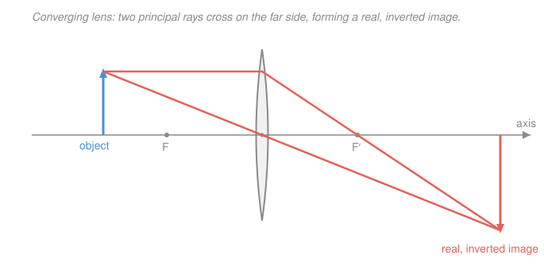

# Waves & Optics · Lesson 3.3: Lenses & optical instruments

> ⏱ ~15 min · Module 3: Geometric optics · Builds on: [3.2 Mirrors & image formation](03-02-mirrors-image-formation.md), [3.1 Reflection, refraction & Snell's law](03-01-reflection-refraction-snell.md) · Unlocks: [4.1 Interference: double slit & thin films](04-01-interference-double-slit-thin-films.md), where the wave nature of light returns

## Why this matters

Every camera, eye, microscope, projector, and telescope is a few pieces of shaped glass arranged to relay light from one place to another. A lens does what a curved mirror did in [3.2](03-02-mirrors-image-formation.md) — gather rays and cross them into an image — except light passes *through* it, bending twice (Snell's law from [3.1](03-01-reflection-refraction-snell.md) at each surface). Astonishingly, the whole story of a thin lens collapses into a single number, the focal length $f$, and a single equation you've already met in mirror form. Learn to chain two lenses and you can design the guts of any optical instrument.

## The idea

A converging lens is fatter in the middle. Rays skimming the top get bent down, rays skimming the bottom get bent up, and rays arriving *parallel* to the axis all cross at one point on the far side — the **focal point**, a distance $f$ past the lens. Run that backward: light *from* the focal point leaves the lens parallel. A lens is a machine for trading "coming from a direction" for "arriving at a place."

To find where an image forms, you don't trace the millions of rays leaving each point — you trace two or three *special* rays whose bending you already know, and see where they meet. Where the actual light crosses, you get a **real image** (you could catch it on a screen). Where only the *backward extensions* of diverging rays meet, you get a **virtual image** (your eye sees it, but no light is really there — like the image behind a flat mirror).

The one genuinely new move in this lesson is chaining: put two lenses in a row and **the image made by the first lens becomes the object for the second.** That's it. A microscope and a telescope are both just "lens 1 hands its image to lens 2."

## The formal version

**Thin-lens equation.** For a thin lens with object distance $d_o$ and image distance $d_i$ (both measured from the lens, in the same length unit),

$$\boxed{\;\frac{1}{d_o} + \frac{1}{d_i} = \frac{1}{f}\;}$$

*In words: the object and image distances are tied together by the lens's focal length — fix two, the third is forced.* This is the **same** equation as the mirror equation in [3.2](03-02-mirrors-image-formation.md); only the sign conventions for "which side is positive" differ, because light transmits through a lens instead of reflecting back.

**Magnification.**

$$m = -\frac{d_i}{d_o}, \qquad m = \frac{h_i}{h_o}$$

where $h_o, h_i$ are object and image heights. *In words: $|m|$ is how many times bigger the image is; a negative $m$ means inverted (flipped upside down), positive means upright.*

**Sign convention** (state it once, use it everywhere — consistent with [3.2](03-02-mirrors-image-formation.md)):

- **Focal length:** converging (convex) lens $f > 0$; diverging (concave) lens $f < 0$.
- **Object:** a real object (actual light diverging *into* the lens) has $d_o > 0$.
- **Image:** $d_i > 0$ is a **real** image on the *far* side of the lens (opposite the object) — and it is inverted. $d_i < 0$ is a **virtual** image on the *same* side as the object — upright.

**Lensmaker's equation** (quoted, so you know where $f$ comes from). For a thin lens of refractive index $n$ with surface radii $R_1, R_2$,

$$\frac{1}{f} = (n-1)\!\left(\frac{1}{R_1} - \frac{1}{R_2}\right).$$

*In words: the focal length is set by how much denser the glass is than air ($n-1$) and how sharply its two faces curve.* You won't compute with it here — just know that shape and material make $f$, and everything else follows from $f$.

**Three principal rays** (any two locate the image tip; the diagram uses two):

1. **Parallel ray** — comes in parallel to the axis, leaves through the *far* focal point $F'$.
2. **Chief (center) ray** — passes straight through the lens center, undeviated.
3. **Focal ray** — passes through the *near* focal point $F$, leaves parallel to the axis.

**Two-lens systems.** Solve lens 1 alone. Then the image it makes is the object for lens 2, at object distance

$$d_{o2} = (\text{lens separation}) - d_{i1}.$$

If $d_{o2} > 0$ the intermediate image sits *before* lens 2 (a normal, real object). If $d_{o2} < 0$ the first lens's rays were still converging toward a point *beyond* lens 2 when lens 2 grabbed them — a **virtual object**, and you plug the negative number straight in. The total magnification multiplies:

$$m = m_1 \, m_2.$$

## Picture

The parallel ray (top) bends through the far focus $F'$; the center ray goes straight. They cross on the far side — that crossing is the image tip, below the axis, so the image is real and inverted. Here $d_o$ and $d_i$ are in the ratio $200:300$, giving $m = -\tfrac{300}{200} = -1.5$: inverted and half-again as tall.

## Worked examples

**Example 1 (one lens — camera-style shrink).** An object stands 30 cm in front of a converging lens with $f = 10$ cm. Where is the image, how big, real or virtual?

$$\frac{1}{d_i} = \frac{1}{f} - \frac{1}{d_o} = \frac{1}{10} - \frac{1}{30} = \frac{3-1}{30} = \frac{2}{30} = \frac{1}{15} \;\Rightarrow\; d_i = 15\ \text{cm}.$$

$d_i > 0$, so a **real** image 15 cm past the lens. Magnification $m = -d_i/d_o = -15/30 = -0.5$: **inverted**, half size. That's exactly a camera — a distant-ish object shrunk onto the sensor.

**Example 2 (two lenses — the Boss problem, fully modeled).** An object is 30 cm before a converging lens $f_1 = 20$ cm. A second converging lens $f_2 = 15$ cm sits 90 cm beyond the first. Find the final image and total magnification.

*Lens 1:*

$$\frac{1}{d_{i1}} = \frac{1}{20} - \frac{1}{30} = \frac{3-2}{60} = \frac{1}{60} \;\Rightarrow\; d_{i1} = 60\ \text{cm}, \qquad m_1 = -\frac{60}{30} = -2.$$

Real, inverted, doubled — this image forms 60 cm past lens 1, which is *before* lens 2 (only 90 cm away).

*Lens 2:* the object distance is the gap between that image and lens 2:

$$d_{o2} = 90 - 60 = 30\ \text{cm} \;(>0,\ \text{a real object}).$$
$$\frac{1}{d_{i2}} = \frac{1}{15} - \frac{1}{30} = \frac{2-1}{30} = \frac{1}{30} \;\Rightarrow\; d_{i2} = 30\ \text{cm}, \qquad m_2 = -\frac{30}{30} = -1.$$

Final image: **real**, 30 cm past lens 2. Total magnification

$$m = m_1 m_2 = (-2)(-1) = +2:$$

twice the size and — two inversions cancel — **upright** relative to the original object. This is the whole trick behind every multi-lens instrument.

**Instruments in one breath.** A **magnifier** is a single converging lens with the object *inside* $f$: the image goes virtual, upright, and enlarged (angular gain $\approx 25\,\text{cm}/f$, using the eye's 25 cm near point). A **microscope** is Example 2's structure: a short-$f$ **objective** makes a real, magnified intermediate image, and an **eyepiece** magnifies that as a magnifier would. A **telescope** points both foci at the same interior spot; its angular magnification is

$$M = -\frac{f_o}{f_e}$$

(objective focal length over eyepiece focal length) — long objective, short eyepiece, big magnification, inverted view.

## Watch out

- **You might think a positive $d_i$ means "in front."** For a *lens* it's the opposite of a mirror: $d_i > 0$ is a real image on the *far* side (light transmitted through). A virtual image ($d_i < 0$) sits back on the object's side. Sign discipline is the whole game.
- **You might treat lens 2's object distance as the distance to the original object.** No — it's the distance from lens 2 to *lens 1's image*: $d_{o2} = \text{separation} - d_{i1}$. And if that comes out negative, don't panic: a negative (virtual) object is legal, just substitute it.
- **You might expect two converging lenses to always magnify more.** Not necessarily — each stage can shrink ($|m|<1$) or flip. Multiply the signed magnifications; two inversions give an upright result.

## One-liner

> One number $f$ and one equation $1/d_o + 1/d_i = 1/f$ locate every image; chain lenses by feeding each image in as the next object, and multiply the magnifications.

## Problems

**P1 (🟢)** A converging lens has $f = 10$ cm. An object sits 15 cm in front of it. Find the image distance, the magnification, and state whether the image is real or virtual, upright or inverted.

**P2 (🟡)** An object is 40 cm before a converging lens $f_1 = 20$ cm. A second converging lens $f_2 = 10$ cm is placed 60 cm beyond the first. Find the final image location, whether it is real, and the total magnification. (A two-lens chain, like the Boss problem.)

**P3 (🔴, optional)** A converging lens $f_1 = 10$ cm forms an image of an object placed 15 cm in front of it. A **diverging** lens $f_2 = -15$ cm is then placed only 20 cm beyond the first — so it intercepts the still-converging light before it focuses. Find the final image and the total magnification, and interpret the sign of $d_{o2}$.

Solutions

**P1** Thin-lens equation:

$$\frac{1}{d_i} = \frac{1}{10} - \frac{1}{15} = \frac{3-2}{30} = \frac{1}{30} \;\Rightarrow\; d_i = 30\ \text{cm}.$$

$m = -d_i/d_o = -30/15 = -2$. So $d_i > 0$: **real** image, 30 cm past the lens; $m < 0$: **inverted**, twice as tall.

*Check.* Object between $f$ and $2f$ (10 cm and 20 cm) should give a real, inverted, *enlarged* image beyond $2f$ — and $d_i = 30 > 20$, $|m| = 2 > 1$. ✓ (This is a projector: object just outside focus, big image thrown far.)

**P2** *Lens 1:*

$$\frac{1}{d_{i1}} = \frac{1}{20} - \frac{1}{40} = \frac{2-1}{40} = \frac{1}{40} \;\Rightarrow\; d_{i1} = 40\ \text{cm}, \qquad m_1 = -\frac{40}{40} = -1.$$

*Lens 2:* $d_{o2} = 60 - 40 = 20$ cm (real object).

$$\frac{1}{d_{i2}} = \frac{1}{10} - \frac{1}{20} = \frac{2-1}{20} = \frac{1}{20} \;\Rightarrow\; d_{i2} = 20\ \text{cm}, \qquad m_2 = -\frac{20}{20} = -1.$$

Final image: **real**, 20 cm past lens 2. Total $m = m_1 m_2 = (-1)(-1) = +1$: same size as the original object, upright.

*Check.* $d_{i1} = 40 < 60$, so lens 1's image really does land before lens 2 — a proper real object, consistent with $d_{o2} > 0$. Two inversions cancel to upright. ✓

**P3** *Lens 1:*

$$\frac{1}{d_{i1}} = \frac{1}{10} - \frac{1}{15} = \frac{1}{30} \;\Rightarrow\; d_{i1} = 30\ \text{cm}, \qquad m_1 = -\frac{30}{15} = -2.$$

Lens 1 *would* focus 30 cm past itself, but lens 2 sits only 20 cm away. So

$$d_{o2} = 20 - 30 = -10\ \text{cm} < 0:$$

a **virtual object** — the light is still converging toward a point 10 cm *beyond* lens 2 when lens 2 intercepts it. Plug it in with $f_2 = -15$:

$$\frac{1}{d_{i2}} = \frac{1}{f_2} - \frac{1}{d_{o2}} = \frac{1}{-15} - \frac{1}{-10} = -\frac{1}{15} + \frac{1}{10} = \frac{-2+3}{30} = \frac{1}{30} \;\Rightarrow\; d_{i2} = 30\ \text{cm}.$$

Real image 30 cm past lens 2. $m_2 = -d_{i2}/d_{o2} = -30/(-10) = +3$, so total $m = m_1 m_2 = (-2)(+3) = -6$: **inverted**, six times the object's height, real.

*Check.* A diverging lens acting on a virtual (converging) object can still yield a real image — the incoming convergence outweighs the lens's spreading. The negative $d_{o2}$ is the flag that the "object" is really a would-be image the second lens caught early. ✓

## Flashback

**From Lesson 3.2 (Mirrors & image formation):** A concave mirror has focal length $f = 12$ cm. An object stands 18 cm in front of it. Find the image distance and magnification, and say whether the image is real or virtual, upright or inverted. (Fresh numbers — same $1/d_o + 1/d_i = 1/f$ machinery, mirror-side.)

Solution

$$\frac{1}{d_i} = \frac{1}{f} - \frac{1}{d_o} = \frac{1}{12} - \frac{1}{18} = \frac{3-2}{36} = \frac{1}{36} \;\Rightarrow\; d_i = 36\ \text{cm}.$$

$m = -d_i/d_o = -36/18 = -2$. For a mirror, $d_i > 0$ means the image is **real** (on the same, reflecting side as the object) and, with $m < 0$, **inverted** — twice as tall.

*Check.* Object between $f$ and $2f$ (12 and 24 cm) on a concave mirror gives a real, inverted, magnified image beyond the center of curvature — and indeed $d_i = 36 > 24$, $|m| = 2$. Same equation as a lens; only the "which side is real" convention flips. ✓

## Connections

- **Backward:** the thin-lens equation is the mirror equation of [3.2](03-02-mirrors-image-formation.md) with a lens's sign convention, and each of the lens's two surfaces bends light by Snell's law from [3.1](03-01-reflection-refraction-snell.md) — the lensmaker's equation is just those two refractions bookkept into one $f$.
- **Forward:** geometric optics treats light as rays because $\lambda$ is tiny next to a lens. In [4.1 Interference](04-01-interference-double-slit-thin-films.md) we shrink the apertures until $\lambda$ matters again and rays give way to waves — and in [4.2](04-02-diffraction-gratings-resolution.md) diffraction sets the ultimate resolution limit of the very instruments built here.
- **Sideways (design & optimization):** the lensmaker's/thin-lens relations are the algebra behind optical *design* — choosing $f$'s and separations to hit a target magnification is a small constrained-optimization problem, the same flavor as tuning parameters to meet a spec elsewhere in math and econ.
