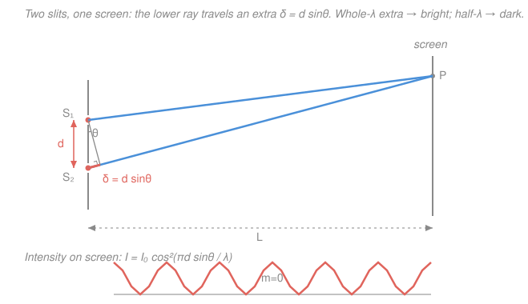

# Waves & Optics · Lesson 4.1: Interference: double slit & thin films

> ⏱ ~15 min · Module 4: Physical optics · Builds on: [2.3 Superposition, standing waves & beats](02-03-superposition-standing-waves-beats.md), [2.4 Light as an electromagnetic wave](02-04-light-as-em-wave.md) · Unlocks: [4.2 Diffraction, gratings & resolution](04-02-diffraction-gratings-resolution.md)

## Why this matters

Rays and lenses (Module 3) treat light as arrows. But light is a wave, and waves do something arrows never can: **cancel**. Bright plus bright can equal dark. This is the proof that light is a wave — Thomas Young's 1801 double-slit experiment settled the argument — and it's the reason a soap bubble flashes rainbow colors, an oil slick on wet asphalt swirls green and magenta, and your camera lens has a purple sheen (an anti-reflection coating that uses cancellation on purpose). Master one idea, **adding two wave fields and asking where they reinforce or annihilate**, and all of these fall out of the same short calculation.

## The idea

Send one wave into two paths of slightly different length, then recombine them. If one path is longer by a *whole* wavelength, the two arrive crest-on-crest — they **reinforce** (bright). If it's longer by *half* a wavelength, crest meets trough — they **cancel** (dark). Everything in this lesson is bookkeeping on that one path-length difference.

Two warnings up front. First, this only works if the two waves keep a **fixed phase relationship** — they must be **coherent**. Two independent bulbs flicker randomly out of step, so their fringes wash out in nanoseconds; that's why Young used *one* source split into two, and why lasers (highly coherent) make the cleanest fringes. Second, "half a wavelength of extra path" isn't the only way to flip crest-to-trough — a wave can also pick up a half-wavelength jump *at a reflection*, which is the secret ingredient behind thin-film colors. Hold that thought.

## The formal version

### Young's double slit

Two narrow slits a distance $d$ apart (the **slit separation**, meters) are lit by the same coherent wave of wavelength $\lambda$. Light leaving them heads toward a screen at angle $\theta$ from the straight-ahead direction. Because the screen is far, the two rays are essentially parallel, and the lower ray travels an extra distance — the **path difference**

$$\delta = d\sin\theta.$$

*In words: the extra path one slit's light travels is the slit spacing times the sine of the viewing angle.*

Bright where the extra path is a whole number of wavelengths; dark where it's a half-integer:

$$\underbrace{d\sin\theta = m\lambda}_{\text{bright (constructive)}}, \qquad \underbrace{d\sin\theta = \left(m+\tfrac12\right)\lambda}_{\text{dark (destructive)}}, \qquad m = 0, \pm1, \pm2,\dots$$

*In words: count wavelengths in the path difference — a whole count reinforces, a half-count cancels.* The integer $m$ is the **order**; $m=0$ is the central bright fringe, straight ahead, where both paths are equal.

On a screen a distance $L$ away, the fringes land at height $y = L\tan\theta$. For the small angles typical in these experiments, $\sin\theta \approx \tan\theta \approx y/L$, so the $m$-th bright fringe sits at

$$y_m \approx \frac{m\lambda L}{d}, \qquad\text{giving evenly spaced fringes with spacing}\qquad \boxed{\;\Delta y = \frac{\lambda L}{d}\;}.$$

*In words: bright fringes are equally spaced, farther apart for longer wavelengths, a bigger throw to the screen, or closer slits.*

How bright is the screen *between* the maxima? Add two equal fields $E_0\cos(\omega t)$ and $E_0\cos(\omega t + \phi)$, where the phase gap $\phi = \frac{2\pi}{\lambda}\delta = \frac{2\pi d\sin\theta}{\lambda}$ converts path difference into radians. Intensity goes as amplitude squared, and the trig collapses to

$$I = I_0\cos^2\!\left(\frac{\pi d\sin\theta}{\lambda}\right),$$

with $I_0$ the peak (four times *one* slit's intensity — energy is redistributed, not created). *In words: the screen brightness rises and falls as a smooth $\cos^2$, peaking at each bright fringe and dropping to zero at each dark one.*

### Thin films

Now the reflective version. A film of index $n$ and thickness $t$ (soap, oil, a lens coating) sends back **two** reflections: one off the top surface, one off the bottom. They recombine in your eye and interfere. Two effects set their phase gap:

1. **Extra travel.** The bottom reflection crosses the film twice, an optical path of $2nt$ (index $n$ counts because light is slower — shorter wavelength — inside the film).
2. **A reflection phase flip.** A wave reflecting off a boundary from *low* index to *high* index inverts — it gains an extra half-wavelength ($\pi$) jump. Reflecting from high to low index does **not**. This is the same rule as a wave pulse flipping when it hits a fixed (denser) end of a rope, back in [2.2](02-02-waves-on-strings-sound.md).

For a film with **air on both sides** (soap, oil), only the *top* reflection is low-to-high, so exactly **one** beam picks up the half-wave flip. That lone flip flips the whole rulebook versus the double slit:

$$\underbrace{2nt = \left(m+\tfrac12\right)\lambda}_{\text{bright reflection (constructive)}}, \qquad \underbrace{2nt = m\lambda}_{\text{dark reflection (destructive)}}, \qquad m = 0,1,2,\dots$$

*In words: because one reflection already flipped, an extra travel of a whole $\lambda$ now lands the two beams out of step (dark), and a half-$\lambda$ travel puts them back in step (bright)* — the reverse of the two-slit conditions. Here $\lambda$ is the **vacuum** wavelength (the film's index already lives inside $2nt$).

**Colors.** Shine white light on a film whose thickness varies. At each spot, $2nt$ hits the bright condition for some wavelengths and the dark condition for others — a few colors are reinforced, their complements erased. As $t$ changes across the film you sweep through different reinforced colors: the swirling bands of a soap bubble or an oil slick. Flip the design (put a coating on glass so *both* reflections flip and cancel the flips out) and you can instead make a chosen color reflect *minimally* — an **anti-reflection coating**.

## Picture

## Worked examples

**Example 1 (double slit — read off the fringes).** Green light, $\lambda = 500$ nm, lights two slits $d = 0.20$ mm apart; the screen is $L = 1.5$ m away. Fringe spacing:

$$\Delta y = \frac{\lambda L}{d} = \frac{(500\times10^{-9})(1.5)}{0.20\times10^{-3}} = \frac{7.5\times10^{-7}}{2.0\times10^{-4}} = 3.75\times10^{-3}\ \mathrm{m} = 3.75\ \mathrm{mm}.$$

The second-order bright fringe sits at $y_2 = 2\Delta y = 7.5$ mm. Check the small-angle assumption: $\sin\theta_1 = \lambda/d = 2.5\times10^{-3}$, so $\theta_1 \approx 0.14^\circ$ — tiny, so $\sin\theta\approx\tan\theta$ was safe.

**Example 2 (why a soap film looks colored).** A soap film ($n = 1.33$) is $t = 100$ nm thick where you're looking. Which visible color reflects brightly? Air on both sides means one flip, so bright reflection needs $2nt = (m+\tfrac12)\lambda$, i.e. $\lambda = \dfrac{2nt}{m+\frac12}$. The optical path is $2nt = 2(1.33)(100\ \mathrm{nm}) = 266$ nm. Then:

- $m = 0$: $\lambda = 266/0.5 = 532$ nm — **green**, squarely in the visible.
- $m = 1$: $\lambda = 266/1.5 = 177$ nm — deep ultraviolet, invisible.

So this patch flashes green. A thicker patch reinforces a longer wavelength — the bands drift toward red — which is exactly the shifting color you see as the film drains and thins under gravity (the top, thinnest part, going black just before it pops: there $2nt \to 0$, the two beams differ only by the lone half-wave flip, so *every* color cancels).

## Watch out

- **You might think any two light sources interfere.** Only **coherent** ones give *stable* fringes. Two separate flashlights do interfere every instant, but their random relative phase reshuffles the pattern billions of times a second, averaging to uniform gray. One source split in two (Young) or a laser is what keeps the fringes standing still.
- **You might forget the reflection half-wave flip — or apply it twice.** Count your low-to-high reflections. **One** flip (soap/oil in air) → the film's bright/dark conditions are the *reverse* of the two-slit ones. **Zero or two** flips (e.g. an anti-reflection coating, where air-to-coating and coating-to-glass are *both* low-to-high) → the flips cancel and you're back to the "plain" conditions, $2nt = m\lambda$ for bright. Miscounting flips flips your answer.
- **You might mix up $\lambda$ in a film.** The wavelength *inside* the film is $\lambda/n$, but the conditions above already fold that in via the optical path $2nt$ — so plug in the **vacuum** wavelength $\lambda$, not $\lambda/n$.

## One-liner

> Interference is bookkeeping on path difference: whole $\lambda$ reinforces, half $\lambda$ cancels — with a bonus half-$\lambda$ flip at every low-to-high reflection, which is what paints soap films and oil slicks.

## Problems

**P1 (🟢)** A helium–neon laser ($\lambda = 633$ nm) shines on two slits $d = 0.15$ mm apart, casting fringes on a wall $L = 2.0$ m away. Find the fringe spacing $\Delta y$ and the distance from the central bright fringe to the third-order ($m=3$) bright fringe.

**P2 (🟡)** A soap film ($n = 1.33$) with air on both sides looks bright yellow ($\lambda = 580$ nm) in reflected light. Find the two smallest film thicknesses that produce this.

**P3 (🔴, optional)** You coat a camera lens ($n_{\text{glass}} = 1.52$) with magnesium fluoride ($n = 1.38$) to kill reflections at $\lambda = 550$ nm. First argue which interference condition applies by counting reflection flips, then find the thinnest coating.

Solutions

**P1** Fringe spacing:

$$\Delta y = \frac{\lambda L}{d} = \frac{(633\times10^{-9})(2.0)}{0.15\times10^{-3}} = \frac{1.266\times10^{-6}}{1.5\times10^{-4}} = 8.44\times10^{-3}\ \mathrm{m} = 8.44\ \mathrm{mm}.$$

The third bright fringe is three spacings out: $y_3 = 3\Delta y = 3(8.44) = 25.3\ \mathrm{mm} \approx 2.5\ \mathrm{cm}$.

*Check.* Units: $\dfrac{(\mathrm{m})(\mathrm{m})}{\mathrm{m}} = \mathrm{m}$ ✓. Sanity: the slits ($0.15$ mm) are far larger than $\lambda$, so fringes are small (mm-scale), as found. Small-angle check: $\sin\theta_3 = 3\lambda/d = 1.27\times10^{-2}$, $\theta_3 \approx 0.73^\circ$ — still tiny, so $y \approx m\lambda L/d$ was valid. ✓

**P2** Air on both sides = one reflection flip, so **bright** reflection is $2nt = (m+\tfrac12)\lambda$, i.e. $t = \dfrac{(m+\frac12)\lambda}{2n}$. Two smallest thicknesses are $m=0$ and $m=1$:

$$t_0 = \frac{(0.5)(580\ \mathrm{nm})}{2(1.33)} = \frac{290}{2.66} = 109\ \mathrm{nm}, \qquad t_1 = \frac{(1.5)(580)}{2.66} = 3t_0 = 327\ \mathrm{nm}.$$

*Check.* $t_0 = \lambda/(4n)$: a quarter-wave (measured inside the film) — the classic thinnest constructive case ✓. Each step in $m$ adds $\lambda/(2n) = 218$ nm, matching $t_1 - t_0 = 218$ nm ✓. Thicknesses of order 100 nm are physically reasonable for a soap film ✓.

**P3** Count flips. Top surface: air ($1.00$) → coating ($1.38$), low-to-high → **flip**. Bottom surface: coating ($1.38$) → glass ($1.52$), also low-to-high → **flip**. Two flips cancel, so the phase bookkeeping is the "plain" case: **destructive** (minimum reflection, the goal) requires

$$2nt = \left(m+\tfrac12\right)\lambda.$$

Thinnest is $m=0$: $2nt = \tfrac12\lambda$, so

$$t = \frac{\lambda}{4n} = \frac{550\ \mathrm{nm}}{4(1.38)} = \frac{550}{5.52} = 99.6\ \mathrm{nm} \approx 100\ \mathrm{nm}.$$

*Check.* Quarter-wave-in-the-coating again ($t = \lambda/4n$), but this time engineered to *cancel* the reflection rather than boost it — the two-flip count is what flipped "bright" into "dark." Units: $\mathrm{nm}$ ✓. (Aside: coatings choose $n \approx \sqrt{n_{\text{glass}}} = \sqrt{1.52} \approx 1.23$ ideally, so the two reflected *amplitudes* match and the cancellation is total; MgF₂'s $1.38$ is the closest durable material.) ✓

## Flashback

**From Lesson 2.3 (Superposition, standing waves & beats):** Two flutes hold steady notes of $440$ Hz and $445$ Hz at once. How many loudness pulses per second do you hear, and what pitch do they ride on?

Solution

Adding two equal-amplitude tones of nearby frequencies gives a **beat**: the amplitude swells and fades at the *difference* frequency,

$$f_{\text{beat}} = |f_1 - f_2| = |445 - 440| = 5\ \mathrm{Hz},$$

so you hear **5 loudness pulses per second**. The rapid oscillation you actually hear as pitch is the *average*, $\frac{1}{2}(440 + 445) = 442.5$ Hz.

*Check.* Beats slow to zero as the two notes match ($f_1 \to f_2$), which is exactly how you tune an instrument by ear — kill the beats. This is the same move as this lesson: **superpose two waves and watch where they reinforce and cancel.** Beats are that pattern in *time*; double-slit fringes are the identical pattern laid out in *space*. ✓

## Connections

- **Backward:** the reflection half-wave flip is the wave-on-a-rope inversion at a fixed end from [2.2](02-02-waves-on-strings-sound.md), and the whole lesson is superposition ([2.3](02-03-superposition-standing-waves-beats.md)) applied to the EM fields of [2.4](02-04-light-as-em-wave.md) — with $\lambda_{\text{film}} = \lambda/n$ set by the slowing of light inside a medium ([3.1](03-01-reflection-refraction-snell.md)).
- **Forward:** [4.2 Diffraction, gratings & resolution](04-02-diffraction-gratings-resolution.md) pushes two slits to $N$ slits — the same $d\sin\theta = m\lambda$ condition, but the maxima sharpen into the razor-thin lines that a spectrometer uses to split light into its wavelengths.
- **Sideways (Fourier / signal processing):** beats and fringes are both what you get from summing two sinusoids of slightly different phase — the product-to-sum identity $\cos A + \cos B = 2\cos\frac{A-B}{2}\cos\frac{A+B}{2}$. A fast carrier modulated by a slow envelope is exactly amplitude modulation (AM radio), and the general machinery for decomposing signals this way is Fourier analysis, which returns in [4.4 Wave packets, dispersion & Fourier](04-04-wave-packets-dispersion-fourier.md).
