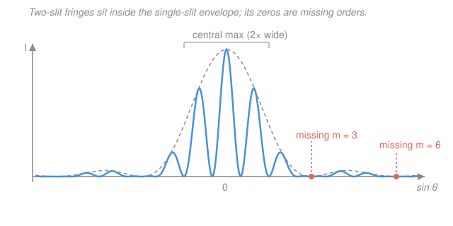

# Waves & Optics · Lesson 4.2: Diffraction, gratings & resolution

> ⏱ ~15 min · Module 4: Physical optics · Builds on: [4.1 Interference: double slit & thin films](04-01-interference-double-slit-thin-films.md) · Unlocks: [4.3 Polarization](04-03-polarization.md)

## Why this matters

In [4.1](04-01-interference-double-slit-thin-films.md) we treated each slit as an infinitely thin line source. Real slits have *width*, and that width does two things you can't ignore. First, a single slit spreads light into its own pattern — **diffraction** — which is why no lens can ever focus light to a perfect point, and why every telescope, microscope, and human eye has a hard resolution limit set by physics, not by build quality. Second, when you line up *many* slits — a **diffraction grating** — the fringes sharpen into razor-thin spectral lines, the tool that splits starlight into the chemical fingerprints of distant galaxies. Same wave equation, three huge payoffs: the blur limit, the spectrometer, and the reason astronomers care about mirror size.

## The idea

Take one wide slit and imagine chopping it into a row of tiny sub-sources across its width — a *continuum* of little emitters, all in phase at the slit. Straight ahead, every sub-source travels the same distance, they all add up, and you get a bright **central maximum**. Tilt to an angle and the sub-sources start to disagree. At just the right angle, the top half of the slit is exactly half a wavelength ahead of the bottom half — every source in the top pairs with one in the bottom that cancels it, and the light goes *dark*. That's the first **diffraction minimum**. The pattern is a broad bright center flanked by weak side lobes.

The key surprise: a *wider* slit gives a *narrower* pattern. Squeeze the opening and light fans out more; open it up and the beam stays tight. Waves spread most when confined most — a theme that returns as the uncertainty principle.

Now the grating. Stack $N$ identical slits with equal spacing. The bright directions are exactly the double-slit directions from [4.1](04-01-interference-double-slit-thin-films.md) — but with hundreds of slits all agreeing, the bright spots become intensely sharp and bright while everything between them cancels. And because the bright angle depends on wavelength, each color lands in a slightly different place: the grating fans white light into a spectrum.

## The formal version

**Single-slit diffraction.** A slit of width $a$ (meters), illuminated by light of wavelength $\lambda$, produces dark fringes (minima) at angles $\theta$ satisfying

$$a\sin\theta = m\lambda, \qquad m = \pm 1, \pm 2, \pm 3, \dots$$

*In words: the slit goes dark whenever it can be split into $m$ pairs of halves that each cancel.* **Trap:** $m = 0$ is **not** a minimum — it's the bright central maximum. The counting starts at $m = \pm 1$.

The central maximum runs from the $m=-1$ minimum to the $m=+1$ minimum, so it is **twice as wide** as every side lobe (which spans one unit of $m$). Its angular half-width, for small angles where $\sin\theta \approx \theta$, is

$$\theta_{\text{half}} \approx \frac{\lambda}{a}.$$

*In words: the beam's angular spread is wavelength over slit width — smaller opening, bigger spread.*

**Diffraction grating.** For $N$ slits with center-to-center spacing $d$ (meters), the bright **principal maxima** sit at

$$\boxed{\,d\sin\theta = m\lambda, \qquad m = 0, \pm 1, \pm 2, \dots\,}$$

*In words: same condition as the double slit — but as $N$ grows the peaks get far sharper and brighter,* because you now need *all* $N$ slits to agree, which happens only in a razor-thin band of angles. The integer $m$ is the **order**. Different $\lambda$ satisfy this at different $\theta$, so a grating **disperses** light into spectra — that's its job.

**Missing orders.** A grating slit has *both* a spacing $d$ and a width $a$. The sharp interference peaks (from $d$) are **modulated by the single-slit envelope** (from $a$). If an interference maximum lands exactly on a diffraction *minimum*, it's suppressed — a **missing order**. This happens when both conditions hold at the same $\theta$:

$$d\sin\theta = m\lambda \quad(\text{interference max}) \qquad\text{and}\qquad a\sin\theta = m'\lambda \quad(\text{diffraction min}).$$

Divide one by the other: the $\sin\theta$ and $\lambda$ cancel, leaving $\dfrac{m}{m'} = \dfrac{d}{a}$. So the missing orders are exactly the multiples of $d/a$. **In particular, $d = 3a$ kills orders $m = 3, 6, 9, \dots$** (each coincides with $m' = 1, 2, 3$). Memorize this coincidence; it drives the figure below and the boss problem.

**Rayleigh criterion (resolution).** Two point sources seen through an aperture are **just resolved** when the central max of one falls on the first diffraction minimum of the other. For a **circular** aperture of diameter $D$, the geometry adds a factor 1.22:

$$\theta_{\min} \approx 1.22\,\frac{\lambda}{D}.$$

*In words: you can only tell two points apart if their angular separation exceeds $1.22\lambda/D$ — bigger aperture, finer vision.* This one formula caps a telescope's detail, an eye's acuity, and a microscope's fineness.

## Picture

The dashed grey curve is the single-slit envelope from width $a$; the blue curve is the actual two-slit intensity (fringes from spacing $d$) living inside it. Here $d = 3a$, so the fringes that would sit at orders $m = 3$ and $m = 6$ fall right on the envelope's zeros and vanish — the missing orders.

## Worked examples

**Example 1 (single slit — spread from width).** Red light, $\lambda = 600$ nm, hits a slit of width $a = 0.10$ mm $= 1.0\times10^{-4}$ m. Where's the first dark fringe, and how wide is the central bright band on a screen $L = 2.0$ m away?

First minimum: $\sin\theta = \lambda/a = (600\times10^{-9})/(1.0\times10^{-4}) = 6.0\times10^{-3}$, so $\theta \approx 0.34°$. On the screen, $y_1 \approx L\theta = 2.0 \times 6.0\times10^{-3} = 1.2$ cm from center. The central maximum runs from $-y_1$ to $+y_1$, so its full width is $2y_1 = 2.4$ cm — twice the width of each side lobe. Halve the slit and this doubles.

**Example 2 (grating — dispersing a spectrum).** A grating has 500 lines per mm, so $d = 1/500$ mm $= 2000$ nm. For $\lambda = 600$ nm, how many orders appear? Since $\sin\theta \le 1$, we need $m \le d/\lambda = 2000/600 = 3.33$, so $m = 0, 1, 2, 3$ are geometrically possible: $\sin\theta = 0.30,\ 0.60,\ 0.90$ at $\theta \approx 17.5°,\ 36.9°,\ 64.2°$. A blue line at 450 nm would land at *smaller* angles — that separation between colors is the spectrum. (If the slits happen to have width $a = d/3$, order $m = 3$ is a missing order and drops out — see Example in Problems.)

## Watch out

- **You might call $m=0$ a single-slit minimum.** It isn't — $m=0$ is the bright central peak. Single-slit *minima* start at $m = \pm1$. (For the *grating*, by contrast, $m=0$ *is* a bright principal maximum — straight-through, all colors overlapping.) Don't mix the two roles of $m$.
- **You might think a bigger slit makes a bigger pattern.** Opposite: $\theta_{\text{half}} = \lambda/a$, so wider $a$ means a *narrower* central lobe. Confinement causes spreading.
- **You might forget the 1.22.** The Rayleigh factor is 1 for a slit but $1.22$ for a *circular* aperture (lenses, mirrors, pupils, telescopes). Use $1.22\lambda/D$ for anything round.
- **You might expect every order to show up.** The single-slit envelope can zero out an interference maximum. Always check whether $m$ is a multiple of $d/a$ before reporting it.

## One-liner

> A slit of width $a$ spreads light by $\sim\lambda/a$ (minima at $a\sin\theta=m\lambda$, $m\ne0$); $N$ such slits spaced $d$ give razor-sharp spectra at $d\sin\theta=m\lambda$, and $1.22\lambda/D$ is the hard limit on telling two points apart.

## Problems

**P1 (🟢)** Monochromatic light of wavelength $\lambda = 500$ nm passes through a single slit of width $a = 0.20$ mm. Find the angular position of the first diffraction minimum, and the *angular full width* of the central maximum.

**P2 (🟡, echoes Boss 4)** A diffraction grating has $500$ lines per millimeter, and each slit has width $a = d/3$ (so $d = 3a$). It is lit with $\lambda = 600$ nm. (a) List the orders $m \ge 0$ that are geometrically possible ($\sin\theta \le 1$). (b) Which of those, if any, are *missing orders*, and why? (c) So which bright spots actually appear on one side of center?

**P3 (🔴, optional — resolution)** On a dark road your pupil opens to $D = 5.0$ mm. Using $\lambda = 550$ nm and the Rayleigh criterion, estimate the greatest distance at which you could just resolve two headlights $1.5$ m apart. (Ignore atmosphere and aberrations — this is the pure diffraction limit.)

Solutions

**P1** First minimum at $a\sin\theta = \lambda$:

$$\sin\theta = \frac{\lambda}{a} = \frac{500\times10^{-9}}{0.20\times10^{-3}} = 2.5\times10^{-3} \;\Rightarrow\; \theta \approx 2.5\times10^{-3}\ \text{rad} \approx 0.14°.$$

The central maximum spans from the $m=-1$ to the $m=+1$ minimum, so its angular full width is

$$\Delta\theta = 2\theta \approx 5.0\times10^{-3}\ \text{rad} \approx 0.29°.$$

*Check.* Units: $\lambda/a$ is (m)/(m), dimensionless — correct for a sine. The central lobe is twice the half-angle $\lambda/a$, matching "central max is twice as wide." ✓

**P2** Here $d = 1/500$ mm $= 2000$ nm and $a = d/3 \approx 667$ nm.

(a) Geometrically possible orders need $m\lambda \le d$, i.e. $m \le d/\lambda = 2000/600 = 3.33$. So $m = 0, 1, 2, 3$ (at $\sin\theta = 0,\ 0.30,\ 0.60,\ 0.90$).

(b) Missing orders occur at multiples of $d/a = 3$. So $m = 3$ is a missing order: at $m=3$, $\sin\theta = 0.90$, and $a\sin\theta = 667\times0.90 \approx 600$ nm $= 1\cdot\lambda$ — exactly the first single-slit *minimum* ($m'=1$). The envelope is zero there, so the fringe is suppressed.

(c) Actually visible on each side: $m = 1$ and $m = 2$ (plus the central $m=0$). Order 3 is snuffed out. Bright spots: $m = 0, \pm1, \pm2$.

*Check.* The rule "$d=3a$ kills $m=3,6,9$" predicts exactly this, and only $m=3$ lies in range — consistent. ✓

**P3** Circular aperture, so $\theta_{\min} = 1.22\lambda/D$:

$$\theta_{\min} = \frac{1.22\,(550\times10^{-9})}{5.0\times10^{-3}} \approx 1.34\times10^{-4}\ \text{rad}.$$

Two lights a distance $s = 1.5$ m apart subtend $\theta \approx s/L$ at range $L$; setting $\theta = \theta_{\min}$ gives the maximum range:

$$L_{\max} = \frac{s}{\theta_{\min}} = \frac{1.5}{1.34\times10^{-4}} \approx 1.1\times10^{4}\ \text{m} \approx 11\ \text{km}.$$

*Check.* Units: (m)/(rad) $=$ m ✓. Sanity: a real eye resolves closer to a few km (aberrations, retinal spacing, and glare all degrade it), so the pure diffraction limit being a bit *more* optimistic is exactly right — physics sets the ceiling, hardware falls below it. ✓

## Flashback

**From Lesson 4.1 (Double slit & thin films):** A double slit with spacing $d = 0.50$ mm is illuminated by a HeNe laser, $\lambda = 633$ nm, and the fringes are viewed on a screen $L = 3.0$ m away. Find the spacing between adjacent bright fringes. (Fresh variant — different numbers, and note this uses the *interference* spacing, the same $d\sin\theta = m\lambda$ that reappears as this lesson's grating condition.)

Solution

Adjacent bright fringes differ by one order: $d\sin\theta_m = m\lambda$. For small angles $\sin\theta \approx y/L$, so $y_m = m\lambda L/d$ and the spacing is

$$\Delta y = \frac{\lambda L}{d} = \frac{(633\times10^{-9})(3.0)}{0.50\times10^{-3}} \approx 3.8\times10^{-3}\ \text{m} = 3.8\ \text{mm}.$$

*Check.* Units: $(\text{m})(\text{m})/(\text{m}) = \text{m}$ ✓. Wider spacing $d$ would pack the fringes *closer* — the inverse dependence that also makes a fine grating ($d$ small) throw its orders far apart. ✓

## Connections

- **Backward:** the grating condition $d\sin\theta = m\lambda$ is literally the double-slit maximum from [4.1](04-01-interference-double-slit-thin-films.md), now sharpened by using many slits and modulated by the single-slit envelope introduced here. Missing orders are the two effects meeting.
- **Forward:** [4.3 Polarization](04-03-polarization.md) turns to light's *transverse* nature — a property gratings and slits don't touch — completing the physical-optics toolkit. The resolution limit here also underlies why [4.4](04-04-wave-packets-dispersion-fourier.md)'s narrow wave packets spread.
- **Sideways (Fourier / uncertainty):** "narrow slit $\to$ wide diffraction pattern" is a Fourier-transform pair — the far-field pattern is the transform of the aperture, so confining a wave in space forces it to spread in angle. This is the same $\Delta x\,\Delta k \gtrsim 1$ reciprocity that becomes Heisenberg's uncertainty principle in quantum mechanics (see [`fourier-analysis`](../../fourier-analysis/syllabus.md)).
