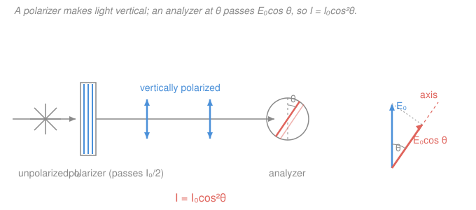

# Waves & Optics · Lesson 4.3: Polarization

> ⏱ ~15 min · Module 4: Physical optics · Builds on: [2.4 Light as an electromagnetic wave](02-04-light-as-em-wave.md), [4.2 Diffraction, gratings & resolution](04-02-diffraction-gratings-resolution.md) · Unlocks: [4.4 Wave packets, dispersion & Fourier synthesis](04-04-wave-packets-dispersion-fourier.md)

## Why this matters

Every photo you take through polarized sunglasses, every LCD screen you read, every glare-free shot of a lake — all of it is polarization at work. Interference and diffraction (4.1, 4.2) treated light as a wave but never asked *which way* it wiggles. Polarization is exactly that missing degree of freedom, and it is only available because light is **transverse**. So this lesson is also a payoff on a promise from [2.4](02-04-light-as-em-wave.md): the electromagnetic field oscillates *across* the direction of travel, and that sideways choice is a knob you can control, filter, and measure — with one clean law, Malus's law, doing most of the work.

## The idea

Send a wave down a rope and you can shake your hand up–down, or side–side, or in a circle. The *direction of the shake*, perpendicular to the rope, is the wave's **polarization**. Light is the same: its electric field $\vec E$ points somewhere in the plane perpendicular to the beam, and that direction is the polarization. Because sound is a *longitudinal* wave — air compresses along the direction of travel, there is no sideways choice — **sound cannot be polarized**. Polarization is a transverse-only phenomenon, a direct fingerprint of the fact that light is a transverse EM wave.

Ordinary light from the sun or a bulb is **unpolarized**: countless atoms emit independently, so $\vec E$ points in a random direction that reshuffles billions of times a second — no direction is special. A **polarizer** is a filter with a transmission axis; it lets through only the field component along that axis, throwing away the rest. Put unpolarized light through it and out comes light shaking cleanly in one direction: **linearly polarized**. Stack a second polarizer (an **analyzer**) and rotate it, and the brightness rises and falls — the amount that survives depends only on the angle between the two axes. That angle-dependence *is* Malus's law.

## The formal version

**Linear, circular, elliptical.** If $\vec E$ oscillates along a fixed line, the light is **linearly polarized**. If two perpendicular components of equal size are a quarter-cycle ($90°$) out of phase, the tip of $\vec E$ traces a **circle** — **circular polarization**; any other amplitude/phase combination traces an ellipse (**elliptical**). *In words: linear = a line, circular = a corkscrew, elliptical = the general case in between.*

**Malus's law.** Take linearly polarized light of intensity $I_0$ hitting an analyzer whose transmission axis makes angle $\theta$ with the light's polarization. Only the field component along the axis passes: $E = E_0\cos\theta$. Since intensity goes as the square of the field ($I \propto E^2$, from [2.4](02-04-light-as-em-wave.md)),

$$\boxed{\,I = I_0\cos^2\theta\,}$$

*In words: the transmitted intensity is the incident intensity times the cosine-squared of the angle between the polarization and the analyzer axis.* At $\theta = 0$ (aligned) everything passes; at $\theta = 90°$ (crossed) nothing does; at $\theta = 45°$ exactly half gets through.

**Unpolarized light through one polarizer.** Now the incoming angle $\theta$ is random and uniform, so we average $\cos^2\theta$ over all directions. The average of $\cos^2$ over a full turn is $\tfrac12$, so an ideal polarizer passes

$$I = \tfrac12 I_0 \qquad(\text{unpolarized input}),$$

and the output is linearly polarized along the axis. *In words: a single polarizer always halves unpolarized light — no matter how you rotate it — and cleans up what survives into a single direction.* (The $\tfrac12$ is a one-time cost; after that, Malus's law governs every further polarizer.)

**Ways to make polarized light.**
- **Selective absorption** — a Polaroid sheet of aligned long molecules absorbs the field component along the molecules and transmits the perpendicular one.
- **Scattering** — sunlight scattered by air molecules at $90°$ is strongly polarized; that is why the **blue sky** is partly polarized and a polarizer darkens it.
- **Reflection** — glare off water, glass, or a road is partially polarized *horizontally*, which is the whole reason for polarized sunglasses. This one has a sharp special angle:

**Brewster's angle.** Light in medium 1 (index $n_1$) hitting medium 2 (index $n_2$) is **100% polarized on reflection** — purely perpendicular to the plane of incidence — when the incidence angle satisfies

$$\tan\theta_B = \frac{n_2}{n_1}.$$

*In words: at one special angle the reflected beam is perfectly, completely polarized.* The clean geometric reason: at $\theta_B$ the **reflected and refracted rays are exactly $90°$ apart** (verify with Snell's law below). The molecules of medium 2 vibrate along the refracted direction and cannot radiate along their own axis, so the would-be parallel component of the reflection has nowhere to go — only the perpendicular component survives. Sunglasses set their absorption axis vertical to kill this horizontally-polarized glare.

**Birefringence (a taste).** Some crystals — calcite is the classic — have *two* refractive indices depending on polarization, so an unpolarized ray splits into two, giving calcite its famous **double image**. Slice such a crystal to the right thickness and you get a **wave plate**: it delays one polarization component relative to the other, turning linear into circular polarization (a "quarter-wave plate") — the standard tool for *creating* circular light. We will not compute wave plates here; just know birefringence is the mechanism.

## Picture

## Worked examples

**Example 1 (mechanical — read off Malus's law).** Unpolarized light of intensity $I_0$ passes a vertical polarizer, then an analyzer whose axis is $60°$ from vertical. What fraction emerges?

First polarizer (unpolarized in): halve it, $I_1 = \tfrac12 I_0$, now vertically polarized. Then Malus with $\theta = 60°$:

$$I_2 = I_1\cos^2 60° = \tfrac12 I_0 \left(\tfrac12\right)^2 = \tfrac12 I_0 \cdot \tfrac14 = \frac{I_0}{8}.$$

So one-eighth gets through. The $\tfrac12$ is the unpolarized toll; the $\cos^2$ is the analyzer.

**Example 2 (the crossed-polarizers puzzle — light from nothing).** Two polarizers are **crossed** (axes $90°$ apart), so together they pass *zero* light. Now slip a third polarizer **between** them at $45°$ to each. What comes out? Start with unpolarized $I_0$.

- After polarizer 1 (vertical): $I_1 = \tfrac12 I_0$, vertically polarized.
- After the middle polarizer ($45°$ from vertical): $I_2 = I_1\cos^2 45° = \tfrac12 I_0 \cdot \tfrac12 = \tfrac14 I_0$, now polarized at $45°$.
- After polarizer 3 (horizontal, which is $45°$ from the middle axis): $I_3 = I_2\cos^2 45° = \tfrac14 I_0 \cdot \tfrac12 = \dfrac{I_0}{8}.$

Inserting a filter made the pair *brighter* — from $0$ to $I_0/8$. The middle polarizer **rotates** the polarization in two $45°$ steps, and no single step is crossed, so light leaks through. This is not a trick of energy from nowhere: each polarizer absorbs part of the beam; the geometry just keeps every hand-off below $90°$.

## Watch out

- **You might think the single-polarizer $\tfrac12$ is Malus's law with $\theta$ averaged to something.** It *is* the average of $\cos^2\theta$ — but it applies **only** to *unpolarized* input, once, at the first polarizer. After that the light is polarized and you use the full $I_0\cos^2\theta$ with the actual angle *between consecutive axes* — never re-apply the $\tfrac12$.
- **You might think crossed polarizers can never transmit.** They can, the moment anything in between rotates the polarization — a third sheet (Example 2), a sugar solution, or a stressed piece of plastic. That leak is the basis of LCD displays.
- **You might confuse the angle in Malus's law.** $\theta$ is measured between the incoming *polarization direction* and the analyzer *axis*, not from any fixed lab vertical. With a stack, use the angle between each pair in sequence.

## One-liner

> Polarization is which way light's transverse $\vec E$ shakes; an analyzer at angle $\theta$ passes $I_0\cos^2\theta$ (a lone polarizer halves unpolarized light), and reflection is fully polarized at Brewster's $\tan\theta_B = n_2/n_1$.

## Problems

**P1 (🟢)** Unpolarized light of intensity $I_0$ passes a vertical polarizer and then an analyzer set at $30°$ to the vertical. What intensity emerges, as a fraction of $I_0$?

**P2 (🟡)** Two polarizers are crossed ($90°$ apart). A third is inserted between them at angle $\theta$ to the first. Write the transmitted intensity (unpolarized $I_0$ in) as a function of $\theta$, and find the $\theta$ that maximizes it and the maximum value.

**P3 (🔴)** Find Brewster's angle for light in air ($n_1 = 1$) reflecting off water ($n_2 = 1.33$). Then confirm that at this angle the reflected and refracted rays are $90°$ apart, using Snell's law. Which orientation should sunglasses use to cut the glare?

Solutions

**P1** First polarizer halves the unpolarized light: $I_1 = \tfrac12 I_0$, vertically polarized. Then Malus with $\theta = 30°$, where $\cos 30° = \sqrt3/2$ so $\cos^2 30° = 3/4$:

$$I_2 = \tfrac12 I_0 \cdot \tfrac34 = \frac{3}{8}I_0 = 0.375\,I_0.$$

*Check.* It sits between the aligned case ($\theta=0 \Rightarrow \tfrac12 I_0$) and the crossed case ($\theta=90° \Rightarrow 0$), as it must; and $3/8 < 1/2$ ✓.

**P2** Polarizer 1 (unpolarized in): $I_1 = \tfrac12 I_0$. Middle polarizer at $\theta$ from the first: $I_2 = \tfrac12 I_0\cos^2\theta$. The last polarizer is at $90°$ from the first, hence $90° - \theta$ from the middle one:

$$I_3 = I_2\cos^2(90°-\theta) = \tfrac12 I_0\cos^2\theta\,\sin^2\theta.$$

Use $\cos\theta\sin\theta = \tfrac12\sin 2\theta$, so $\cos^2\theta\sin^2\theta = \tfrac14\sin^2 2\theta$:

$$I_3 = \frac{I_0}{8}\sin^2 2\theta.$$

This is maximized when $\sin^2 2\theta = 1$, i.e. $2\theta = 90°$, so $\boxed{\theta = 45°}$, giving $I_3^{\max} = I_0/8$.

*Check.* At $\theta = 0$ or $\theta = 90°$ the middle sheet aligns with one of the crossed pair and $I_3 = 0$ — correctly recovering the "crossed pair blocks everything" limit. The peak $I_0/8$ at $45°$ matches Example 2 ✓.

**P3** Brewster's angle:

$$\tan\theta_B = \frac{n_2}{n_1} = \frac{1.33}{1} = 1.33 \;\Longrightarrow\; \theta_B = \arctan 1.33 \approx 53.1°.$$

Now the $90°$ claim. Snell's law gives the refraction angle $\theta_r$ from $n_1\sin\theta_B = n_2\sin\theta_r$:

$$\sin\theta_r = \frac{n_1\sin\theta_B}{n_2} = \frac{\sin 53.1°}{1.33} = \frac{0.800}{1.33} = 0.601 \;\Longrightarrow\; \theta_r \approx 36.9°.$$

Then $\theta_B + \theta_r = 53.1° + 36.9° = 90.0°$. Since the reflected ray leaves at $\theta_B$ from the normal on the same side geometry, reflected and refracted rays are separated by $180° - \theta_B - \theta_r = 90°$ ✓ — exactly the Brewster condition.

The reflected glare is polarized **horizontally** (parallel to the water surface), so sunglasses use a **vertical** transmission axis to absorb it.

*Check.* $\tan\theta_B = n_2/n_1$ is equivalent to the $90°$ condition: if $\theta_r = 90° - \theta_B$ then $\sin\theta_r = \cos\theta_B$, and Snell gives $n_1\sin\theta_B = n_2\cos\theta_B \Rightarrow \tan\theta_B = n_2/n_1$ ✓. A larger $n_2$ pushes $\theta_B$ toward grazing, as expected.

## Flashback

**From Lesson 4.2 (Diffraction, gratings & resolution):** Your eye's pupil has diameter $D = 2.0$ mm. Using the Rayleigh criterion for a circular aperture, $\theta_{\min} = 1.22\,\lambda/D$, find the smallest angular separation (in radians) you can resolve for green light $\lambda = 550$ nm. Roughly how far apart must two points be to be resolved at a reading distance of $30$ cm?

Solution

$$\theta_{\min} = 1.22\frac{\lambda}{D} = 1.22\cdot\frac{550\times10^{-9}\ \mathrm{m}}{2.0\times10^{-3}\ \mathrm{m}} = 1.22\cdot 2.75\times10^{-4} \approx 3.4\times10^{-4}\ \mathrm{rad}.$$

At distance $L = 0.30$ m, the separation is $s = L\,\theta_{\min} = 0.30 \times 3.4\times10^{-4} \approx 1.0\times10^{-4}\ \mathrm{m} = 0.1$ mm.

*Check.* Units: $\lambda/D$ is dimensionless (m/m) → radians ✓. A tenth of a millimeter at reading distance matches everyday experience (you cannot resolve individual $0.1$ mm dots on a page). A bigger pupil or aperture $D$ lowers $\theta_{\min}$ — better resolution — the same diffraction limit that governs telescopes. ✓

## Connections

- **Backward:** polarization exists *only* because light is a transverse EM wave — [2.4](02-04-light-as-em-wave.md)'s claim that $\vec E$ oscillates perpendicular to the propagation direction. The $I \propto E^2$ used in Malus's law is the same intensity-from-amplitude relation. And Brewster's angle rests on Snell's law from [3.1 Reflection, refraction & Snell's law](03-01-reflection-refraction-snell.md).
- **Forward:** [4.4 Wave packets, dispersion & Fourier synthesis](04-04-wave-packets-dispersion-fourier.md) returns to the wave's structure in *time*; polarization and dispersion together fully specify a real light beam. Circular polarization also foreshadows photon spin in quantum optics.
- **Sideways (chemistry & stress analysis):** optically active solutions (sugar, many biomolecules) rotate the plane of polarization, so a crossed-polarizer setup measures concentration; the same trick reveals stress patterns in transparent plastics (photoelasticity) — the crossed-polarizer leak of Example 2 turned into a measurement tool.
